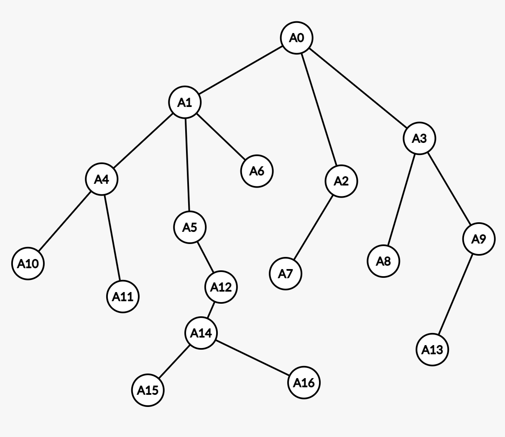
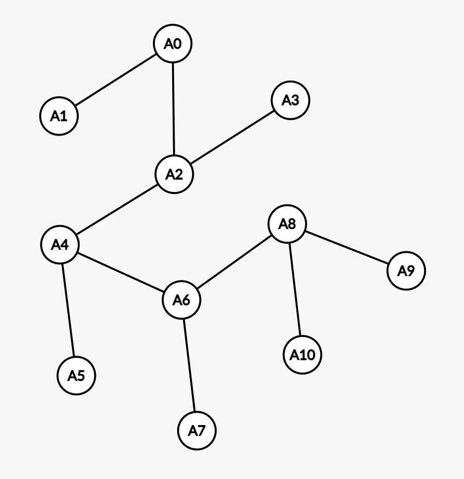
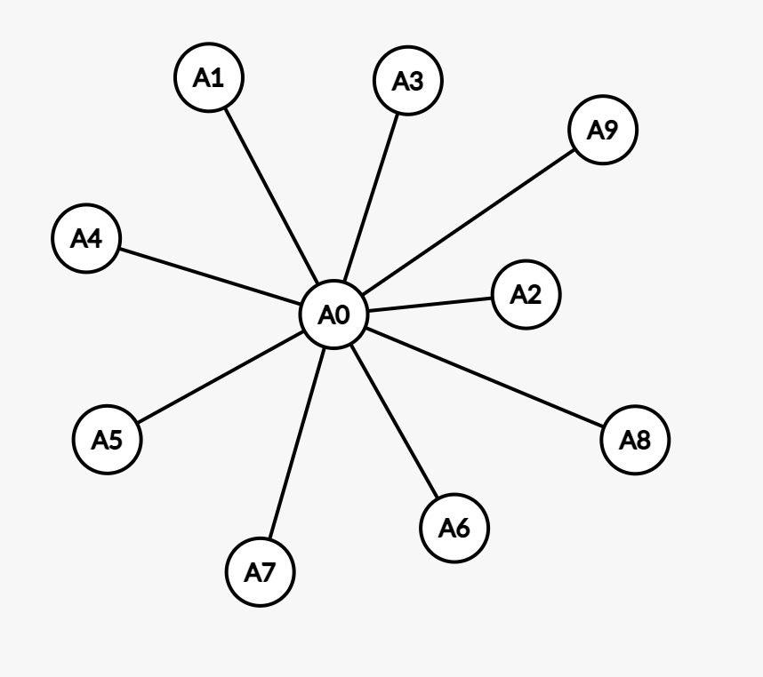
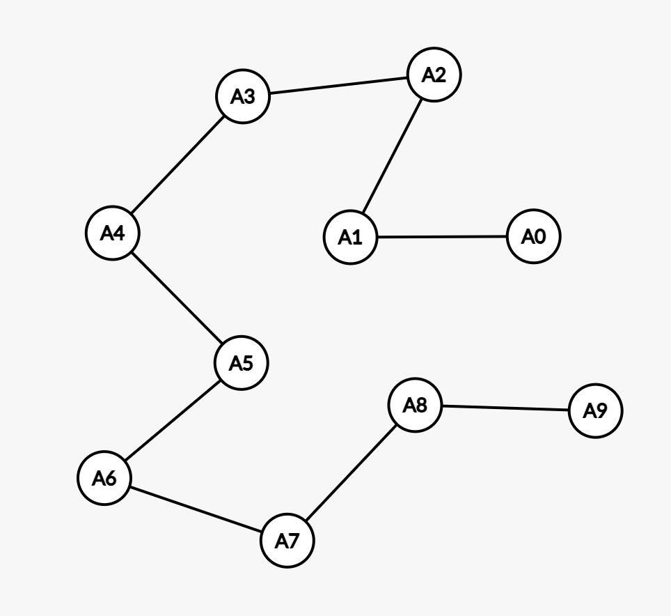

# 단계 2. 알고리즘을 구현하기 위한 자료형

## 스토리

! 스토리 추가
!!! 문제 12 TC1, 3 동일

---

# 문제 1. 일단 리스트는 잘 다루어야...

## 문제 분류

- 중요도 : 5/5
- 난이도 : 2/5
- 목표 수행 시간 : 4시간

## 스토리

닥터 G는 유전자 염기서열을 분석하기 위해서 유전자를 순서대로 조각내는 모든 경우의 수를 찾고 있었다. 예를 들어서 'CTA'라는 유전자 염기 서열은 다음과 같이 조각을 낼 수 있다.

```
'CTA'
'C', 'TA'
'CT', 'A'
'C', 'T', 'A'
```

재귀 호출을 사용하면 쉽게 조각낼 수 있을 것만 같았지만, 생각만큼 잘 되지 않아서 고생을 하던 닥터 G는 게시판에 이 문제를 좀 풀어달라고 글을 올렸다.

## 수행목표

- 파이썬 리스트의 사용법을 숙지한다.
- 어떤 리스트가 주어졌을 때, 이 리스트의 모든 원소를 빠짐없이 하나 이상으로 나눈 모든 조합의 리스트를 만들어 반환한다. 리스트를 나눌 때, 리스트의 항목의 순서는 지켜져야 한다.

  - 다음 리스트에는 13개의 테스트케이스가 포함되어 있다. 테스트케이스 별로 결과를 구한 후, 이를 수행단계에서 지시하는대로 변형해 출력한다.

    ```python
    testcases = [['C', 'T', 'A'], [1, 2, 3], [1, 1, 1], [1], ['C'], [1, 1], ['C', 'T', 'A', 'G'], [1, 1, 1, 1], ['C', 'T', 'A', 'G', 'T'], [23, 24, 25, 26, 27], ['CT', 'AG', 'TG', 'GC', 'CA', 'AT'], ['AT', 'TGA', 'AC', 'TC', 'AGC', 'GGA', 'AA', 'TT', 'TCT', 'G'], ['TTCGTC', 'GCT', 'GTCAGATGC', 'T', 'CGCCAT']]
    ```

## 수행단계

- 다음 기능을 재귀 호출을 사용해 수행하는 함수를 datastructure/list_segmentation.py 파일에 구현한다.

  - 어떤 리스트가 주어진다. 목표는 유전자 염기서열의 모든 조각의 경우의 수를 찾는 것이지만, 굳이 특정 자료형에만 한정한 알고리즘을 만들 필요는 없다.
    - 테스트 케이스는 문자열과 숫자가 주어진다.
  - 이 리스트를 빠진 항목없이 순서대로 나누는 모든 경우의 리스트를 반환하는 함수를 구현한다.

    - 예를 들어서 주어진 입력 리스트가 ['C', 'T', 'A']인 경우, 반환하는 리스트는 다음 4개의 리스트를 가진 리스트이다.

    ```
    [['C'], ['T'], ['A']]
    [['C'], ['T', 'A']]
    [['C', 'T'], ['A']]
    [['C', 'T', 'A']]
    ```

    - 실제로 반환되는 리스트는 세번 중첩된 리스트이다. 위의 입력에서 반환되는 리스트는 다음과 같다.
      - `[[['C'], ['T'], ['A']], [['C'], ['T', 'A']], [['C', 'T'], ['A']], [['C', 'T', 'A']]]`
    - 결과의 리스트의 순서는 구현 방식에 따라 변경될 수 있지만, 각 항목의 순서는 반드시 입력 리스트의 순서를 지켜야 한다.
      - 예를 들어서 위의 결과는 `[[['C'], ['T', 'A']], [['C', 'T'], ['A']], [['C', 'T', 'A']], [['C'], ['T'], ['A']]]`와 같이 순서가 바뀔 수 있지만, 이 리스트의 항목인 `[['C'], ['T', 'A']]`가 `[['T', 'A'], ['C']]` 또는 `[['C'], ['A', 'T']]`가 되어서는 안된다.
    - 제공된 10개의 테스트 케이스에 대해서 반환된 결과 리스트를 다음의 c2h4 함수를 사용해 그 결과를 출력한다.

      ```python
      import hashlib
      def hash4(input):
          return hashlib.sha256(input.encode()).hexdigest()[:4]

      def c2h4(arr):
          arr.sort()
          result = ''
          for mid_list in arr:
              result += '_'
              for inner_list in mid_list:
                  result += '='
                  for element in inner_list:
                      if isinstance(element, int):
                          result += chr((element % 26) + 65) + ','
                      else:
                          result += element + ','
          return hash4(result)
      ```

## 결과 예시

```
Testcase 1의 입력 : ['C', 'T', 'A']
    결과 : 465f
Testcase 2의 입력 : [1, 2, 3]
    결과 : 17ad
Testcase 3의 입력 : [1, 1, 1]
    결과 : 27ce
(이하 생략)
```

## 참고사항

- 없음

## 제약사항

- 과정에서 제시한 제약사항을 준수한다.

## 개발환경

- 3.9 버전 이상의 파이썬 프로그램으로 작성한다.

## 보너스 과제

- 없음

---

## 평가질문/평가가이드

### [수행목표 확인]

- 문제에서 지시한 형식을 준수하였는가?
  - datastructure/list_segmentation.py 파일에 구현이 되어 있는지 확인한다.
- 제약사항을 준수하였는가?
  - 허용되지 않은 모듈, 라이브러리, 패키지의 사용 여부 (직접 구현한 경우 사용 가능하다.)
  - 입력과 무관하게 프로그램이 처리되지 않은 예외를 발생시키지 않고 정상적으로 종료되어야 한다.
- 결과가 정확한가?
  - 파이썬 3.9 이상에서 동작 여부를 확인한다.
  - 결과는 다음과 같다. 출력 형식은 평가하지 않는다.
    ```
    Testcase 1의 입력 : ['C', 'T', 'A']
        결과 : 465f
    Testcase 2의 입력 : [1, 2, 3]
        결과 : 17ad
    Testcase 3의 입력 : [1, 1, 1]
        결과 : 27ce
    Testcase 4의 입력 : [1]
        결과 : 3dec
    Testcase 5의 입력 : ['C']
        결과 : 0665
    Testcase 6의 입력 : [1, 1]
        결과 : 608f
    Testcase 7의 입력 : ['C', 'T', 'A', 'G']
        결과 : 56cb
    Testcase 8의 입력 : [1, 1, 1, 1]
        결과 : dda7
    Testcase 9의 입력 : ['C', 'T', 'A', 'G', 'T']
        결과 : 13ab
    Testcase 10의 입력 : [23, 24, 25, 26, 27]
        결과 : bd3e
    Testcase 11의 입력 : ['CT', 'AG', 'TG', 'GC', 'CA', 'AT']
        결과 : 9410
    Testcase 12의 입력 : ['AT', 'TGA', 'AC', 'TC', 'AGC', 'GGA', 'AA', 'TT', 'TCT', 'G']
        결과 : d3d6
    Testcase 13의 입력 : ['TTCGTC', 'GCT', 'GTCAGATGC', 'T', 'CGCCAT']
        결과 : c588
    ```

### [문제에 대한 이해]

- A, B가 파이썬 리스트일 때, A + B는 어떤 결과가 나오는가?
  - 두 리스트를 연결하는 연산이다.
- A, B가 파이썬 리스트일 때, [A, B]는 어떤 결과가 나오는가?
  - 두 리스트를 항목으로 가지는 새로운 리스트를 생성한다.
- A = [1, 2], B = [3, 4]일 때, A.append(B)의 결과는 무엇인가?
  - A에 B를 추가하는 연산으로, 결과는 [1, 2, [3, 4]]가 된다.
- A, B가 파이썬 리스트일 때, A에 B의 모든 항목을 덧붙인 리스트를 만드는 방법을 설명하라. 예를 들어 A가 [1, 2], B가 [3, 4]인 경우, [1, 2, 3], [1, 2, 4]를 만드는 작업이다.
  - B의 모든 원소를 루프나 리스트 컴프리헨션을 통해서 A에 합치는 과정을 확인한다.

### [코드 예시]

```python
def segmentations(arr, prefix_list = None, result = None):
    if prefix_list == None:
        prefix_list = []
    if result == None:
        result = []
    if not arr:
        result.append(prefix_list)
        return result
    head = arr[0]
    tail = arr[1:]
    segmentations(tail, prefix_list + [[head]], result)
    if prefix_list:
        segmentations(tail, prefix_list[:-1] + [prefix_list[-1] + [head]], result)
    return result

import hashlib
def hash4(input):
    return hashlib.sha256(input.encode()).hexdigest()[:4]

def c2h4(arr):
    arr.sort()
    result = ''
    for mid_list in arr:
        result += '_'
        for inner_list in mid_list:
            result += '='
            for element in inner_list:
                if isinstance(element, int):
                    result += chr((element % 26) + 65) + ','
                else:
                    result += element + ','
    return hash4(result)


def main():
    testcases = [['C', 'T', 'A'], [1, 2, 3], [1, 1, 1], [1], ['C'], [1, 1], ['C', 'T', 'A', 'G'], [1, 1, 1, 1], ['C', 'T', 'A', 'G', 'T'], [23, 24, 25, 26, 27], ['CT', 'AG', 'TG', 'GC', 'CA', 'AT'], ['AT', 'TGA', 'AC', 'TC', 'AGC', 'GGA', 'AA', 'TT', 'TCT', 'G'], ['TTCGTC', 'GCT', 'GTCAGATGC', 'T', 'CGCCAT']]

    for i, tc in enumerate(testcases):
        result = segmentations(tc)
        print(f"Testcase {i + 1}의 입력 : {tc}")
        print(f"    결과 : {c2h4(result)}")

if __name__ == "__main__":
    main()
```

---

# 문제 2. 파이썬 딕셔너리

## 문제 분류

- 중요도 : 5/5
- 난이도 : 2/5
- 목표 수행 시간 : 2시간

## 스토리

염기서열을 효과적으로 분할하는데 성공한 닥터 G는 다음에 해야 할 일의 방법을 찾고 있었다.
'이제 각 조각 별로 실험을 진행해야 하는데...'
각 조각 별로 수행하는 실험은 조각마다 서로 다른 프로세스와 시약이 필요한 과정이다. 즉 조각의 수 만큼의 시약을 미리 준비해야 한다. 닥터 G는 얼마만큼의 시약을 미리 준비하기 위해서 패턴 별로 필요한 시약의 수를 출력하는 프로그램을 만들기로 했다.

## 수행목표

- 주어진 리스트를 항목이 빠지지 않게 분할하는 모든 경우의 수를 찾는 이전 문제의 결과에서 시작한다. 그 결과를 사용해 패턴 별로 빈도수를 계산하고 이를 출력한다.
  - 이를 위한 프로그램은 파이썬의 딕셔너리 자료형을 사용한다.
- 예를 들어서 `['C', 'T', 'A']` 염기서열을 `[[['C'], ['T'], ['A']], [['C'], ['T', 'A']], [['C', 'T'], ['A']], [['C', 'T', 'A']]]`과 같이 분할 하였다면, `['C']`, `['A']`를 위한 시약 두 단위와 `['T', 'A']`, `['C', 'T']`, `['C', 'T', 'A']`와 `['A']`를 위한 시약 한 단위를 준비해야 한다.
- 다음 테스트 케이스의 각 리스트에 대해서 항목이 빠지지 않게 분할한 후, 여기에 포함된 모든 패턴에 대해서 빈도수를 계산해 출력하는 프로그램을 만들고, 결과를 출력한다. 이때 결과는 빈도 순으로 출력되어야 한다.

## 수행단계

- 파이썬 딕셔너리의 활용법에 대해서 숙지한다.
  - 파이썬 딕셔너리를 사용해 루프를 만드는 방법을 키, 값, 그리고 키와 값을 동시에 활용하는 루프 각각에 대해서 확인한다.
  - 파이썬 딕셔너리의 경우 파이썬 버전 3.7 이후부터는 딕셔너리의 순서가 보장된다. 람다(lambda) 함수를 사용해 어떤 딕셔너리를 값의 순서로 정렬하는 방법을 조사한다.
- 파이썬의 자료형은 크게 변경 가능한 자료형(mutable)과 변경 불가능한 자료형(immutable)로 나눌 수 있다. 두 자료형이 무엇이며, 어떤 차이가 있는지 조사한다.
  - 특히, 파라미터로 전달되었을 때 두 자료형의 동작 방식의 차이에 대해서도 확인한다.
- 이전 문제의 결과에서 각 분할의 단위 조각 리스트의 빈도수를 파이썬 딕셔너리를 사용해 계산하고 출력하는 프로그램을 datastructure/segment_count.py 파일에 작성한다.
  - 이 딕셔너리의 키는 리스트를 활용해 정한다. 딕셔너리 자체에 사용되는 키는 리스트를 그대로 사용하지 않아도 되지만, 이 딕셔너리에서 키와 값을 가지고 왔을 때, 키를 다시 원래의 리스트로 복원할 수 있어야 한다.
  - 이 딕셔너리는 값을 기준으로 정렬된 딕셔너리로 생성되어야 한다.
- 이전 문제에서 제공된 테스트케이스에 대해서 모든 가능한 분할 조합의 리스트를 만든 후, 빈도수를 계산해 출력한다.

## 결과예시

```
Testcase 1의 입력 : ['C', 'T', 'A']
    segment ['C'] : 2회
    segment ['A'] : 2회
    segment ['T'] : 1회
    segment ['T', 'A'] : 1회
    segment ['C', 'T'] : 1회
    segment ['C', 'T', 'A'] : 1회
Testcase 2의 입력 : [1, 2, 3]
    segment [1] : 2회
    segment [3] : 2회
    segment [2] : 1회
    segment [2, 3] : 1회
    segment [1, 2] : 1회
    segment [1, 2, 3] : 1회
Testcase 3의 입력 : [1, 1, 1]
    segment [1] : 5회
    segment [1, 1] : 2회
    segment [1, 1, 1] : 1회
(이하 생략)
```

## 참고사항

- 없음

## 제약사항

- 과정에서 제시한 제약사항을 준수한다.

## 개발환경

- 3.9 버전 이상의 파이썬 프로그램으로 작성한다.

## 보너스 과제

- 없음

---

## 평가질문/평가가이드

### [수행목표 확인]

- 문제에서 지시한 형식을 준수하였는가?
  - datastructure/segment_count.py 파일에 구현이 되어 있는지 확인한다.
  - 딕셔너리의 키를 리스트를 사용해서 만들었고, 이 키는 리스트로 복원 가능한지 확인한다.
  - 각 패턴의 빈도수를 출력할 때 생성한 딕셔너리를 활용해 출력하는지 확인한다.
- 제약사항을 준수하였는가?
  - 허용되지 않은 모듈, 라이브러리, 패키지의 사용 여부 (직접 구현한 경우 사용 가능하다.)
  - 입력과 무관하게 프로그램이 처리되지 않은 예외를 발생시키지 않고 정상적으로 종료되어야 한다.
- 결과가 정확한가?
  - 파이썬 3.9 이상에서 동작 여부를 확인한다.
  - 결과는 다음과 같다. 출력 형식은 평가하지 않는다.
    ```
    Testcase 1의 입력 : ['C', 'T', 'A']
        segment ['C'] : 2회
        segment ['A'] : 2회
        segment ['T'] : 1회
        segment ['T', 'A'] : 1회
        segment ['C', 'T'] : 1회
        segment ['C', 'T', 'A'] : 1회
    Testcase 2의 입력 : [1, 2, 3]
        segment [1] : 2회
        segment [3] : 2회
        segment [2] : 1회
        segment [2, 3] : 1회
        segment [1, 2] : 1회
        segment [1, 2, 3] : 1회
    Testcase 3의 입력 : [1, 1, 1]
        segment [1] : 5회
        segment [1, 1] : 2회
        segment [1, 1, 1] : 1회
    Testcase 4의 입력 : [1]
        segment [1] : 1회
    Testcase 5의 입력 : ['C']
        segment ['C'] : 1회
    Testcase 6의 입력 : [1, 1]
        segment [1] : 2회
        segment [1, 1] : 1회
    Testcase 7의 입력 : ['C', 'T', 'A', 'G']
        segment ['C'] : 4회
        segment ['G'] : 4회
        segment ['T'] : 2회
        segment ['A'] : 2회
        segment ['A', 'G'] : 2회
        segment ['C', 'T'] : 2회
        segment ['T', 'A'] : 1회
        segment ['T', 'A', 'G'] : 1회
        segment ['C', 'T', 'A'] : 1회
        segment ['C', 'T', 'A', 'G'] : 1회
    Testcase 8의 입력 : [1, 1, 1, 1]
        segment [1] : 12회
        segment [1, 1] : 5회
        segment [1, 1, 1] : 2회
        segment [1, 1, 1, 1] : 1회
    Testcase 9의 입력 : ['C', 'T', 'A', 'G', 'T']
        segment ['T'] : 12회
        segment ['C'] : 8회
        segment ['A'] : 4회
        segment ['G'] : 4회
        segment ['G', 'T'] : 4회
        segment ['C', 'T'] : 4회
        segment ['A', 'G'] : 2회
        segment ['A', 'G', 'T'] : 2회
        segment ['T', 'A'] : 2회
        segment ['C', 'T', 'A'] : 2회
        segment ['T', 'A', 'G'] : 1회
        segment ['T', 'A', 'G', 'T'] : 1회
        segment ['C', 'T', 'A', 'G'] : 1회
        segment ['C', 'T', 'A', 'G', 'T'] : 1회
    Testcase 10의 입력 : [23, 24, 25, 26, 27]
        segment [23] : 8회
        segment [27] : 8회
        segment [24] : 4회
        segment [25] : 4회
        segment [26] : 4회
        segment [26, 27] : 4회
        segment [23, 24] : 4회
        segment [25, 26] : 2회
        segment [25, 26, 27] : 2회
        segment [24, 25] : 2회
        segment [23, 24, 25] : 2회
        segment [24, 25, 26] : 1회
        segment [24, 25, 26, 27] : 1회
        segment [23, 24, 25, 26] : 1회
        segment [23, 24, 25, 26, 27] : 1회
    Testcase 11의 입력 : ['CT', 'AG', 'TG', 'GC', 'CA', 'AT']
        segment ['CT'] : 16회
        segment ['AT'] : 16회
        segment ['AG'] : 8회
        segment ['TG'] : 8회
        segment ['GC'] : 8회
        segment ['CA'] : 8회
        segment ['CA', 'AT'] : 8회
        segment ['CT', 'AG'] : 8회
        segment ['GC', 'CA'] : 4회
        segment ['GC', 'CA', 'AT'] : 4회
        segment ['TG', 'GC'] : 4회
        segment ['AG', 'TG'] : 4회
        segment ['CT', 'AG', 'TG'] : 4회
        segment ['TG', 'GC', 'CA'] : 2회
        segment ['TG', 'GC', 'CA', 'AT'] : 2회
        segment ['AG', 'TG', 'GC'] : 2회
        segment ['CT', 'AG', 'TG', 'GC'] : 2회
        segment ['AG', 'TG', 'GC', 'CA'] : 1회
        segment ['AG', 'TG', 'GC', 'CA', 'AT'] : 1회
        segment ['CT', 'AG', 'TG', 'GC', 'CA'] : 1회
        segment ['CT', 'AG', 'TG', 'GC', 'CA', 'AT'] : 1회
    Testcase 12의 입력 : ['AT', 'TGA', 'AC', 'TC', 'AGC', 'GGA', 'AA', 'TT', 'TCT', 'G']
        segment ['AT'] : 256회
        segment ['G'] : 256회
        segment ['TGA'] : 128회
        segment ['AC'] : 128회
        segment ['TC'] : 128회
        segment ['AGC'] : 128회
        segment ['GGA'] : 128회
        segment ['AA'] : 128회
        segment ['TT'] : 128회
        segment ['TCT'] : 128회
        segment ['TCT', 'G'] : 128회
        segment ['AT', 'TGA'] : 128회
        segment ['TT', 'TCT'] : 64회
        segment ['TT', 'TCT', 'G'] : 64회
        segment ['AA', 'TT'] : 64회
        segment ['GGA', 'AA'] : 64회
        segment ['AGC', 'GGA'] : 64회
        segment ['TC', 'AGC'] : 64회
        segment ['AC', 'TC'] : 64회
        segment ['TGA', 'AC'] : 64회
        segment ['AT', 'TGA', 'AC'] : 64회
        segment ['AA', 'TT', 'TCT'] : 32회
        segment ['AA', 'TT', 'TCT', 'G'] : 32회
        segment ['GGA', 'AA', 'TT'] : 32회
        segment ['AGC', 'GGA', 'AA'] : 32회
        segment ['TC', 'AGC', 'GGA'] : 32회
        segment ['AC', 'TC', 'AGC'] : 32회
        segment ['TGA', 'AC', 'TC'] : 32회
        segment ['AT', 'TGA', 'AC', 'TC'] : 32회
        segment ['GGA', 'AA', 'TT', 'TCT'] : 16회
        segment ['GGA', 'AA', 'TT', 'TCT', 'G'] : 16회
        segment ['AGC', 'GGA', 'AA', 'TT'] : 16회
        segment ['TC', 'AGC', 'GGA', 'AA'] : 16회
        segment ['AC', 'TC', 'AGC', 'GGA'] : 16회
        segment ['TGA', 'AC', 'TC', 'AGC'] : 16회
        segment ['AT', 'TGA', 'AC', 'TC', 'AGC'] : 16회
        segment ['AGC', 'GGA', 'AA', 'TT', 'TCT'] : 8회
        segment ['AGC', 'GGA', 'AA', 'TT', 'TCT', 'G'] : 8회
        segment ['TC', 'AGC', 'GGA', 'AA', 'TT'] : 8회
        segment ['AC', 'TC', 'AGC', 'GGA', 'AA'] : 8회
        segment ['TGA', 'AC', 'TC', 'AGC', 'GGA'] : 8회
        segment ['AT', 'TGA', 'AC', 'TC', 'AGC', 'GGA'] : 8회
        segment ['TC', 'AGC', 'GGA', 'AA', 'TT', 'TCT'] : 4회
        segment ['TC', 'AGC', 'GGA', 'AA', 'TT', 'TCT', 'G'] : 4회
        segment ['AC', 'TC', 'AGC', 'GGA', 'AA', 'TT'] : 4회
        segment ['TGA', 'AC', 'TC', 'AGC', 'GGA', 'AA'] : 4회
        segment ['AT', 'TGA', 'AC', 'TC', 'AGC', 'GGA', 'AA'] : 4회
        segment ['AC', 'TC', 'AGC', 'GGA', 'AA', 'TT', 'TCT'] : 2회
        segment ['AC', 'TC', 'AGC', 'GGA', 'AA', 'TT', 'TCT', 'G'] : 2회
        segment ['TGA', 'AC', 'TC', 'AGC', 'GGA', 'AA', 'TT'] : 2회
        segment ['AT', 'TGA', 'AC', 'TC', 'AGC', 'GGA', 'AA', 'TT'] : 2회
        segment ['TGA', 'AC', 'TC', 'AGC', 'GGA', 'AA', 'TT', 'TCT'] : 1회
        segment ['TGA', 'AC', 'TC', 'AGC', 'GGA', 'AA', 'TT', 'TCT', 'G'] : 1회
        segment ['AT', 'TGA', 'AC', 'TC', 'AGC', 'GGA', 'AA', 'TT', 'TCT'] : 1회
        segment ['AT', 'TGA', 'AC', 'TC', 'AGC', 'GGA', 'AA', 'TT', 'TCT', 'G'] : 1회
    Testcase 13의 입력 : ['TTCGTC', 'GCT', 'GTCAGATGC', 'T', 'CGCCAT']
        segment ['TTCGTC'] : 8회
        segment ['CGCCAT'] : 8회
        segment ['GCT'] : 4회
        segment ['GTCAGATGC'] : 4회
        segment ['T'] : 4회
        segment ['T', 'CGCCAT'] : 4회
        segment ['TTCGTC', 'GCT'] : 4회
        segment ['GTCAGATGC', 'T'] : 2회
        segment ['GTCAGATGC', 'T', 'CGCCAT'] : 2회
        segment ['GCT', 'GTCAGATGC'] : 2회
        segment ['TTCGTC', 'GCT', 'GTCAGATGC'] : 2회
        segment ['GCT', 'GTCAGATGC', 'T'] : 1회
        segment ['GCT', 'GTCAGATGC', 'T', 'CGCCAT'] : 1회
        segment ['TTCGTC', 'GCT', 'GTCAGATGC', 'T'] : 1회
        segment ['TTCGTC', 'GCT', 'GTCAGATGC', 'T', 'CGCCAT'] : 1회
    ```

### [보너스 과제 확인]

- 함수 호출 만으로 함수의 실행 시간을 출력할 수 있도록 구현하였는가?
  - 파이썬 데코레이터 등의 방법을 사용해 지시한대로 구현이 되었는지 확인한다.

### [문제에 대한 이해]

- 파이썬 딕셔너리에 포함된 항목의 키, 값, 그리고 키와 값을 동시에 사용할 수 있는 루프를 만드는 방법을 각각 설명하라.
  - dict.keys(), dict.values(), dict.items()를 사용해 루프를 만드는 방법을 제시하는지 확인한다.
- 파이썬의 람다 함수를 사용해 딕셔너리를 값을 기준으로 정렬하는 방법을 설명하라.
  - lambda 함수의 개념, 사용법과 이를 사용해 딕셔너리를 정렬하는 방법을 이해하고 있는지 확인한다.
  - sorted_dict = dict(sorted(original_dict.items(), key=lambda item: item[1]))
- 딕셔너리에 값을 추가할 때 다음과 같은 오류가 발생하였다. 그 이유를 설명하라.

  ```
  my_list = [1, 2, 3]
  my_dict = {}
  my_dict[my_list] = 1
  Traceback (most recent call last):
    File "<stdin>", line 1, in <module>
  TypeError: unhashable type: 'list'
  ```

  - mutable 객체는 딕셔너리의 키로 사용할 수 없어서 발생하는 문제이다.

- 파이썬의 mutable 객체와 immutable 객체에 대해서 설명하고, 어떤 자료형이 어떤 객체인지 대표적인 객체 몇 가지의 예를 들어보라.
  - immutable 객체는 한 번 생성된 후 그 상태를 변경할 수 없는 객체이다. int, float, str 등이 여기에 속한다.
  - mutable 객체는 생성 후에 상태를 변경할 수 있는 객체이다. list, dict, set 등이 여기에 속한다.
- 파이썬 함수에서 리스트를 파라미터로 전달한 후, 호출된 함수에서 이 리스트를 수정하는 경우에 발생 가능한 문제는 무엇인가? 그리고 이 문제를 회피하기 위한 방법은 무엇인지 제시하라.
  - mutable 객체를 함수 파라미터로 전달하는 경우, 객체의 포인터가 전달되므로 객체를 조작하면 호출한 함수에서 리스트를 접근할 때, 이 리스트의 값이 변경되어 문제의 발생 여지가 있다. 이를 회피하기 위해서는, 새로운 리스트를 복사해 전달하거나, 호출된 함수에서 리스트를 복사해 사용하면 된다.

### [코드 예시]

```python
# 이전 문제에서 중복 코드는 생략
def counts_per_segment(arr):
    segment_count = {}
    for outer_list in arr:
        for inner_list in outer_list:
            inner_list_tuple = tuple(inner_list)
            if inner_list_tuple not in segment_count:
                segment_count[inner_list_tuple] = 0
            segment_count[inner_list_tuple] += 1


    segment_count = dict(sorted(segment_count.items(), key=lambda x: x[1], reverse=True))
    return segment_count

def main():
    testcases = [['C', 'T', 'A'], [1, 2, 3], [1, 1, 1], [1], ['C'], [1, 1], ['C', 'T', 'A', 'G'], [1, 1, 1, 1], ['C', 'T', 'A', 'G', 'T'], [23, 24, 25, 26, 27], ['CT', 'AG', 'TG', 'GC', 'CA', 'AT'], ['AT', 'TGA', 'AC', 'TC', 'AGC', 'GGA', 'AA', 'TT', 'TCT', 'G'], ['TTCGTC', 'GCT', 'GTCAGATGC', 'T', 'CGCCAT']]

    for i, tc in enumerate(testcases):
        result = segmentations(tc)
        print(f"Testcase {i + 1}의 입력 : {tc}")
        segment_count = counts_per_segment(result)
        for k, v in segment_count.items():
            print(f"    segment {list(k)} : {v}회")

if __name__ == '__main__':
    main()
```

---

# 문제 3. 큐 자료구조

## 문제 분류

- 중요도 : 5/5
- 난이도 : 2/5
- 목표 수행 시간 : 4시간

## 스토리

연구 지원 조직에서 행정 업무의 이력이 30년에 가까운 지선생은 행정 업무의 달인, 연구소의 산 역사 등으로 불리고 있었다. 하지만 지선생의 뛰어난 업무 성과의 비결 중에 하나는 업무를 효율화하기 위한 온갖 기술들을 사용하는 그 실천력이었다.

지선생이 담당하는 행정 업무는 종종 동시에 여러 일을 처리해야 하는 상황이 발생하곤 한다. 어떤 업무는 검토와 동시에 처리할 수 있는 업무가 있지만, 어떤 업무는 일단 처리한 후 시스템에 입력하고 그 결과를 확인해야 하는 업무도 있다. 때에 따라서는 처리 결과에 따라 이 과정을 몇 번씩 반복해야 하는 그런 업무도 있다.

지선생은 이러한 상황에서 업무를 체계화하기 위한 사무자동화 기술을 발휘해 업무 작업표를 만들고 십수년 전부터 적용해오고 있었다. 다음은 업무 작업표를 활용한 어느 날 오전 지선생의 일과를 정리한 것이다.

| 시간        | 상세                                                                                                                                                 | 대기열   |
| ----------- | ---------------------------------------------------------------------------------------------------------------------------------------------------- | -------- |
| 09:00       | 아침에 출근한 지선생은 당장 처리해야 하는 A1, B1, C1 3개의 업무를 확인한다. 이에 지선생은 우선 A1, B1, C1 3개의 업무를 작업표에 차례대로 등록한다.   | A1,B1,C1 |
| 09:00~09:10 | 작업표의 가장 앞에 있는 업무 A1를 자동으로 처리하도록 시스템에 맡기고 난 후, 그 결과를 확인해야 하므로 다시 A1를 작업표에 등록한다.                  | B1,C1,A1 |
| 09:10~09:20 | 작업표의 가장 앞에 있는 업무 B1는 자동으로 처리할 필요가 없는 바로 해결 할 수 있는 업무였다. 그냥 처리하고 끝낸다.                                   | C1,A1    |
| 09:20~09:30 | 작업표의 가장 앞에 있는 업무 C1를 자동으로 처리하도록 시스템에 맡기고 난 후, 그 결과를 확인해야 하므로 다시 C1를 작업표에 등록한다.                  | A1,C1    |
| 09:30       | 그 사이 업무 D1 요청이 들어왔다. 업무 D1을 작업표에 등록한다.                                                                                        | A1,C1,D1 |
| 09:30~09:40 | 작업표의 가장 앞에 있는 업무 A1를 확인하니, 다시 시스템에 맡겨야 한다는 사실을 확인했다. 지선생은 이를 시스템에 다시 넘기고, A1를 작업표에 등록한다. | C1,D1,A1 |
| 09:40~09:50 | 작업표의 가장 앞에 있는 업무 C1를 확인하니, 업무가 종료되었음을 확인했다.                                                                            | D1,A1    |
| 09:50~10:00 | 작업표의 가장 앞에 있는 업무 D1를 확인하니, 바로 처리하고 끝낼 수 있는 업무였다.                                                                     | A1       |
| 10:00~10:10 | 작업표의 가장 앞에 있는 업무 A1를 확인하니, 업무가 종료되었음을 확인했다.                                                                            |          |
| 10:10       | 작업표가 비어 있으므로, 지선생은 커피 한 잔의 여유를 즐기러 휴게실로 향했다.                                                                         |

## 수행목표

- 지선생의 업무 작업표의 관리 함수를 다음과 같이 구현한다.
  - 지선생이 해야 할 일은 두 글자로 표현된다. 두 글자는 알파벳 또는 0에서 9 사이의 숫자로 구성된다. 위의 예시에서 `A1`, `B1`, `C1`, `D1`이 여기에 해당된다.
  - 업무를 수행하는데 필요한 각 사이클은 모두 동일한 시간으로 주어진다. 위의 예시에서는 10분이지만, 프로그램에서는 분 단위의 임의의 값으로 주어진다.
  - 각 업무는 시작 시간과 필요한 사이클을 가지고 있다. 위의 예시에서 `A1` 업무의 시작 시간은 0번 사이클 이후(즉 일과 시작 시점), 필요한 사이클은 3이며, `D1` 업무의 시작 시간은 3번 사이클 이후, 필요한 사이클은 1이다.
    - 업무 시작 시간은 전체 사이클에서 몇 번째 사이클에 해당 업무가 시작되는지를 나타낸다.
  - 위의 예시에서 지선생의 업무 목록은 다음과 같이 표현된다. `A1,0,3,B1,0,1,C1,0,2,D1,3,1`
  - 주어진 업무의 개수는 100개 이하이다.
  - 이 함수는 지선생의 하나의 업무 목록과 업무의 한 사이클의 시간(분)을 파라미터로 받아서 지선생이 업무 시작 몇 분 만에 휴식을 취할 수 있는지, 그리고 그 때까지의 업무 대기열 전체를 이어붙인 문자열을 반환한다.
    - 위의 예시에서 지선생이 최초로 휴식을 취하는 시점은 업무 시작 70분 시점이고, 이 때 까지의 각 사이클 종료 시점의 업무 대기열에 해당하는 `B1C1A1`, `C1A1`, `A1C1`, `C1D1A1`, `D1A1`, `A1`을 모두 이어붙인 `B1C1A1C1A1A1C1C1D1A1D1A1A1`을 반환한다.
    - 아직 시작시간이 되지 않아서 업무 작업표에 등록되지 않은 업무가 남아 있다 할 지라도 쉬는 시간이 발생한다면, 그 시점을 휴식 시간으로 하여 그 때의 결과를 반환한다.
- 첨부파일에는 15개의 작업 일정이 포함되어 있다. 이 15개의 작업 일정에 대해서 작업표 관리 함수가 반환한 결과를 수행단계의 지시에 따라 가공해 출력한다.
  - 첨부파일의 각 줄이 하나의 작업 일정에 해당한다.
  - 업무 1사이클의 소요 시간은 1분으로 한다.

## 수행단계

- 큐 자료구조에 대해서 조사한다.
  - 큐 자료구조에서 데이터를 더하고 빼는 방법에 대해서도 조사한다.
  - 파이썬의 `collections` 모듈의 `deque`에 대해서 조사한다.
- 수행 목표에서 주어진 문제를 큐 자료구조를 사용해 구현한다.
  - 어느 시점의 업무 대기열은 `deque`를 사용해 구현한다.
  - 리스트에 항목을 꺼낼 때는 반드시 첫 번째 항목만 꺼낼 수 있고, 리스트에 항목을 추가할 때는 반드시 리스트의 마지막에만 항목을 더할 수 있다.
- 각 작업 일정의 한 사이클은 1분이라고 할 때, 작업표 관리 함수가 반환한 결과 중 시간의 값과 대기열 목록을 이어붙인 문자열의 간이 해시 값(다음 `hash4` 함수의 결과)을 출력하는 프로그램을 `datastructure/scheduler.py` 파일에 작성한다.

  ```python
  import hashlib

  def hash4(input):
      return hashlib.md5(input.encode()).hexdigigest()[:4]
  ```

## 결과예시

```
testcase 1
  최초의 휴식 시간은 7분 후 입니다.
  각 사이클의 대기열을 이어붙인 결과의 간이 해시 값은 0f4e 입니다.

testcase 2
  최초의 휴식 시간은 17분 후 입니다.
  각 사이클의 대기열을 이어붙인 결과의 간이 해시 값은 7ec1 입니다.

(이하 생략)
```

## 참고사항

- 없음

## 제약사항

- 과정에서 제시한 제약사항을 준수한다.

## 개발환경

- 3.9 버전 이상의 파이썬 프로그램으로 작성한다.

## 보너스 과제

- 없음

---

## 평가질문/평가가이드

### [수행목표 확인]

- 문제에서 지시한 형식을 준수하였는가?
  - datastructure/scheduler.py 파일에 구현이 되어 있는지 확인한다.
  - 작업 대기열을 구현하기 위해서 collections의 deque를 사용하였는지 확인한다.
  - 큐를 사용하는 기본 원칙을 준수하였는지 확인한다. deque 객체에 데이터를 추가할 때는 append, 데이터를 빼 올때는 popleft를 사용해야 한다.
- 제약사항을 준수하였는가?
  - 허용되지 않은 모듈, 라이브러리, 패키지의 사용 여부 (직접 구현한 경우 사용 가능하다.)
  - 입력과 무관하게 프로그램이 처리되지 않은 예외를 발생시키지 않고 정상적으로 종료되어야 한다.
- 결과가 정확한가?

  - 파이썬 3.9 이상에서 동작 여부를 확인한다.
  - 결과는 다음과 같다. 출력 형식은 평가하지 않는다.

    ```
    testcase 1
      최초의 휴식 시간은 7분 후 입니다.
      각 사이클의 대기열을 이어붙인 결과의 간이 해시 값은 0f4e 입니다.

    testcase 2
      최초의 휴식 시간은 17분 후 입니다.
      각 사이클의 대기열을 이어붙인 결과의 간이 해시 값은 7ec1 입니다.

    testcase 3
      최초의 휴식 시간은 0분 후 입니다.
      각 사이클의 대기열을 이어붙인 결과의 간이 해시 값은 d41d 입니다.

    testcase 4
      최초의 휴식 시간은 73분 후 입니다.
      각 사이클의 대기열을 이어붙인 결과의 간이 해시 값은 0f01 입니다.

    testcase 5
      최초의 휴식 시간은 0분 후 입니다.
      각 사이클의 대기열을 이어붙인 결과의 간이 해시 값은 d41d 입니다.

    testcase 6
      최초의 휴식 시간은 26분 후 입니다.
      각 사이클의 대기열을 이어붙인 결과의 간이 해시 값은 500b 입니다.

    testcase 7
      최초의 휴식 시간은 25분 후 입니다.
      각 사이클의 대기열을 이어붙인 결과의 간이 해시 값은 500b 입니다.

    testcase 8
      최초의 휴식 시간은 99분 후 입니다.
      각 사이클의 대기열을 이어붙인 결과의 간이 해시 값은 0770 입니다.

    testcase 9
      최초의 휴식 시간은 97분 후 입니다.
      각 사이클의 대기열을 이어붙인 결과의 간이 해시 값은 da89 입니다.

    testcase 10
      최초의 휴식 시간은 143분 후 입니다.
      각 사이클의 대기열을 이어붙인 결과의 간이 해시 값은 1434 입니다.

    testcase 11
      최초의 휴식 시간은 1126분 후 입니다.
      각 사이클의 대기열을 이어붙인 결과의 간이 해시 값은 56c8 입니다.

    testcase 12
      최초의 휴식 시간은 767분 후 입니다.
      각 사이클의 대기열을 이어붙인 결과의 간이 해시 값은 b98c 입니다.

    testcase 13
      최초의 휴식 시간은 781분 후 입니다.
      각 사이클의 대기열을 이어붙인 결과의 간이 해시 값은 e29e 입니다.

    testcase 14
      최초의 휴식 시간은 9844분 후 입니다.
      각 사이클의 대기열을 이어붙인 결과의 간이 해시 값은 6df9 입니다.

    testcase 15
      최초의 휴식 시간은 186분 후 입니다.
      각 사이클의 대기열을 이어붙인 결과의 간이 해시 값은 459e 입니다.
    ```

### [문제에 대한 이해]

- 큐 자료구조란 무엇인가?
  - 선입선출(First In, First Out; FIFO)의 원칙을 따르는 자료구조를 말한다.
- 큐 자료구조에서 큐 객체를 다루는 두 가지 기본적인 기능에 대해서 제시하고 동작 방식을 설명하라.
  - enqueue와 dequeue 두 기능에 대해서 선입 선출 방식으로 데이터를 추가하고 빼는 방식을 제시하는지 확인한다.
- 리스트로 큐 자료구조를 구현하는 방법을 설명하라.
  - 리스트로 큐 자료구조를 구현하려면 데이터를 추가할 때는 append, 데이터를 빼서 가지고 올 때는 pop함수를 사용해 리스트를 생성, 사용한다.
- 리스트로 큐 자료구조를 구현하는 대신 collections 모듈의 deque를 사용할 때의 이점을 프로그램의 성능과 관련지어 제시하라.
  - 리스트의 pop은 시간복잡도가 $\mathcal O(n)$인데 비해 deque의 popleft를 사용할 때는 $\mathcal O(1)$로 시간복잡도 측면에서 유리하다.

### 코드 예시

```python
from collections import deque
import random
import hashlib

def hash4(input):
    return hashlib.md5(input.encode()).hexdigest()[:4]

def manage_job(job_list, minute_per_cycle):
    job_segment = job_list.strip().split(',')
    job_startings = {}
    for i in range(len(job_segment) // 3):
        name = job_segment[i * 3]
        start = int(job_segment[i * 3 + 1])
        cycle = int(job_segment[i * 3 + 2])
        if start not in job_startings:
            job_startings[start] = []
        job_startings[start].append((name, cycle))
    job_waiting = deque()
    total_cycle = 0
    result = ''
    while True:
        if total_cycle in job_startings:
            for job in job_startings[total_cycle]:
                job_waiting.append(job)
        if len(job_waiting) == 0:
            break
        job = job_waiting.popleft()
        cycle_remain = job[1] - 1
        if cycle_remain > 0:
            job_waiting.append((job[0], cycle_remain))
        result += ''.join(job_in_waitinglist[0] for job_in_waitinglist in job_waiting)
        total_cycle += 1
    return total_cycle * minute_per_cycle, result

def main():
    with open('scheduler_testcases.txt', 'r') as f:
        i = 0
        while True:
            tcline = f.readline()
            if not tcline or len(tcline.strip()) == 0:
                break
            caseline = f.readline()
            t, w = manage_job(caseline.strip(), 1)
            print(tcline.strip())
            print(f"  최초의 휴식 시간은 {t}분 후 입니다.")
            print(f"  각 사이클의 대기열을 이어붙인 결과의 간이 해시 값은 {hash4(w)} 입니다.")
            print()

if __name__ == '__main__':
    main()
```

---

# 문제 4. 순환 큐

## 문제 분류

- 중요도 : 5/5
- 난이도 : 2/5
- 목표 수행 시간 : 4시간

## 스토리

자신의 업무를 체계화해서 효율적으로 업무를 수행하고 있는 지선생도 업무 작업표에 과도한 업무가 쌓여 있는 상황은 도저히 견딜 수 없었다. 그리하여 업무 작업표에 등록된 업무의 수가 정해진 수에 도달하면 그 상황에 추가되는 업무는 없는 샘 치기로 했다.

예를 들어 업무 목록이 `A1,0,3,B1,0,1,C1,0,2,D1,3,1`로 주어지고 작업표에 등록할 수 있는 최대 업무의 수가 2라고 할 때, 업무의 흐름은 다음과 같이 달라지게 된다.

| 시간        | 상세                                                                                                                                                                                                                                | 대기열 |
| ----------- | ----------------------------------------------------------------------------------------------------------------------------------------------------------------------------------------------------------------------------------- | ------ |
| 09:00       | 아침에 출근한 지선생은 당장 처리해야 하는 A1, B1, C1 3개의 업무를 확인한다. 이에 지선생은 우선 A1, B1, C1 3개의 업무를 작업표에 차례대로 등록하던 중, 최대 등록 가능한 2개의 업무가 등록된 이후 C1 업무는 무시하고 등록하지 않는다. | A1,B1  |
| 09:00~09:10 | 작업표의 가장 앞에 있는 업무 A1를 자동으로 처리하도록 시스템에 맡기고 난 후, 그 결과를 확인해야 하므로 다시 A1를 작업표에 등록한다.                                                                                                 | B1,A1  |
| 09:10~09:20 | 작업표의 가장 앞에 있는 업무 B1는 자동으로 처리할 필요가 없는 바로 해결 할 수 있는 업무였다. 그냥 처리하고 끝낸다.                                                                                                                  | A1     |
| 09:20~09:30 | 작업표의 가장 앞에 있는 업무 A1을 확인하니, 다시 시스템에 맡겨야 한다는 사실을 확인했다. 지선생은 이를 처리한 후 시스템에 다시 넘기고, A1을 작업표에 다시 등록한다.                                                                 | A1     |
| 09:30       | 그 사이 업무 D1 요청이 들어왔다. 업무 D1을 작업표에 등록한다.                                                                                                                                                                       | A1,D1  |
| 09:30~09:40 | 작업표의 가장 앞에 있는 업무 A1을 확인하니, 업무가 종료되었음을 확인했다.                                                                                                                                                           | D1     |
| 09:40~09:50 | 작업표의 가장 앞에 있는 업무 D1를 확인하니, 바로 처리하고 끝낼 수 있는 업무였다.                                                                                                                                                    |        |
| 09:50       | 작업표가 비어 있으므로, 지선생은 커피 한 잔의 여유를 즐기러 휴게실로 향했다.                                                                                                                                                        |

- 09:00 : 아침에 출근한 지선생은 당장 처리해야 하는 A1, B1, C1 3개의 업무를 확인한다. 이에 지선생은 우선 A1, B1, C1 3개의 업무를 작업표에 차례대로 등록하던 중, 최대 등록 가능한 2개의 업무가 등록된 이후 C1 업무는 무시하고 등록하지 않는다. (현재 업무 대기열은 A1, B1)
- 09:00 ~ 09:10 : 작업표의 가장 앞에 있는 업무 A1을 자동으로 처리하도록 시스템에 맡기고 난 후, 그 결과를 확인해야 하므로 다시 A1을 작업표에 등록한다. (현재 대기열은 B1, A1)
- 09:10 ~ 09:20 : 작업표의 가장 앞에 있는 업무 B1는 자동으로 처리할 필요가 없는 바로 해결 할 수 있는 업무였다. 그냥 처리하고 끝낸다. (현재 대기열은 A1)
- 09:20 ~ 09:30 : 작업표의 가장 앞에 있는 업무 A1을 확인하니, 다시 시스템에 맡겨야 한다는 사실을 확인했다. 지선생은 이를 처리한 후 시스템에 다시 넘기고, A1을 작업표에 다시 등록한다. (현재 대기열은 A1)
- 09:30 ~ 09:40 : 어느새 업무 D1 요청이 들어왔다. 우선 업무 D1를 작업표에 등록하고 (현재 대기열은 A1, D1) 작업표의 가장 앞에 있는 업무 A1을 확인하니, 업무가 종료되었음을 확인했다. (현재 대기열은 D1)
- 09:40 ~ 09:50 : 작업표의 가장 앞에 있는 업무 D1를 확인하니, 바로 처리하고 끝낼 수 있는 업무였다. (현재 대기열은 비어있다.)
- 09:50 : 작업표가 비어 있으므로, 지선생은 커피 한 잔의 여유를 즐기러 휴게실로 향했다.

닥터 G는 조금 더 효율적인 정렬 방법을 찾아보기로 했다. 인터넷에서 조사를 해 보니 여러 효율적인 정렬 방법이 소개되고 있었다. 그런데 그 정렬 방법들은 모두 알고리즘을 구현한 함수가 다시 자기 자신을 호출하고 있는 이상한 형태로 되어 있었다.

이러한 형태를 찾아보니 이러한 알고리즘 구현 방식을 '재귀호출'이라 부른다는 사실을 알게 되었다. 문득 고등학교 수학 시간에 수열을 배울 때 비슷한 구조의 수식을 사용해 수열을 정의했던 일이 머리속에 떠올랐다.

## 수행목표

- 지선생의 변경된 방침을 반영하는 함수를 다음과 같이 구현한다.

  - 지선생이 해야 할 일은 두 글자로 표현된다. 두 글자는 알파벳 또는 0에서 9 사이의 숫자로 구성된다. 위의 예시에서 `A1`, `B1`, `C1`, `D1`이 여기에 해당된다.
  - 업무를 수행하는데 필요한 각 사이클은 모두 동일한 시간으로 주어진다. 위의 예시에서는 10분이지만, 프로그램에서는 분 단위의 임의의 값으로 주어진다.
  - 각 업무는 시작 시간과 필요한 사이클을 가지고 있다. 위의 예시에서 `A1` 업무의 시작 시간은 0번 사이클 이후(즉 시작 시점), 필요한 사이클은 3이며, `D1` 업무의 시작 시간은 3번 사이클 이후, 필요한 사이클은 1이다.
    - 업무 시작 시간은 전체 사이클에서 몇 번째 사이클에 해당 업무가 시작되는지를 나타낸다.
  - 위의 예시에서 지선생의 업무 목록은 다음과 같이 표현된다. `A1,0,3,B1,0,1,C1,0,2,D1,3,1`
  - 주어진 업무의 개수는 100개 이하이다.
  - 작업표에 등록된 업무의 수가 지정된 최대 등록 업무수에 도달하면, 더 이상 업무를 등록하지 않는다. 이렇게 무시된 업무는, 나중에 등록 업무의 수에 여유가 생기더라도 추가하지 않고 마지막까지 무시된다.
  - 이 함수는 지선생의 하나의 업무 목록과 업무의 한 사이클의 시간(분), 그리고 작업표에 등록되는 업무의 최대 개수를 파라미터로 받아서 지선생이 업무 시작 몇 분 만에 휴식을 취할 수 있는지와 그 때까지 등록하지 않고 무시한 업무의 개수, 그리고 그 때까지의 업무 대기열 전체를 이어붙인 문자열을 반환한다.
    - 위의 예시에서 지선생이 최초로 휴식을 취하는 시점은 업무 시작 50분 시점이고, 등록되지 않고 무시된 업무는 `C1` 하나이다. 함수는 50과 1, 그리고 이 때 까지의 각 사이클 종료 시점의 업무 대기열에 해당하는 `B1A1`, `A1`, `A1`, `D1`을 모두 이어붙인 `B1A1A1A1D1`을 반환한다.
    - 아직 시작시간이 되지 않아서 업무 작업표에 등록되지 않은 업무가 남아 있다 할 지라도 쉬는 시간이 발생한다면, 그 시점을 휴식 시간으로 하여 결과를 출력한다. 또한 아직 시작하지 않은 업무는 무시된 업무로 계산하지 않는다.

- 첨부파일에는 15개의 작업 일정이 포함되어 있다. 이 15개의 작업 일정에 대해서 작업표 관리 함수가 반환한 결과를 수행단계의 지시에 따라 가공해 출력한다.
  - 첨부파일의 각 줄이 하나의 작업 일정에 해당한다.
  - 테스트 케이스는 순서대로 1번에서 15번으로 번호를 붙일 때, n번 테스트 케이스는 동시에 등록 가능한 최대 작업의 수를 n으로 한다. 단, 첫 번째 테스트 케이스에 동시에 등록 가능한 작업의 수는 2로 한다.
  - 업무 1사이클의 소요 시간은 1분으로 한다.

## 수행단계

- 순환 큐 자료구조에 대해서 조사한다.
  - 순환 큐를 사용할 때의 이점이 무엇인지 조사한다.
  - 파이썬 리스트를 사용해 순환큐를 구현하는 방법에 대해서 조사한다.
  - 순환 큐에서 데이터를 추가하고 가지고 오는 방법에 대해서 조사한다.
- 수행 목표에서 주어진 문제를 순환 큐를 사용해 구현한다.
  - 어느 시점의 업무 대기열은 파이썬의 리스트로 구현한다. 이전 문제에서 사용한 `collections` 모듈을 사용할 수 없다.
- 각 작업 일정의 한 사이클은 1분이라고 하고, 각 테스트케이스의 등록 가능한 최대 업무의 수는 테스트케이스 1은 2개, 나머지는 테스트케이스의 번호와 동일할 때, 작업표 관리 함수가 반환한 결과 중 시간의 값, 무시된 작업의 수와 대기열 목록을 이어붙인 문자열의 간이 해시 값(다음 `hash4` 함수의 결과)을 출력하는 프로그램을 `datastructure/lazy_scheduler.py` 파일에 작성한다.

  ```python
  import hashlib

  def hash4(input):
      return hashlib.md5(input.encode()).hexdigigest()[:4]
  ```

## 결과 예시

```
testcase 1
    최초의 휴식 시간은 5분 후 입니다.
    무시된 작업은 1개 입니다.
    각 사이클의 대기열을 이어붙인 결과의 간이 해시 값은 a166 입니다.

testcase 2
    최초의 휴식 시간은 12분 후 입니다.
    무시된 작업은 1개 입니다.
    각 사이클의 대기열을 이어붙인 결과의 간이 해시 값은 19b5 입니다.
```

## 참고사항

- 없음

## 제약사항

- 과정에서 제시한 제약사항을 준수한다.

## 개발환경

- 3.9 버전 이상의 파이썬 프로그램으로 작성한다.

## 보너스 과제

- 없음

---

## 평가질문/평가가이드

### [수행목표 확인]

- 문제에서 지시한 형식을 준수하였는가?
  - datastructure/lazy_scheduler.py 파일에 구현이 되어 있는지 확인한다.
  - 순환 큐를 사용해 구현하였는지의 여부를 확인한다.
- 제약사항을 준수하였는가?
  - 허용되지 않은 모듈, 라이브러리, 패키지의 사용 여부 (직접 구현한 경우 사용 가능하다.)
  - 입력과 무관하게 프로그램이 처리되지 않은 예외를 발생시키지 않고 정상적으로 종료되어야 한다.
- 결과가 정확한가?

  - 파이썬 3.9 이상에서 동작 여부를 확인한다.
  - 결과는 다음과 같다. 출력 형식은 평가하지 않는다.

    ```
    testcase 1
        최초의 휴식 시간은 5분 후 입니다.
        무시된 작업은 1개 입니다.
        각 사이클의 대기열을 이어붙인 결과의 간이 해시 값은 a166 입니다.

    testcase 2
        최초의 휴식 시간은 12분 후 입니다.
        무시된 작업은 1개 입니다.
        각 사이클의 대기열을 이어붙인 결과의 간이 해시 값은 19b5 입니다.

    testcase 3
        최초의 휴식 시간은 0분 후 입니다.
        무시된 작업은 0개 입니다.
        각 사이클의 대기열을 이어붙인 결과의 간이 해시 값은 d41d 입니다.

    testcase 4
        최초의 휴식 시간은 19분 후 입니다.
        무시된 작업은 16개 입니다.
        각 사이클의 대기열을 이어붙인 결과의 간이 해시 값은 d2be 입니다.

    testcase 5
        최초의 휴식 시간은 0분 후 입니다.
        무시된 작업은 0개 입니다.
        각 사이클의 대기열을 이어붙인 결과의 간이 해시 값은 d41d 입니다.

    testcase 6
        최초의 휴식 시간은 26분 후 입니다.
        무시된 작업은 0개 입니다.
        각 사이클의 대기열을 이어붙인 결과의 간이 해시 값은 500b 입니다.

    testcase 7
        최초의 휴식 시간은 25분 후 입니다.
        무시된 작업은 0개 입니다.
        각 사이클의 대기열을 이어붙인 결과의 간이 해시 값은 500b 입니다.

    testcase 8
        최초의 휴식 시간은 8분 후 입니다.
        무시된 작업은 91개 입니다.
        각 사이클의 대기열을 이어붙인 결과의 간이 해시 값은 771f 입니다.

    testcase 9
        최초의 휴식 시간은 31분 후 입니다.
        무시된 작업은 21개 입니다.
        각 사이클의 대기열을 이어붙인 결과의 간이 해시 값은 f7b3 입니다.

    testcase 10
        최초의 휴식 시간은 46분 후 입니다.
        무시된 작업은 20개 입니다.
        각 사이클의 대기열을 이어붙인 결과의 간이 해시 값은 1e36 입니다.

    testcase 11
        최초의 휴식 시간은 239분 후 입니다.
        무시된 작업은 39개 입니다.
        각 사이클의 대기열을 이어붙인 결과의 간이 해시 값은 7216 입니다.

    testcase 12
        최초의 휴식 시간은 139분 후 입니다.
        무시된 작업은 37개 입니다.
        각 사이클의 대기열을 이어붙인 결과의 간이 해시 값은 a13c 입니다.

    testcase 13
        최초의 휴식 시간은 93분 후 입니다.
        무시된 작업은 87개 입니다.
        각 사이클의 대기열을 이어붙인 결과의 간이 해시 값은 bafa 입니다.

    testcase 14
        최초의 휴식 시간은 1617분 후 입니다.
        무시된 작업은 85개 입니다.
        각 사이클의 대기열을 이어붙인 결과의 간이 해시 값은 894f 입니다.

    testcase 15
        최초의 휴식 시간은 32분 후 입니다.
        무시된 작업은 83개 입니다.
        각 사이클의 대기열을 이어붙인 결과의 간이 해시 값은 0d1d 입니다.
    ```

### [문제에 대한 이해]

- 순환 큐란 무엇인가?
  - 순환 큐는 큐의 끝이 시작점과 연결된 데이터 구조이다.
  - 기본적인 선입선출(FIFO) 큐의 원리를 따르지만, 고정된 크기를 가지고, 큐가 '순환'하는 형태로 동작한다.
  - 큐가 가득 찬 상태에서 항목을 삽입되면, 삽입이 되지 않거나 큐의 시작 부분(가장 오래된 항목)을 덮어쓰는 방식으로 선택적으로 동작한다.
- 순환 큐가 일반 큐에 비해서 어떤 이점을 가지고 있는가?
  - 고정된 크기로 메모리를 효율적으로 관리할 수 있다는 장점을 포함해서 순환 큐의 이점을 제시할 수 있는지 확인한다.
- 리스트를 사용해 순환 큐를 구현하는 방법에 대해서 설명하라.
  - 여러가지 방법으로 구현할 수 있다. 큐와 시작과 끝을 가리키는 포인터 성격의 변수로 관리하는 방법 등 순환큐의 성질을 유지하는 방식을 제시하는지 확인한다.

### [코드 예시]

```python
import hashlib

def hash4(input):
    return hashlib.md5(input.encode()).hexdigest()[:4]


def append_job_circular_queue(job, front, rear, job_waiting, maximum_waiting):
    if (rear + 1) % maximum_waiting == front:
        return front, rear
    if front == -1:
        front = 0
        rear = 0
        job_waiting[rear] = job
    else:
        rear = (rear + 1) % maximum_waiting
        job_waiting[rear] = job
    return front, rear

def pop_job_circular_queue(front, rear, job_waiting, maximum_waiting):
    if front == -1:
        return front, rear, None
    if front == rear:
        return -1, -1, job_waiting[front]
    return (front + 1) % maximum_waiting, rear, job_waiting[front]

def manage_job_with_maximum_waiting(job_list, minute_per_cycle, maximum_waiting):
    job_segment = job_list.strip().split(',')
    job_startings = {}
    for i in range(len(job_segment) // 3):
        name = job_segment[i * 3]
        start = int(job_segment[i * 3 + 1])
        cycle = int(job_segment[i * 3 + 2])
        if start not in job_startings:
            job_startings[start] = []
        job_startings[start].append((name, cycle))
    job_waiting = [('', -1) for _ in range(maximum_waiting)]
    front = -1
    rear = -1
    total_cycle = 0
    result = ''
    ignored = 0
    while True:
        if total_cycle in job_startings:
            for job in job_startings[total_cycle]:
                next_front, next_rear = append_job_circular_queue(job, front, rear, job_waiting, maximum_waiting)
                if rear != next_rear:
                    front = next_front
                    rear = next_rear
                else:
                    ignored += 1
        if front == -1:
            break

        front, rear, current_job = pop_job_circular_queue(front, rear, job_waiting, maximum_waiting)
        cycle_remain = current_job[1] - 1
        if cycle_remain > 0:
            front, rear = append_job_circular_queue((current_job[0], cycle_remain), front, rear, job_waiting, maximum_waiting)

        if front <= rear:
            result += ''.join(job_in_waitinglist[0] for job_in_waitinglist in job_waiting[front:rear + 1])
        else:
            result += ''.join(job_in_waitinglist[0] for job_in_waitinglist in job_waiting[front:] + job_waiting[:rear + 1])
        total_cycle += 1
    return total_cycle * minute_per_cycle, ignored, result


def main():
    with open('scheduler_testcases.txt', 'r') as f:
        i = 0
        while True:
            i += 1
            if i == 1:
                maximum_job = 2
            else:
                maximum_job = i

            tcline = f.readline()
            if not tcline or len(tcline.strip()) == 0:
                break
            caseline = f.readline()
            t, ignore, w = manage_job_with_maximum_waiting(caseline.strip(), 1, maximum_job)
            print(tcline.strip())
            print(f"    최초의 휴식 시간은 {t}분 후 입니다.")
            print(f"    무시된 작업은 {ignore}개 입니다.")
            print(f"    각 사이클의 대기열을 이어붙인 결과의 간이 해시 값은 {hash4(w)} 입니다.")
            print()


if __name__ == '__main__':
    main()

```

---

# 문제 5. 스택 (1)

## 문제 분류

- 중요도 : 5/5
- 난이도 : 3/5
- 목표 수행 시간 : 4시간

## 스토리

닥터 K는 인공지능을 사용한 단백질 신약 후보 물질의 탐사와 관련한 연구 성과를 논문으로 정리해 제출했다.

피어 리뷰 과정에서 논문을 리뷰하는 익명의 지구 어딘가의 연구 동료는 다음과 같이 다소 의외의 리뷰 결과를 회신했다.

> - 좋은 논문 제출해 주셔서 감사합니다. 그런데 귀하의 논문에 사용된 수식에 문제가 있습니다. 괄호가 제대로 닫히지 않은 수식이 일부 발견되었습니다. 중요한 문제는 아니지만 이런 실수가 박사님의 논문의 품격에 어울리지 않는다고 판단되어, 이를 수정하신 후 재투고 해 주시기를 요청드립니다.

## 수행목표

- K 박사의 논문에 포함된 수식은 다음과 같이 정의된다.

  - 수식은 대괄호(`[]`), 중괄호(`{}`), 소괄호(`()`)를 포함하고 있다.
  - 일반적인 수식과 달리 각 괄호 사이에는 우선 순위가 주어지지 않는다.
  - 수식이 지켜야 하는 규칙은 괄호의 순서가 꼬이지 않고 합이 맞아야 한다는 것이다.
  - 다음은 규칙에 맞는 수식의 예시이다.

    - `(2+[{4-7}+4*[3+5]-2]/6)`
    - `2-((3*[(3+5)]/6))`
    - `([{}])` - 이 오로지 괄호의 합이 맞는지에 따라 평가하므로, 규칙에 맞는 수식으로 판정한다.

  - 다음은 규칙에 맞지 않는 수식의 예시이다.
    - `[2*{4-3]/2}`
    - `(5+(3/2)`

- 어떤 수식이 주어졌을 때 이 수식의 괄호가 올바르게 사용되었는지를 조사하는 함수를 구현한다.
- 첨부한 파일에 20개의 수식이 포함되어 있다. 각 수식이 올바른 수식인지 검사하고, 그 결과를 출력한다.

## 수행단계

- 스택 자료구조에 대해서 조사한다.

  - 파이썬에서 별도의 모듈 또는 라이브러리를 사용하지 않고 리스트를 사용해 스택을 구현하는 방법을 찾는다.

- 수행 목표에서 주어진 문제를 스택 자료구조를 사용해 확인하는 함수를 datastructure/equation_inspector.py 파일에 구현한다.

  - 이 함수는 정상적인 수식은 True를, 그렇지 않은 수식은 False를 반환한다.

- 첨부한 파일에는 20개의 수식이 포함되어 있다. 각각의 수식은 'testcase 번호', 그리고 수식 각 한 줄 씩 두 줄로 구성된다. 각 수식에 대해서 검사한 결과를 출력한다.

## 결과예시

```
testcase 1
  유효한 수식입니다.

testcase 2
  유효한 수식입니다.

testcase 3
  유효한 수식입니다.

testcase 4
  유효하지 않은 수식입니다.

testcase 5
  유효하지 않은 수식입니다.
(이하 생략)
```

## 참고사항

- 없음

## 제약사항

- 과정에서 제시한 제약사항을 준수한다.

## 개발환경

- 3.9 버전 이상의 파이썬 프로그램으로 작성한다.

## 보너스 과제

- 하나의 열린 괄호 바로 앞에 열린 괄호가 있고, 닫힌 괄호 바로 뒤에 닫힌 괄호가 있는 경우 의미없이 반복 중첩된 괄호 쌍 하나로 정의한다.

  - 예를 들어 수식이 `3*{(5+2)}`라면 `5+2`를 를 감싸고 있는 괄호가 하나의 의미없이 반복 중첩된 괄호쌍이 된다.
  - 수식이 `3*{{(5+2)}}`인 경우에도 이 수식에서 의미없이 반복 중첩된 괄호 쌍은 하나이다. `{{(X)}}`는 하나의 괄호쌍으로 간주한다.

  - 수식 `(2+[{4-7}+4*[3+5]-2]/6)`의 의미없이 반복 중첩된 괄호 쌍의 수는 0이다.
  - 수식 `2-((3*[(3+5)]/6))`의 의미없이 반복 중첩된 괄호 쌍의 수는 2이다.
  - 수식 `([{}])`의 의미없이 반복 중첩된 괄호 쌍의 수는 1이다.

- 주어진 테스트 예제에서 수식이 유효한 경우에 의미없이 반복 중첩된 괄호 쌍의 수를 출력하도록 구현을 수정해보자. 이 문제 역시 스택을 사용해 해결해야 한다. 보너스 과제를 포함한 결과 예시는 다음과 같다.

  ```
  testcase 1
    유효한 수식입니다.
    의미없이 중첩된 괄호 쌍의 수 : 0

  testcase 2
    유효한 수식입니다.
    의미없이 중첩된 괄호 쌍의 수 : 2

  testcase 3
    유효한 수식입니다.
    의미없이 중첩된 괄호 쌍의 수 : 1

  testcase 4
    유효하지 않은 수식입니다.

  testcase 5
    유효하지 않은 수식입니다.
  (이하 생략)
  ```

---

## 평가질문/평가가이드

### [수행목표 확인]

- 문제에서 지시한 형식을 준수하였는가?

  - datastructure/equation_inspector.py 파일에 구현이 되어 있는지 확인한다.
  - 파이썬 리스트를 사용해 구현한 스택을 문제 해결해 활용하였는지 확인한다.

- 제약사항을 준수하였는가?

  - 허용되지 않은 모듈, 라이브러리, 패키지의 사용 여부 (직접 구현한 경우 사용 가능하다.)
  - 입력과 무관하게 프로그램이 처리되지 않은 예외를 발생시키지 않고 정상적으로 종료되어야 한다.

- 결과가 정확한가?

  - 파이썬 3.9 이상에서 동작 여부를 확인한다.

  - 결과는 다음과 같다. 출력 형식은 평가하지 않는다.

    ```
    testcase 1
      유효한 수식입니다.

    testcase 2
      유효한 수식입니다.

    testcase 3
      유효한 수식입니다.

    testcase 4
      유효하지 않은 수식입니다.

    testcase 5
      유효하지 않은 수식입니다.

    testcase 6
      유효한 수식입니다.

    testcase 7
      유효하지 않은 수식입니다.

    testcase 8
      유효한 수식입니다.

    testcase 9
      유효한 수식입니다.

    testcase 10
      유효하지 않은 수식입니다.

    testcase 11
      유효하지 않은 수식입니다.

    testcase 12
      유효한 수식입니다.

    testcase 13
      유효하지 않은 수식입니다.

    testcase 14
      유효한 수식입니다.

    testcase 15
      유효한 수식입니다.

    testcase 16
      유효하지 않은 수식입니다.

    testcase 17
      유효하지 않은 수식입니다.

    testcase 18
      유효한 수식입니다.

    testcase 19
      유효하지 않은 수식입니다.

    testcase 20
      유효한 수식입니다.
    ```

### [보너스 과제 확인]

- 보너스 과제에서 지시한 대로 문제를 해결하였는가?

  - 스택을 이용해서 문제를 해결하였는지 확인한다.

  - 결과 예시는 다음과 같다.

    ```
    testcase 1
      유효한 수식입니다.
      의미없이 중첩된 괄호 쌍의 수 : 0

    testcase 2
      유효한 수식입니다.
      의미없이 중첩된 괄호 쌍의 수 : 2

    testcase 3
      유효한 수식입니다.
      의미없이 중첩된 괄호 쌍의 수 : 1

    testcase 4
      유효하지 않은 수식입니다.

    testcase 5
      유효하지 않은 수식입니다.

    testcase 6
      유효한 수식입니다.
      의미없이 중첩된 괄호 쌍의 수 : 0

    testcase 7
      유효하지 않은 수식입니다.

    testcase 8
      유효한 수식입니다.
      의미없이 중첩된 괄호 쌍의 수 : 7

    testcase 9
      유효한 수식입니다.
      의미없이 중첩된 괄호 쌍의 수 : 3

    testcase 10
      유효하지 않은 수식입니다.

    testcase 11
      유효하지 않은 수식입니다.

    testcase 12
      유효한 수식입니다.
      의미없이 중첩된 괄호 쌍의 수 : 24

    testcase 13
      유효하지 않은 수식입니다.

    testcase 14
      유효한 수식입니다.
      의미없이 중첩된 괄호 쌍의 수 : 53

    testcase 15
      유효한 수식입니다.
      의미없이 중첩된 괄호 쌍의 수 : 78

    testcase 16
      유효하지 않은 수식입니다.

    testcase 17
      유효하지 않은 수식입니다.

    testcase 18
      유효한 수식입니다.
      의미없이 중첩된 괄호 쌍의 수 : 122

    testcase 19
      유효하지 않은 수식입니다.

    testcase 20
      유효한 수식입니다.
      의미없이 중첩된 괄호 쌍의 수 : 950
    ```

### [문제에 대한 이해]

- 스택 자료구조에 대해서 설명하라.
- 파이썬 리스트를 사용해 스택 자료구조를 구현하는 방법에 대해서 설명하라. 스택과 관련된 핵심에 해당하는 두 가지 기능의 구현 방법을 포함해야 한다.
- 이 문제를 해결하는데 스택을 사용한 방법에 대해서 설명하라.

### [코드 예시]

```python
def is_valid_expression(expression):
    bracket_mapping = {')': '(', '}': '{', ']': '['}
    stack = []

    for char in expression:
        if char in bracket_mapping:
            if not stack or stack[-1] != bracket_mapping[char]:
                return False
            stack.pop()
        elif char in bracket_mapping.values():
            stack.append(char)

    return not stack

def count_meaningless_brackets(expression):
    bracket_mapping = {')': '(', '}': '{', ']': '['}
    stack = []
    previous_bracket = False
    previous_continuous_bracket = False
    count = 0

    for char in expression:
        if char in bracket_mapping:
            if not stack or stack[-1] != bracket_mapping[char]:
                return False
            if previous_bracket and not previous_continuous_bracket:
                count += 1
                previous_continuous_bracket = True
            stack.pop()
            previous_bracket = True
        else:
            previous_continuous_bracket = False
            previous_bracket = False
            if char in bracket_mapping.values():
                stack.append(char)

    return count

def main():
    with open("tcs_equation_inspecter.txt", "r") as f:
        equation = ''
        testcase = ''
        while True:
            line = f.readline()
            if not line or line[:8] == 'testcase':
                if equation != '':
                    inspect_result = is_valid_expression(equation)
                    if inspect_result:
                        print(testcase)
                        print('  유효한 수식입니다.')
                        repeated_bracket_pair = count_meaningless_brackets(equation)
                        print('  의미없이 중첩된 괄호 쌍의 수 :', repeated_bracket_pair)
                        print()
                    else:
                        print(testcase)
                        print('  유효하지 않은 수식입니다.\n')
                if not line:
                    break
                testcase = line.strip()
                equation = ''
            else:
                equation += line.strip()

if __name__ == "__main__":
    main()


```

---

# 문제 6. 스택 (2)

## 문제 분류

- 중요도 : 5/5
- 난이도 : 3/5
- 목표 수행 시간 : 4시간

## 스토리

"요즘, 유전자 조작의 공식화 작업은 잘 진행되고 있어요?"

연구 그룹장이 닥터 K가 진행하고 있는 작업의 진행 상황을 물어보자, 닥터 K가 답했다.

"네. 어느 정도 마무리되었습니다."

대답과 함께 닥터 K는 공식화 작업의 잠정적 결론을 다음과 같이 설명했다.

> - 유전자 염기 서열은 `'C'`, `'T'`, `'A'`, `'G'` 네 종류의 염기의 조합으로 표현된다. 유전자 조합은 이 염기 서열을 변형하는 과정인데, 닥터 K는 유전자를 조합할 때 다음 세 가지 방법을 사용한다.
>   - 이어붙이기 : 두 유전자 염기 서열을 이어 붙인다. 유전자 A의 염기 서열이 `CT`, 유전자 B의 염기 서열이 `GC`인 경우, 유전자 A와 유전자 B를 이어 붙이면 `CTGC`가 된다.
>   - 걸러내기 : 주어진 유전자에서 특정 패턴을 제거하는 과정이다. 주어진 유전자의 처음부터 차례대로 패턴이 존재하는지를 검사하고, 해당 패턴을 찾으면 이 패턴을 제거한 후, 제거한 유전자에서 처음부터 다시 검사를 시작한다. 더 이상 패턴을 찾을 수 없으면 걸러내기 작업을 종료한다. 예를 들어 주어진 유전자 염기 서열이 `ACCTTACTG`이고 제거할 패턴이 `CT`인 경우 결과는 `AAG`가 된다.
>   - 조합하기 : 두 유전자의 염기 서열에 포함된 염기를 처음부터 순서대로 번갈아가면서 조합한다. 이 때 두 유전자 중 하나에서 더 이상 조합할 염기가 없으면 작업을 종료한다. 예를 들어 `CTA`와 `GC`를 조합하면 `CGTCA`가 되고, `GC`와 `CTA`를 조합하면 `GCCT`가 된다.
> - 이 조합법을 공식으로 표현하기 위해서 이어 붙이기는 `+`, 걸러내기는 `-`, 그리고 조합하기는 `*` 부호를 사용한다.
>   - 단, `*`가 `+`, `-`에 우선순위를 가지는 수학의 사칙연산과 달리, 무조건 순서대로 조합을 진행해야 하며, 순서를 바꾸기 위해서는 괄호`()`를 사용한다.

"그러면, 이제 그 공식을 입력하면, 최종 예측 결과 염기 서열을 출력할 수 있는거야?"

거듭된 질문에 닥터 K가 난감한 표정을 지었다.

아, 그건 좀…"

"문제가 무엇인지 알 것 같은데? 혹시 우선 순위에 따라서 조합을 해 보는게 어려운거 아니야?"

"네. 공식이 조금만 복잡해져도 괄호가 많아져서…"

"그러면, 일단 수식을 연산자를 피연산자 뒤로 보내는 형태로 수식의 표기법을 조금 변형해보면 어때?"

## 수행목표

- 다음 기능을 수행하는 함수를 스택을 사용해 구현한다.

  - 문자열로 주어진 유전자 조작 공식에 대해서, 연산자를 피연산자의 뒤로 보내는 방식으로 괄호를 사용하고 표현하는 문자열로 변경하여 이를 반환한다. 주어진 유전자 조작 공식과 반환하는 변경 형식 모두 문자열이다. 다음은 입력에 따른 출력의 예시이다.

    | 입력        | 출력      |
    | ----------- | --------- |
    | `A+B*C`     | `AB+C*`   |
    | `A+(B*C)`   | `ABC*+`   |
    | `A+B*(C+D)` | `AB+CD+*` |

* 첨부한 파일에 포함된 20개의 유전자 조작 공식에 대해서 각각을 변환한 결과를 출력한다.

## 수행단계

- 수행목표에서 제시된 유전자 조작 공식을 변형하는 함수를 datastructure/operand_first.py 파일에 구현한다. 이 때 다음 사항을 참고한다.

  - 구현에 스택을 사용한다.
  - 공식에 사용되는 유전자 패턴은 한 글자의 영어 알파벳으로 표현된다.
  - 주어진 유전자 조작 공식은 모두 유효하다.
  - 유전자 패턴을 나타내는 영어 알파벳, 괄호 문자 (`(`, `)`), 연산자(`+`, `-`, `*`) 이외의 문자는 모두 무시한다.

- 첨부한 파일에는 20개의 유전자 조작 공식이 들어 있다. 하나의 유전자 조작 공식은 다음과 같이 구성되어 있다.

  - 첫 번째 줄 - testcase 번호
  - 두 번째 줄 이후 - 유전자 조작 공식. 긴 유전자 조작 공식은 두 줄 이상으로 구성되어 있으며, 이전 줄과 이어 붙여서 하나의 유전자 조작 공식을 구성한다.

- 첨부한 파일의 20개의 유전자 조작 공식을 문제에서 지시한 형식으로 변환한 문자열에 대해서, 다음 함수를 이용해 구한 간이 해시값을 출력한다.

  ```python
  import hashlib

  def hash4(input):
      return hashlib.md5(input.encode()).hexdigigest()[:4]
  ```

## 결과예시

```
testcase 1:b5bd
testcase 2:7588
testcase 3:2767
testcase 4:f91d
(이하 생략)
```

## 참고사항

- 없음

## 제약사항

- 과정에서 제시한 제약사항을 준수한다.

## 개발환경

- 3.9 버전 이상의 파이썬 프로그램으로 작성한다.

## 보너스 과제

- 이렇게 변형한 수식을 통해 입력 패턴에 따른 최종 유전자 조작 결과를 미리 확인해보는 것이 닥터 K와 보스의 희망사항이다. 공식에 사용된 유전자 패턴이 연산자를 뒤로 보내는 방식으로 변형된 공식과 함께 주어졌을 때, 유전자 조작 결과를 계산해 반환하는 함수를 구현한다.

  - 이 함수도 스택을 사용해 구현한다.

- 공식에 사용된 각 유전자의 패턴이 다음과 같을 때, 첨부한 유전자 조작 공식 20개의 유전자 조작 결과를 출력한다.

  ```python
  patterns = {
      'A': 'CT',
      'B': 'GC',
      'C': 'ATT',
      'D': 'GCG',
      'E': 'CCG',
  }
  ```

* 다음은 일부 결과의 예시이다.

  ```
  testcase 1:b5bd
      유전자 조작 결과 : CATTGTC
  testcase 2:7588
      유전자 조작 결과 : CTGACT
  testcase 3:2767
      유전자 조작 결과 : GACTGTGCG
  testcase 4:f91d
      유전자 조작 결과 : CCGG
  (이하 생략)
  ```

---

## 평가질문/평가가이드

### [수행목표 확인]

- 문제에서 지시한 형식을 준수하였는가?

  - datastructure/operand_first.py 파일에 구현이 되어 있는지 확인한다.
  - 스택을 사용해 구현하였는지 확인한다.

- 제약사항을 준수하였는가?

  - 허용되지 않은 모듈, 라이브러리, 패키지의 사용 여부 (직접 구현한 경우 사용 가능하다.)
  - 입력과 무관하게 프로그램이 처리되지 않은 예외를 발생시키지 않고 정상적으로 종료되어야 한다.

- 결과가 정확한가?

  - 파이썬 3.9 이상에서 동작 여부를 확인한다.

  - 결과는 다음과 같다. 출력 형식은 평가하지 않는다.

    ```
    testcase 1:b5bd
    testcase 2:7588
    testcase 3:2767
    testcase 4:f91d
    testcase 5:ac0c
    testcase 6:284c
    testcase 7:7678
    testcase 8:b978
    testcase 9:0c8a
    testcase 10:aaee
    testcase 11:c479
    testcase 12:0118
    testcase 13:c6b1
    testcase 14:9fca
    testcase 15:94e3
    testcase 16:b23b
    testcase 17:5dd2
    testcase 18:609e
    testcase 19:3de1
    testcase 20:a202
    ```

### [보너스 과제 확인]

- 보너스 과제를 지시한 대로 해결하였는가?

  - 변형된 공식을 파라미터로 받아 스택을 사용해 문제를 해결하도록 구현하였는지 확인한다.

  - 결과 예시는 다음과 같다.

    ```
    testcase 1:b5bd
        유전자 조작 결과 : CATTGTC
    testcase 2:7588
        유전자 조작 결과 : CTGACT
    testcase 3:2767
        유전자 조작 결과 : GACTGTGCG
    testcase 4:f91d
        유전자 조작 결과 : CCGG
    testcase 5:ac0c
        유전자 조작 결과 : CGCCTGC
    testcase 6:284c
        유전자 조작 결과 : GACTGTCCCCCCGACT
    testcase 7:7678
        유전자 조작 결과 : CGCCCCTCT
    testcase 8:b978
        유전자 조작 결과 : ACCCTGTCTA
    testcase 9:0c8a
        유전자 조작 결과 : ACACCGGCAGCTTC
    testcase 10:aaee
        유전자 조작 결과 : TCGTTCCGCTCT
    testcase 11:c479
        유전자 조작 결과 : CCGGAGCCAGC
    testcase 12:0118
        유전자 조작 결과 : GCCACGTTCG
    testcase 13:c6b1
        유전자 조작 결과 : TCCTCCTTCTCCG
    testcase 14:9fca
        유전자 조작 결과 : TCCTCCCGTTATTGCGGC
    testcase 15:94e3
        유전자 조작 결과 : AGGGACCATT
    testcase 16:b23b
        유전자 조작 결과 : ACGCCGCGGCCGAGCGATTGGCGGAGCGATT
    testcase 17:5dd2
        유전자 조작 결과 : CGCCGGTCCGGCCCTCTCCGCTCTGCGCCCGCCCCCGGGTGACTGTCGCCCGC
    testcase 18:609e
        유전자 조작 결과 : CAACCTCTT
    testcase 19:3de1
        유전자 조작 결과 : CACAGGGTGCCTCGC
    testcase 20:a202
        유전자 조작 결과 : AAAGTGGTCCGTGACGGA
    ```

### [문제에 대한 이해]

- 연산자를 피연산자 뒤로 보내는 변형이 계산 과정의 구현에 어떤 방식으로 도움이 되는지를 설명하라.
- 연산자를 피연산자 뒤로 보내는 변형 과정에서 스택의 구조를 어떻게 활용하였는지 설명하라.
- (보너스 과제를 해결한 경우)변형된 공식을 사용해 유전자 조작 결과를 예측하는 함수의 동작 방식을 설명하라.

### [코드 예시]

```python
import hashlib

def infix_to_postfix(expression):
    oper = ['+', '-', '*']
    bracket = ['(', ')']
    stack = []
    result = []

    for char in expression:
        if char == ' ':
            continue
        if char not in oper and char not in bracket:
            result.append(char)
        elif char == '(':
            stack.append(char)
        elif char == ')':
            while stack and stack[-1] != '(':
                result.append(stack.pop())
            stack.pop()
        else:
            while stack and stack[-1] != '(':
                result.append(stack.pop())
            stack.append(char)

    while stack:
        result.append(stack.pop())

    return ''.join(result)

def calculate(patterns, expression):
    stack = []
    oper = ['+', '-', '*']
    for char in expression:
        if char == ' ':
            continue
        if char not in oper:
            stack.append(patterns[char])
        elif char == ' ':
            continue
        else:
            pattern2 = stack.pop()
            pattern1 = stack.pop()
            if char == '+':
                stack.append(pattern1 + pattern2)
            elif char == '-':
                before_remove = pattern1
                while True:
                    pattern1 = pattern1.replace(pattern2, '')
                    if before_remove == pattern1:
                        break
                    before_remove = pattern1
                stack.append(pattern1)
            elif char == '*':
                result = ''
                for i in range(min(len(pattern1), len(pattern2))):
                    result += pattern1[i] + pattern2[i]
                if len(pattern1) > len(pattern2):
                    result += pattern1[len(pattern2)]
                stack.append(result)
    return stack.pop()

import hashlib
def hash4(input):
    return hashlib.md5(input.encode()).hexdigest()[:4]

with open("opf_testcases.txt", "r") as f:
    equation = ''
    testcase = ''
    while True:
        line = f.readline()
        if not line or line[:8] == 'testcase':
            if equation != '':
                pnr_result = infix_to_postfix(equation)
                print(f"{testcase}:{hash4(pnr_result)}")
                print(f"    유전자 조작 결과 : {calculate(patterns, pnr_result)}")
            if not line:
                break
            testcase = line.strip()
            equation = ''
        else:
            equation += line.strip()
```

---

# 문제 7. 연결된 리스트

## 문제 분류

- 중요도 : 5/5
- 난이도 : 3/5
- 목표 수행 시간 : 4시간

## 스토리

연구소에는 수많은 실험 장비들이 있다. 이 장비 중 일부는 연속성을 가진 장비가 있다. 세균 배양기의 예를 들자면, 거의 해마다 새로운 배양 장비를 도입하고 있고, 조금이라도 뒤에 도입된 세균 배양기는 이전에 도입된 세균 배양기의 후속 장비의 성격을 지니게 된다. 만약 세균 배양기를 신규 도입하는 안에 대해서 검토를 한다면, 특정 시점에 도입된 세균 배양기를 선택한 후, 후속 도입 장비들의 리스트를 만든 후 검토를 하게 된다.

물론 데이터베이스에 도입 시기와 장비의 이름 또는 분류명을 조건으로 쿼리를 실행해서 목록을 만들 수는 있지만, 제조사마다 장비의 이름이 다르고, 또 같은 장비를 시기 별로 부르는 분류명도 종종 변하는 일이 있어서 목록을 만드는 일이 매우 번거롭고 시간이 오래 걸리는 일이 되고 있다.

지선생은 지금부터라도 이전 모델과 후속 도입 모델을 연결할 수 있는 체계를 연구소의 시스템에 도입하기로 결정했다.

## 수행목표

- 각 장비의 정보를 저장하는 자료구조를 파이썬 클래스를 사용해 구현한다. 클래스의 이름은 `Device`로 한다.
- 구현한 파이썬 클래스의 객체를 노드로 가지는 연결된 리스트(linked list)를 만든다. 연결된 리스트를 관리하기 위해서 다음 기능을 수행하는 함수를 구현한다. 각 함수의 상세한 내용은 수행단계의 설명을 참고한다.
  - 연결된 리스트를 출력하는 함수
  - 연결된 리스트에 노드를 추가하는 함수들
  - 연결된 리스트에서 노드를 삭제하는 함수들
  - 리스트에서 특정 위치의 노드를 반환하는 함수
  - 역순의 리스트를 생성하는 함수
- 구현한 클래스와 함수를 아래 수행단계에서 제시하는 테스트 코드를 적용하고 그 결과를 출력한다.

## 수행단계

- 연결된 리스트(linked list)에 대해서 조사한다.
- 각 장비 별 정보를 저장한 객체를 생성할 수 있는 파이썬 클래스 `Device`를 구현한다. 이 클래스는 두 개의 멤버 변수를 가진다.
  - 장비의 모델명 (`model_name`)
  - 후속 장비 노드를 가리키는 변수 (`next`)
- 클래스 `Device`를 다룰 수 있는 다음 함수들을 구현한다. `Device` 클래스와 이 함수들은 `datastructure/device_list.py` 파일에 구현한다.
  - `add_node_first(head: Device, model_name: str) -> Device`
    - `model_name`을 모델명으로 하는 `Device`의 객체를 생성하고, `head` 노드로부터 연결된 리스트의 첫 번째 노드로 삽입하고, 삽입한 노드를 반환한다.
    - `head`가 `None`인 경우, 객체를 생성한 후 반환한다.
  - `add_node_last(head: Device, model_name: str) -> Device`
    - `model_name`을 모델명으로 하는 `Device`의 객체를 생성하고, `head` 노드로부터 연결된 리스트의 가장 마지막에 삽입하고 `head` 노드를 반환한다.
    - `head`가 `None`인 경우, 객체를 생성한 후 반환한다.
  - `add_node(head: Device, model_before: str, model_name: str) -> Device`
    - `model_name`을 모델명으로 하는 `Device`의 객체를 생성하고, `head` 노드로부터 연결된 리스트에서 모델명이 `model_before`인 노드의 다음에 삽입하고 `head`를 반환한다.
    - 리스트에 `model_before`에 해당하는 모델이 둘 이상 있는 경우, 첫 번째 노드의 다음에 삽입한다.
    - `head`가 `None`이거나 리스트에 `model_before`에 해당하는 모델이 없는 경우, `add_node_last`와 동일하게 동작한다.
  - `remove_first(head: Device) -> Device`
    - `head` 노드로부터 연결된 리스트의 첫 번째 노드를 삭제하고, 새로운 첫 번째 노드를 반환한다.
    - 노드를 삭제할 수 없거나, 삭제 후 연결된 리스트가 빈 리스트인 경우 `None`을 반환한다.
  - `remove_last(head: Device) -> Device`
    - `head` 노드로부터 연결된 리스트의 마지막 노드를 삭제하고, 첫 번째 노드를 반환한다.
    - 노드를 삭제할 수 없거나, 삭제 후 연결된 리스트가 빈 리스트인 경우 `None`을 반환한다.
  - `remove_models(head: Device, model_name: str) -> Device`
    - `head` 노드로부터 연결된 리스트에서 모델명이 `model_name`인 모든 노드를 삭제하고, 첫 번째 노드를 반환한다.
    - `head`가 `None`이거나 삭제 후 연결된 리스트가 빈 리스트인 경우 `None`을 반환한다.
  - `node_at(head: Device, location: int) -> Device`
    - `head` 노드로부터 연결된 리스트에서 `location` 번째 노드를 반환한다.
    - `location`이 `0`이면 `head` 노드를, `1`이면 그 다음 노드를 의미한다.
    - `head`가 `None`이거나, 지정한 숫자가 리스트의 범위를 벗어나는 경우 `None`을 반환한다.
  - `nodes_in_list(head: Device) -> str`
    - `head` 노드로부터 연결된 리스트에서 순서대로 모델명을 이어붙인 문자열을 반환한다. 예를 들어 리스트에 연결된 모델명의 순서가 ‘A1’, ‘A2’, ‘A3’인 경우 `A1A2A3`을 반환한다.
    - `head`가 `None`인 경우 빈 문자열을 반환한다.
  - `reverse(head: Device) -> Device`
    - `head` 노드로부터 연결된 리스트에 대해서, 역순의 연결된 리스트를 생성하고 새로 생성된 리스트의 첫 번째 노드를 반환한다. 이 때, 원래 `head` 노드로부터 연결된 리스트도 변함없이 유효한 리스트를 유지해야 한다.
    - `head`가 None인 경우 `None`을 반환한다.
- 이렇게 구현한 클래스와 함수에 대해서 다음 코드를 추가하고 실행한 결과를 출력한다.

  ```python
  import hashlib

  def hash4(input: str) -> str:
      return hashlib.md5(input.encode()).hexdigest()[:4]

  def main():
      result = []
      head = add_node_last(None, 'A1')
      head = add_node_last(head, 'A2')
      head = add_node_last(head, 'A3')
      head = add_node_last(head, 'A4')
      head = add_node_last(head, 'A3')
      head = add_node_first(head, 'A6')
      head = add_node_last(head, 'A7')
      head = add_node(head, 'A3', 'A8')
      result.append(nodes_in_list(head))
      result.append(nodes_in_list(reverse(head)))
      head = add_node_last(None, 'B1')
      head = add_node_last(head, 'B2')
      head = add_node_last(head, 'B3')
      head = add_node_last(head, 'B4')
      head = add_node_last(head, 'BR')
      head = add_node_last(head, 'BR')
      head = add_node_last(head, 'B5')
      head = add_node_last(head, 'B6')
      head = add_node_first(head, 'BR')
      head = add_node_first(head, 'BR')
      head = add_node_first(head, 'BR')
      head = add_node_last(head, 'BR')
      head = add_node_last(head, 'BR')
      head = add_node_last(head, 'BR')
      head = remove_models(head, 'BR')
      result.append(nodes_in_list(head))
      result.append(nodes_in_list(reverse(head)))
      head = add_node_last(None, 'C1')
      head = remove_first(head)
      head = add_node_first(head, 'C2')
      head = remove_last(head)
      head = add_node_first(head, 'C3')
      head = add_node_first(head, 'C4')
      head = remove_first(head)
      head = add_node_first(head, 'C5')
      head = add_node_first(head, 'C6')
      head = remove_last(head)
      head = add_node_first(head, 'C7')
      head = add_node_first(head, 'C8')
      node = node_at(head, 2)
      result.append(nodes_in_list(node))
      result.append(nodes_in_list(reverse(node)))
      head = None
      for i in range(10000):
          model_name = 'D' + str(i % 987)
          head = add_node_first(head, model_name)
      head = add_node_last(node_at(head, 5), 'DN')
      result.append(nodes_in_list(reverse(head)))
      result.append(nodes_in_list(head))
      head = remove_models(head, 'D0')
      result.append(nodes_in_list(reverse(head)))
      result.append(nodes_in_list(head))
      for result in result:
          print(hash4(result), result[:20])

  if __name__ == '__main__':
      main()
  ```

## 결과예시

```
aebc A6A1A2A3A8A4A3A7
5447 A7A3A4A8A3A2A1A6
```

## 참고사항

- 없음

## 제약사항

- 과정에서 제시한 제약사항을 준수한다.

## 개발환경

- 3.9 버전 이상의 파이썬 프로그램으로 작성한다.

## 보너스 과제

- 없음

---

## 평가질문/평가가이드

### [수행목표 확인]

- 문제에서 지시한 형식을 준수하였는가?
  - datastructure/device_list.py 파일에 구현이 되어 있는지 확인한다.
  - 노드를 파이썬 클래스로 제작하였으며, 각 노드들은 연결된 리스트 형태로 연결이 관리되도록 구현되었는지 확인한다.
  - 문제에서 지시한 함수들이 지시한 바대로 적절히 구현되어 있는지 확인한다.
    - 각 함수들의 파라미터로 전달되는 Device의 객체들이 None인 경우에도 예외가 발생하지 않는지 확인한다.
- 제약사항을 준수하였는가?
  - 허용되지 않은 모듈, 라이브러리, 패키지의 사용 여부 (직접 구현한 경우 사용 가능하다.)
  - 입력과 무관하게 프로그램이 처리되지 않은 예외를 발생시키지 않고 정상적으로 종료되어야 한다.
- 결과가 정확한가?
  - 파이썬 3.9 이상에서 동작 여부를 확인한다.
  - 결과는 다음과 같다. 출력 형식은 평가하지 않는다.
    ```
    aebc A6A1A2A3A8A4A3A7
    5447 A7A3A4A8A3A2A1A6
    1b8d B1B2B3B4B5B6
    70c2 B6B5B4B3B2B1
    d895 C6C5
    0c53 C5C6
    e537 DND0D1D2D3D4D5D6D7D8
    40f9 D124D123D122D121D120
    b1e5 DND1D2D3D4D5D6D7D8D9
    1589 D124D123D122D121D120
    ```

### [문제에 대한 이해]

- 연결된 리스트가 무엇인지 설명하라.
  - 연결된 리스트는 데이터 항목이 노드 형태로 저장되며, 각 노드가 다음 노드를 가리키는 포인터 또는 참조를 통해 서로 연결되어 있는 선형적인 데이터 구조이다.
  - 연결된 리스트의 각 노드는 데이터와 다음 노드를 가리키는 포인터(단일 연결 리스트의 경우) 또는 이전과 다음 노드를 모두 가리키는 포인터(이중 연결 리스트의 경우)를 포함한다.
- 연결된 리스트가 가지는 장점은 무엇인가?
  - 동적으로 크기를 조정할 수 있고, 메모리를 효율적으로 사용할 수 있으며, 효율적으로 삽입, 삭제가 가능하다는 장점이 있다.
- 연결된 리스트의 단점은 무엇인가?
  - 인덱스를 사용해 접근이 불가하므로 일부 기능이 비효율적이며, 포인터 또는 참조로 인해 추가적인 메모리가 필요하다는 단점이 있다.

### [코드 예시]

```python
class Device:
    def __init__(self, model_name):
        self.model_name = model_name
        self.next = None

def add_node_first(head: Device, model_name: str) -> Device:
    new_node = Device(model_name)
    new_node.next = head
    return new_node

def add_node_last(head: Device, model_name: str) -> Device:
    new_node = Device(model_name)
    if head == None:
        return new_node

    cur = head
    while True:
        if cur.next == None:
            cur.next = new_node
            break
        cur = cur.next
    return head

def add_node(head: Device, model_before: str, model_name: str) -> Device:
    new_node = Device(model_name)
    if head == None:
        return new_node
    cur = head
    while True:
        if cur.model_name == model_before:
            new_node.next = cur.next
            cur.next = new_node
            break
        if cur.next == None:
            cur.next = new_node
            break
        cur = cur.next
    return head

def remove_first(head: Device) -> Device:
    if head == None:
        return None
    return head.next

def remove_last(head: Device) -> Device:
    if head == None:
        return None
    if head.next == None:
        return None
    cur = head
    while True:
        if cur.next.next == None:
            cur.next = None
            break
        cur = cur.next
    return head

def remove_models(head: Device, model_name: str) -> Device:
    if head == None:
        return None
    while head.model_name == model_name:
        head = head.next
        if head == None:
            return None
    cur = head
    while True:
        if cur.next == None:
            break
        if cur.next.model_name == model_name:
            cur.next = cur.next.next
            continue
        cur = cur.next
    return head

def node_at(head: Device, location: int) -> Device:
    if head == None:
        return None
    if location == 0:
        return head
    cur = head
    for _ in range(location):
        if cur.next == None:
            return None
        cur = cur.next
    return cur

def nodes_in_list(head: Device) -> str:
    result = ''
    cur = head
    while cur != None:
        result += cur.model_name
        cur = cur.next
    return result

def reverse(head: Device) -> Device:
    if head == None:
        return None
    if head.next == None:
        return Device(head.model_name)
    reverse_head = None
    while head != None:
        reverse_head = add_node_first(reverse_head, head.model_name)
        head = head.next
    return reverse_head

import hashlib

def hash4(input: str) -> str:
    return hashlib.md5(input.encode()).hexdigest()[:4]

def main():
    result = []
    head = add_node_last(None, 'A1')
    head = add_node_last(head, 'A2')
    head = add_node_last(head, 'A3')
    head = add_node_last(head, 'A4')
    head = add_node_last(head, 'A3')
    head = add_node_first(head, 'A6')
    head = add_node_last(head, 'A7')
    head = add_node(head, 'A3', 'A8')
    result.append(nodes_in_list(head))
    result.append(nodes_in_list(reverse(head)))
    head = add_node_last(None, 'B1')
    head = add_node_last(head, 'B2')
    head = add_node_last(head, 'B3')
    head = add_node_last(head, 'B4')
    head = add_node_last(head, 'BR')
    head = add_node_last(head, 'BR')
    head = add_node_last(head, 'B5')
    head = add_node_last(head, 'B6')
    head = add_node_first(head, 'BR')
    head = add_node_first(head, 'BR')
    head = add_node_first(head, 'BR')
    head = add_node_last(head, 'BR')
    head = add_node_last(head, 'BR')
    head = add_node_last(head, 'BR')
    head = remove_models(head, 'BR')
    result.append(nodes_in_list(head))
    result.append(nodes_in_list(reverse(head)))
    head = add_node_last(None, 'C1')
    head = remove_first(head)
    head = add_node_first(head, 'C2')
    head = remove_last(head)
    head = add_node_first(head, 'C3')
    head = add_node_first(head, 'C4')
    head = remove_first(head)
    head = add_node_first(head, 'C5')
    head = add_node_first(head, 'C6')
    head = remove_last(head)
    head = add_node_first(head, 'C7')
    head = add_node_first(head, 'C8')
    node = node_at(head, 2)
    result.append(nodes_in_list(node))
    result.append(nodes_in_list(reverse(node)))
    head = None
    for i in range(10000):
        model_name = 'D' + str(i % 987)
        head = add_node_first(head, model_name)
    head = add_node_last(node_at(head, 5), 'DN')
    result.append(nodes_in_list(reverse(head)))
    result.append(nodes_in_list(head))
    head = remove_models(head, 'D0')
    result.append(nodes_in_list(reverse(head)))
    result.append(nodes_in_list(head))
    for result in result:
        print(hash4(result), result[:20])

if __name__ == '__main__':
    main()

```

---

# 문제 8. 최후의 승자는?

## 문제 분류

- 중요도 : 4/5
- 난이도 : 3/5
- 목표 수행 시간 : 2시간

## 스토리

세균을 연구하는 연구원 V는 일반적인 세균과 달리, 숙주의 자원을 독차지하기 위해서 경쟁자를 제거하는 성질을 가진 독특한 세균을 발견했다. 이 세균에 대해서 조금 더 자세히 연구한 결과 이 세균은 다음과 같은 성질을 가지고 있다는 가설을 수립했다.

> - 이 세균은 자원을 원형으로 둘러싼 후에 서로 경쟁을 시작한다.
> - 이 세균 중 한 마리가 시계 방향으로 독소를 1 만큼 전달하기 시작한다. 전달 받은 세균은 거기에 자신의 독소를 더해 독소의 양이 1 증가하며, 이 독소를 다시 시계방향으로 전달한다. 하지만, 독소가 치사량에 전달하면 독소를 전달하지 못하고 이 세균은 소멸한다.
> - 세균이 소멸한 경우, 소멸한 세균의 시계방향 바로 옆의 세균은 다시 농도가 낮은 독소를 전달한다.
> - 이 과정을 세균 개체가 단 하나만 남을 때 까지 반복한다.

연구원 V는 가설 검증을 위해서 실험을 설계했다. 연구원 V는 k마리의 세균의 독소가 더해지면, 세균이 소멸하도록 실험 환경을 조절할 수 있었다. 가설 검증을 위해서는 총 n마리의 세균이 있을 때, 어떤 세균이 살아남는지를 예측한 다음 실제로 그 세균이 살아남는지 확인하면 된다.

우선 7마리의 세균을 배치하고, 처음 전달을 시작한 세균을 포함해 3마리가 독소를 더하면 세균이 소멸되도록 환경을 설정한 후 실험을 시작했다. 관찰 결과는 다음과 같았다. (아래 숫자는 처음 독소 전달을 시작한 세균을 1번으로, 시계 방향으로 번호를 붙인 것이다.)

> - 3번 세균 소멸 → 6번 세균 소멸 → 2번 세균 소멸 → 7번 세균 소멸 → 5번 세균 소멸 → 1번 세균 소멸
> - 마지막 생존자는 4번 세균

이는 실험 전 예측한 결과와 동일했다. 이 정도는 종이에 7마리의 세균을 배치하고 하나씩 제거하는 방법으로 쉽게 확인할 수 있는 수준이다. 하지만 이런 간단한 실험으로 가설을 검증하기에는 부족하다고 판단한 연구원 V는 실험 규모를 1 ≤ n ≤ 100000, 1 ≤ k ≤ 1000까지 확장하기로 한다. (n, k는 모두 정수이다.)

물론 이 정도 규모에서는 종이에 그림을 그리면서 확인하는게 쉽지 않은 탓에 간단한 프로그램을 작성해 결과를 예측해보기로 하였다. 그런데, 연구원 V는 난감한 상황에 처하게 되었다.

## 수행목표

- 세균이 n 마리 (n은 10000이하의 양의 정수)가 있고 k 마리의 독소가 추가된 시점에 세균이 소멸할 때 최후에 생존한 세균의 번호가 몇 번인지를 반환하는 함수를 구현한다.
  - 이 함수의 시간 복잡도는 $\mathcal O(n)$으로 구현해야 한다.
  - 세균은 원형으로 배치되며, 처음 독소를 전달하기 시작하는 세균을 1번으로 하고, 시계방향으로 차례로 n번까지 번호를 부여한다.
- 다음 테스트케이스에 대해서 결과를 출력한다. 테스트케이스는 총 12개로 테스트케이스의 각 쌍은 세균의 수 n과 세균이 사망하게 되는 독소의 농도 k의 값이다.

  ```python
  testcases = [(7, 3), (15, 5), (1, 10), (10, 1), (15, 5), (5, 15), (30, 30), (1000, 1), (1000, 39), (100000, 100), (100000, 333), (100000, 1000)]
  ```

## 수행단계

- 연구원 V는 먼저 이 문제를 파이썬 리스트로 해결하기로 하고 다음과 같은 함수를 작성했다. n = 100000, k = 1000일 때의 함수의 실행 시간을 출력하고 확인하자. 또한, 이 구현의 시간복잡도도 계산해보자.
  ```python
  def remove_rival_list(n, k):
      virus = [True] * n
      count = n
      cur = 0
      while count > 1:
          i = 0
          while i < k:
              if virus[cur]:
                  i += 1
              cur = (cur + 1) % n
          virus[(cur - 1) % n] = False
          count -= 1
      for i in range(n):
          if virus[i]:
              return i + 1
  ```
- 연구원 V는 리스트로 구현한 함수의 문제를 해결하기 위해서 재귀호출을 사용하는 다음과 같은 함수를 작성했다. 이 함수의 시간복잡도를 계산한 후, n = 100000, k = 1000일 때 발생하는 문제점을 확인해보자.
  ```python
  def remove_rival_recursive(n, k):
      if n == 1:
          return 0
      else:
          return (remove_rival_recursive(n - 1, k) + k) % n
  ```
- 재귀호출을 사용할 때의 문제가 발생하지 않고, 리스트 구현보다 빠르게 동작하는 `remove_rival_fast(n, k)` 함수를 `datastructure/remove_rival.py` 파일에 구현한다.
  - 수행 목표에서 제시한 테스트케이스 12개의 결과를 각 테스트케이스 별 함수 실행시간과 함께 출력한다.
  - 선형 시간 복잡도의 성능을 가지는 알고리즘으로 구현해야 한다. 단 시간 복잡도를 계산할 때 k는 입력의 크기와 무관한 상수로 가정한다.

## 결과예시

```
testcase 1
    실행 시간: 6.198883056640625e-06 sec
    winner : 4

testcase 2
    실행 시간: 8.344650268554688e-06 sec
    winner : 1
(이하 생략)
```

## 참고사항

- 없음

## 제약사항

- 과정에서 제시한 제약사항을 준수한다.

## 개발환경

- 3.9 버전 이상의 파이썬 프로그램으로 작성한다.

## 보너스 과제

- 없음

---

## 평가질문/평가가이드

### [수행목표 확인]

- 문제에서 지시한 형식을 준수하였는가?
  - datastructure/remove_rival.py 파일에 구현이 되어 있는지 확인한다.
  - 선형 시간복잡도의 함수로 구현되었는지 확인한다.
- 제약사항을 준수하였는가?
  - 허용되지 않은 모듈, 라이브러리, 패키지의 사용 여부 (직접 구현한 경우 사용 가능하다.)
  - 입력과 무관하게 프로그램이 처리되지 않은 예외를 발생시키지 않고 정상적으로 종료되어야 한다.
- 결과가 정확한가?

  - 파이썬 3.9 이상에서 동작 여부를 확인한다.
  - 프로그램의 결과는 다음과 같다. 출력 형식은 평가하지 않는다. 실행 시간은 다르게 출력되겠지만, 마지막 테스트케이스도 일반적인 환경에서 수 초 이내에 종료되는게 정상이다.

    ```
    testcase 1
        실행 시간: 6.198883056640625e-06 sec
        winner : 4

    testcase 2
        실행 시간: 8.344650268554688e-06 sec
        winner : 1

    testcase 3
        실행 시간: 9.5367431640625e-07 sec
        winner : 1

    testcase 4
        실행 시간: 0.0 sec
        winner : 10

    testcase 5
        실행 시간: 7.867813110351562e-06 sec
        winner : 1

    testcase 6
        실행 시간: 2.86102294921875e-06 sec
        winner : 1

    testcase 7
        실행 시간: 2.9802322387695312e-05 sec
        winner : 29

    testcase 8
        실행 시간: 0.0 sec
        winner : 1000

    testcase 9
        실행 시간: 0.0016491413116455078 sec
        winner : 188

    testcase 10
        실행 시간: 0.34204888343811035 sec
        winner : 3365

    testcase 11
        실행 시간: 1.5977790355682373 sec
        winner : 99509

    testcase 12
        실행 시간: 4.368833780288696 sec
        winner : 98669
    ```

### [문제에 대한 이해]

- 파이썬 리스트를 사용해 구현한 함수의 시간 복잡도를 근거와 함께 제시하라.
  - 두 개의 루프로 구성되며, 각각의 루프가 n과 선형적으로 반복 회수가 증가하므로 시간 복잡도가 $\mathcal O(n^2)$임을 설명할 수 있어야 한다.
- 재귀 호출을 사용해 구현한 경우에 발생하는 문제는 무엇인가?
  - 재귀 깊이와 관련된 문제를 지적하는지 확인한다.
- 이 문제를 선형 시간 복잡도 함수로 구현하는데 사용한 방법을 설명하라.
  - 순환 연결 리스트를 사용해서 해결하는 방법을 기대하였으나, 선형 시간 복잡도로 구현한 다른 방법을 제시하는 경우 정답으로 인정한다.
- 구현한 함수가 선형 시간 복잡도임을 설명하라.
  - 순환 연결 리스트로 구현한 경우의 분석은 다음과 같다.
  - 순환 연결 리스트를 만드는 과정에서 n개의 요소를 추가하므로 $\mathcal O(n)$의 시간 복잡도를 가진다.
  - 라이벌을 제거하는 과정은 k에 비례해서 순환 회수가 증가하지만, k는 정해진 상수이므로 무시할 수 이기 때문에 마찬가지로 $\mathcal O(n)$의 시간 복잡도를 가진다.
  - 두 선형 시간 복잡도 작업이 병렬적으로 배치되어 있기 때문에 구현한 함수는 $\mathcal O(n)$의 시간 복잡도를 가진다.

### [코드 예시]

```python
import time

def execute_time(func):
    def wrapper(*args, **kwargs):
        start = time.time()
        result = func(*args, **kwargs)
        print(f"    실행 시간: {time.time() - start} sec")
        return result
    return wrapper

class Node:
    def __init__(self, data):
        self.data = data
        self.next = None

def create_circular_linked_list(n):
    head = Node(1)
    prev = head
    for i in range(2, n + 1):
        new_node = Node(i)
        prev.next = new_node
        prev = new_node
    prev.next = head  # 마지막 노드가 첫 번째 노드를 가리키도록 설정
    return head

@execute_time
def remove_rival_fast(n, k):
    if k == 1:
        return n
    head = create_circular_linked_list(n)
    prev = None
    curr = head

    while curr.next != curr:
        for _ in range(k - 1):
            prev = curr
            curr = curr.next
        prev.next = curr.next
        curr = curr.next

    return curr.data


def main():
    testcases = [(7, 3), (15, 5), (1, 10), (10, 1), (15, 5), (5, 15), (30, 30), (1000, 1), (1000, 39), (100000, 100), (100000, 333), (100000, 1000)]
    for i, (n, k) in enumerate(testcases):
        print(f"testcase {i + 1}")
        last_virus = remove_rival_fast(n, k)
        print(f"    winner : {last_virus}")
        print()


if __name__ == "__main__":
    main()
```

---

# 문제 9. 꼬여버린 데이터의 실마리를 찾아라

## 문제 분류

- 중요도 : 3/5
- 난이도 : 2/5
- 목표 수행 시간 : 1시간

## 스토리

‘아, 이거 큰일났네?’

지선생은 연결된 리스트를 다루는 코드를 작성하다가 뭔가 크게 꼬였다는 사실을 발견했다. 연결된 리스트의 마지막 노드의 다음 노드는 None을 가리켜야 하는데, 실수로 리스트의 중간 노드 어딘가를 가리키게 되었다. 이렇게 잘못 구성된 리스트를 탐색하면 무한반복하는 경우가 발생해버리게 된다.

디버깅을 위해서 생성한 수많은 리스트 중 어떤 리스트가 이런 잘못 만들어진 연결된 리스트인지를 확인해야 한다. 물론, 리스트를 탐색하면서 한 번 방문한 리스트에 표시할 수 있는 변수를 추가하거나, 방문한 리스트들의 목록을 저장한 후 한 번 방문한 리스트를 다시 방문했는지 일일이 확인하는 방법으로 처리할 수 있지만, 몇몇 리스트는 길이가 너무 길어서 이런 실행 시간이나 사용하는 메모리의 양을 생각했을 때 좋은 방법이 아니었다.

## 수행목표

- 연결된 리스트에 순환구조가 생성되었는지를 검사하는 함수를 다음 제약 조건 하에 구현한다.
  - 메모리를 매우 효율적으로 사용해야 하며, 검사하는데 필요한 시간도 선형 시간 복잡도 이내여야 한다.
- 수행단계에서 지시한 대로 5개의 리스트를 만들고, 이 리스트들에 대한 검사 결과를 출력한다.

## 수행단계

- datastructure/device_list.py 파일에 구현한, 장비 관리를 위한 연결 리스트 클래스 및 함수를 사용한다.
  - 단 datastructure/check_circle.py 파일에 아래 내용을 구현하며, 필요한 경우 device_list.py 파일에 구현한 클래스 및 함수를 옮겨오지 않고 사용한다.
- 어떤 리스트의 첫 번째 노드 head를 파라미터로 받아서 이 리스트에 순환구조가 존재하는지 확인하는 함수를 구현한다.
  - 시간 복잡도는 $\mathcal O(n)$, 공간 복잡도는 $\mathcal O(1)$인 함수로 구현한다.
  - 검사 가능한 리스트의 길이는 시스템이 생성 가능한 길이의 리스트인 경우 특별히 제한하지 않는다.
- 다음과 같이 생성된 4개의 연결된 리스트를 만든다.

  - 연결된 리스트 1 : 길이가 1000인 연결된 리스트를 만든다. 이 리스트에 포함된 장비는 연결 순서대로 A0, A1, ..., A999까지의 이름을 가진다. 리스트를 생성한 후, 이 연결된 리스트의 마지막 노드의 다음 노드를 리스트의 51번째 노드로 연결한다.
  - 연결된 리스트 2 : 길이가 1000인 연결된 리스트를 만든다. 이 리스트에 포함된 장비는 연결 순서대로 B0, B1, ..., B999까지의 이름을 가진다.
  - 연결된 리스트 3 : 길이가 5001인 연결된 리스트를 만든다. 이 리스트에 포함된 장비는 연결 순서대로 C0, C1, ..., C5000까지의 이름을 가진다. 리스트를 생성한 후, 이 연결된 리스트의 마지막 노드의 다음 노드를 리스트의 51번째 노드로 연결한다.
  - 연결된 리스트 4 : 길이가 1000인 연결된 리스트를 만든다. 이 리스트에 포함된 장비는 연결 순서대로 D0, D1, ..., D999까지의 이름을 가진다. 리스트를 생성한 후, 이 연결된 리스트의 마지막 노드의 다음 노드를 리스트의 첫 번째 노드로 연결한다.
  - 연결된 리스트 5 : 길이가 5001인 연결된 리스트를 만든다. 이 리스트에 포함된 장비는 연결 순서대로 E0, E1, ..., E5000까지의 이름을 가진다. 리스트를 생성한 후, 이 연결된 리스트의 마지막 노드의 다음 노드를 리스트의 첫 번째 노드로 연결한다.

- 위와 같이 생성한 4개의 연결된 리스트에 대해서 순환 여부를 검사하고 그 결과를 출력한다.

## 결과예시

```
list1 :  cyclic
    순환 연결한 노드의 모델 이름 : A999
list2 :  non-cyclic

(이하 생략)
```

## 참고사항

- 없음

## 제약사항

- 과정에서 제시한 제약 사항을 준수한다.

## 개발환경

- 3.9 버전 이상의 파이썬 프로그램으로 작성한다.

## 보너스 과제

- 이 문제에서처럼 단순한 순환 구조는 다행히 문제의 노드를 찾아서 연결만 제거하면 쉽게 수정할 수 있다. 문제는 이 노드가 무엇인지 확인해야 한다는 점이다. 순환 구조가 있는 리스트의 경우, 연결을 제거할 노드를 반환하도록 함수를 수정하고, 이 노드의 모델명을 출력해보자.
  - 생성한 5개의 연결된 리스트에 대해서 그 결과를 함께 출력한다.
  - 시간 복잡도 및 공간 복잡도는 수정 전과 다르지 않아야 한다.

---

## 평가질문/평가가이드

### [수행목표 확인]

- 문제에서 지시한 형식을 준수하였는가?
  - datastructure/check_circle.py 파일에 구현이 되어 있는지 확인한다.
  - device_list.py 파일에 구현한 클래스 및 함수를 import하여 구현하고 있는지 확인한다.
  - 지시한 대로 4개의 순환 구조가 있는 리스트, 하나의 순환 구조가 없는 리스트를 만들었는지 확인한다.
  - 구현한 함수의 시간 복잡도와 공간 복잡도가 각각 선형 시간 복잡도 및 상수 공간 복잡도로 구현되었는지를 확인한다.
- 결과가 정확한가?
  - 파이썬 3.9 이상에서 동작 여부를 확인한다.
  - 실행 결과의 예시는 다음과 같다.
  ```
  list1 :  cyclic
  list2 :  non-cyclic
  list3 :  cyclic
  list4 :  cyclic
  list5 :  cyclic
  ```

### [보너스 과제 확인]

- 순환을 제거할 노드를 반환하도록 함수가 구현되었는가?
  - 순환이 있는 네 개의 리스트 모두 마지막 노드 (A999, C5000, D999, E5000)를 반환하도록 구현이 되어야 한다.
  - 시간 복잡도 및 공간 복잡도가 증가 없이 구현되었는지를 확인한다. (선형 시간 복잡도, 상수 시간 복잡도)
  - 실행 결과의 예시는 다음과 같다.
  ```
  list1 :  cyclic
    순환 연결한 노드의 모델 이름 : A999
  list2 :  non-cyclic
  list3 :  cyclic
    순환 연결한 노드의 모델 이름 : C5000
  list4 :  cyclic
    순환 연결한 노드의 모델 이름 : D999
  list5 :  cyclic
    순환 연결한 노드의 모델 이름 : E5000
  ```

### [문제에 대한 이해]

- 순환을 정해진 크기의 메모리만 사용하면서 확인하는 방법을 제시하라.
  - 두 개의 속도가 다른 포인터를 사용해 탐색하는 방식으로 구현하는 경우의 답변은 다음과 같다.
  - 리스트를 탐색할 때 포인터 두 개를 하나는 노드 1개씩, 다른 하나는 노드 2개씩을 건너뛰게 하면, 순환이 있는 연결된 리스트에서는 두 포인터가 같은 노드를 가리키는 시점이 온다.
- 구현한 알고리즘의 시간 복잡도 및 공간 복잡도가 각각 선형 시간 복잡도, 상수 공간 복잡도인 이유를 설명하라.
  - 두 개의 속도가 다른 포인터를 사용해 탐색하는 방식으로 구현하는 경우의 답변은 다음과 같다.
  - 두 로핀터가 연결된 리스트의 각 노드를 1번만 방문하고 순환 여부를 찾을 수 있으므로 선형 시간 복잡도이다.
  - 이를 위해서 저장하는 별도 변수가 두 개의 탐색용 포인터 뿐 이므로 공간 복잡도는 상수의 값으로 고정된다.
- (보너스 문제를 해결한 경우)순환 구조의 시작 노드와 이전 노드를 같은 시간 및 공간 복잡도 내에서 찾는 방법을 설명하라.
  - 느린 포인터를 리스트의 시작 지점으로 보낸 후, 두 포인터를 한 번씩 이동해서 만나는 지점이 순환의 시작 지점이다. 이 때 빠른 포인터의 이전 노드를 추가해서 함께 관리하는 경우 연결을 제거할 노드를 특정할 수 있다.

### [코드 예시]

```python
from device_list import add_node_last, Device

def make_list_with_size(size: int, prefix: str) -> Device:
    head = None
    for i in range(size):
        head = add_node_last(head, f"{prefix}{i}")
    return head

def find_cycle(head: Device) -> Device:
    slow = fast = head
    while True:
        if slow.next == None or fast.next == None or fast.next.next == None:
            return None, None
        slow = slow.next
        fast = fast.next.next
        if slow == fast:
            break
    slow = head
    before = None
    while True:
        if slow == fast:
            break
        before = fast
        slow = slow.next

        fast = fast.next
    if before == None:
        cur = head
        while cur.next != head:
            cur = cur.next
        before = cur
    return slow, before


def main():
    list1 = make_list_with_size(1000, 'A')
    list2 = make_list_with_size(1000, 'B')
    list3 = make_list_with_size(5001, 'C')
    list4 = make_list_with_size(1000, 'D')
    list5 = make_list_with_size(5001, 'E')

    cur = list1
    circular_linked_node = None
    i = 0
    while True:
        if i == 50:
            circular_linked_node = cur
        if cur.next == None:
            break
        cur = cur.next
        i += 1
    cur.next = circular_linked_node

    cur = list3
    circular_linked_node = None
    i = 0
    while True:
        if i == 50:
            circular_linked_node = cur
        if cur.next == None:
            break
        cur = cur.next
        i += 1
    cur.next = circular_linked_node

    cur = list4
    while True:
        if cur.next == None:
            break
        cur = cur.next
    cur.next = list4

    cur = list5
    while True:
        if cur.next == None:
            break
        cur = cur.next
    cur.next = list5


    is_cyclic_list1, before_cyclic_list1 = find_cycle(list1)
    is_cyclic_list2, before_cyclic_list2 = find_cycle(list2)
    is_cyclic_list3, before_cyclic_list3 = find_cycle(list3)
    is_cyclic_list4, before_cyclic_list4 = find_cycle(list4)
    is_cyclic_list5, before_cyclic_list5 = find_cycle(list5)

    print("list1 : ", 'cyclic' if is_cyclic_list1 else 'non-cyclic')
    if is_cyclic_list1:
        print("    순환 연결한 노드의 모델 이름 :", before_cyclic_list1.model_name)
    print("list2 : ", 'cyclic' if is_cyclic_list2 else 'non-cyclic')
    if is_cyclic_list2:
        print("    순환 연결한 노드의 모델 이름 :", before_cyclic_list2.model_name)
    print("list3 : ", 'cyclic' if is_cyclic_list3 else 'non-cyclic')
    if is_cyclic_list3:
        print("    순환 연결한 노드의 모델 이름 :", before_cyclic_list3.model_name)
    print("list4 : ", 'cyclic' if is_cyclic_list4 else 'non-cyclic')
    if is_cyclic_list4:
        print("    순환 연결한 노드의 모델 이름 :", before_cyclic_list4.model_name)
    print("list5 : ", 'cyclic' if is_cyclic_list5 else 'non-cyclic')
    if is_cyclic_list5:
        print("    순환 연결한 노드의 모델 이름 :", before_cyclic_list5.model_name)

if __name__ == "__main__":
    main()
```

---

# 문제 10. 앞으로도, 뒤로도.

## 문제 분류

- 중요도 : 4/5
- 난이도 : 3/5
- 목표 수행 시간 : 4시간

## 스토리

연결된 장비 관리를 체계화하던 지선생은, 이전 도입된 장비로부터 후속 장비를 조회하는 경우 뿐 아니라, 후속 장비의 이전 도입 장비를 조회하는 일도 잦다는 사실을 알게 되었다. 하지만, 현재 구현한 연결된 리스트의 경우는 이전 도입된 장비를 조회하는 과정이 비효율적이라는 점 때문에 연결된 리스트의 구조를 수정해서 이 과정을 효율적으로 변경하기로 결심한다.

## 수행목표

연결된 리스트 상의 특정 노드의 이전 노드를 조회하는 작업의 시간복잡도가 $\mathcal O(1)$이 되도록 연결된 리스트를 수정한다.

## 수행단계

- datastructure/device_list.py 파일에 구현된 연결된 리스트에서 특정 노드가 주어졌을 때 이 이전 노드를 찾는 방법과 이 방법의 시간 복잡도를 정리한다.
- 이중으로 연결된 리스트(double linked list)에 대해서 조사한다.
  - 이중으로 연결된 리스트에서 특정 노드가 주어졌을 때, 이 이전 노드를 찾는 방법의 시간 복잡도는 얼마인가?
- datastructure/device_list_new.py 파일에 각 장비 별 정보를 저장한 객체를 생성할 수 있는 파이썬 클래스 `Device`를 구현한다. 이 클래스는 이전 문제와 달리 세 개의 멤버 변수를 가진다.
  - 장비의 모델명
  - 이전 장비 노드를 가리키는 변수 (`before`)
  - 후속 장비 노드를 가리키는 변수 (`next`)
- 클래스 `Device`를 다룰 수 있는 다음 함수들을 구현한다. `Device` 클래스와 이 함수들은 `datastructure/device_new_list.py` 파일에 구현한다.
  - `add_node_first(head: Device, model_name: str) -> Device`
    - `model_name`을 모델명으로 하는 `Device`의 객체를 생성하고, `head` 노드로부터 연결된 리스트의 첫 번째 노드로 삽입하고, 삽입한 노드를 반환한다.
    - `head`가 `None`인 경우, 객체를 생성한 후 반환한다.
  - `add_node_last(head: Device, model_name: str) -> Device`
    - `model_name`을 모델명으로 하는 `Device`의 객체를 생성하고, `head` 노드로부터 연결된 리스트의 가장 마지막에 삽입하고 `head` 노드를 반환한다.
    - `head`가 `None`인 경우, 객체를 생성한 후 반환한다.
  - `add_node(head: Device, model_before: str, model_name: str) -> Device`
    - `model_name`을 모델명으로 하는 `Device`의 객체를 생성하고, `head` 노드로부터 연결된 리스트에서 모델명이 `model_before`인 노드의 다음에 삽입하고 `head`를 반환한다.
    - 리스트에 `model_before`에 해당하는 모델이 둘 이상 있는 경우, 첫 번째 노드의 다음에 삽입한다.
    - `head`가 `None`이거나 리스트에 `model_before`에 해당하는 모델이 없는 경우, `add_node_last`와 동일하게 동작한다.
  - `remove_first(head: Device) -> Device`
    - `head` 노드로부터 연결된 리스트의 첫 번째 노드를 삭제하고, 새로운 첫 번째 노드를 반환한다.
    - 노드를 삭제할 수 없거나, 삭제 후 연결된 리스트가 빈 리스트인 경우 `None`을 반환한다.
  - `remove_last(head: Device) -> Device`
    - `head` 노드로부터 연결된 리스트의 마지막 노드를 삭제하고, 첫 번째 노드를 반환한다.
    - 노드를 삭제할 수 없거나, 삭제 후 연결된 리스트가 빈 리스트인 경우 `None`을 반환한다.
  - `remove_models(head: Device, model_name: str) -> Device`
    - `head` 노드로부터 연결된 리스트에서 모델명이 `model_name`인 모든 노드를 삭제하고, 첫 번째 노드를 반환한다.
    - `head`가 `None`이거나 삭제 후 연결된 리스트가 빈 리스트인 경우 `None`을 반환한다.
  - `node_at(head: Device, location: int) -> Device`
    - `head` 노드로부터 연결된 리스트에서 `location` 번째 노드를 반환한다.
    - `location`이 `0`이면 `head` 노드를, `1`이면 그 다음 노드를 의미한다.
    - `head`가 `None`이거나, 지정한 숫자가 리스트의 범위를 벗어나는 경우 `None`을 반환한다.
  - `nodes_in_list(head: Device) -> str`
    - `head` 노드로부터 연결된 리스트에서 순서대로 모델명을 이어붙인 문자열을 반환한다. 예를 들어 리스트에 연결된 모델명의 순서가 ‘A1’, ‘A2’, ‘A3’인 경우 `A1A2A3`을 반환한다.
    - `head`가 `None`인 경우 빈 문자열을 반환한다.
  - `reverse(head: Device) -> Device`
    - `head` 노드로부터 연결된 리스트에 대해서, 역순의 연결된 리스트를 생성하고 새로 생성된 리스트의 첫 번째 노드를 반환한다. 이 때, 원래 `head` 노드로부터 연결된 리스트도 변함없이 유효한 리스트를 유지해야 한다.
    - `head`가 None인 경우 `None`을 반환한다.
  - `before_node(after_node: Device) -> Device`
    - 주어진 `after_node`의 이전 노드를 반환한다. 이 함수의 시간 복잡도는 $\mathcal O (1)$이어야 한다.
    - 만약 `after_node`가 None이거나 이전 노드가 없는 경우 None을 반환한다.
  - `remove_node(target: Device) -> bool, Device`
    - 리스트에서 target 노드를 삭제한다.
    - 첫 번째 반환값은 노드 삭제의 성공, 실패 여부와 무관하게 이 노드가 포함된 연결된 리스트의 첫 번째 항목이 변경되었는지의 여부를 반환한다. 삭제 후 리스트가 빈 리스트가 되었거나 첫 번째 항목이 변경되는 경우 True를 반환한다.
    - 첫 번째 반환값이 True인 경우, 두 번째 반환값은 새로운 첫 번째 항목의 노드를 반환한다. (빈 리스트가 된 경우 None)
    - 첫 번째 반환값이 False인 경우, 두 번째 반환값은 None이다.
    - 이 함수의 시간 복잡도는 $\mathcal O (1)$이어야 한다.
- 이렇게 구현한 클래스와 함수에 대해서 다음 코드를 추가하고 실행한 결과를 출력한다.

```python


import hashlib

def hash4(input: str) -> str:
    return hashlib.md5(input.encode()).hexdigest()[:4]

def main():
    result = []
    head = add_node_last(None, 'A1')
    head = add_node_last(head, 'A2')
    head = add_node_last(head, 'A3')
    head = add_node_last(head, 'A4')
    head = add_node_last(head, 'A3')
    head = add_node_first(head, 'A6')
    head = add_node_last(head, 'A7')
    head = add_node(head, 'A3', 'A8')
    result.append(nodes_in_list(head))
    result.append(nodes_in_list(reverse(head)))
    head = add_node_last(None, 'Z1')
    _, head = remove_node(head)
    result.append(nodes_in_list(head))
    head = add_node_last(None, 'Z1')
    head = add_node_last(head, 'Z2')
    head = add_node_last(head, 'Z3')
    head = add_node_last(head, 'Z4')
    _, head = remove_node(head)
    result.append(nodes_in_list(head))
    head = add_node_last(None, 'Z1')
    head = add_node_last(head, 'Z2')
    head = add_node_last(head, 'Z3')
    head = add_node_last(head, 'Z4')
    will_remove_node = node_at(head, 2)
    remove_node(will_remove_node)
    result.append(nodes_in_list(head))
    will_remove_node = node_at(head, 2)
    remove_node(will_remove_node)
    result.append(nodes_in_list(head))
    head = add_node_last(None, 'B1')
    head = add_node_last(head, 'B2')
    head = add_node_last(head, 'B3')
    head = add_node_last(head, 'B4')
    head = add_node_last(head, 'BR')
    head = add_node_last(head, 'BR')
    head = add_node_last(head, 'B5')
    head = add_node_last(head, 'B6')
    head = add_node_first(head, 'BR')
    head = add_node_first(head, 'BR')
    head = add_node_first(head, 'BR')
    head = add_node_last(head, 'BR')
    head = add_node_last(head, 'BR')
    head = add_node_last(head, 'BR')
    head = remove_models(head, 'BR')
    result.append(nodes_in_list(head))
    result.append(nodes_in_list(reverse(head)))
    head = add_node_last(None, 'C1')
    head = remove_first(head)
    head = add_node_first(head, 'C2')
    head = remove_last(head)
    head = add_node_first(head, 'C3')
    head = add_node_first(head, 'C4')
    head = remove_first(head)
    head = add_node_first(head, 'C5')
    head = add_node_first(head, 'C6')
    head = remove_last(head)
    head = add_node_first(head, 'C7')
    head = add_node_first(head, 'C8')
    node = node_at(head, 2)
    result.append(nodes_in_list(node))
    result.append(nodes_in_list(reverse(node)))
    head = None
    for i in range(10000):
        model_name = 'D' + str(i % 987)
        head = add_node_first(head, model_name)
    head = add_node_last(node_at(head, 5), 'DN')
    result.append(nodes_in_list(reverse(head)))
    result.append(nodes_in_list(head))
    head = remove_models(head, 'D0')
    result.append(nodes_in_list(reverse(head)))
    result.append(nodes_in_list(head))
    new_head = before_node(node_at(head, 99))
    result.append(nodes_in_list(reverse(new_head)))

    for result in result:
        print(hash4(result), result[:20])

if __name__ == '__main__':
    main()


```

## 결과예시

```
aebc A6A1A2A3A8A4A3A7
5447 A7A3A4A8A3A2A1A6
(이하 생략)
```

## 참고사항

- 없음

## 제약사항

- 과정에서 제시한 제약사항을 준수한다.

## 개발환경

- 3.9 버전 이상의 파이썬 프로그램으로 작성한다.

## 보너스 과제

- 주어진 노드를 포함하는 이중으로 연결된 리스트 전체의 역순 리스트를 생성하고, 이 리스트의 첫 번째 노드를 반환하는 `reverse_all(node: Device) -> Device` 함수를 구현한다. 이 함수는 다음과 같은 조건을 만족해야 한다.
  - 이 노드가 포함된 전체 리스트의 역순 리스트를 생성한다. 예를 들어 어떤 리스트가 node1 -> node2 -> node3일 때 reverse(node2)는 node3 -> node2의 리스트를 생성해 반환하지만, reverse_all은 node3 -> node2 -> node1의 리스트를 생성해 반환한다.
  - 이 과정에서 원래의 리스트는 그 구조가 유지되어야 한다.
  - 이 과정에서 원래 리스트의 각 노드는 단 1번만 방문한다.
- 모델명이 M1, M2, M3, M4, M5인 노드가 순서대로 연결된 이중으로 연결된 리스트를 만든다. 이 리스트의 세 번째 노드(모델명 M3) node3에 대해서 nodes_in_list(reverse_all(node3))와 nodes_in_list(head)의 반환값을 출력하라. (head는 처음에 생성한 이중으로 연결된 리스트의 첫 번째 노드이다.)

---

## 평가질문/평가가이드

### [수행목표 확인]

- 문제에서 지시한 형식을 준수하였는가?
  - datastructure/device_new_list.py 파일에 구현이 되어 있는지 확인한다.
  - 이전 노드를 찾는 함수와 노드를 삭제하는 함수의 시간 복잡도가 상수 시간 복잡도로 구현되어 있는지를 확인한다.
- 결과가 정확한가?

  - 파이썬 3.9 이상에서 동작 여부를 확인한다.
  - 프로그램의 결과는 다음과 같다. 출력 형식은 평가하지 않는다.

    ```
    aebc A6A1A2A3A8A4A3A7
    5447 A7A3A4A8A3A2A1A6
    d41d
    63c1 Z2Z3Z4
    5589 Z1Z2Z4
    b681 Z1Z2
    1b8d B1B2B3B4B5B6
    70c2 B6B5B4B3B2B1
    d895 C6C5
    0c53 C5C6
    e537 DND0D1D2D3D4D5D6D7D8
    40f9 D124D123D122D121D120
    b1e5 DND1D2D3D4D5D6D7D8D9
    1589 D124D123D122D121D120
    bfe3 DND1D2D3D4D5D6D7D8D9
    ```

### [보너스과제 확인]

- 지시한대로 보너스 과제를 해결하였는가?
  - 원래의 리스트의 구조를 유지하면서 리스트 전체의 역순의 리스트를 생성하는지 확인한다.
  - 이 과정에서 원래의 리스트의 각 노드를 한 번씩만 방문하는지 확인한다.
  - 결과는 다음과 같다.
  ```
  M5M4M3M2M1
  M1M2M3M4M5
  ```

### [문제에 대한 이해]

- 이중으로 연결된 리스트의 구조를 설명하라.
  - 이중으로 연결된 리스트는 각 노드의 다음 노드 뿐 아니라 이전 노드에 대한 참조를 각 노드가 갖는다.
- 이중으로 연결된 리스트에서 리스트의 처음과 끝이 아닌 위치에 노드를 삽입하는 과정을 설명하라.
  - 삽입하는 순서가 잘못되어 리스트의 노드 간 연결이 훼손되지 않도록 노드를 삽입할 수 있는지 확인한다.
- 이중으로 연결된 리스트에서 리스트의 처음과 끝이 아닌 노드를 제거하는 과정을 설명하라.
  - 삭제하는 순서가 잘못되어 리스트의 노드 간 연결이 훼손되지 않도록 노드를 삭제할 수 있는지 확인한다.
- 이전 노드를 빠르게 찾을 수 있다는 점 이외에 원래의 연결된 리스트에 비해서 이중으로 연결된 리스트의 장점을 제시하라.
  - 중간 노드로부터 모든 노드를 찾을 수 있어 시작 노드가 주어지지 않더라도 전체 연결된 리스트의 노드를 사용하는 함수를 실행할 수 있다.

### [코드 예시]

```python

class Device:
    def __init__(self, model_name):
        self.model_name = model_name
        self.next = None
        self.before = None

def add_node_first(head: Device, model_name: str) -> Device:
    new_node = Device(model_name)
    if head == None:
        return new_node
    head.before = new_node
    new_node.next = head
    return new_node


def add_node_last(head: Device, model_name: str) -> Device:
    new_node = Device(model_name)
    if head == None:
        return new_node
    cur = head
    while True:
        if cur.next == None:
            cur.next = new_node
            new_node.before = cur
            break
        cur = cur.next
    return head

def add_node(head: Device, model_before: str, model_name: str) -> Device:
    new_node = Device(model_name)
    if head == None:
        return new_node
    cur = head
    while True:
        if cur.model_name == model_before:
            new_node.next = cur.next
            new_node.before = cur
            cur.next = new_node
            if new_node.next != None:
                new_node.next.before = new_node
            break
        if cur.next == None:
            cur.next = new_node
            new_node.before = cur
            break
        cur = cur.next
    return head

def remove_first(head: Device) -> Device:
    if head == None:
        return None
    if head.next == None:
        return None
    head.next.before = None
    return head.next


def remove_last(head: Device) -> Device:
    if head == None:
        return None
    if head.next == None:
        return None
    cur = head
    while True:
        if cur.next.next == None:
            cur.next = None
            break
        cur = cur.next
    return head

def remove_models(head: Device, model_name: str) -> Device:
    if head == None:
        return None
    while head.model_name == model_name:
        head = head.next
        if head == None:
            return None
    cur = head
    while True:
        if cur.next == None:
            break
        if cur.next.model_name == model_name:
            cur.next = cur.next.next
            if cur.next != None:
                cur.next.before = cur
            continue
        cur = cur.next
    return head

def node_at(head: Device, location: int) -> Device:
    if head == None:
        return None
    if location == 0:
        return head
    cur = head
    for _ in range(location):
        if cur.next == None:
            return None
        cur = cur.next
    return cur

def nodes_in_list(head: Device) -> str:
    result = ''
    cur = head
    while cur != None:
        result += cur.model_name
        cur = cur.next
    return result

def reverse(head: Device) -> Device:
    if head == None:
        return None
    if head.next == None:
        return Device(head.model_name)
    reverse_head = None
    while head != None:
        reverse_head = add_node_first(reverse_head, head.model_name)
        head = head.next
    return reverse_head

def before_node(after_node: Device) -> Device:
    if after_node == None:
        return None
    return after_node.before

def remove_node(target: Device) -> (bool, Device):
    if target == None:
        return False, None
    if target.before == None:
        if target.next == None:
            return True, None
        target.next.before = None
        return True, target.next
    if target.next == None:
        target.before.next = None
        return False, None
    target.before.next = target.next
    target.next.before = target.before
    return False, None

def reverse_all(node: Device) -> Device:
    head = Device(node.model_name)
    cur = node.next
    while cur != None:
        head = add_node_first(head, cur.model_name)
        cur = cur.next
    cur = node.before
    while cur != None:
        head = add_node_last(head, cur.model_name)
        cur = cur.before
    return head

import hashlib

def hash4(input: str) -> str:
    return hashlib.md5(input.encode()).hexdigest()[:4]


def main():
    result = []
    head = add_node_last(None, 'A1')
    head = add_node_last(head, 'A2')
    head = add_node_last(head, 'A3')
    head = add_node_last(head, 'A4')
    head = add_node_last(head, 'A3')
    head = add_node_first(head, 'A6')
    head = add_node_last(head, 'A7')
    head = add_node(head, 'A3', 'A8')
    result.append(nodes_in_list(head))
    result.append(nodes_in_list(reverse(head)))
    head = add_node_last(None, 'Z1')
    _, head = remove_node(head)
    result.append(nodes_in_list(head))
    head = add_node_last(None, 'Z1')
    head = add_node_last(head, 'Z2')
    head = add_node_last(head, 'Z3')
    head = add_node_last(head, 'Z4')
    _, head = remove_node(head)
    result.append(nodes_in_list(head))
    head = add_node_last(None, 'Z1')
    head = add_node_last(head, 'Z2')
    head = add_node_last(head, 'Z3')
    head = add_node_last(head, 'Z4')
    will_remove_node = node_at(head, 2)
    remove_node(will_remove_node)
    result.append(nodes_in_list(head))
    will_remove_node = node_at(head, 2)
    remove_node(will_remove_node)
    result.append(nodes_in_list(head))
    head = add_node_last(None, 'B1')
    head = add_node_last(head, 'B2')
    head = add_node_last(head, 'B3')
    head = add_node_last(head, 'B4')
    head = add_node_last(head, 'BR')
    head = add_node_last(head, 'BR')
    head = add_node_last(head, 'B5')
    head = add_node_last(head, 'B6')
    head = add_node_first(head, 'BR')
    head = add_node_first(head, 'BR')
    head = add_node_first(head, 'BR')
    head = add_node_last(head, 'BR')
    head = add_node_last(head, 'BR')
    head = add_node_last(head, 'BR')
    head = remove_models(head, 'BR')
    result.append(nodes_in_list(head))
    result.append(nodes_in_list(reverse(head)))
    head = add_node_last(None, 'C1')
    head = remove_first(head)
    head = add_node_first(head, 'C2')
    head = remove_last(head)
    head = add_node_first(head, 'C3')
    head = add_node_first(head, 'C4')
    head = remove_first(head)
    head = add_node_first(head, 'C5')
    head = add_node_first(head, 'C6')
    head = remove_last(head)
    head = add_node_first(head, 'C7')
    head = add_node_first(head, 'C8')
    node = node_at(head, 2)
    result.append(nodes_in_list(node))
    result.append(nodes_in_list(reverse(node)))
    head = None
    for i in range(10000):
        model_name = 'D' + str(i % 987)
        head = add_node_first(head, model_name)
    head = add_node_last(node_at(head, 5), 'DN')
    result.append(nodes_in_list(reverse(head)))
    result.append(nodes_in_list(head))
    head = remove_models(head, 'D0')
    result.append(nodes_in_list(reverse(head)))
    result.append(nodes_in_list(head))
    new_head = before_node(node_at(head, 99))
    result.append(nodes_in_list(reverse(new_head)))

    for result in result:
        print(hash4(result), result[:20])

    head = add_node_last(None, 'M1')
    head = add_node_last(head, 'M2')
    head = add_node_last(head, 'M3')
    head = add_node_last(head, 'M4')
    head = add_node_last(head, 'M5')
    node3 = node_at(head, 2)
    print(nodes_in_list(reverse_all(node3)))
    print(nodes_in_list(head))

if __name__ == '__main__':
    main()
```

---

# 문제 11. 계통도를 만드는 방법

## 문제 분류

- 중요도 : 4/5
- 난이도 : 4/5
- 목표 수행 시간 : 4시간

## 스토리

생물의 진화를 연구하는 E 연구원은 진화 과정에서 구성되는 진화적 조상과 진화적 자손의 관계를 체계적으로 관리하기 위해서 데이터베이스를 구성하는 작업을 하고 있다. 생물 A가 생물 B로 진화한 경우 생물 A를 진화적 부모, 생물 B를 진화적 자식이라고 할 때, 일반적으로 하나의 진화적 부모로부터 여러 진화적 자식이 발생하며, 하나의 진화적 자식은 단 하나의 진화적 부모를 가지고 있다. 또한 자식, 자식의 자식, 그리고 그 자식 등 진화로 관계가 맺어지는 모든 생물은 단 하나의 근본적 부모를 공유하고 있다.

일반적으로 데이터를 체계화해서 관리하는 관계형 데이터베이스의 경우는 이러한 형태의 관계를 관리하기에 적합하지 않으므로, 닥터 E는 이를 위한 적당한 자료 구조를 찾아보고 있었다. 다른 연구원들과 마찬가지로 E 연구원 역시 프로그래밍 지원 게시판에 도움을 청했다.

## 수행목표

- 진화적 부모와 자식의 관계, 그리고 이 관계가 중첩되는 하나의 진화 계통도를 표현할 수 있는 자료구조를 구현한다. 이 자료구조는 다음과 같은 특성 및 기능을 제공해야 한다.
  > - 계통도 자료구조의 특징
  >   - 하나의 부모는 0개 이상의 자식을 가질 수 있다.
  >   - 자식은 반드시 단 하나의 부모를 가진다. 단 진화의 계통에서 최상위에 위치한 생물은 부모를 가지지 않는다.
  >   - 계통도에 등록된 생물은 고유한 이름을 가진다.
  > - 이 계통도가 제공하는 기능
  >   - 부모의 이름과 자식의 이름을 사용해 계통도에 생물을 추가하는 기능
  >   - 이 계통도에서 주어진 이름에 해당하는 노드를 반환하는 기능
  >   - 이 계통도에서 최상위 조상과 진화 단계가 가장 먼 자손 사이의 단계를 반환 (부모와 자식 사이의 단계를 1로 한다.)
  >   - 이 계통도에서 최상위 조상과 진화 단계가 가장 먼 자손의 이름을 반환
  >   - 이 계통도에 특정한 이름의 생물이 포함되어 있는지를 확인하는 기능
- 다음 그림의 계통도를 가지는 4개의 트리를 생성한다. 아래 계통도는 모두 최초의 조상은 A0이다.
  - 계통도 1
    
  - 계통도 2
    
  - 계통도 3
    
  - 계통도 4
    
- 생성한 트리 자료구조에서 다음의 값을 구현한 함수를 사용해 트리 별로 출력한다.
  - 트리의 높이
  - 최상위 조상으로부터 진화의 단계가 가장 먼 자손(들)의 이름
  - 최상위 조상의 자식 중 가장 진화 단계가 긴 자손을 가진 자식(들)의 이름
  - 계통도 내의 모든 생물(들)의 이름
  - 각 계통도에 'A12'이라는 이름의 자손이 존재하는지의 여부
  - 각 계통도에서 'A5'라는 이름의 생물종을 루트로 하는 서브트리의 높이

## 수행단계

- 트리 자료구조에 대해서 조사한다.
- datastructure/evolution_tree.py 파일에 계통도 상에서 하나의 생물종을 표현하는 노드 객체를 생성하는데 사용하는 파이썬 클래스 Species를 구현한다.
  - 각 생물의 이름을 저장하는 변수를 갖는다.
  - 노드의 자식 노드를 참조하는 변수를 갖는다.
- 같은 파일에 파이썬 클래스 Species로 생성한 객체들을 연결해 계통도로 동작하도록 다음과 같은 함수를 구현한다.

  - add_child(species_name: str, parent: Species) -> Species
    - 계통도에 species_name을 이름으로 하는 생물종을 추가한다. 추가하는 생물종은 parent 노드의 자식이 된다.
    - 만약 parent가 None인 경우, 새로운 트리를 생성한다.
    - 반환값은 추가된 노드이다.
    - 각 생물종은 고유한 이름을 가진다는 조건이 있지만, 자식을 추가할 때 이름의 중복 여부는 확인하지 않는다.
  - node_with_name(species_name: str, node: Species) -> Species

    - 계통도의 최상위 노드 node를 파라미터로 받아 계통도에 주어진 이름을 가진 노드를 반환한다.
    - 해당 이름의 노드가 없다면 None을 반환한다.
    - 주어진 노드는 계통도 트리의 가장 최상위 노드일 수도, 그렇지 않을 수도 있다. 최상위 노드가 아닌 경우, 조상 노드는 고려하지 않고 주어진 노드를 최상위 노드로 하는 트리에 대해서 동작한다.

  - level_of_children(node: Species) -> int

    - 주어진 노드의 자손 중, 거리가 가장 먼 자손 까지의 거리를 계산해 반환한다.
    - 부모와 자식 사이의 거리는 1이며, 자식 노드가 없는 경우는 0을 반환한다.
    - node가 None인 경우 None을 반환한다.

  - decendant_all(node: Species) -> list[str]

    - 주어진 노드의 모든 자손 생물종(직접 진화한 자식 뿐 아니라, 그 이하로 진화한 모든 생물종)의 이름을 사전순으로 정렬된 리스트로 반환한다.

  - farthest_children_name(node: Species) -> list[str]

    - 주어진 노드의 자손 중, 거리가 가장 먼 자손의 이름의 리스트를 반환한다.
    - 반환하는 리스트의 길이는 1 이상이다. 자식이 없는 경우에는 거리가 0인 노드의 이름, 즉 자신의 이름을 가진 리스트를 반환하며, 같은 거리의 자식이 여럿 존재하면 2 이상의 값을 가진다.
    - node가 None인 경우 None을 반환한다.

  - is_descendant(species_name: str, node: Species) -> bool

    - 주어진 노드 node의 자손 중에 species_name을 이름으로 하는 생물이 존재하면 True, 그렇지 않다면 False를 반환한다.
    - 노드의 수가 n일 때, 이 함수의 시간 복잡도는 O(n) 미만이어야 한다.

  - 문제에서 주어진 4개의 그림을 진화 계통도라고 할 때, 진화 계통도의 트리를 생성한다.

    - 네 개의 트리 모두 최상위 조상의 이름은 A0이다.
    - 조금 이상하게 보일 수 있지만, 분명히 조상의 이름이 A0인 트리의 그림들이다.

  - 문제에서 요구한 답을 구현한 함수의 반환 결과만을 사용해 구해서 출력한다.
    - 여러 생물의 이름을 출력할 때 순서는 고려하지 않는다.

## 결과예시

```
계통도 1
    트리의 높이 : 5
    최상위 조상으로부터 진화의 단계가 가장 먼 자손(들)의 이름 : A15, A16
    최상위 조상의 자식 중 가장 진화 단계가 긴 자손을 가진 자식(들)의 이름 : A1
    계통도 내 모든 생물(들)의 이름 : A0, A1, A4, A10, A11, A5, A12, A14, A15, A16, A6, A2, A7, A3, A8, A9, A13
    A12는 계통도 내에 있습니다.
    A5 생물종을 루트로 하는 서브트리의 높이 : 3
(이하 생략)
```

## 참고사항

- 없음

## 제약사항

- 과정에서 제시한 제약사항을 준수한다.

## 개발환경

- 3.9 버전 이상의 파이썬 프로그램으로 작성한다.

## 보너스 과제

- 없음

---

## 평가질문/평가가이드

### [수행목표 확인]

- 문제에서 지시한 형식을 준수하였는가?
  - datastructure/evolution_tree.py 파일에 구현이 되어 있는지 확인한다.
- 결과가 정확한가?
  - 파이썬 3.9 이상에서 동작 여부를 확인한다.
  - 하나의 부모가 0개 이상 제한없는 수의 자식 노드를 가질 수 있는 구조로 구현하였는지 확인한다.
  - 프로그램의 결과는 다음과 같다. 출력 형식은 평가하지 않는다.

```
계통도 1
    트리의 높이 : 5
    최상위 조상으로부터 진화의 단계가 가장 먼 자손(들)의 이름 : A15, A16
    최상위 조상의 자식 중 가장 진화 단계가 긴 자손을 가진 자식(들)의 이름 : A1
    계통도 내 모든 생물(들)의 이름 : A0, A1, A4, A10, A11, A5, A12, A14, A15, A16, A6, A2, A7, A3, A8, A9, A13
    A12는 계통도 내에 있습니다.
    A5 생물종을 루트로 하는 서브트리의 높이 : 3
계통도 2
    트리의 높이 : 5
    최상위 조상으로부터 진화의 단계가 가장 먼 자손(들)의 이름 : A9, A10
    최상위 조상의 자식 중 가장 진화 단계가 긴 자손을 가진 자식(들)의 이름 : A2
    계통도 내 모든 생물(들)의 이름 : A0, A1, A2, A3, A4, A5, A6, A7, A8, A9, A10
    A12는 계통도 내에 없습니다.
    A5 생물종을 루트로 하는 서브트리의 높이 : 0
계통도 3
    트리의 높이 : 1
    최상위 조상으로부터 진화의 단계가 가장 먼 자손(들)의 이름 : A1, A2, A3, A4, A5, A6, A7, A8, A9
    최상위 조상의 자식 중 가장 진화 단계가 긴 자손을 가진 자식(들)의 이름 : A1, A2, A3, A4, A5, A6, A7, A8, A9
    계통도 내 모든 생물(들)의 이름 : A0, A1, A2, A3, A4, A5, A6, A7, A8, A9
    A12는 계통도 내에 없습니다.
    A5 생물종을 루트로 하는 서브트리의 높이 : 0
계통도 4
    트리의 높이 : 9
    최상위 조상으로부터 진화의 단계가 가장 먼 자손(들)의 이름 : A9
    최상위 조상의 자식 중 가장 진화 단계가 긴 자손을 가진 자식(들)의 이름 : A1
    계통도 내 모든 생물(들)의 이름 : A0, A1, A2, A3, A4, A5, A6, A7, A8, A9
    A12는 계통도 내에 없습니다.
    A5 생물종을 루트로 하는 서브트리의 높이 : 4
```

### [문제에 대한 이해]

- 트리 자료구조에 대해서 설명하라.
- 트리 자료구조를 구현하기 위해서 부모 노드와 자식 노드 간의 참조 구조를 어떻게 구현하였는가?

### [코드 예시]

```python
class Species:
    def __init__(self, name):
        self.name = name
        self.children = []

def add_child(species_name: str, parent: Species) -> Species:
    new_species = Species(species_name)
    if parent != None:
        parent.children.append(new_species)
    return new_species

def node_with_name(species_name: str, node: Species) -> Species:
    if node == None:
        return None
    if node.name == species_name:
        return node
    for child in node.children:
        result = node_with_name(species_name, child)
        if result != None:
            return result
    return None

def level_of_children(node: Species) -> int:
    if node == None:
        return None
    if len(node.children) == 0:
        return 0
    level_of_direct_children = []
    for child in node.children:
        level_of_direct_children.append(level_of_children(child))
    return max(level_of_direct_children) + 1

def descendant_all(node: Species) -> list[str]:
    if node == None:
        return []
    result = [node.name]
    for child in node.children:
        result += descendant_all(child)
    return result

def farthest_children_name_and_level(node: Species) -> (list[str], int):
    if node == None:
        return None, None
    result = [node.name]
    max_level = 0
    for child in node.children:
        child_names, child_level = farthest_children_name_and_level(child)
        if child_level > max_level:
            max_level = child_level
            result = child_names
        elif child_level == max_level:
            result += child_names
    return result, max_level + 1

def farthest_children_name(node: Species) -> list[str]:
    return farthest_children_name_and_level(node)[0]

def is_descendant(species_name: str, node: Species) -> bool:
    if node == None:
        return False
    if node.name == species_name:
        return True
    for child in node.children:
        if is_descendant(species_name, child):
            return True
    return False

def main():
    root1 = add_child('A0', None)
    add_child('A1', root1)
    add_child('A2', root1)
    add_child('A3', root1)
    add_child('A4', root1.children[0])
    add_child('A5', root1.children[0])
    add_child('A6', root1.children[0])
    add_child('A7', root1.children[1])
    add_child('A8', root1.children[2])
    add_child('A9', root1.children[2])
    add_child('A10', root1.children[0].children[0])
    add_child('A11', root1.children[0].children[0])
    add_child('A12', root1.children[0].children[1])
    add_child('A13', root1.children[2].children[1])
    add_child('A14', root1.children[0].children[1].children[0])
    add_child('A15', root1.children[0].children[1].children[0].children[0])
    add_child('A16', root1.children[0].children[1].children[0].children[0])

    root2 = add_child('A0', None)
    add_child('A1', root2)
    add_child('A2', root2)
    add_child('A3', root2.children[1])
    add_child('A4', root2.children[1])
    add_child('A5', root2.children[1].children[1])
    add_child('A6', root2.children[1].children[1])
    add_child('A7', root2.children[1].children[1].children[1])
    add_child('A8', root2.children[1].children[1].children[1])
    add_child('A9', root2.children[1].children[1].children[1].children[1])
    add_child('A10', root2.children[1].children[1].children[1].children[1])

    root3 = add_child('A0', None)
    add_child('A1', root3)
    add_child('A2', root3)
    add_child('A3', root3)
    add_child('A4', root3)
    add_child('A5', root3)
    add_child('A6', root3)
    add_child('A7', root3)
    add_child('A8', root3)
    add_child('A9', root3)

    root4 = add_child('A0', None)
    add_child('A1', root4)
    add_child('A2', root4.children[0])
    add_child('A3', root4.children[0].children[0])
    add_child('A4', root4.children[0].children[0].children[0])
    add_child('A5', root4.children[0].children[0].children[0].children[0])
    add_child('A6', root4.children[0].children[0].children[0].children[0].children[0])
    add_child('A7', root4.children[0].children[0].children[0].children[0].children[0].children[0])
    add_child('A8', root4.children[0].children[0].children[0].children[0].children[0].children[0].children[0])
    add_child('A9', root4.children[0].children[0].children[0].children[0].children[0].children[0].children[0].children[0])


    testcases = [root1, root2, root3, root4]

    for i, tc in enumerate(testcases):
        print(f"계통도 {i + 1}")
        print(f"    트리의 높이 : {level_of_children(tc)}")
        print(f"    최상위 조상으로부터 진화의 단계가 가장 먼 자손(들)의 이름 : {', '.join(farthest_children_name(tc))}")
        max_height_child_name = []
        max_height = -1
        for child in tc.children:
            height_of_child = level_of_children(child)
            if height_of_child > max_height:
                max_height = height_of_child
                max_height_child_name = [child.name]
            elif height_of_child == max_height:
                max_height_child_name.append(child.name)
        max_height_child_name_str = ', '.join(max_height_child_name)
        if max_height == -1:
            print(f"    최상위 조상의 자식이 없습니다.")
        else:
            print(f"    최상위 조상의 자식 중 가장 진화 단계가 긴 자손을 가진 자식(들)의 이름 : {max_height_child_name_str}")
        decendant_names = ', '.join(descendant_all(tc))
        print(f"    계통도 내 모든 생물(들)의 이름 : {decendant_names}")
        has_decentent_A12 = is_descendant('A12', tc)
        if has_decentent_A12:
            print(f"    A12는 계통도 내에 있습니다.")
        else:
            print(f"    A12는 계통도 내에 없습니다.")
        node_A5 = node_with_name('A5', tc)
        print(f"    A5 생물종을 루트로 하는 서브트리의 높이 : {level_of_children(node_A5)}")

if __name__ == '__main__':
    main()
```

---

# 문제 12. 뿌리를 찾아주마

## 문제 분류

- 중요도 : 4/5
- 난이도 : 4/5
- 목표 수행 시간 : 4시간

## 스토리

닥터 E는 성공적으로 계통도를 트리로 만들고, 이를 체계화된 데이터로 관리할 수 있게 되었다. 매우 복잡한 계통도에서 어떤 노드를 선택하면, 그 노드의 진화적 자손의 목록을 쉽고 빠르게 찾을 수 있었다. 닥터 E의 보스가 그 결과를 보더니 매우 흡족해하면서 물었다.
"물론 조상의 목록도 제공되는거지?"

## 수행목표

- 이진 트리 형태로 진화 계통도가 주어졌을 때, 계통도에 포함된 특정 노드의 모든 조상의 목록을 반환하는 함수를 구현한다. 반환하는 모든 조상의 목록은 가장 거리가 먼 조상부터 차례대로 정렬되어 있어야 한다.
- 다음 첨부파일에 포함된 10개의 트리에 대해서 각 트리에서 가장 먼저 제시되는 노드의 모든 조상의 목록을 출력한다.

## 수행단계

- 트리의 형태 중 특별한 구조를 가지고 있으며, 그 구조 덕분에 매우 유용하게 사용되는 여러 종류의 트리 구조가 있다. 그 중 가장 대표적인 구조인 이진 트리(Binary tree)에 대해서 조사해보자.
- 다음 기능을 하는 프로그램을 datastructure/evolution_binarytree.py 파일에 구현한다.
  - 이전 문제에서 단 하나의 진화적 부모는 최대 2개 까지의 진화적 자식을 가질 수 있다는 조건을 더해 이진 트리의 형태로 계통도 트리를 구현한다.
  - 부모 노드가 왼쪽 자식 노드, 오른쪽 자식 노드를 참조할 수 있는 형태로 트리의 노드를 구성하는 객체의 파이썬 클래스를 구현한다.
  - add_child(species_name: str, parent: Species, is_left_child: bool) -> Species 함수를 구현한다.
    - 이진 트리에 species_name 이름의 객체를 생성하고 추가한다.
    - 추가하는 위치는 parent 노드의 왼쪽(is_left_child가 True인 경우) 또는 오른쪽(is_left_child가 False인 경우) 자식으로 한다.
    - 추가하려는 위치에 다른 자식 노드가 있는 경우는 추가하지 않고 None을 반환한다.
    - parent가 None인 경우, is_left_child의 값은 무시하고 새로운 트리를 생성한다.
    - 추가한 노드를 반환한다.
  - ancestor_list(node: Species, root: Species) -> list[str] 함수를 구현한다.
    - 이 함수는 주어진 루트 노드 root의 계통도에서 주어진 노드의 조상 노드(들)의 리스트를 반환한다.
    - 리스트의 항목의 순서는 주어진 노드로부터 먼 노드부터 차례로 이루어진다.
- 첨부한 파일은 10개의 트리를 포함하고 있으며, 각각의 트리는 다음과 같이 파일 내에서 표현된다.
  - 각 트리는 testcase 번호 줄로 시작한다.
  - 각 줄이 하나의 노드이며, 노드의 위치와 이름으로 구성되어 있다. 위치에서 O은 최상위 노드를 의미하며, l은 왼쪽 자식 노드, r은 오른쪽 자식 노드를 의미한다. 예시는 다음과 같다.
    - O : 루트 노드
    - Ol : 루트의 왼쪽 자식 노드
    - Orlr : 루트의 오른쪽 자식 노드의 왼쪽 자식 노드의 오른쪽 자식 노드
  - 트리에 포함된 각 노드의 순서는 무작위로 섞여서 제공된다. 생성된 트리에는 주어진 노드가 모두 포함되어야 한다.
- 첨부한 파일로 생성한 10개의 트리에 대해서 첨부 파일의 첫 번째 노드에 대해서 ancestor_list 함수의 결과를 구한 후, 이 결과로 생성한 트리의 루트 노드를 파라미터로 다음 함수의 결과를 출력한다.

  ```python
  # root가 제공된 데이터에서 생성된 트리의 루트이고, ancestor_list : ancestor_list 함수가 반환한 조상들의 목록일 때
  # hash4s_from_tree_and_list(ancestor_list, root)의 결과를 출력한다.

  import hashlib
  def hash4s_from_tree_and_list(arr, root):
      tree_string = tree_to_string(root)
      return hashlib.sha256(str(arr).encode()).hexdigest()[:4] + hashlib.sha256(tree_string.encode()).hexdigest()[:4]

  def tree_to_string(node: Species) -> list[str]:
      if node == None:
          return []
      result = node.name
      if node.left == None:
          result += '_l_'
      else:
          result += tree_to_string(node.left)
      if node.right == None:
          result += '_r_'
      else:
          result += tree_to_string(node.right)
      return result

  ```

## 결과예시

```
Testcase 1
    출력결과 : 39fa

Testcase 2
    출력결과 : 16bf
(이하 생략)
```

## 참고사항

- 간이 해시값으로 바꾸기 전의 Testcase 1의 원래 결과는 `['a0']`이다.
- 간이 해시값으로 바꾸기 전의 Testcase 4의 원래 결과는 `['a0', 'b0', 'c0']`이다.

## 제약사항

- 과정에서 제시한 제약사항을 준수한다.

## 개발환경

- 3.9 버전 이상의 파이썬 프로그램으로 작성한다.

## 보너스 과제

- 없음

---

## 평가질문/평가가이드

### [수행목표 확인]

- 문제에서 지시한 형식을 준수하였는가?
  - datastructure/evolution_binarytree.py 파일에 구현이 되어 있는지 확인한다.
- 결과가 정확한가?

  - 파이썬 3.9 이상에서 동작 여부를 확인한다.
  - 프로그램의 결과는 다음과 같다. 출력 형식은 평가하지 않는다.

    ```
    Testcase 1
        출력결과 : 39fa

    Testcase 2
        출력결과 : 16bf

    Testcase 3
        출력결과 : 4f53

    Testcase 4
        출력결과 : 9b7f

    Testcase 5
        출력결과 : d495

    Testcase 6
        출력결과 : d0cf

    Testcase 7
        출력결과 : f915

    Testcase 8
        출력결과 : e8ce

    Testcase 9
        출력결과 : f103

    Testcase 10
        출력결과 : e3e3
    ```

### [문제에 대한 이해]

- 이진 트리는 무엇인지 설명하라.
- 구현한 모든 조상의 목록을 찾는 함수의 시간 복잡도는 얼마인지 설명해보라.
- 문제에서 제시한 트리의 노드는 부모 노드가 자식 노드의 참조를 가지고 있다. 여기에 더해서, 자식 노드도 부모 노드의 참조를 가지고 있다면, 모든 조상의 목록을 찾는 방법은 무엇이며 이 방법의 시간 복잡도는 어떻게 될까?
- 효율적인 구현을 위해서 부모에서 자식, 자식에서 부모 양방향의 참조를 모두 가지도록 구현할 때 트리에 노드를 추가하는 함수는 어떤 과정으로 동작하는지를 설명하라.
- 문제에서 주어진 트리 데이터는 트리 상의 노드의 순서를 무작위로 섞어서 제공하고 있다. 이 데이터를 사용해 트리를 만들 때 어떤 방법으로 트리를 만들었는가?
- 이 문제에서는 이진 트리의 각각의 노드의 위치를 O, l, r 세 글자를 조합해서 표현하고 있다. 이와 유사한 방식으로 이진 트리가 아닌 일반 트리의 각각의 노드의 위치를 표현하고자 한다면, 어떤 방식으로 표현할 수 있을까?

### [코드 예시]

```python
class Species:
    def __init__(self, name):
        self.name = name
        self.left = None
        self.right = None


def add_child(species_name: str, parent: Species, is_left: bool) -> Species:
    new_species = Species(species_name)
    if parent != None:
        if is_left:
            if parent.left != None:
                return None
            else:
                parent.left = new_species
        else:
            if parent.right != None:
                return None
            else:
                parent.right = new_species
    return new_species

def ancestor_list(node: Species, root: Species) -> list[str]:
    if node == None or root == None:
        return None
    if node == root:
        return []
    if root.left != None:
        result = ancestor_list(node, root.left)
        if result != None:
            return [root.name] + result
    if root.right != None:
        result = ancestor_list(node, root.right)
        if result != None:
            return [root.name] + result
    return None

def make_tree(nodes: list[(str, str)]):
    check_node_location = nodes[0][0]
    nodes.sort(key=lambda x: len(x[0]))

    root = add_child(nodes[0][1], None, True)
    check_node = None
    if check_node_location == 'O':
        check_node = root
    for i in range(1, len(nodes)):
        location = nodes[i][0]
        name = nodes[i][1]
        parent = root
        discovery_str = ''
        for j in range(1, len(location) - 1):
            if location[j] == 'l':
                parent = parent.left
                discovery_str += 'l'
            else:
                parent = parent.right
                discovery_str += 'r'

        if location[-1] == 'l':
            added_node = add_child(name, parent, True)

        else:
            added_node = add_child(name, parent, False)
        if location == check_node_location:
            check_node = added_node
    return root, check_node

import hashlib
def hash4_from_list(arr):
    return hashlib.sha256(str(arr).encode()).hexdigest()[:4]

def main():
    with open("tree_example.txt", "r") as f:
        lines = f.readlines()

    testcases = []
    testcase = []
    for line in lines:
        if line[:8] == 'Testcase':
            if testcase != []:
                testcases.append(testcase)
                testcase = []
        else:
            testcase.append(line.strip().split(','))
    testcases.append(testcase)

    for i, tc in enumerate(testcases):
        root, check_node = make_tree(tc)
        ancestor_nodes = ancestor_list(check_node, root)
        print(f"Testcase {i+1}")
        print(ancestor_nodes)
        print(f"    모든 조상들의 목록의 간이 해시값 : {hash4_from_list(ancestor_nodes)}")
        print()
```

# 문제 13. 바이러스의 네트워크

## 문제 분류

- 중요도 : 4/5
- 난이도 : 4/5
- 목표 수행 시간 : 4시간

## 스토리

바이러스는 매우 빠르게 돌연변이가 발생하는 것으로 알려져 있다. 바이러스를 연구하는 연구원 V와 생물의 진화를 연구하는 닥터 E는 이 과정을 공동으로 연구하고 있다. 그 결과 바이러스가 숙주에 들어가면 숙주가 가진 유전적 특성에 따라 돌연변이 프로세스가 정의된다는 사실을 알게 되었다.

두 연구원은 바이러스의 돌연변이 프로세스를 하나의 흐름도로 그려내고자 한다. 다양한 바이러스와 그 돌연변이를 일일이 손으로 그릴 수 없기 때문에 이를 위한 소프트웨어를 개발하기로 하였으며, 우선 이 흐름도를 컴퓨터에 표현하고 저장할 방법을 찾아야 한다. 두 박사는 이를 위한 적절한 방식을 찾기 위해서 프로그래밍 게시판에 도움을 청하기로 했다.

## 수행목표

- 두 연구원의 돌연변이 데이터는 돌연변이를 다음과 같이 표현한다.
  - 바이러스의 이름은 소문자로 구성된다.
  - 프로세스의 이름은 대문자로 표현한다. 프로세스의 이름은 문제 풀이와 무관하지만, 이해를 돕기 위해서 사용한다.
  - 바이러스 `x`가 돌연변이 프로세스 F를 통해서 `y`로 변이하는 경우를 `F(x) = y`로 표현한다.
  - 돌연변이의 프로세스의 특징은 다음과 같다.
    - `F(x) = y`, `G(y) = z`일 때 `G(F(x)) = z` : 두 번의 연속된 돌연변이를 의미한다.
    - `F(x) = y`일 때 `G(y) = x`가 성립하더라도 F와 G는 서로 다른 돌연변이 프로세스이다.
    - F와 G가 서로 다른 프로세스라 할 지라도 `F(x)`과 `G(x)`의 결과가 동일할 수 있다.
    - `x`과 `y`이 서로 다른 바이러스이고, F와 G가 서로 다른 프로세스라 할 지라도 `F(x)`과 `G(y)`의 결과가 동일할 수 있다.
  - 다음의 경우는 돌연변이가 아니다.
    - `F(x) = x`
    - 단 이 경우에도 `x`는 다른 프로세스에 따라 돌연변이가 발생할 수 있다.
- 첨부한 파일에는 바이러스 돌연변이의 흐름의 10회 분의 조사 결과가 수록되어 있다.
  - 첨부한 파일 각각에 대해서 10개의 흐름도를 파이썬 클래스의 객체로 구현한다.
  - 모든 조사에는 `start`라는 이름의 바이러스가 포함되어 있다. 이 `start`가 어떤 과정을 거쳐서든 도달할 수 있는 모든 돌연변이 바이러스의 이름을 사전순으로 정렬한 리스트를 반환하는 메소드를 구현한 후, 리스트를 수행단계에서 제시한 방식으로 출력한다.

## 수행단계

- 객체 사이의 관계를 표현하는데 사용되는 그래프 자료구조에 대해서 조사한다.
  - 그래프를 구현하는 방식 중에 '인접 리스트'를 사용해서 구현하는 방식에 대해서 조사한다.
  - 파이썬에서 '인접 리스트' 방식으로 그래프를 구현하는 방법에 대해서 조사한다.
- 인접 리스트 방식으로 돌연변이 프로세스 그래프를 저장하고 필요한 기능을 제공하는 파이썬 클래스 VirusMutations을 datastructure/virus_mutation.py 파일에 구현한다.
  - 이 그래프에 바이러스의 이름은 저장되어야 하지만, 프로세스의 이름은 저장할 필요는 없다.
  - 다음의 기능을 가지는 클래스의 메소드를 추가한다.
    - 그래프에 추가된 꼭짓점의 수를 반환하는 메소드
    - 그래프에 추가된 변의 수를 반환하는 메소드
    - 그래프에 하나의 돌연변이 프로세스를 추가하는 메소드 (변이 전 바이러스의 이름과 변이 후 바이러스의 이름을 파라미터로 받는다.)
    - 바이러스의 이름을 파라미터로 받아서, 돌연변이 프로세스를 한 번 이상 반복한 결과로 도달 가능한 모든 돌연변이 바이러스의 목록을 반환하는 메소드 (단, 하나의 바이러스가 중복해서 포함되지 않아야 한다.)
      - start라는 이름의 바이러스가 없거나, start에서 다른 바이러스로 변이할 수 없는 경우 빈 리스트([])를 반환한다.
- 첨부한 파일은 바이러스 돌연변이 흐름에 대한 데이터 10개를 포함하고 있으며, 각각의 데이터는 다음과 같이 구성된다.
  - 각 데이터는 'Testcase 번호' 줄로 시작한다.
  - 시작 줄 다음부터 한 줄에 하나씩의 바이러스 돌연변이 프로세스가 기재된다.
    - aaaaa,bbbbb는 바이러스 aaaaa가 1회의 프로세스를 거쳐서 bbbbb로 변이한다는 의미이다.
    - 다음 예시 데이터는 start라는 이름의 바이러스를 포함해 바이러스가 5개 (start, aaaaa, bbbbb, ccccc, ddddd)를 꼭짓점으로 가지고, 바이러스 간의 돌연변이 프로세스 7개를 변으로 가지는 그래프를 표현하는 데이터이다. (start에서 start로의 변화는 돌연변이에 해당하지 않으며, bbbbb에서 ccccc로의 변이 프로세스는 두 가지 종류가 있음을 나타낸다.) 이 데이터에서 바이러스 start는 돌연변이 프로세스를 통해서 최종적으로 aaaaa, bbbbb, ccccc 세 종류의 바이러스로 변이할 수 있다.
    ```
    Testcase 1
    start,start
    start,aaaaa
    start,bbbbb
    aaaaa,bbbbb
    aaaaa,ccccc
    bbbbb,ccccc
    bbbbb,ccccc
    ddddd,ccccc
    ```
  - 첨부한 10개의 흐름도에 대해서 바이러스 돌연변이 흐름의 그래프 객체를 생성한다.
  - start라는 이름의 바이러스가 변이할 수 있는 모든 바이러스의 중복되지 않은 목록을 구한 후, 이 리스트를 다음 함수를 사용해 가공한 결과를 그래프에 포함된 꼭짓점과 변의 수, 이 리스트에 포함된 바이러스의 수와 함께 출력한다.

## 결과예시

```
Testcase 1
    꼭짓점의 수 : 5
    변의 수 : 7
    start에서 도달 가능한 변이 바이러스의 수 : 3
    start에서 도달 가능한 변이 바이러스 목록의 간이 해시값 : b943

Testcase 2
    꼭짓점의 수 : 4
    변의 수 : 5
    start에서 도달 가능한 변이 바이러스의 수 : 0
    start에서 도달 가능한 변이 바이러스 목록의 간이 해시값 : d41d
(이하 생략)
```

## 참고사항

- 유전자의 출력 순서는 정렬해서 출력할 필요가 없다. 단, 유전자 목록에 유전자는 중복되지 않아야 한다.

## 제약사항

- 과정에서 제시한 제약사항을 준수한다.

## 개발환경

- 3.9 버전 이상의 파이썬 프로그램으로 작성한다.

## 보너스 과제

- 주어진 예시에서 aaaaa를 bbbbb로 바꾸는 하나의 돌연변이 프로세스는 bbbbb를 aaaaa로도 바꿀 수 있다고 가정하자. 파이썬 클래스와 메소드를 변경하지 않고 그래프에 꼭짓점과 변을 추가하여 그래프를 생성하는 방법만 수정해서 이 가정을 반영한 그래프를 10개 생성하고, start에서 도달 가능한 모든 변이 바이러스의 목록을 구한 후, 이를 가공한 결과를 리스트에 포함된 바이러스의 수와 함께 출력해보자.
  - 예를 들어서 위의 수행과정에서 예시를 든 5개의 바이러스를 꼭짓점으로 가지는 그래프의 경우, start에서 도달할 수 있는 변이는 aaaaa, bbbbb, ccccc, ddddd, start 다섯 개의 바이러스가 되며, 이 때의 출력 결과는 다음과 같다.
  ```
  Testcase 1
    start에서 도달 가능한 변이 바이러스의 수 : 5
    start에서 도달 가능한 변이 바이러스 목록의 간이 해시값 : 7a8d
  (이하 생략)
  ```

---

## 평가질문/평가가이드

### [수행목표 확인]

- 문제에서 지시한 형식을 준수하였는가?
  - datastructure/virus_mutation.py 파일에 구현이 되어 있는지 확인한다.
- 결과가 정확한가?

  - 파이썬 3.9 이상에서 동작 여부를 확인한다.
  - 프로그램의 결과는 다음과 같다. 출력 형식은 평가하지 않는다.

    ```
    Testcase 1
        꼭짓점의 수 : 5
        변의 수 : 7
        start에서 도달 가능한 변이 바이러스의 수 : 3
        start에서 도달 가능한 변이 바이러스 목록의 간이 해시값 : b943

    Testcase 2
        꼭짓점의 수 : 4
        변의 수 : 5
        start에서 도달 가능한 변이 바이러스의 수 : 0
        start에서 도달 가능한 변이 바이러스 목록의 간이 해시값 : d41d

    Testcase 3
        꼭짓점의 수 : 5
        변의 수 : 6
        start에서 도달 가능한 변이 바이러스의 수 : 0
        start에서 도달 가능한 변이 바이러스 목록의 간이 해시값 : d41d

    Testcase 4
        꼭짓점의 수 : 10
        변의 수 : 10
        start에서 도달 가능한 변이 바이러스의 수 : 6
        start에서 도달 가능한 변이 바이러스 목록의 간이 해시값 : c799

    Testcase 5
        꼭짓점의 수 : 30
        변의 수 : 97
        start에서 도달 가능한 변이 바이러스의 수 : 29
        start에서 도달 가능한 변이 바이러스 목록의 간이 해시값 : 702a

    Testcase 6
        꼭짓점의 수 : 42
        변의 수 : 30
        start에서 도달 가능한 변이 바이러스의 수 : 3
        start에서 도달 가능한 변이 바이러스 목록의 간이 해시값 : d0e9

    Testcase 7
        꼭짓점의 수 : 85
        변의 수 : 80
        start에서 도달 가능한 변이 바이러스의 수 : 8
        start에서 도달 가능한 변이 바이러스 목록의 간이 해시값 : 20f4

    Testcase 8
        꼭짓점의 수 : 38
        변의 수 : 78
        start에서 도달 가능한 변이 바이러스의 수 : 29
        start에서 도달 가능한 변이 바이러스 목록의 간이 해시값 : 67e7

    Testcase 9
        꼭짓점의 수 : 40
        변의 수 : 79
        start에서 도달 가능한 변이 바이러스의 수 : 5
        start에서 도달 가능한 변이 바이러스 목록의 간이 해시값 : a36a

    Testcase 10
        꼭짓점의 수 : 300
        변의 수 : 991
        start에서 도달 가능한 변이 바이러스의 수 : 144
        start에서 도달 가능한 변이 바이러스 목록의 간이 해시값 : 537a
    ```

### [보너스 과제의 확인]

- 보너스 과제를 지시한 대로 구현하였는가?
  - 그래프 클래스의 구현은 변경하지 않고, 그래프 객체를 생성하는 과정만으로 방향성이 없는 그래프를 구성할 수 있는가?
- 보너스 과제의 결과가 정확한가?

  - 보너스 과제의 출력 결과는 다음과 같다.

  ```
  Testcase 1
      start에서 도달 가능한 변이 바이러스의 수 : 5
      start에서 도달 가능한 변이 바이러스 목록의 간이 해시값 : 7a8d

  Testcase 2
      start에서 도달 가능한 변이 바이러스의 수 : 0
      start에서 도달 가능한 변이 바이러스 목록의 간이 해시값 : d41d

  Testcase 3
      start에서 도달 가능한 변이 바이러스의 수 : 5
      start에서 도달 가능한 변이 바이러스 목록의 간이 해시값 : 7a8d

  Testcase 4
      start에서 도달 가능한 변이 바이러스의 수 : 10
      start에서 도달 가능한 변이 바이러스 목록의 간이 해시값 : 47e2

  Testcase 5
      start에서 도달 가능한 변이 바이러스의 수 : 30
      start에서 도달 가능한 변이 바이러스 목록의 간이 해시값 : c5ff

  Testcase 6
      start에서 도달 가능한 변이 바이러스의 수 : 3
      start에서 도달 가능한 변이 바이러스 목록의 간이 해시값 : d0e9

  Testcase 7
      start에서 도달 가능한 변이 바이러스의 수 : 71
      start에서 도달 가능한 변이 바이러스 목록의 간이 해시값 : 70f2

  Testcase 8
      start에서 도달 가능한 변이 바이러스의 수 : 38
      start에서 도달 가능한 변이 바이러스 목록의 간이 해시값 : ca02

  Testcase 9
      start에서 도달 가능한 변이 바이러스의 수 : 40
      start에서 도달 가능한 변이 바이러스 목록의 간이 해시값 : 0db5

  Testcase 10
      start에서 도달 가능한 변이 바이러스의 수 : 150
      start에서 도달 가능한 변이 바이러스 목록의 간이 해시값 : b54a
  ```

### [문제에 대한 이해]

- 그래프 자료구조에서 꼭짓점, 변, 방향성의 개념에 대해서 설명하라.
- 인접 리스트를 사용해 파이썬에서 그래프를 구현하는 방식에 대해서 설명하라.
- 그래프 자료구조에서는 같은 꼭짓점을 연결하는 변이 존재할 수 있는가? 예제 그래프에서는 같은 꼭짓점을 존재할 수 없도록 문제에서 제시한 제약 조건은 무엇인가?
- 어떤 그래프에서 꼭짓점의 도달 가능한 모든 꼭짓점의 목록을 중복없이 구하는 과정에 대해서 설명하라.
- (보너스 과제를 해결한 경우)그래프 클래스를 수정하지 않고 그래프의 방향성을 제거하기 위해서 어떤 방법을 사용하였는가?

### [코드 예시]

```python

class VirusMutations:
    def __init__(self):
        self.vertices = {}
        self.vertex_count = 0
        self.edge_count = 0

    def add_process(self, before, after):
        if before not in self.vertices:
            self.vertices[before] = []
            self.vertex_count += 1
        if after not in self.vertices:
            self.vertices[after] = []
            self.vertex_count += 1
        self.vertices[before].append(after)
        self.edge_count += 1

    def edge_count_in_graph(self):
        return self.edge_count

    def vertex_count_in_graph(self):
        return self.vertex_count

    def final_mutation_list(self, start, result=None):
        if result == None:
            result = []
        if start not in self.vertices:
            return result
        for vertex in self.vertices[start]:
            if vertex not in result:
                result.append(vertex)
                self.final_mutation_list(vertex, result)
        return result

import hashlib
def hash4_from_list(input):
    input.sort()
    return hashlib.md5(','.join(input).encode()).hexdigest()[:4]

def main():
    testcases = []
    with open('virus_mutation_data.txt', 'r') as f:
        lines = f.readlines()
    tc = None
    for line in lines:
        if line[:8] == 'Testcase':
            if tc != None:
                testcases.append(tc)
            tc = []
        else:
            segments = line.strip().split(',')
            if len(segments) == 2 and segments[0] != segments[1]:
                tc.append((segments[0], segments[1]))

    if tc != None:
        testcases.append(tc)

    print("----- 방향성이 있는 경우 -----")
    for i, tc in enumerate(testcases):
        print("Testcase", i + 1)
        vc = VirusMutations()
        for before, after in tc:
            vc.add_process(before, after)
        print(f"    꼭짓점의 수 : {vc.vertex_count_in_graph()}")
        print(f"    변의 수 : {vc.edge_count_in_graph()}")
        virus_from_start = vc.final_mutation_list('start')
        print(f"    start에서 도달 가능한 변이 바이러스의 수 : {len(virus_from_start)}")
        print(f"    start에서 도달 가능한 변이 바이러스 목록의 간이 해시값 : {hash4_from_list(virus_from_start)}")
        print()

    print("----- 방향성이 없는 경우 -----")
    for i, tc in enumerate(testcases):
        print("Testcase", i + 1)
        vc = VirusMutations()
        for before, after in tc:
            vc.add_process(before, after)
            vc.add_process(after, before)
        virus_from_start = vc.final_mutation_list('start')
        print(f"    start에서 도달 가능한 변이 바이러스의 수 : {len(virus_from_start)}")
        print(f"    start에서 도달 가능한 변이 바이러스 목록의 간이 해시값 : {hash4_from_list(virus_from_start)}")
        print()

if __name__ == "__main__":
    main()
```
