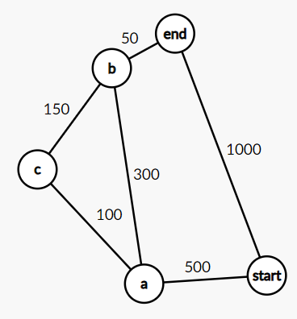
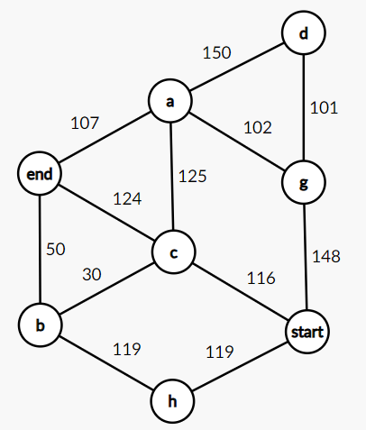
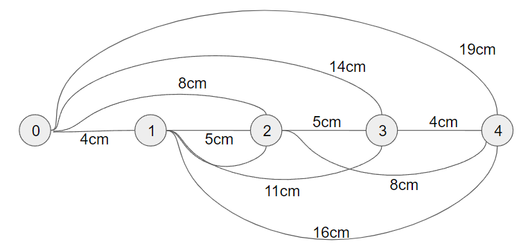

# 단계 5. 다이나믹 프로그래밍 연습

## 스토리

유전자 정보를 연구하는 G 연구원과 T 연구원은 학창 시절부터의 절친이었다. 어쩌다보니 같은 직장에서 근무하게 된 두 사람은 종종 식사나 술자리를 함께 하면서 여전히 좋은 관계를 유지하고 있었다. 어느 가을 저녁, 두 사람은 연구소 근처 맛집에서 저녁을 먹고 있었다. T 연구원은 연구소 밖에서 업무 이야기하는 것을 좋아하지는 않았지만, 요즘 잘 안풀리는 문제가 있다며 G 연구원에게 의견을 물어봤다.

“우리 연구 그룹에서 개발한 스마트 마우스 기억나지?”

“응. 기억 능력에 연산 능력이 있을지도 모른다고 발표했던 그 쥐 말하는거지?”

“응. 그런데 문제가 있어.”

“뭔데?”

“쥐의 지능을 검증하려고 하는데, 우리가 멍청한게 문제지.”

이렇게 시작한 사연은 다음과 같았다.

스마트 동물 연구 그룹에서 개발한 “영리한 쥐”가 연산 능력과 학습 능력이 있는지를 확인하기 위해 다음과 같은 실험을 설계했다.

방이 N개가 있는 미로를 설치한다. 각 방은 1번 방에서 N번 방까지 이름이 붙어 있고, 시작 지점은 방은 아니지만 편의상 0번 방이라고 부르고 있다. 0번 방은 N개의 통로가 있고, 1번 방에서 N번 방까지 연결되어 있다. 1번 방은 N-1개의 통로가 있고 2번 방에서 N번 방까지 연결되어 있다. 이런 식으로 K번 방은 K+1번 방부터 N번 방까지 연결된 통로를 가지고 있다. 각 통로는 길이가 정해져 있으며, 쥐들의 속도는 모두 일정하다. 그리고 N번 방에 도착하면 보상을 주는데, 빨리 도착할 수록 보상이 좋아진다.

“그래서 보상이 뭐야?”

“응. 8년 숙성된 냄새가 엄청난 치즈. 쥐가 그 냄새를 맡으면 미칠 듯이 좋아하더라구. 문제는, 이 치즈가 싸구려라서 시간이 지나면 지날 수록 냄새가 점점 사라진다는건데…”

“그래서?”

“이 치즈 냄새가 통로에 퍼지니까, 기를 쓰고 쥐들이 달리더라구.”

“그리고?”

“영리한 쥐가 매번 1등을 했지.”

“그러면 입증된거 아니야?”

“그런데, 영리한 쥐가 점점 학습을 해서 더 영리해지고 있는지를 확인해야 하니까. 그런데 문제는 영리한 쥐가 최선의 선택을 했는지 확인해보고 싶은데… 그게 계산이 잘 안되더라구.”

“음. 혹시, 실험할 때 방은 몇 개 설치한거야?”

“적당히 설치했어. 한 1000개 정도?”

G 연구원은 순간 할 말을 잃었다. 방이 1000개인 미로라면 방과 방 사이의 통로의 개수만 499500개이다. 적당히라는게 뭔지 모르는 녀석. 아니, 우리 연구소 실험 예산 괜찮은거야?

---

# 문제 1. 이상한 나라에서 동전으로 버스 타기

## 문제 분류

- 중요도 : 5/5
- 난이도 : 2/5
- 목표 수행 시간 : 4시간

## 스토리

S 연구원은 논문 성과가 탁월한 연구원이다. 그러다 보니 논문 발표를 위해서 해외 출장도 잦은 편이다. 그런 그도 이런 신기한 동전을 발행하는 나라는 처음이었다.

'1 다음이 7, 그리고 그 다음이 15?'

알고보니 그 국가의 오래전 역사 시대에 초대 국왕 1명이 7명의 기사들과 15개의 주변 왕국을 정복한 역사를 기념하기 위한 주화 시스템이었던 것이다. 여하튼 S 연구원은 이 나라에서도 동전을 가지고 버스를 타야 한다.

## 수행목표

- 편의상 어떤 국가의 화폐 단위를 원이라고 부르기로 하자. S 연구원이 방문한 국가의 동전은 1원 동전, 7원 동전, 15원 동전,

- 어떤 구성의 동전의 경우에도 각 동전을 제한없이 사용할 수 있을 때, 특정 금액의 요금을 지불하는데 필요한 최소한의 동전의 개수를 구하는 다이나믹 프로그래밍 접근 방법을 찾는다.
- 최소한의 동ㅈ
- 연구소를 구성하는 두 지점 사이의 거리가 포함된 데이터를 사용해 두 지점 사이의 모든 경로와 각 경로의 거리를 반환하는 함수를 구현한다.
- 첨부 파일에 포함된 10개의 지점 및 거리 데이터를 대상으로 'start' 지점에서 'end' 지점 사이의 모든 경로를 구한 다음, 이중 가장 짧은 거리, 가장 긴 거리, 평균 거리를 찾아 이를 출력한다.

## 수행단계

- `dp/shortest_path1.py` 파일에 다음을 구현한다.
  - 연결된 두 지점의 목록으로 비방향성 그래프를 생성한다.
  - 생성된 그래프에서 지정된 두 지점 사이의 가능한 모든 경로를 생성하고, 각 경로의 전체 거리와 함께 튜플의 리스트 형태로 반환하는 함수를 구현한다.
- 첨부 파일에는 총 10개의 그래프 데이터가 포함되어 있다. 각각의 데이터는 `Testcase 번호` 줄로 구분된다.

  - 각각의 그래프 데이터에는 `start`, `end`라는 이름의 꼭짓점이 하나씩 포함되어 있으며, 나머지 꼭짓점은 고유한 소문자 한 글자의 이름을 갖는다.
  - 두 꼭짓점과 꼭짓점 사이의 거리를 공백 문자로 구분해 하나의 줄을 구성한다. 비방향성 그래프이므로 두 꼭짓점의 순서는 그래프의 구성에 영향을 미치지 않는다.
  - 아래 그림의 그래프는 첫 번째 테스트 데이터의 그래프이다. 이 데이터를 사용해 만든 그래프에서 함수가 반환하는 값은 다음과 같다. - `[(['start','end'], 1000), (['start', 'a', 'b', 'end'], 850), (['start', 'a', 'c', 'b', 'end'], 800)]`  
    

- 첨부 파일에 포함된 10개의 그래프 각각에 대해서 다음을 출력한다.

  - `start`에서 `end`로 연결되는 경로의 수, 이 경로 중 최단 거리, 최장 거리 및 평균 거리의 값
  - 만약 경로가 존재하지 않으면 경로가 존재하지 않는다고 출력한다.

## 결과 예시

```
Testcase 1의 모든 경로의 수는 3이며 최단 거리는 800, 최장 거리는 1000, 평균 거리는 883 입니다.

Testcase 2의 모든 경로의 수는 2이며 최단 거리는 200, 최장 거리는 200, 평균 거리는 200 입니다.
(이하 생략)
```

## 참고사항

- 없음

## 제약사항

- 과정에서 제시한 제약사항을 준수한다.

## 개발환경

- 3.9 버전 이상의 파이썬 프로그램으로 작성한다.

## 보너스 과제

- 문제에서 사용한 방법으로 구할 수 있는 최단 경로와 최장 경로를 출력한다. 만약 같은 거리의 최단 경로 또는 최장 경로가 둘 이상 존재하는 경우 모두 출력한다.

---

## 평가질문/평가가이드

### [수행목표 확인]

- 문제에서 지시한 형식을 준수하였는가?
  - dp/shortest_path1.py 파일에 구현이 되어 있는지 확인한다.
- 제약사항을 준수하였는가?
  - 허용되지 않은 모듈, 라이브러리, 패키지의 사용 여부 (직접 구현한 경우 사용 가능하다.)
  - 입력과 무관하게 프로그램이 처리되지 않은 예외를 발생시키지 않고 정상적으로 종료되어야 한다.
- 결과가 정확한가?

  - 파이썬 3.9 이상에서 동작 여부를 확인한다.
  - 결과는 다음과 같다. 출력 형식은 평가하지 않는다.

    ```
    Testcase 1의 모든 경로의 수는 3이며 최단 거리는 800, 최장 거리는 1000, 평균 거리는 883 입니다.

    Testcase 2의 모든 경로의 수는 2이며 최단 거리는 200, 최장 거리는 200, 평균 거리는 200 입니다.

    Testcase 3의 모든 경로의 수는 1이며 최단 거리는 150, 최장 거리는 150, 평균 거리는 150 입니다.

    Testcase 4에서 start에서 시작해 end에 도착할 수 있는 경로가 존재하지 않습니다.

    Testcase 5의 모든 경로의 수는 1이며 최단 거리는 400, 최장 거리는 400, 평균 거리는 400 입니다.

    Testcase 6의 모든 경로의 수는 65이며 최단 거리는 100, 최장 거리는 500, 평균 거리는 401 입니다.

    Testcase 7의 모든 경로의 수는 4422이며 최단 거리는 240, 최장 거리는 1205, 평균 거리는 948 입니다.

    Testcase 8의 모든 경로의 수는 3이며 최단 거리는 242, 최장 거리는 373, 평균 거리는 285 입니다.

    Testcase 9의 모든 경로의 수는 130이며 최단 거리는 319, 최장 거리는 1697, 평균 거리는 1007 입니다.

    Testcase 10의 모든 경로의 수는 12499052이며 최단 거리는 247, 최장 거리는 2637, 평균 거리는 1952 입니다.
    ```

### [보너스 과제 확인]

- 보너스 과제를 지시한 대로 해결하였으며 그 결과는 정확한가?
  - 각각의 경로를 출력하되 같은 거리의 경로가 둘 이상 있는 경우 이를 모두 출력하고 있는지 확인한다.
  - 결과 예시는 다음과 같다.
- 각각의 문자를 최대 n번까지 사용해서 만들 수 있는 모든 단어를 반환하는 함수를 구현하고, 입력에 대해서 정확한 결과를 출력하였는가?

  - 결과 예시는 다음과 같다. 전체 목록의 출력은 일부만 포함하고 있다.

    ```
    Testcase 1의 모든 경로의 수는 3이며 최단 거리는 800, 최장 거리는 1000, 평균 거리는 883 입니다.
        최단 거리 경로
            start -> a -> c -> b -> end
        최장 거리 경로
            start -> end

    Testcase 2의 모든 경로의 수는 2이며 최단 거리는 200, 최장 거리는 200, 평균 거리는 200 입니다.
        최단 거리 경로
            start -> a -> end
            start -> b -> end
        최장 거리 경로
            start -> a -> end
            start -> b -> end

    Testcase 3의 모든 경로의 수는 1이며 최단 거리는 150, 최장 거리는 150, 평균 거리는 150 입니다.
        최단 거리 경로
            start -> end
        최장 거리 경로
            start -> end

    Testcase 4에서 start에서 시작해 end에 도착할 수 있는 경로가 존재하지 않습니다.

    Testcase 5의 모든 경로의 수는 1이며 최단 거리는 400, 최장 거리는 400, 평균 거리는 400 입니다.
        최단 거리 경로
            start -> a -> b -> c -> end
        최장 거리 경로
            start -> a -> b -> c -> end

    Testcase 6의 모든 경로의 수는 65이며 최단 거리는 100, 최장 거리는 500, 평균 거리는 401 입니다.
        최단 거리 경로
            start -> end
        최장 거리 경로
            start -> a -> b -> c -> d -> end
            start -> a -> b -> d -> c -> end
            start -> a -> c -> b -> d -> end
            start -> a -> c -> d -> b -> end
            start -> a -> d -> b -> c -> end
            start -> a -> d -> c -> b -> end
            start -> b -> a -> c -> d -> end
            start -> b -> a -> d -> c -> end
            start -> b -> c -> a -> d -> end
            start -> b -> c -> d -> a -> end
            start -> b -> d -> a -> c -> end
            start -> b -> d -> c -> a -> end
            start -> c -> a -> b -> d -> end
            start -> c -> a -> d -> b -> end
            start -> c -> b -> a -> d -> end
            start -> c -> b -> d -> a -> end
            start -> c -> d -> a -> b -> end
            start -> c -> d -> b -> a -> end
            start -> d -> a -> b -> c -> end
            start -> d -> a -> c -> b -> end
            start -> d -> b -> a -> c -> end
            start -> d -> b -> c -> a -> end
            start -> d -> c -> a -> b -> end
            start -> d -> c -> b -> a -> end

    Testcase 7의 모든 경로의 수는 4422이며 최단 거리는 240, 최장 거리는 1205, 평균 거리는 948 입니다.
        최단 거리 경로
            start -> c -> end
        최장 거리 경로
            start -> g -> c -> h -> f -> d -> a -> e -> b -> end

    Testcase 8의 모든 경로의 수는 3이며 최단 거리는 242, 최장 거리는 373, 평균 거리는 285 입니다.
        최단 거리 경로
            start -> a -> end
            start -> b -> a -> end
        최장 거리 경로
            start -> c -> a -> end

    Testcase 9의 모든 경로의 수는 130이며 최단 거리는 319, 최장 거리는 1697, 평균 거리는 1007 입니다.
        최단 거리 경로
            start -> f -> n -> end
        최장 거리 경로
            start -> c -> e -> i -> d -> f -> o -> b -> r -> a -> g -> l -> j -> n -> end

    Testcase 10의 모든 경로의 수는 12499052이며 최단 거리는 247, 최장 거리는 2637, 평균 거리는 1952 입니다.
        최단 거리 경로
            start -> b -> end
        최장 거리 경로
            start -> p -> i -> k -> b -> r -> n -> l -> q -> g -> f -> a -> j -> c -> e -> h -> o -> d -> m -> end
    ```

### [문제에 대한 이해]

- 그래프에서 모든 경로를 구하는데 사용한 방법을 설명하라.
- 완전 탐색법으로 모든 경로를 구한 후 최단 거리 경로를 구하는 이 문제의 접근 방법은 어떤 문제가 있을 것으로 추정되는가?
- 구현한 방법으로 특정 두 지점 사이의 최단 거리 경로를 구하고자 할 때의 시간 복잡도를 제시하라.

### [코드 예시]

```python
class Graph:
    def __init__(self):
        self.vertices = {}
        self.distance_table = {}

    def add_edge(self, vertex1, vertex2, distance):
        if vertex1 not in self.vertices:
            self.vertices[vertex1] = []
        if vertex2 not in self.vertices[vertex1]:
            self.vertices[vertex1].append(vertex2)
        if vertex2 not in self.vertices:
            self.vertices[vertex2] = []
        if vertex1 not in self.vertices[vertex2]:
            self.vertices[vertex2].append(vertex1)
        distance_key = (vertex1, vertex2)
        if vertex1 > vertex2:
            distance_key = (vertex2, vertex1)
        self.distance_table[distance_key] = distance

    def find_all_path(self, start, end, visited = None, paths = None):
        result = []
        is_first_call = False
        if visited == None:
            visited = []
            is_first_call = True
        if paths == None:
            paths = []

        visited.append(start)
        if start == end:
            paths.append(visited)
        else:
            for neighbor in self.vertices[start]:
                if neighbor not in visited:
                    self.find_all_path(neighbor, end, visited[:], paths)

        if is_first_call:

            for path in paths:
                distance = 0
                for i in range(len(path) - 1):
                    distance_key = (path[i], path[i + 1])
                    if path[i] > path[i + 1]:
                        distance_key = (path[i + 1], path[i])
                    distance += self.distance_table[distance_key]
                result.append((path, distance))

        return result


def main():
    with open("dp_tc1.txt", "r") as f:
        lines = f.readlines()

    case_start_lines = []
    for i, line in enumerate(lines):
        if line.startswith("Testcase"):
            case_start_lines.append(i)
    case_start_lines.append(len(lines))

    for i in range(len(case_start_lines) - 1):
        lab_map = Graph()
        for j in range(case_start_lines[i] + 1, case_start_lines[i + 1]):
            line = lines[j].strip()
            if line == '':
                continue
            vertex1, vertex2, distance = line.split(' ')
            distance = int(distance)
            lab_map.add_edge(vertex1, vertex2, distance)

        all_paths = lab_map.find_all_path('start', 'end')
        if all_paths == []:
            print(f"Testcase {i + 1}에서 start에서 시작해 end에 도착할 수 있는 경로가 존재하지 않습니다.")
        else:
            path_count = len(all_paths)
            total_distance = 0
            min_distance = float('inf')
            max_distance = 0
            min_path = []
            max_path = []
            for path, distance in all_paths:
                total_distance += distance
                if distance < min_distance:
                    min_distance = distance
                    min_path = [path]
                elif distance == min_distance:
                    min_path.append(path)
                if distance > max_distance:
                    max_distance = distance
                    max_path = [path]
                elif distance == max_distance:
                    max_path.append(path)
            print(f"Testcase {i + 1}의 모든 경로의 수는 {path_count}이며 최단 거리는 {min_distance}, 최장 거리는 {max_distance}, 평균 거리는 {total_distance // path_count} 입니다.")
            print(f"    최단 거리 경로")
            for path in min_path:
                print(f"        {' -> '.join(path)}")
            print(f"    최장 거리 경로")
            for path in max_path:
                print(f"        {' -> '.join(path)}")
        print()

if __name__ == "__main__":
    main()

```

---

# 문제 2. 꼭 가야 하는 길만 찾는 구조

## 문제 분류

- 중요도 : 5/5
- 난이도 : 2/5
- 목표 수행 시간 : 2시간

## 스토리

V 연구원은 약도에서 실험동 사이를 연결하는 모든 경로를 사용해 그래프를 구성한 후, 이 그래프에서 모든 경로를 찾고 거리를 비교하려 했다. 하지만 복잡한 K 바이오 연구소의 구조에서 모든 경로를 찾는 작업이 매우 비효율적인 방법이라는 사실을 알고리즘을 구현한 후에야 알게 되었다.

효율적인 방법을 찾고자 고민을 하던 V 연구원은 최단 거리를 찾는 문제에서 어떤 특정한 구조가 있다는 사실을 깨달았다.

## 수행목표

- 두 지점 사이의 최단 거리를 구할 때 다음 원칙을 사용할 수 있다.
  - 두 지점 사이의 최단 경로에 포함된 특정 구간은 최단 경로이다.
  - 두 지점 사이의 여러 경로 중 최단 경로가 아닌 경로는 어떠한 다른 최단 경로에도 포함되지 않는다.
- 이 구조를 사용해 최단 경로를 구하는 함수를 구현한다.
- 다음 첨부 파일에는 10개의 그래프를 구성하는 데이터가 포함되어 있다. 이 중 첫 9개의 그래프에 대한 결과를 출력한다.

## 수행단계

- 수행 목표에서 제시한 두 가지 원칙의 타당성을 분석한다.
- 이 원칙은 문제의 구조와 관련된 원칙이다. 문제의 구조를 분석해보자.
  - 아래 그림에서 end로 연결되는 지점이 c 뿐이며 a와 b가 end와 연결되지 않는다고 가정하자. 이 경우 D(a, b)가 두 지점 사이의 최단 거리를 나타낸다면, D(start, end) = 124 + D(start, c)가 된다.
  - 아래 그림의 연결이 모두 유효하다고 가정할 때, D(start, end)를 D(start, b), D(start, c), D(start, a)를 포함하는 수식으로 표현해보자.
    
- 이 원칙이 제시하는 문제의 구조를 점화식으로 사용하는 재귀 호출 방식으로 두 지점 사이의 최단 경로의 거리를 구하는 함수를 dp/shortest_path2.py 파일에 구현한다.
- 첨부 파일은 이전 문제와 동일한 구조를 가진 파일로 총 10개의 그래프 데이터가 포함되어 있다. 이 중 첫 아홉 개의 그래프에 대해서 `start`에서 `end`로의 최단 거리를 출력한다.
- 열 번째 그래프의 경우는 실행했을 때 어떤 문제가 있는지 확인한다.

## 결과예시

```
Testcase 1의 최단 거리는 196입니다.

Testcase 2의 최단 거리는 200입니다.
(이하 생략)
```

## 참고사항

- 이전 문제의 테스트 데이터와 비교하면 첫 번째, 다섯 번째 테스트케이스의 데이터만 다르고 나머지는 같다.

## 제약사항

- 과정에서 제시한 제약사항을 준수한다.

## 개발환경

- 3.9 버전 이상의 파이썬 프로그램으로 작성한다.

## 보너스 과제

- 문제의 구조를 사용하는 재귀 호출로 최단 거리를 구하는 방식을 그대로 사용하면서 동시에 이 최단 거리에 해당하는 경로도 반환하도록 함수를 수정한다.
  - 만약 같은 거리의 최단 경로가 둘 이상 있는 경우 모두를 반환한다.
  - 이 함수는 테스크테이스의 처음 두 그래프에 대해서 다음 튜플을 반환하도록 구현한다.
    - (196, [['start', 'c', 'b', 'end']])
    - (200, [['start', 'a', 'end'], ['start', 'b', 'end']])
  - 이 함수의 반환 결과를 그대로 출력한다.

---

## 평가질문/평가가이드

### [수행목표 확인]

- 문제에서 지시한 형식을 준수하였는가?
  - dp/shortest_path2.py 파일에 구현이 되어 있는지 확인한다.
  - 문제의 구조를 사용하는 재귀 호출 방식으로 구현되어 있는지 확인한다.
- 제약사항을 준수하였는가?
  - 허용되지 않은 모듈, 라이브러리, 패키지의 사용 여부 (직접 구현한 경우 사용 가능하다.)
  - 입력과 무관하게 프로그램이 처리되지 않은 예외를 발생시키지 않고 정상적으로 종료되어야 한다.
- 결과가 정확한가?

  - 파이썬 3.9 이상에서 동작 여부를 확인한다.
  - 결과는 다음과 같다. 출력 형식은 평가하지 않는다. Testcase 10의 결과는 출력되어 있지 않아도 무방하다.

    ```
    Testcase 1의 최단 거리는 196입니다.

    Testcase 2의 최단 거리는 200입니다.

    Testcase 3의 최단 거리는 150입니다.

    Testcase 4에서 start에서 시작해 end에 도착할 수 있는 경로가 존재하지 않습니다.

    Testcase 5의 최단 거리는 310입니다.

    Testcase 6의 최단 거리는 100입니다.

    Testcase 7의 최단 거리는 240입니다.

    Testcase 8의 최단 거리는 242입니다.

    Testcase 9의 최단 거리는 319입니다.

    Testcase 10의 최단 거리는 247입니다.
    ```

### [보너스 과제의 확인]

- 보너스 과제를 지시대로 해결하였는가?
  - 문제의 구조를 사용하는 재귀 호출 방식으로 구현하고 있는지 확인한다.
- 결과가 정확한가?

  - 최단 경로가 둘 이상인 경우(2번, 5번, 8번 테스트케이스) 모든 경로를 반환값에 포함하고 있는지 확인한다.
  - 결과 예시는 다음과 같다.

    ```
    Testcase 1의 최단 거리는 196입니다.
        최단 경로를 구하는 함수의 반환값 : (196, [['start', 'c', 'b', 'end']])

    Testcase 2의 최단 거리는 200입니다.
        최단 경로를 구하는 함수의 반환값 : (200, [['start', 'a', 'end'], ['start', 'b', 'end']])

    Testcase 3의 최단 거리는 150입니다.
        최단 경로를 구하는 함수의 반환값 : (150, [['start', 'end']])

    Testcase 4에서 start에서 시작해 end에 도착할 수 있는 경로가 존재하지 않습니다.

    Testcase 5의 최단 거리는 310입니다.
        최단 경로를 구하는 함수의 반환값 : (310, [['start', 'a', 'c', 'd', 'end'], ['start', 'b', 'c', 'd', 'end'], ['start', 'a', 'c', 'e', 'end'], ['start', 'b', 'c', 'e', 'end']])

    Testcase 6의 최단 거리는 100입니다.
        최단 경로를 구하는 함수의 반환값 : (100, [['start', 'end']])

    Testcase 7의 최단 거리는 240입니다.
        최단 경로를 구하는 함수의 반환값 : (240, [['start', 'c', 'end']])

    Testcase 8의 최단 거리는 242입니다.
        최단 경로를 구하는 함수의 반환값 : (242, [['start', 'b', 'a', 'end'], ['start', 'a', 'end']])

    Testcase 9의 최단 거리는 319입니다.
        최단 경로를 구하는 함수의 반환값 : (319, [['start', 'f', 'n', 'end']])

    Testcase 10의 최단 거리는 247입니다.
        최단 경로를 구하는 함수의 반환값 : (247, [['start', 'b', 'end']])

    ```

### [문제에 대한 이해]

- 문제에서 제시한 두 가지 원칙의 타당성에 대해서 설명하라.
- D(start, end)를 D(start, b), D(start, c), D(start, a)를 포함하는 수식으로 표현하라.
- 이 방식은 '작은 문제의 결과를 활용해 큰 문제를 해결'하는 형태로 문제의 구조를 활용한다. 이때 큰 문제를 상위 구조의 문제, 작은 문제를 하위 구조의 문제라고 정의한다면, 가장 큰 구조의 문제와 가장 작은 구조의 문제는 무엇인가?
- 열 번째 테스트 그래프에서 발생하는 문제는 무엇인가? 이 문제의 원인은 무엇인지 알고리즘의 구조를 기반으로 설명해보자.
- 같은 방법을 사용해 두 지점 사이의 최장 거리를 구할 수 있는가? 근거와 함께 답을 제시하라.

### [코드 예시]

```python
class Graph:
    def __init__(self):
        self.vertices = {}
        self.distance_table = {}

    def add_edge(self, vertex1, vertex2, distance):
        if vertex1 not in self.vertices:
            self.vertices[vertex1] = []
        if vertex2 not in self.vertices[vertex1]:
            self.vertices[vertex1].append(vertex2)
        if vertex2 not in self.vertices:
            self.vertices[vertex2] = []
        if vertex1 not in self.vertices[vertex2]:
            self.vertices[vertex2].append(vertex1)
        distance_key = (vertex1, vertex2)
        if vertex1 > vertex2:
            distance_key = (vertex2, vertex1)
        self.distance_table[distance_key] = distance

    def get_distance(self, vertex1, vertex2):
        if (vertex1, vertex2) in self.distance_table:
            return self.distance_table[(vertex1, vertex2)]
        elif (vertex2, vertex1) in self.distance_table:
            return self.distance_table[(vertex2, vertex1)]
        else:
            return None

    def find_shortest_distance(self, start, end, visited = None):
        if visited == None:
            visited = [end]
        if start == end:
            return 0
        distance = float('inf')
        min_distance = float('inf')
        for neighbor in self.vertices[end]:
            if neighbor not in visited:
                distance = self.find_shortest_distance(start, neighbor, visited + [neighbor]) + self.get_distance(neighbor, end)
                if distance < min_distance:
                    min_distance = distance
        return min_distance

    def find_shortest_path(self, start, end, visited = None):
        if visited == None:
            visited = [end]
        if start == end:
            return 0, [visited]

        distance = float('inf')
        min_distance = float('inf')
        min_path = []
        for neighbor in self.vertices[end]:
            if neighbor not in visited:
                distance, paths = self.find_shortest_path(start, neighbor, [neighbor] + visited)

                if distance + self.get_distance(neighbor, end) < min_distance:
                    min_distance = distance + self.get_distance(neighbor, end)
                    min_path = []
                    for path in paths:
                        min_path.append(path)
                elif distance + self.get_distance(neighbor, end) == min_distance:
                    for path in paths:
                        min_path.append(path)
        return (min_distance, min_path)


def main():
    with open("dp_tc2.txt", "r") as f:
        lines = f.readlines()

    case_start_lines = []
    for i, line in enumerate(lines):
        if line.startswith("Testcase"):
            case_start_lines.append(i)
    case_start_lines.append(len(lines))

    for i in range(len(case_start_lines) - 1):
        lab_map = Graph()
        for j in range(case_start_lines[i] + 1, case_start_lines[i + 1]):
            line = lines[j].strip()
            if line == '':
                continue
            vertex1, vertex2, distance = line.split(' ')
            distance = int(distance)
            lab_map.add_edge(vertex1, vertex2, distance)
        result = lab_map.find_shortest_path('start', 'end')
        distance = result[0]
        if distance == float('inf'):
            print(f"Testcase {i + 1}에서 start에서 시작해 end에 도착할 수 있는 경로가 존재하지 않습니다.")
        else:
            print(f"Testcase {i + 1}의 최단 거리는 {distance}입니다.")
            print(f"    최단 경로를 구하는 함수의 반환값 : {result}")
        print()

if __name__ == "__main__":
    main()

```

---

# 문제 3. 관점을 바꾸면 길이 보인다.

## 문제 분류

- 중요도 : 5/5
- 난이도 : 2/5
- 목표 수행 시간 : 4시간

## 스토리

'어, 이게 아닌데?'

V 연구원은 크게 실망했다. 구조를 사용해서 해결하면 효과적으로 문제를 해결할 수 있을 것이라는 생각이 들었는데, 사실 그렇지 않았기 때문이다. 하지만, 관점을 바꿔 다시 도전해보기로 마음을 먹었다.

'상향식으로 접근해보면 어떨까?'

## 수행목표

- 알고 있는 두 지점간의 최단 거리를 사용해 다른 두 지점의 최단 거리를 갱신하는 과정을 반복한다. 이 과정을 더 이상 갱신되는 두 지점 사이의 최단 거리가 없을 때 까지 반복하는 방식으로 두 지점간의 최단 거리를 계산하고 최종적으로 파라미터로 전달한 두 지점 사이의 거리를 반환한다.
- 다음 첨부 파일에는 12개의 그래프를 구성하는 데이터가 포함되어 있다. 12개의 그래프에 대한 결과를 출력한다.

## 수행단계

- 하향식 접근 방법 대신 다음과 같이 상향식 접근 방식으로 거리를 계산하고, 계산된 결과 중 지정한 두 지점 사이의 거리를 반환하는 함수를 dp/shortest_path3.py 파일에 구현한다.
  - 처음에 우리가 알 수 있는 두 지점 사이의 잠정 최단 거리는 그래프에서 직접 연결된 두 꼭짓점 사이의 거리이다.
  - 그 다음 단계에서 우리가 알 수 있는 잠정 최단 거리는 현재 잠정 최단 거리를 알고 있는 두 지점을 연결한 결과이다.
  - 그 다음 단계도 마찬가지로 그 시점에서 알 수 있는 잠정 최단 거리를 연결해 나간다.
  - 이 과정을 반복하다보면 두 지점 사이의 잠정 최단 거리에 대한 두 가지 상황이 발생한다.
    - 잠정 최단 거리를 알 수 없었는데 새롭게 알 수 있는 새로운 두 지점이 추가된다.
    - 잠정 최단 거리를 알고 있었는데 이 잠정 최단 거리보다 더 짧은 새로운 잠정 최단 거리로 갱신된다.
  - 예를 들어 다음 그림의 그래프에서 처음에는 start와 end 사이의 잠정 최단 거리를 알 수 없지만, 초기에 주어진 start와 c, c와 end 사이의 잠정 최단 거리를 더하면, start와 end 사이의 잠정 최단 거리를 알 수 있다.
  - 또한 c와 end 사이의 잠정 최단 거리가 124인 상황에서, c와 b, b와 end 사이의 잠정 최단 거리를 더하면 c와 end 사이의 잠정 최단 거리가 124보다 작은 80으로 갱신된다.
    
  - 이 과정을 더 이상 최단 거리가 갱신되지 않는다고 판단될 때 까지 반복한다.
  - 이전 문제와 마찬가지로 최단 경로를 구하는 문제의 구조를 활용하지만, 큰 문제에서 점점 작은 문제로 나누어 접근하는 대신, 작은 문제를 모아서 큰 문제를 해결하는 반대 방향의 접근 방식이다. 이전 문제처럼 큰 문제에서 시작하는 접근 방법을 하향식 접근 방법, 반대로 작은 문제를 모아서 큰 문제를 해결하는 접근 방식을 상향식 접근 방식이라고 부른다.
- 상향식 접근 방식으로 구현한 함수를 사용해 첨부 파일에 포함된 12개의 그래프에서 `start` 지점에서 `end` 지점 사이의 최단 거리를 찾아 출력한다.

## 결과예시

```
Testcase 1 : 최단 거리는 196입니다.

Testcase 2 : 최단 거리는 200입니다.
(이하 생략)
```

## 참고사항

- 이 문제의 테스트케이스 중 처음 10개는 이전 문제의 테스트케이스와 동일하며, 뒤의 2개가 추가되었다.

## 제약사항

- 과정에서 제시한 제약사항을 준수한다.

## 개발환경

- 3.9 버전 이상의 파이썬 프로그램으로 작성한다.

## 보너스 과제

- 같은 상향식 방법으로 접근하되, 모든 두 지점간의 최단 거리를 구하는 대신 파라미터로 시작 지점에서 다른 모든 지점까지의 최단 거리를 구하는 방법으로 조금 더 빠르게 두 지점 사이의 최단 거리를 구하는 함수를 구현하고, 이 함수를 사용해 `start`와 `end` 두 지점 사이의 최단 거리를 테스트케이스 12개의 그래프에 대해서 출력해보자.

---

## 평가질문/평가가이드

### [수행목표 확인]

- 문제에서 지시한 형식을 준수하였는가?
  - dp/shortest_path3.py 파일에 구현이 되어 있는지 확인한다.
  - 상향식 다이나믹 프로그래밍으로 구현하였는지 확인한다.
  - 이 문제는 그리디 알고리즘 방식을 적용한 다른 최단 경로 알고리즘을 요구하는 문제가 아니다. 만약 그러한 알고리즘을 사용한 경우, 해당 알고리즘이 왜 문제에서 제시한 방법으로 해석되는지를 명확히 설명할 수 있는 경우에만 해답으로 인정한다.
- 제약사항을 준수하였는가?
  - 허용되지 않은 모듈, 라이브러리, 패키지의 사용 여부 (직접 구현한 경우 사용 가능하다.)
  - 입력과 무관하게 프로그램이 처리되지 않은 예외를 발생시키지 않고 정상적으로 종료되어야 한다.
- 결과가 정확한가?

  - 파이썬 3.9 이상에서 동작 여부를 확인한다.
  - 결과는 다음과 같다. 출력 형식은 평가하지 않는다. 테스트케이스 8의 경우, 구현 방식에 따라 95, 96, 97 셋 중 어느 값도 나올 수 있다.

    ```
    Testcase 1 : 최단 거리는 196입니다.

    Testcase 2 : 최단 거리는 200입니다.

    Testcase 3 : 최단 거리는 150입니다.

    Testcase 4 : start에서 시작해 end에 도착할 수 있는 경로가 존재하지 않습니다.

    Testcase 5 : 최단 거리는 310입니다.

    Testcase 6 : 최단 거리는 100입니다.

    Testcase 7 : 최단 거리는 240입니다.

    Testcase 8 : 최단 거리는 242입니다.

    Testcase 9 : 최단 거리는 319입니다.

    Testcase 10 : 최단 거리는 247입니다.

    Testcase 11 : 최단 거리는 211입니다.

    Testcase 12 : 최단 거리는 214입니다.
    ```

### [보너스 과제 확인]

- 지시한대로 보너스 과제를 해결하였는가?
  - 상향식으로 시작 지점에서 각 지점으로의 잠정 최단 거리만 계산하는 방식으로 반복 갱신한 후 더 이상 갱신되지 않을 때 까지 이를 반복하는 방식으로 구현하였는지 확인한다.
- 결과가 정확한가?
  - 결과는 수정 전과 동일해야 하며, 수행 시간은 마지막 테스트케이스에서도 거의 지연없이 결과를 확인할 수 있어야 한다.

### [문제에 대한 이해]

- 일상의 특정 문제를 해결하기 위한 상향식 접근 방법과 하향식 접근 방법의 예를 들어보라. 같은 문제를 서로 다른 방법으로 접근하는 예시를 제시하라.
- 구현한 함수를 기준으로 상향식으로 최단 거리를 계산하는 과정을 설명하라.
- 하향식 접근 방법과 비교해 이 문제의 상향식 접근 방법의 성능이 좋은 이유를 설명하라.

### [코드 예시]

```python

class Graph:
    def __init__(self):
        self.vertices = {}
        self.distance_table = {}

    def add_edge(self, vertex1, vertex2, distance):
        if vertex1 not in self.vertices:
            self.vertices[vertex1] = []
        if vertex2 not in self.vertices[vertex1]:
            self.vertices[vertex1].append(vertex2)
        if vertex2 not in self.vertices:
            self.vertices[vertex2] = []
        if vertex1 not in self.vertices[vertex2]:
            self.vertices[vertex2].append(vertex1)
        distance_key = (vertex1, vertex2)
        if vertex1 > vertex2:
            distance_key = (vertex2, vertex1)
        self.distance_table[distance_key] = distance

    def get_distance(self, vertex1, vertex2):
        if (vertex1, vertex2) in self.distance_table:
            return self.distance_table[(vertex1, vertex2)]
        elif (vertex2, vertex1) in self.distance_table:
            return self.distance_table[(vertex2, vertex1)]
        else:
            return None

    # bonus problem solution
    def find_shortest_distance2(self, start, end):
        vertices = list(self.vertices.keys())
        distances_from_start = {}
        for (v1, v2), v in self.distance_table.items():
            if v1 == start or v2 == start:
                if v1 == start:
                    distances_from_start[v2] = v
                else:
                    distances_from_start[v1] = v
        while True:
            updated_distances_from_start = {}
            for mid in distances_from_start.keys():
                if mid not in updated_distances_from_start:
                    updated_distances_from_start[mid] = distances_from_start[mid]
                else:
                    updated_distances_from_start[mid] = min(updated_distances_from_start[mid], distances_from_start[mid])
                for dst in vertices:
                    distance_mid_dst = self.get_distance(mid, dst)
                    if distance_mid_dst == None:
                        continue
                    distance_start_mid_dst = distances_from_start[mid] + distance_mid_dst
                    current_distance_start_dst = float('inf')
                    if dst in updated_distances_from_start:
                        current_distance_start_dst = updated_distances_from_start[dst]
                    direct_to_dst = float('inf')
                    if dst in distances_from_start:
                        direct_to_dst = distances_from_start[dst]
                    updated_distances_from_start[dst] = min(distance_start_mid_dst, current_distance_start_dst, direct_to_dst)
            is_updated = False
            if len(distances_from_start) != len(updated_distances_from_start):
                is_updated = True
            else:
                for k, v in distances_from_start.items():
                    if v != updated_distances_from_start[k]:
                        is_updated = True
                        break
            if is_updated == False:
                break
            distances_from_start = updated_distances_from_start
        if end in distances_from_start:
            return distances_from_start[end]
        else:
            return None

    def find_shortest_distance(self, start, end):
        vertices = list(self.vertices.keys())
        distances = {}
        for (v1, v2), v in self.distance_table.items():
            key = tuple(sorted([v1, v2]))
            distances[key] = v
        while True:
            updated_distances = {}
            for i in range(len(vertices)):
                for j in range(i + 1, len(vertices)):
                    v1 = vertices[i]
                    v2 = vertices[j]
                    key = tuple(sorted([v1, v2]))
                    current_distance = float('inf')
                    if key in distances:
                        current_distance = distances[key]
                    for inter_vertex in vertices:
                        if inter_vertex == v1 or inter_vertex == v2:
                            continue
                        first_half_key = tuple(sorted([v1, inter_vertex]))
                        second_half_key = tuple(sorted([inter_vertex, v2]))
                        if first_half_key in distances and second_half_key in distances:
                            current_distance = min(current_distance, distances[first_half_key] + distances[second_half_key])
                    if current_distance != float('inf'):
                        updated_distances[(key)] = current_distance
            is_updated = False
            if len(distances) != len(updated_distances):
                is_updated = True
            else:
                for k, v in distances.items():
                    if v != updated_distances[k]:
                        is_updated = True
                        break
            if is_updated == False:
                break
            distances = updated_distances
        key = tuple(sorted([start, end]))

        if key in distances:
            return distances[key]
        else:
            return None

def main():
    with open("dp_tc3.txt", "r") as f:
        lines = f.readlines()

    case_start_lines = []
    for i, line in enumerate(lines):
        if line.startswith("Testcase"):
            case_start_lines.append(i)
    case_start_lines.append(len(lines))

    for i in range(len(case_start_lines) - 1):
        lab_map = Graph()
        for j in range(case_start_lines[i] + 1, case_start_lines[i + 1]):
            line = lines[j].strip()
            if line == '':
                continue
            vertex1, vertex2, distance = line.split(' ')
            distance = int(distance)
            lab_map.add_edge(vertex1, vertex2, distance)
        distance = lab_map.find_shortest_distance('start', 'end')
        print(f"Testcase {i + 1} : ", end = '')
        if distance == None:
            print("start에서 시작해 end에 도착할 수 있는 경로가 존재하지 않습니다.")
        else:
            print(f"최단 거리는 {distance}입니다.")
        print()

if __name__ == "__main__":
    main()
```

---

# 문제 4. 관점을 바꿔서 찾은 길

## 문제 분류

- 중요도 : 5/5
- 난이도 : 2/5
- 목표 수행 시간 : 4시간

## 스토리

관점을 바꿔 해결의 실마리를 찾은 연구원 V. 하지만 연구원 V에게 고비가 하나 더 남아 있었다. 필요한 것은 최단 거리 뿐 아니라 최단 거리로 갈 수 있는 경로였기 때문이다.

## 수행목표

- 이전 문제에서 상향식 접근 방법으로 최단 거리를 빠르게 찾는 방법을 만들었다면, 이번 문제에서는 그 최단 거리의 경로가 어떤 경로인지 찾는다.
- 상향식 접근 방법으로 최단 거리를 계산하면서 최단 경로도 계산한 후, 지정한 두 지점 사이의 최단 경로를 함께 반환하는 함수를 구현한다.
- 다음 첨부 파일에는 12개의 그래프를 구성하는 데이터가 포함되어 있다. 12개의 그래프에 대한 결과를 출력한다.

## 수행단계

- 두 지점 사이의 잠정 최단 거리를 계산하면서 잠정 최단 경로도 함께 계산하는 방법을 정리한다.
- 이 방법을 사용해 상향식 접근 방법으로 두 지점 사이의 최단 거리 뿐 아니라 최단 경로도 반환하는 함수를 dp/shortest_path4.py 파일에 구현한다.
  - 이 함수가 반환하는 최단 경로는 최단 경로들의 목록의 형태이다. 같은 거리의 최단 경로가 둘 이상 존재할 수 있기 때문이다.
- 상향식 접근 방식으로 구현한 함수를 사용해 첨부 파일에 포함된 12개의 그래프에서 `start` 지점에서 `end` 지점 사이의 최단 거리와 이 때의 경로를 찾아 출력한다.
  - 같은 거리의 최단 경로가 둘 이상인 경우 모든 경로를 출력한다.

## 결과 예시

```
Testcase 1 : 최단 거리는 196입니다.
    최단 경로를 구하는 함수의 반환값 : [['start', 'c', 'b', 'end']]

Testcase 2 : 최단 거리는 200입니다.
    최단 경로를 구하는 함수의 반환값 : [['start', 'a', 'end'], ['start', 'b', 'end']]

(이하 생략)
```

## 참고사항

- 없음

## 제약사항

- 과정에서 제시한 제약사항을 준수한다.

## 개발환경

- 3.9 버전 이상의 파이썬 프로그램으로 작성한다.

## 보너스 과제

- 없음

## 평가질문/평가가이드

### [수행목표 확인]

- 문제에서 지시한 형식을 준수하였는가?
  - dp/shortest_path4.py 파일에 구현이 되어 있는지 확인한다.
  - 상향식 접근 방법으로 최단 거리와 최단 경로를 구하는 함수를 구현하였는지 확인한다.
- 제약사항을 준수하였는가?
  - 허용되지 않은 모듈, 라이브러리, 패키지의 사용 여부 (직접 구현한 경우 사용 가능하다.)
  - 입력과 무관하게 프로그램이 처리되지 않은 예외를 발생시키지 않고 정상적으로 종료되어야 한다.
- 결과가 정확한가?

  - 파이썬 3.9 이상에서 동작 여부를 확인한다.
  - 결과는 다음과 같다. 출력 형식은 평가하지 않는다.

    ```
    Testcase 1 : 최단 거리는 196입니다.
        최단 경로를 구하는 함수의 반환값 : [['start', 'c', 'b', 'end']]

    Testcase 2 : 최단 거리는 200입니다.
        최단 경로를 구하는 함수의 반환값 : [['start', 'a', 'end'], ['start', 'b', 'end']]

    Testcase 3 : 최단 거리는 150입니다.
        최단 경로를 구하는 함수의 반환값 : [['start', 'end']]

    Testcase 4 : start에서 시작해 end에 도착할 수 있는 경로가 존재하지 않습니다.

    Testcase 5 : 최단 거리는 310입니다.
        최단 경로를 구하는 함수의 반환값 : [['start', 'a', 'c', 'd', 'end'], ['start', 'b', 'c', 'd', 'end'], ['start', 'a', 'c', 'e', 'end'], ['start', 'b', 'c', 'e', 'end']]

    Testcase 6 : 최단 거리는 100입니다.
        최단 경로를 구하는 함수의 반환값 : [['start', 'end']]

    Testcase 7 : 최단 거리는 240입니다.
        최단 경로를 구하는 함수의 반환값 : [['start', 'c', 'end']]

    Testcase 8 : 최단 거리는 242입니다.
        최단 경로를 구하는 함수의 반환값 : [['start', 'a', 'end'], ['start', 'b', 'a', 'end']]

    Testcase 9 : 최단 거리는 319입니다.
        최단 경로를 구하는 함수의 반환값 : [['start', 'f', 'n', 'end']]

    Testcase 10 : 최단 거리는 247입니다.
        최단 경로를 구하는 함수의 반환값 : [['start', 'b', 'end']]

    Testcase 11 : 최단 거리는 211입니다.
        최단 경로를 구하는 함수의 반환값 : [['start', 'ac', 'end']]

    Testcase 12 : 최단 거리는 214입니다.
        최단 경로를 구하는 함수의 반환값 : [['start', 'ehkxe', 'end']]
    ```

### [문제에 대한 이해]

- 최단 경로를 구하기 위해서 어떤 방법을 사용하였는지 설명하라.

### [코드 예시]

```python
class Graph:
    def __init__(self):
        self.vertices = {}
        self.distance_table = {}

    def add_edge(self, vertex1, vertex2, distance):
        if vertex1 not in self.vertices:
            self.vertices[vertex1] = []
        if vertex2 not in self.vertices[vertex1]:
            self.vertices[vertex1].append(vertex2)
        if vertex2 not in self.vertices:
            self.vertices[vertex2] = []
        if vertex1 not in self.vertices[vertex2]:
            self.vertices[vertex2].append(vertex1)
        distance_key = (vertex1, vertex2)
        if vertex1 > vertex2:
            distance_key = (vertex2, vertex1)
        self.distance_table[distance_key] = distance

    def get_distance(self, vertex1, vertex2):
        if (vertex1, vertex2) in self.distance_table:
            return self.distance_table[(vertex1, vertex2)]
        elif (vertex2, vertex1) in self.distance_table:
            return self.distance_table[(vertex2, vertex1)]
        else:
            return None

    def find_shortest_path(self, start, end):
        vertices = list(self.vertices.keys())
        vertices.sort()
        distances = {}
        shortest_paths = {}
        for (v1, v2), v in self.distance_table.items():
            key = tuple(sorted([v1, v2]))
            distances[key] = v
            shortest_paths[key] = [[v1, v2]]
        while True:
            updated_distances = {}
            for i in range(len(vertices)):
                for j in range(i + 1, len(vertices)):
                    v1 = vertices[i]
                    v2 = vertices[j]
                    key = (v1, v2)
                    current_distance = float('inf')
                    current_path = []
                    if key in distances:
                        current_distance = distances[key]
                        current_path = shortest_paths[key]
                    for inter_vertex in vertices:
                        if inter_vertex == v1 or inter_vertex == v2:
                            continue
                        first_half_key = tuple(sorted([v1, inter_vertex]))
                        second_half_key = tuple(sorted([inter_vertex, v2]))
                        if first_half_key in distances and second_half_key in distances:
                            distance_through_inter_vertex = distances[first_half_key] + distances[second_half_key]
                            path_through_inter_vertex = []
                            for path_prev in shortest_paths[first_half_key]:
                                for path_after in shortest_paths[second_half_key]:
                                    composed_path = path_prev[:-1]
                                    if path_prev[0] != v1:
                                        composed_path = path_prev[::-1][:-1]
                                    if path_after[-1] == v2:
                                        composed_path += path_after
                                    else:
                                        composed_path += path_after[::-1]
                                    path_through_inter_vertex.append(composed_path)
                            if distance_through_inter_vertex < current_distance:
                                current_distance = distance_through_inter_vertex
                                current_path = path_through_inter_vertex
                            elif distance_through_inter_vertex == current_distance:
                                for path in path_through_inter_vertex:
                                    if path not in current_path:
                                        current_path.append(path)
                    if current_distance != float('inf'):
                        updated_distances[(key)] = current_distance
                        shortest_paths[key] = current_path
            is_updated = False
            if len(distances) != len(updated_distances):
                is_updated = True
            else:
                for k, v in distances.items():
                    if v != updated_distances[k]:
                        is_updated = True
                        break
            if is_updated == False:
                break
            distances = updated_distances
        key = tuple(sorted([start, end]))
        if key not in distances:
            return None, None
        if shortest_paths[key][0][0] == start:
            result_path = shortest_paths[key]
        else:
            result_path = []
            for path in shortest_paths[key]:
                result_path.append(path[::-1])

        return distances[key], result_path


def main():
    with open("dp_tc3.txt", "r") as f:
        lines = f.readlines()

    case_start_lines = []
    for i, line in enumerate(lines):
        if line.startswith("Testcase"):
            case_start_lines.append(i)
    case_start_lines.append(len(lines))

    for i in range(len(case_start_lines) - 1):
        lab_map = Graph()
        for j in range(case_start_lines[i] + 1, case_start_lines[i + 1]):
            line = lines[j].strip()
            if line == '':
                continue
            vertex1, vertex2, distance = line.split(' ')
            distance = int(distance)
            lab_map.add_edge(vertex1, vertex2, distance)
        distance, path = lab_map.find_shortest_path('start', 'end')
        print(f"Testcase {i + 1} : ", end = '')
        if distance == None:
            print("start에서 시작해 end에 도착할 수 있는 경로가 존재하지 않습니다.")
        else:
            print(f"최단 거리는 {distance}입니다.")
            print(f"    최단 경로를 구하는 함수의 반환값 : {path}")

        print()

if __name__ == "__main__":
    main()
```

---

# 문제 5. 영리한 쥐의 경로찾기 (1)

## 문제 분류

- 중요도 : 5/5
- 난이도 : 3/5
- 목표 수행 시간 : 4시간

## 스토리

'영리한 쥐'가 최선의 선택을 했는지 검증을 하기 위해서 최적의 경로가 무엇인지 알아내야 하는 연구원 T. 쥐가 점점 영리해져서 최선의 선택을 했는데, 정작 인간이 그 경로를 알지 못한다면 이건 인간의 존엄과 직결된 치명적인 문제이다. (이 문제의 심각성이 잘 이해가 되지 않는 사람들은 과정의 스토리를 다시 한 번 읽고 오자.)

이 사실을 자각한 연구원 T는 떨리는 손으로 프로그래밍 게시판에 도움을 청했다.

## 수행목표

- 영리한 쥐의 경로찾기 문제는 다음과 같이 정리할 수 있다.
  - 지점이 N개가 있는 미로를 설치한다. 각 지점은 1번 지점에서 N번 지점까지 이름이 붙어 있고, 시작 지점은 편의상 0번 지점이라고 부르고 있다.
  - 0번 지점은 N개의 통로가 있고, 1번 지점에서 N번 지점까지 연결되어 있다.
  - 1번 지점은 N-1개의 통로가 있고 2번 지점에서 N번 지점까지 연결되어 있다.
  - 이런 식으로 K번 지점은 K+1번 지점부터 N번 지점까지 연결된 통로를 가지고 있다.
  - 각 통로는 길이가 정해져 있으며, 쥐들의 속도는 모두 1cm/s로 일정하다. 그리고 쥐는 뒤로 돌아갈 수 없다. 앞으로만 나아갈 뿐이다.
  - 그리고 N지점 방에 도착하면 보상을 주는데, 빨리 도착할 수록 보상이 좋아진다.
  - 해결해야 하는 문제 : 모든 경우 경로의 경우 중에 N번 지점에 가장 빨리 도착할 수 있는 경로를 선택한 쥐는 출발 후 몇 초 후에 N번 지점에 도착할까?
- 다음 그림의 미로에서 0번 지점에서 출발한 쥐가 4번 지점에 가장 빨리 도착할 수 있는 경로를 선택했을 때, 출발 시간을 기준으로 몇 초 후에 도착할지를 출력한다.
  

## 수행단계

- 문제의 구조를 분석한다. 다음은 구조 분석에 도움이 되는 몇 가지 조언들이다.
  - 위의 그림을 그대로 표로 옮겨보자. 표의 첫 열은 이전 지점을, 표의 첫 행은 이후 지점을, 그리고 값은 두 지점 사이의 통로를 이동하는데 필요한 시간이다. (1cm/s의 속도로 이동하므로, 사실 시간과 거리는 같은 값이다.)
  - 두 지점 사이를 이동할 때 직접 연결된 통로로 이동하는 것이 빠른 경우도 있지만, 다른 지점을 들러서 이동하는 것이 더 빠른 경우도 있다. 즉 두 지점 사이를 연결하는 통로의 길이를 t(i, j), 두 지점 사이의 최소 이동 시간을 mt(i, j)라고 했을 때 t(i, j) >= mt(i, j)의 관계가 성립한다.
  - 문제의 구조를 분석하는 목표는 다음과 같다.
    - 상위 문제를 해결하는데 사용 가능한 하위 문제를 찾는다. 이 과정은 일반항의 점화식을 찾는 것과 동일한 작업이다. 이 문제에서는 0 <= i <= k <= j <= N인 모든 i, j, k에 대해서 mt(i, j)와 mt(i, k), mt(k, j), 그리고 t(i, j) 사이의 관계를 찾아서 이를 점화식으로 사용한다.
    - 가장 간단한 문제를 찾는다. 가장 간단한 문제는 하향식으로 접근하는 재귀 호출의 경우 종료 조건을, 상향식으로 접근하는 경우에는 시작 지점을 의미한다. 일반적으로 가장 간단한 문제는 값이 주어지거나 쉽게 구할 수 있는 직관적인 문제이다.
- 찾아낸 문제의 구조를 사용하는 하향식 접근 방법으로 mt(i, j)의 값을 구해서 반환하는 함수를 dp/smart_mouse1.py 파일에 구현한다.
  - 이 함수는 i, j 이외에 미로의 구조를 파라미터로 받는다. 그림의 미로는 다음과 같은 파라미터로 주어진다.
    ```python
    t = [[0, 4, 8, 14, 19], [-1, 0, 5, 11, 16], [-1, -1, 0, 5, 8], [-1, -1, -1, 0, 4], [-1, -1, -1, -1, 0]]
    ```
  - 위의 그림의 미로에서 영리한 쥐가 0번 지점에서 4번 지점으로 이동하는데 필요한 시간의 최소값을 구해서 출력한다.
  - 다음 데이터는 0번 지점부터 15번 지점까지로 구성된 미로의 데이터이다. 이 데이터에서 0번 지점에서 15번 지점으로 이동하는데 필요한 시간의 최소값을 구해서 출력한다.
    - 꽤 오랜 시간이 걸릴 수도 있지만, 기다려서 결과를 출력한다. 그리고 실행에 긴 시간이 필요한 이유를 찾아보자.
    ```python
    tc2 = [[0, 4, 8, 7, 15, 15, 19, 21, 21, 32, 30, 31, 38, 39, 43, 47, 46, 58, 53, 54, 62], [-1, 0, 2, 5, 8, 14, 13, 18, 19, 25, 28, 29, 30, 38, 43, 41, 46, 50, 49, 59, 53], [-1, -1, 0, 4, 6, 7, 9, 14, 19, 23, 27, 29, 31, 32, 37, 43, 48, 44, 50, 49, 61], [-1, -1, -1, 0, 3, 6, 10, 11, 14, 20, 25, 22, 30, 24, 33, 36, 36, 41, 44, 53, 50], [-1, -1, -1, -1, 0, 3, 6, 9, 12, 14, 22, 26, 27, 27, 29, 30, 41, 40, 44, 46, 48], [-1, -1, -1, -1, -1, 0, 2, 4, 9, 12, 15, 17, 22, 25, 34, 25, 37, 40, 39, 44, 48], [-1, -1, -1, -1, -1, -1, 0, 2, 5, 10, 12, 15, 17, 22, 24, 28, 29, 34, 37, 43, 46], [-1, -1, -1, -1, -1, -1, -1, 0, 2, 7, 11, 10, 15, 17, 20, 21, 26, 34, 35, 34, 42], [-1, -1, -1, -1, -1, -1, -1, -1, 0, 2, 7, 8, 12, 15, 19, 17, 25, 28, 29, 35, 35], [-1, -1, -1, -1, -1, -1, -1, -1, -1, 0, 2, 5, 7, 12, 15, 19, 19, 25, 25, 29, 33], [-1, -1, -1, -1, -1, -1, -1, -1, -1, -1, 0, 3, 7, 8, 12, 14, 17, 22, 26, 28, 27], [-1, -1, -1, -1, -1, -1, -1, -1, -1, -1, -1, 0, 4, 4, 11, 11, 17, 19, 21, 25, 29], [-1, -1, -1, -1, -1, -1, -1, -1, -1, -1, -1, -1, 0, 3, 6, 11, 12, 15, 22, 22, 22], [-1, -1, -1, -1, -1, -1, -1, -1, -1, -1, -1, -1, -1, 0, 2, 4, 9, 10, 16, 19, 22], [-1, -1, -1, -1, -1, -1, -1, -1, -1, -1, -1, -1, -1, -1, 0, 4, 6, 10, 12, 15, 16], [-1, -1, -1, -1, -1, -1, -1, -1, -1, -1, -1, -1, -1, -1, -1, 0, 4, 8, 8, 13, 15], [-1, -1, -1, -1, -1, -1, -1, -1, -1, -1, -1, -1, -1, -1, -1, -1, 0, 4, 6, 8, 12], [-1, -1, -1, -1, -1, -1, -1, -1, -1, -1, -1, -1, -1, -1, -1, -1, -1, 0, 4, 4, 9], [-1, -1, -1, -1, -1, -1, -1, -1, -1, -1, -1, -1, -1, -1, -1, -1, -1, -1, 0, 4, 6], [-1, -1, -1, -1, -1, -1, -1, -1, -1, -1, -1, -1, -1, -1, -1, -1, -1, -1, -1, 0, 2], [-1, -1, -1, -1, -1, -1, -1, -1, -1, -1, -1, -1, -1, -1, -1, -1, -1, -1, -1, -1, 0]]
    ```

## 결과예시

```
TC 1 - 최소 이동 시간 : 16
(이하 생략)
```

## 참고사항

- 없음

## 제약사항

- 과정에서 제시한 제약사항을 준수한다.

## 개발환경

- 3.9 버전 이상의 파이썬 프로그램으로 작성한다.

## 보너스 과제

- 없음

---

## 평가질문/평가가이드

### [수행목표 확인]

- 문제에서 지시한 형식을 준수하였는가?
  - dp/smart_mouse1.py 파일에 구현이 되어 있는지 확인한다.
  - 재귀 호출을 사용한 하향식 접근 방법으로 구현되어 있는지 확인한다.
- 제약사항을 준수하였는가?
  - 허용되지 않은 모듈, 라이브러리, 패키지의 사용 여부 (직접 구현한 경우 사용 가능하다.)
  - 입력과 무관하게 프로그램이 처리되지 않은 예외를 발생시키지 않고 정상적으로 종료되어야 한다.
- 결과가 정확한가?

  - 파이썬 3.9 이상에서 동작 여부를 확인한다.
  - 결과는 다음과 같다. 출력 형식은 평가하지 않는다.

    ```
    TC 1 - 최소 이동 시간 : 16
    TC 2 - 최소 이동 시간 : 46
    ```

### [문제에 대한 이해]

- 미로를 문제에서 언급한 방식의 표로 옮겨보라.
- 이 문제의 구조를 설명하라.
- 구현한 알고리즘의 시간 복잡도를 분석하라.
- 이 방법은 완전탐색법이라고 할 수 있을까?

### [코드 예시]

```python
def find_min_time(i, j, t):
    try:
        if i == j:
            return 0
        elif i + 1 == j:
            return t[i][j]
        min_time = t[i][j]
        for k in range(i + 1, j):
            min_time = min(min_time, find_min_time(i, k, t) + find_min_time(k, j, t))
        return min_time
    except IndexError:
        return None

def main():
    tc1 = [[0, 4, 8, 14, 19], [-1, 0, 5, 11, 16], [-1, -1, 0, 5, 8], [-1, -1, -1, 0, 4], [-1, -1, -1, -1, 0]]
    print(f"TC 1 - 최소 이동 시간 : {find_min_time(0, 4, tc1)}")
    tc2 = [[0, 4, 8, 7, 15, 15, 19, 21, 21, 32, 30, 31, 38, 39, 43, 47, 46, 58, 53, 54, 62], [-1, 0, 2, 5, 8, 14, 13, 18, 19, 25, 28, 29, 30, 38, 43, 41, 46, 50, 49, 59, 53], [-1, -1, 0, 4, 6, 7, 9, 14, 19, 23, 27, 29, 31, 32, 37, 43, 48, 44, 50, 49, 61], [-1, -1, -1, 0, 3, 6, 10, 11, 14, 20, 25, 22, 30, 24, 33, 36, 36, 41, 44, 53, 50], [-1, -1, -1, -1, 0, 3, 6, 9, 12, 14, 22, 26, 27, 27, 29, 30, 41, 40, 44, 46, 48], [-1, -1, -1, -1, -1, 0, 2, 4, 9, 12, 15, 17, 22, 25, 34, 25, 37, 40, 39, 44, 48], [-1, -1, -1, -1, -1, -1, 0, 2, 5, 10, 12, 15, 17, 22, 24, 28, 29, 34, 37, 43, 46], [-1, -1, -1, -1, -1, -1, -1, 0, 2, 7, 11, 10, 15, 17, 20, 21, 26, 34, 35, 34, 42], [-1, -1, -1, -1, -1, -1, -1, -1, 0, 2, 7, 8, 12, 15, 19, 17, 25, 28, 29, 35, 35], [-1, -1, -1, -1, -1, -1, -1, -1, -1, 0, 2, 5, 7, 12, 15, 19, 19, 25, 25, 29, 33], [-1, -1, -1, -1, -1, -1, -1, -1, -1, -1, 0, 3, 7, 8, 12, 14, 17, 22, 26, 28, 27], [-1, -1, -1, -1, -1, -1, -1, -1, -1, -1, -1, 0, 4, 4, 11, 11, 17, 19, 21, 25, 29], [-1, -1, -1, -1, -1, -1, -1, -1, -1, -1, -1, -1, 0, 3, 6, 11, 12, 15, 22, 22, 22], [-1, -1, -1, -1, -1, -1, -1, -1, -1, -1, -1, -1, -1, 0, 2, 4, 9, 10, 16, 19, 22], [-1, -1, -1, -1, -1, -1, -1, -1, -1, -1, -1, -1, -1, -1, 0, 4, 6, 10, 12, 15, 16], [-1, -1, -1, -1, -1, -1, -1, -1, -1, -1, -1, -1, -1, -1, -1, 0, 4, 8, 8, 13, 15], [-1, -1, -1, -1, -1, -1, -1, -1, -1, -1, -1, -1, -1, -1, -1, -1, 0, 4, 6, 8, 12], [-1, -1, -1, -1, -1, -1, -1, -1, -1, -1, -1, -1, -1, -1, -1, -1, -1, 0, 4, 4, 9], [-1, -1, -1, -1, -1, -1, -1, -1, -1, -1, -1, -1, -1, -1, -1, -1, -1, -1, 0, 4, 6], [-1, -1, -1, -1, -1, -1, -1, -1, -1, -1, -1, -1, -1, -1, -1, -1, -1, -1, -1, 0, 2], [-1, -1, -1, -1, -1, -1, -1, -1, -1, -1, -1, -1, -1, -1, -1, -1, -1, -1, -1, -1, 0]]
    print(f"TC 2 - 최소 이동 시간 : {find_min_time(0, 20, tc2)}")

if __name__ == '__main__':
    main()
```

---

# 문제 6. 영리한 쥐의 경로찾기 (2)

## 문제 분류

- 중요도 : 4/5
- 난이도 : 3/5
- 목표 수행 시간 : 2시간

## 스토리

프로그래밍 지원 게시판에는 문제의 구조를 찾고 구조를 활용해 해결한다는 취지의 설명이 달렸고, 이 설명을 이해한 T 연구원은 문제를 해결할 수 있었다.

아니, 해결한 것이 아니다. T 연구원은 무려 수백개 이상의 지점을 가진 대규모 실험을 생각하고 있었기 때문이다. 당장 20개의 지점을 가진 가상의 데이터에서 계산하는데 수십초 씩 걸린다는 것을 확인한 마당에 이 방법을 해결책이라 할 수는 없었다.

그런 T 연구원을 지켜보던, G 연구원은 T 연구원에게 사정을 듣고 고민을 나누기로 한다. 그리고 문제의 구조에 이용 가능한 무엇인가가 더 있다는 사실을 알게 되었다.

## 수행목표

- 좀 더 큰 미로에서 영리한 쥐가 목표 지점에 도달하는 최소 시간을 구할 수 있는 하향식 접근 함수를 구현한다.
- 다음 코드를 사용해 임의의 크기(room_count)의 가상 미로 데이터를 생성할 수 있다. 이 미로를 사용해 room_count가 20, 30, 40, 50일 때의 결과를 수행 시간과 함께 출력해보자.

  ```python
  import random

  def make_distance(i, j):
      distance = 0
      for x in range(j - i):
          distance += random.randint(-1, 1) + 3
      return distance

  def make_maze(room_count):
      maze = []
      for i in range(room_count + 1):
          ith_line = []
          for j in range(room_count + 1):
              if i > j:
                  ith_line.append(-1)
              elif i == j:
                  ith_line.append(0)
              else:
                  ith_line.append(make_distance(i, j))
          maze.append(ith_line)
      return maze
  ```

## 수행단계

- 다이나믹 프로그래밍에서 메모 전략(메모이제이션)의 개념을 조사한다.
- 문제의 구조를 기반으로 하향식 접근 방식으로 문제를 해결하되, 메모이제이션을 사용해 빠르게 답을 얻을 수 있는 수정된 함수를 dp/smart_mouse2.py 파일에 구현한다.
- 수행목표에서 제공된 코드로 지점의 개수가 20, 30, 40, 50개인 미로를 각각 만들고, 각 미로해서 0번 지점에서 가장 큰 번호의 지점으로 이동하는데 필요한 시간을 구해서 출력한다.
  - 이 때, 각 미로에서 이 시간을 구하는데 필요한 함수의 실행 시간을 함께 출력한다.

## 결과예시

```
n = 20인 경우
    수행 시간: 0.0 초
    최소 이동 시간 : 47
(이하 생략)
```

## 참고사항

- 없음

## 제약사항

- 과정에서 제시한 제약사항을 준수한다.

## 개발환경

- 3.9 버전 이상의 파이썬 프로그램으로 작성한다.

## 보너스 과제

- 없음

---

## 평가질문/평가가이드

### [수행목표 확인]

- 문제에서 지시한 형식을 준수하였는가?
  - dp/smart_mouse2.py 파일에 구현이 되어 있는지 확인한다.
  - 하향식 접근방법을 메모이제이션과 함께 사용하여 구현하였는지 확인한다.
- 제약사항을 준수하였는가?
  - 허용되지 않은 모듈, 라이브러리, 패키지의 사용 여부 (직접 구현한 경우 사용 가능하다.)
  - 입력과 무관하게 프로그램이 처리되지 않은 예외를 발생시키지 않고 정상적으로 종료되어야 한다.
- 결과가 정확한가?

  - 파이썬 3.9 이상에서 동작 여부를 확인한다.
  - 프로그램의 결과의 예시이다. 결과는 항상 다르게 나오지만, 수행 시간은 거의 지연없이 결과를 확인할 수 있어야 한다.

    ```
    n = 20인 경우
        수행 시간: 0.0 초
        최소 이동 시간 : 47

    n = 30인 경우
        수행 시간: 0.00251007080078125 초
        최소 이동 시간 : 72

    n = 40인 경우
        수행 시간: 0.004511117935180664 초
        최소 이동 시간 : 92

    n = 50인 경우
        수행 시간: 0.008000373840332031 초
        최소 이동 시간 : 114
    ```

### [문제에 대한 이해]

- 메모이제이션은 무엇인가?
- 재귀 호출과정에서 전역변수를 사용하지 않고 메모이제이션 방식을 적용하는 방법을 설명하라.
- 이 문제를 메모이제이션을 사용해서 해결한 경우의 시간복잡도는 얼마인가?

### [코드 예시]

```python
import time
import random

def make_distance(i, j):
    distance = 0
    for x in range(j - i):
        distance += random.randint(-1, 1) + 3
    return distance

def make_maze(n):
    maze = []
    for i in range(n + 1):
        ith_line = []
        for j in range(n + 1):
            if i > j:
                ith_line.append(-1)
            elif i == j:
                ith_line.append(0)
            else:
                ith_line.append(make_distance(i, j))
        maze.append(ith_line)
    return maze

def execute_time(func):
    def wrapper(*args, **kwargs):
        start = time.time()
        result = func(*args, **kwargs)
        end = time.time()
        print(f"    수행 시간: {end - start} 초")
        return result
    return wrapper

@execute_time
def find_min_time_wrapper(i, j, t):
    return find_min_time(i, j, t)

def find_min_time(i, j, t, memo=None):
    if memo == None:
        memo = {}
    if (i, j) in memo:
        return memo[(i, j)]
    try:
        if i == j:
            return 0
        elif i + 1 == j:
            return t[i][j]
        min_time = t[i][j]
        for k in range(i + 1, j):
            min_time = min(min_time, find_min_time(i, k, t, memo) + find_min_time(k, j, t, memo))
        memo[(i, j)] = min_time
        return min_time
    except IndexError:
        return None

def main():
    for i in range(4):
        n = i * 10 + 20
        print(f"n = {n}인 경우")
        t = make_maze(n)
        print(f"    최소 이동 시간 : {find_min_time_wrapper(0, n, t)}")
        print()

if __name__ == '__main__':
    main()
```

---

# 문제 7. 영리한 쥐의 경로찾기 (3)

## 문제 분류

- 중요도 : 3/5
- 난이도 : 2/5
- 목표 수행 시간 : 1시간

## 스토리

T 연구원이 알아야 하는 것은 가장 짧은 경로의 거리 뿐 아니라 이 경로가 어떤 경로인지도 알아야 했다. 시간 기준으로 확인을 하면 쥐가 점점 영리해지고 있는지를 확인할 수 있지만, 경로를 알면 쥐가 어떤 방향으로 지능이 발전하고 있는지를 유추할 수 있기 때문이다.

## 수행목표

- 하향식 접근 방법과 메모이제이션을 사용해 빠르게 쥐의 최소 이동 시간을 구할 수 있게 되었다. 이 방법을 유지하며서, 어떤 지점들을 들러서 진행할 때 가장 빠르게 이동할 수 있는지도 함께 반환하는 함수를 구현한다.
- 첨부한 파일에는 5개의 리스트가 정의되어 있다. 각각이 별도의 쥐의 미로 실험 환경을 나타낸다. 이 5개의 리스트에 대해서 영리한 쥐의 최소 이동 시간과 이 때 쥐가 어떤 지점들을 거쳐서 목적 지점에 도착하는지를 출력한다.

## 수행단계

- 재귀 호출 과정에서 경로를 추적하는 방법을 다음과 같은 과정을 통해 찾아보자.
  - 경로도 메모이제이션과 같은 방법으로 저장할 수 있다. 딕셔너리를 하나 생성한다. (문제 설명을 위해서 이 딕셔너리의 이름은 split이라고 하자.)
    - 딕셔너리는 지점 i, 지점 j에 대해서 `(i, j)` 튜플을 키로 가진다. `split[(i, j)] = k`인 경우 i 지점에서 j 지점으로 갈 때의 최적 경로는 k를 지나서 간다는 의미이다. 만약 `split[(i, j)] = j`인 경우, i에서 j 지점으로 이동할 때 아무 곳도 들르지 않는 직접 연결된 통로로 이동하는 것이 가장 빠르다는 의미이다.
    - 최적 경로를 계산하는 과정에서 적절한 시점에 split 딕셔너리에 위와 같은 값을 저장하도록 메모이제이션을 사용하는 하향식 접근 방법의 구현 함수를 dp/smart_mouse3.py 파일에 구현한다.
    - split 딕셔너리를 사용하면 최적 경로를 재구성할 수 있다. split 딕셔너리로부터 지정된 두 구간의 최적 경로를 재구성하는 함수를 구현한다.
    - 이 함수는 split 딕셔너리를 반환하거나, split 딕셔너리를 사용해 재구성된 최적 경로를 반환한다. split 딕셔너리를 반환하는 경우에도, 출력하는 결과는 split 딕셔너리가 아니라 재구성된 최적 경로이다.
- 제공한 테스트 미로 데이터는 이전 문제와 동일한 구조의 리스트이다. 이 데이터 각각에 대해서 최소 이동 시간과 이 때 지나가는 각 지점의 번호를 출력해보자.
  - 만약 같은 최소 이동 시간의 경로가 둘 이상 있는 경우 그 중 유효한 경로 하나 이상을 출력한다.

## 결과예시

```
TC 1 - 최소 이동 시간 : 2
    최소 이동 경로 : 0 -> 2

TC 2 - 최소 이동 시간 : 16
    최소 이동 경로 : 0 -> 2 -> 4
(이하 생략)
```

## 참고사항

- 없음

## 제약사항

- 과정에서 제시한 제약 사항을 준수한다.

## 개발환경

- 3.9 버전 이상의 파이썬 프로그램으로 작성한다.

## 보너스 과제

- 없음

---

## 평가질문/평가가이드

### [수행목표 확인]

- 문제에서 지시한 형식을 준수하였는가?
  - dp/smart_mouse3.py 파일에 구현이 되어 있는지 확인한다.
  - 메모이제이션과 하향식 접근 방법으로 구현하는 함수가 최소 이동 시간과 이 때의 경로 또는 이 경로를 재구성할 수 있는 딕셔너리를 생성해 반환하는지를 확인한다.
- 결과가 정확한가?

  - 파이썬 3.9 이상에서 동작 여부를 확인한다.
  - 실행 결과의 예시는 다음과 같다.

    ```
    TC 1 - 최소 이동 시간 : 2
        최소 이동 경로 : 0 -> 2

    TC 2 - 최소 이동 시간 : 16
        최소 이동 경로 : 0 -> 2 -> 4

    TC 3 - 최소 이동 시간 : 60
        최소 이동 경로 : 0 -> 2 -> 3 -> 9 -> 10 -> 20

    TC 4 - 최소 이동 시간 : 90
        최소 이동 경로 : 0 -> 2 -> 5 -> 7 -> 8 -> 9 -> 10 -> 11 -> 12 -> 13 -> 14 -> 15 -> 16 -> 17 -> 19 -> 26 -> 29 -> 31 -> 32 -> 36 -> 37 -> 39 -> 40

    TC 5 - 최소 이동 시간 : 117
        최소 이동 경로 : 0 -> 1 -> 2 -> 5 -> 6 -> 7 -> 8 -> 9 -> 10 -> 11 -> 12 -> 15 -> 20 -> 22 -> 26 -> 27 -> 29 -> 36 -> 41 -> 46 -> 48 -> 49 -> 50
    ```

### [문제에 대한 이해]

- 경로를 저장하는 딕셔너리에 값을 추가하는 시점과, 어떤 값을 저장하는지 설명하라.
  - 두 지점 사이의 최소 이동 시간에 해당하는 중간 지점을 찾았을 때 이 중간 지점의 값을 저장한다.
- 지점 i에서 지점 j까지 가장 빠르게 이동하는 방법이 들르지 않고 이동하는 경우 split(i, j)값이 j가 되도록 하는 메커니즘을 설명하라.
  - split(i, j)의 초기값을 j로 설정한다.

### [코드 예시]

```python
from smart_mouse3_data import testcase_1, testcase_2, testcase_3, testcase_4, testcase_5

def find_mintime_path(i, j, t, memo = None, split = None):
    is_first_call = False
    if memo == None:
        is_first_call = True
        memo = {}
    if split == None:
        split = {}
    if i == j:
        return 0, split
    elif i + 1 == j:
        return t[i][j], split
    if (i, j) in memo:
        return memo[(i, j)], split
    min_time = t[i][j]
    split[(i, j)] = j
    for k in range(i + 1, j):
        min_time_before, _ = find_mintime_path(i, k, t, memo, split)
        min_time_after, _ = find_mintime_path(k, j, t, memo, split)
        if min_time > min_time_before + min_time_after:
            min_time = min_time_before + min_time_after
            split[(i, j)] = k
    memo[(i, j)] = min_time
    if is_first_call:
        return min_time, get_path(i, j, split)
    else:
        return min_time, split

def get_path(start, end, split):
    if start == end:
        return []
    if start + 1 == end:
        return [start, end]
    mid = split[(start, end)]
    if mid == end:
        return [start, end]

    return get_path(start, mid, split)[:-1] + get_path(mid, end, split)

def main():
    testcases = [testcase_1, testcase_2, testcase_3, testcase_4, testcase_5]
    for i, tc in enumerate(testcases):
        min_time, path = find_mintime_path(0, len(tc) - 1, tc)
        print(f"TC {i + 1} - 최소 이동 시간 : {min_time}")
        path_str = map(str, path)
        print(f"    최소 이동 경로 : {' -> '.join(path_str)}")
        print()

if __name__ == '__main__':
    main()
```

---

# 문제 8. 영리한 쥐의 경로찾기 (4)

## 문제 분류

- 중요도 : 3/5
- 난이도 : 2/5
- 목표 수행 시간 : 1시간

## 스토리

이제 영리한 쥐보다 사람의 지능이 모자람이 없다는 사실을 실증한 T 연구원은, 최종적으로 목표로 하는 규모의 실험 결과를 미리 예측해 보기로 했다. 900개의 지점을 가진 미로를 구성하고 쥐의 최소 이동 시간을 계산해보려 했는데......

문제에 직면한 T 연구원은 곰곰히 생각하다가 관점을 바꾸어 보기로 했다. 누군가 그렇게 어려운 문제를 풀었는데, 그 누군가와 그 문제에 대해서 T 연구원은 알지 못했지만 여튼 관점을 바꾸어 보기로 했다.

## 수행목표

- 미로의 크기를 매우 확장했을 때 어떤 결과가 나오는지를 확인한다.
- 이 문제를 해결하는 상향식 접근 방법을 찾고, 이를 사용해 쥐의 최소 이동 시간을 계산해 반환하는 함수를 구현한다.
- 첨부한 파일에 포함된 5개의 리스트에 대한 결과를 출력한다.
- 다음 미로 생성 코드를 사용해 room_count가 900인 미로를 만들고 900개의 지점을 가진 미로에서 함수의 결과와 실행 시간을 출력한다.

  ```python
  import random

  def make_distance(i, j):
      distance = 0
      for x in range(j - i):
          distance += random.randint(-1, 1) + 3
      return distance

  def make_maze(room_count):
      maze = []
      for i in range(room_count + 1):
          ith_line = []
          for j in range(room_count + 1):
              if i > j:
                  ith_line.append(-1)
              elif i == j:
                  ith_line.append(0)
              else:
                  ith_line.append(make_distance(i, j))
          maze.append(ith_line)
      return maze
  ```

## 수행단계

- 상향식 접근 방법을 찾아보자. 아래 그림은 영리한 쥐 첫 번째 문제에서 사용했던 그림과 동일하다.
  - 지점 0에 있는 쥐가 지점 0까지 이동하는 최소 이동 시간은 얼마인지 확인해보자.
  - 지점 0에 있는 쥐가 지점 1까지 이동할 때 가능한 모든 경우를 나열해보자.
    - 지점 1까지의 최소 이동 시간이 얼마인지 확인해보자.
  - 지점 0에 있는 쥐가 지점 2까지 이동할 때 가능한 모든 경우를 나열해보자.
    - 지점 2까지의 최소 이동 시간이 얼마인지 확인해보자.
  - mt[k]를 지점 0에서 지점 k까지의 최소 이동 시간, t[i][j]는 지점 i에서 지점 j로 직접 연결된 통로의 이동 시간이라고 할 때, mt[2]를 mt와 t를 사용해 표현해보자.
  - mk[k]를 mt와 t를 사용해 상향식으로 계산하는 방법을 찾아본다.
- 상향식 접근 방법으로 미로의 지점 0에 들어간 쥐가 지점 N으로 이동하는데 걸리는 최소 시간을 계산해 반환하는 함수를 dp/smart_mouse4.py 파일에 구현한다.
  - min_time 배열을 지점의 수 + 1 만큼 크기로 미리 생성하고, 이 배열에 0번 지점부터 i번 지점으로 이동하는데 필요한 최소 시간을 저장한다. 이 배열은 작은 값부터 차례로 상향식으로 채워 나가고, 최종적으로 N번 지점의 값을 계산함으로써 상향식 계산이 마무리되어야 한다.
- 제공한 테스트 미로 데이터는 이전 문제와 동일한 구조의 리스트이다. 이 데이터 각각에 대해서 최소 이동 시간을 상향식 다이나믹 프로그래밍으로 계산해 출력한다.
- 무작위로 지점 900의 미로를 만든 후, 메모이제이션을 사용한 하향식 접근방법의 구현 결과(dp/smart_mouse2.py)와 이번 문제에서 구현한 상향식 구현 결과의 실행 시간 차이를 비교한다. 성능 차이가 나는 이유도 분석해보자.
  - 실행 시간을 확인할 때 미로를 만드는 시간을 포함시키지 않도록 주의하자.

## 결과예시

```
TC 1 - 최소 이동 시간 : 2
(이하 생략)
```

## 참고사항

- 없음

## 제약사항

- 과정에서 제시한 제약 사항을 준수한다.

## 개발환경

- 3.9 버전 이상의 파이썬 프로그램으로 작성한다.

## 보너스 과제

- 없음

---

## 평가질문/평가가이드

### [수행목표 확인]

- 문제에서 지시한 형식을 준수하였는가?
  - dp/smart_mouse4.py 파일에 구현이 되어 있는지 확인한다.
  - 수행 과정에서 제시한 상향식 접근 방법을 사용해 구현하였는지 확인한다.
- 결과가 정확한가?

  - 파이썬 3.9 이상에서 동작 여부를 확인한다.
  - 실행 결과의 예시는 다음과 같다. 900개의 지점을 가진 미로의 결과는 무작위 미로의 결과이므로 결과값은 실행할 때마다 달라진다. 실행 시간은 거의 실시간으로 결과를 확인할 수 있어야 정상이다.

    ```
    TC 1 - 최소 이동 시간 : 2

    TC 2 - 최소 이동 시간 : 16

    TC 3 - 최소 이동 시간 : 60

    TC 4 - 최소 이동 시간 : 90

    TC 5 - 최소 이동 시간 : 117

    900개의 지점을 가진 미로에서의 실행
        수행 시간: 0.06237387657165527 초
        최소 이동 시간 : 2043
    ```

### [문제에 대한 이해]

- 지점 0에 있는 쥐가 지점 0까지 이동하는 최소 이동 시간은 얼마인지 확인해보자.
  - 0번 지점은 시작 지점이므로, 최소 이동 시간은 0이다.
- 지점 0에 있는 쥐가 지점 1까지 이동할 때 가능한 모든 경우를 나열해보자.
  - 가능한 모든 경우 : 0번 지점에서 1번 지점으로 이동하는 한 가지이다.
- 지점 1까지의 최소 이동 시간은 얼마인가?
  - 최소 이동 시간 : 4초
- 지점 0에 있는 쥐가 지점 2까지 이동할 때 가능한 모든 경우를 나열해보자.
  - 가능한 모든 경우 : 바로 가는 경우(8초)와 1번 지점을 들러서 가는 경우(4초 + 5초 = 9초)
- 지점 2까지의 최소 이동 시간은 얼마인가?
  - 최소 이동 시간 : 8초
- min_time[k] 배열은 지점 0에 있는 쥐가 지점 k까지의 최소 이동 시간을 나타내고, t[i][j]는 지점 i에서 지점 j로 연결된 경로의 이동 시간이다. 지점 2까지의 모든 경우를 min_time 배열과 t 배열을 사용해 표현해보자.
  - 바로 가는 경우의 이동 시간 : min_time[0] + t[0][2]
  - 1번 지점을 들렀다 가는 경우의 이동 시간 : min_time[1] + t[1][2]
- 지점 2까지의 최소 이동 시간을 min_time 배열과 t 배열을 사용해 표현해보자.
  - min_time[2] = MIN(min_time[0] + t[0][2], min_time[1] + t[1][2])
- 지점 3까지의 최소 이동 시간인 min_time[3]을 동일한 방법으로 표현해보자.
  - 3번 지점까지의 최소 시간은 다음 값들의 최소값이다.
    - min_time[0] + t[0][3]
    - min_time[1] + t[1][3]
    - min_time[2] + t[2][3]
  - 그러므로 최소 이동 시간은 다음과 같이 표현할 수 있다. min_time[3] = MIN(min_time[0] + t[0][3], min_time[1] + t[1][3], min_time[2] + t[2][3])
- 지점 4까지의 최소 이동 시간인 min_time[4]를 동일한 방법으로 표현해보자.
  - min_time[4] = MIN(min_time[0] + t[0][4], min_time[1] + t[1][4], min_time[2] + t[2][4], min_time[3] + t[3][4])
- 상향식으로 영리한 쥐의 경로찾기 문제를 해결하는 방법을 설명해보자.
  - min_time 배열을 n + 1 크기로 생성하고 min_time[0]을 0, 나머지 값을 float[‘inf’] 또는 충분히 큰 값으로 초기화한다.
  - 1에서 n 까지의 루프를 만들고, 각 루프마다 min_time[i]을 계산한다.
    - 0에서 i - 1까지의 루프를 만들고, min_time[j] + t[j][i]의 값 중 가장 작은 값을 min_time[i]의 값으로 한다.
- 메모이제이션을 사용한 하향식 접근방법과 상향식 접근 방법을 매우 큰 규모의 미로(지점이 900개 규모인 경우)에 대해서 실행했을 때의 차이를 설명하라.
  - 상향식 접근 방법이 매우 빠르게 답을 제시하는 반면, 하향식 접근 방법은 메모이제이션을 사용한 경우에도 매우 오랜 시간이 필요하다.
- 이 문제에서 상향식 접근 방법의 성능이 하향식 접근 방법의 성능보다 좋은 이유를 제시하라.
  - 하향식 접근 방법은 n에 비래해서 재귀 호출을 하며, (메모를 사용하지 않는 경우 중복 계산으로 인해서 지수 시간 복잡도가 됨), 각 재귀 호출은 O(n^2)이므로 결국 O(n^3)의 시간 복잡도를 가지게 된다.
  - 상향식 접근 방법은 n의 크기에 따라 반복이 증가하는 이중으로 중첩된 루프를 사용하므로 O(n^2)의 시간 복잡도를 가지게 된다.
  - 결국 시간 복잡도의 차이로 실행 시간의 치이가 발생한다.

### [코드 예시]

```python
import time
import random
from smart_mouse4_data import testcase_1, testcase_2, testcase_3, testcase_4, testcase_5

def make_distance(i, j):
    distance = 0
    for x in range(j - i):
        distance += random.randint(-1, 1) + 3
    return distance

def make_maze(room_count):
    maze = []
    for i in range(room_count + 1):
        ith_line = []
        for j in range(room_count + 1):
            if i > j:
                ith_line.append(-1)
            elif i == j:
                ith_line.append(0)
            else:
                ith_line.append(make_distance(i, j))
        maze.append(ith_line)
    return maze

def find_min_time(n, t):
    min_time = [float('inf')] * (n + 1)
    min_time[0] = 0
    for i in range(1, n + 1):
        for j in range(i):
            min_time[i] = min(min_time[i], min_time[j] + t[j][i])
    return min_time[n]

def main():
    testcases = [testcase_1, testcase_2, testcase_3, testcase_4, testcase_5]
    for i, tc in enumerate(testcases):
        min_time = find_min_time(len(tc) - 1, tc)
        print(f"TC {i + 1} - 최소 이동 시간 : {min_time}")
        print()

    tc = make_maze(900)
    start = time.time()
    min_time = find_min_time(len(tc) - 1, tc)
    end = time.time()
    print("900개의 지점을 가진 미로에서의 실행")
    print(f"    수행 시간: {end - start} 초")
    print(f"    최소 이동 시간 : {min_time}")

if __name__ == '__main__':
    main()
```

---

# 문제 9. 영리한 쥐의 경로찾기 (5)

## 문제 분류

- 중요도 : 3/5
- 난이도 : 2/5
- 목표 수행 시간 : 1시간

## 스토리

드디어 엄청나게 큰 규모의 실험의 결과도 미리 예측해서 실험의 달성 목표를 미리 제시할 수 있게 되었다.

'아!'

엄청나게 큰 규모의 실험에서도 어떤 지점을 통과해야 최소 시간인지를 알아야 한다는 사실을 T 연구원은 뒤늦게 깨달았다.

## 수행목표

- 상향식 다이나믹 프로그래밍으로 최소 이동 시간으로 미로를 통과하는 영리한 쥐가 어떤 지점을 들렀는지 결과를 반환하는 함수를 구현한다.
- 구현한 함수를 첨부한 데이터에서 실행한 결과를 출력한다.

## 수행단계

- 영리한 쥐의 경로를 찾는 과정은 이 문제가 마지막이다. 마지막으로 상향식 접근 방법으로 쥐의 경로를 찾는 일이다. 이 결과를 반환하는 함수를 dp/smart_mouse5.py 파일에 구현한다. 이 과정에서 다음 힌트를 사용할 수 있다.
  - previous 배열을 다음과 같이 정의한다.
  - previous[i] = j의 의미는, i번 지점까지의 최소 시간 경로는 i번 지점을 지나기 바로 이전에 j번 지점을 지난다는 의미이다.
  - previous 배열을 생성하고, 의미있는 값으로 초기화하며, 최소시간을 계산하는 과정에서 previous 배열의 값을 업데이트 하도록 코드를 수정해보자.
  - 최소 시간을 계산한 다음, previous 배열의 값을 사용해, 최소 시간으로 목적지에 도달한 쥐가 중간에 들른 지점을 추적하도록 코드를 수정해보자.
- 수행 목표에서 제시한 테스트 케이스를 사용해 결과를 출력한다.
  - 같은 시간의 최소 경로가 둘 이상 있더라도 하나 이상만 출력하면 된다.
  - 이전 테스트케이스에서 크기가 매우 큰 두 개의 데이터가 추가되어 있다.

## 결과예시

```
TC 1 - 최소 이동 시간 : 2
    최소 이동 경로 : 0 -> 2

TC 2 - 최소 이동 시간 : 16
    최소 이동 경로 : 0 -> 2 -> 4
(이하 생략)
```

## 참고사항

- 없음

## 제약사항

- 과정에서 제시한 제약 사항을 준수한다.

## 개발환경

- 3.9 버전 이상의 파이썬 프로그램으로 작성한다.

## 보너스 과제

- 없음

---

## 평가질문/평가가이드

### [수행목표 확인]

- 문제에서 지시한 형식을 준수하였는가?
  - dp/smart_mouse5.py 파일에 구현이 되어 있는지 확인한다.
  - 수행 과정에서 제시한 상향식 접근 방법을 사용해 구현하였는지 확인한다. 경로를 찾는 힌트는 문제에서 제시한 방법을 사용하지 않아도 무방하지만, 상향식 다이나믹 프로그래밍 방법으로 구현이 되어야 한다.
- 결과가 정확한가?

  - 파이썬 3.9 이상에서 동작 여부를 확인한다.
  - 실행 결과의 예시는 다음과 같다.

    ```
    TC 1 - 최소 이동 시간 : 2
        최소 이동 경로 : 0 -> 2

    TC 2 - 최소 이동 시간 : 16
        최소 이동 경로 : 0 -> 2 -> 4

    TC 3 - 최소 이동 시간 : 60
        최소 이동 경로 : 0 -> 2 -> 7 -> 20

    TC 4 - 최소 이동 시간 : 90
        최소 이동 경로 : 0 -> 3 -> 4 -> 8 -> 9 -> 10 -> 11 -> 13 -> 16 -> 19 -> 26 -> 29 -> 31 -> 32 -> 36 -> 37 -> 39 -> 40

    TC 5 - 최소 이동 시간 : 117
        최소 이동 경로 : 0 -> 1 -> 2 -> 5 -> 6 -> 7 -> 8 -> 9 -> 12 -> 15 -> 20 -> 22 -> 26 -> 27 -> 29 -> 36 -> 41 -> 46 -> 48 -> 49 -> 50

    TC 6 - 최소 이동 시간 : 230
        최소 이동 경로 : 0 -> 1 -> 2 -> 3 -> 11 -> 12 -> 13 -> 17 -> 21 -> 22 -> 26 -> 31 -> 32 -> 34 -> 37 -> 55 -> 59 -> 68 -> 74 -> 87 -> 92 -> 93 -> 94 -> 95 -> 96 -> 99 -> 100

    TC 7 - 최소 이동 시간 : 461
        최소 이동 경로 : 0 -> 1 -> 2 -> 7 -> 8 -> 10 -> 15 -> 19 -> 29 -> 30 -> 36 -> 40 -> 46 -> 51 -> 58 -> 59 -> 62 -> 63 -> 64 -> 67 -> 71 -> 74 -> 80 -> 84 -> 95 -> 98 -> 100 -> 103 -> 108 -> 109 -> 112 -> 113 -> 114 -> 115 -> 116 -> 117 -> 122 -> 123 -> 124 -> 131 -> 138 -> 140 -> 144 -> 147 -> 148 -> 155 -> 157 -> 159 -> 160 -> 161 -> 163 -> 170 -> 173 -> 175 -> 180 -> 183 -> 184 -> 186 -> 192 -> 199 -> 200
    ```

### [문제에 대한 이해]

- previous 배열의 생성 및 초기화 방법에 대해서 설명하라. 특히 이렇게 초기값을 사용하는 의도도 설명해보자.
  - 이 배열은 n + 1의 크기, 값은 0으로 초기화한다. 초기값이 0이라는 의미는 i 지점 까지의 계산 전에는 최소 시간 경로를 한 번도 들르지 않고 곧장 i로 삼겠다는 의미이다.
  - 이후 계산 과정에서 다른 점을 들러서 i로 가는 이동 시간과 직접 i로 가는 이동 시간을 비교하게 되며, 더 작은 값을 찾을 수 없어서 이 값이 업데이트 되지 않으면 초기의 값이 끝까지 유지된다.
- previous 배열은 언제 업데이트 되는가?
  - `min_time[i]`가 업데이트 될 때 업데이트한다.
- 최소 이동 시간의 계산이 끝난 후 경로를 추적하는 과정을 설명하라.
  - `previous[n] = j`은 n번 지점까지의 최소시간 경로에서 n 앞에 들르는 지점을 의미한다.
  - `previous[j]`는 n번 지점까지의 최소 시간 경로에서 n, j 앞에 들르는 지점을 의미한다.
  - 이와 같은 역추적을 previous[] = 0이 될 때 까지 반복한다.
  - 이 결과의 역순이 경로가 된다.

### [코드 예시]

```python
from smart_mouse5_data import testcase_1, testcase_2, testcase_3, testcase_4, testcase_5, testcase_6, testcase_7

def find_min_path(n, t):
    min_time = [float('inf')] * (n + 1)
    previous = [0] * (n + 1)

    min_time[0] = 0

    for i in range(1, n + 1):
        for j in range(i):
            if min_time[i] > min_time[j] + t[j][i]:
                min_time[i] = min_time[j] + t[j][i]
                previous[i] = j
    path = []
    current = n
    while current != 0:
        path.append(current)
        current = previous[current]
    path.reverse()
    return min_time[n], path

def find_min_time(n, t):
    min_time = [float('inf')] * (n + 1)
    min_time[0] = 0
    for i in range(1, n + 1):
        for j in range(i):
            min_time[i] = min(min_time[i], min_time[j] + t[j][i])
    return min_time[n]

def main():
    testcases = [testcase_1, testcase_2, testcase_3, testcase_4, testcase_5, testcase_6, testcase_7]
    for i, tc in enumerate(testcases):
        min_time, path = find_min_path(len(tc) - 1, tc)
        print(f"TC {i + 1} - 최소 이동 시간 : {min_time}")
        path_str = map(str, [0] + path)
        print(f"    최소 이동 경로 : {' -> '.join(path_str)}")
        print()

if __name__ == '__main__':
    main()
```

---

# 문제 10. 파스칼의 삼각형

## 문제 분류

- 중요도 : 4/5
- 난이도 : 3/5
- 목표 수행 시간 : 4시간

## 스토리

드디어 완벽한 답을 찾아낸 T 연구원은, 본인의 본업과 무관한 다음과 같은 궁금증이 생겨났다.

'상향식 접근 방법이 항상 좋은거야?'

## 수행목표

- 조합은 다음과 같은 점화식을 사용해서 계산할 수 있다.

  - $_n\mathcal C_m=_{n-1}\mathcal C_m+_{n-1}\mathcal C_{m-1}$

- 이 점화식을 사용해서 조합의 값을 구하는 함수 두개를 구현한다.
  - 하나는 하향식 접근, 다른 하나는 상향식 접근 방법으로 구현한다.
- 주어진 두 가지 경우의 실행 시간을 측정한다.
- 실행 시간을 비교하고, 이를 분석한다. 이 때 분석에 파스칼의 삼각형을 사용한다.

## 수행단계

- 문제에서 제시한 구조를 사용해 조합(Combination)을 계산하고 그 결과를 출력하는 함수를 dp/bottomup_vs_topdown.py 파일에 구현한다.
  - 두 함수는 모두 실행할 때 계산에 필요한 시간을 출력하도록 구현한다.
- 구현한 두 함수를 사용해 다음 두 개의 조합의 결과를 계산해 출력한다. 이 때 각 함수의 실행 시간도 함께 출력한다.
  - $_{900}\mathcal C_{450}$
  - $_{900}\mathcal C_{5}$
- 파스칼의 삼각형에 대해서 조사한다.
  - 파스칼의 삼각형과 조합의 관계에 대해서도 조사한다.
- $_4\mathcal C_3$의 값이 포함된 파스칼의 삼각형을 그려보자. $_4\mathcal C_3$의 값에 O로 체크를 한다.
  - 이 파스칼의 삼각형에서, 하향식 접근 방식의 계산 과정에서 구하는 결과값에 X를 쳐 보자.
  - 이 파스칼의 삼각형에서, 상향식 접근 방식의 계산 과정에서 구하는 결과값에 X를 쳐 보자.
- 파스칼의 삼각형에서 얻을 수 있는 통찰을 사용해 이 문제에서 함수의 수행 시간이 출력한 것과 같이 나온 이유를 확인한다.

## 결과예시

```
combination(900, 450)의 경우
수행 시간: 0.17208099365234375 초
하향식 접근 방식 : 224747188206601595731889139037713458435141013503593341894408388853402888711781430442741976993612639685074658454424962304517685394291753692909893226941007848625775254760391669040333020957131591685203823894886989214819079915185020650292157414056821827745387955846023022800

수행 시간: 0.18119001388549805 초
상향식 접근 방식 : 224747188206601595731889139037713458435141013503593341894408388853402888711781430442741976993612639685074658454424962304517685394291753692909893226941007848625775254760391669040333020957131591685203823894886989214819079915185020650292157414056821827745387955846023022800
(이하 생략)
```

## 참고사항

- 없음

## 제약사항

- 과정에서 제시한 제약사항을 준수한다.

## 개발환경

- 3.9 버전 이상의 파이썬 프로그램으로 작성한다.

## 보너스 과제

- 없음

---

## 평가질문/평가가이드

### [수행목표 확인]

- 문제에서 지시한 형식을 준수하였는가?
  - dp/bottomup_vs_topdown.py 파일에 구현이 되어 있는지 확인한다.
  - 점화식을 기반으로 문제의 구조를 사용해서 상향식, 하향식 접근 방법 각각의 함수를 구현하고 사용하였는지 확인한다.
- 결과가 정확한가?

  - 파이썬 3.9 이상에서 동작 여부를 확인한다.
  - 프로그램의 결과는 다음과 같다. 출력 형식은 평가하지 않는다. 실행 시간은 C(900, 5)에서 의미있는 차이로 하향식 접근 방식이 더 빠르다.

    ```
    combination(900, 450)의 경우
    수행 시간: 0.17208099365234375 초
    하향식 접근 방식 : 224747188206601595731889139037713458435141013503593341894408388853402888711781430442741976993612639685074658454424962304517685394291753692909893226941007848625775254760391669040333020957131591685203823894886989214819079915185020650292157414056821827745387955846023022800

    수행 시간: 0.18119001388549805 초
    상향식 접근 방식 : 224747188206601595731889139037713458435141013503593341894408388853402888711781430442741976993612639685074658454424962304517685394291753692909893226941007848625775254760391669040333020957131591685203823894886989214819079915185020650292157414056821827745387955846023022800

    combination(900, 5)의 경우
    수행 시간: 0.0019998550415039062 초
    하향식 접근 방식 : 4866287287680

    수행 시간: 0.1553964614868164 초
    상향식 접근 방식 : 4866287287680
    ```

### [문제에 대한 이해]

- 파스칼의 삼각형은 무엇인가?
  - 파스칼의 삼각형은 $(a+b)^n$의 각 항의 계수를 n이 0일때부터 차례로 중앙 정렬 형태로 나타낸 것이다.
- 파스칼의 삼각형과 조합의 관계는 어떻게 되나?
  - 파스칼의 삼각형에서 n + 1번째 줄의 r + 1번째 값이 $_n\mathcal C_r$의 값이 된다.
- $_4\mathcal C_3$의 값이 포함된 파스칼의 삼각형을 그리고 $_4\mathcal C_3$의 값에 동그라미를 쳐 보자.
  - 
- $_4\mathcal C_3$의 값이 포함된 파스칼의 삼각형을 그리고 상향식 접근방법에서 계산하는 값들에 X를 쳐 보자.
  - 
- $_4\mathcal C_3$의 값이 포함된 파스칼의 삼각형을 그리고 하향식 접근방법에서 계산하는 값들에 X를 쳐 보자.

  - 

- 이 문제에서 수행 시간이 결과와 같이 나온 이유를 설명해보자.
  - 하향식 접근 방법의 성능이 오히려 좋게 나왔다.
  - 상향식 접근법을 위해서 가장 작은 값에서 계산해 올라가는 경우, 이와 같이 하향식 접근에서는 계산하지 않아도 되는 모든 경우를 다 계산하게 되므로 오히려 하향식 접근법이 더 빠르게 동작한다. 이는 r의 값이 n이나 0에 가까울 수록 더 심해진다. 그래서 $_{900}\mathcal C_{5}$에서 차이가 오히려 두드려지게 나왔다.
- 상향식 접근 방법보다 하향식 접근 방법이 좋은 경우를 일반화 시켜 이야기할 수 있는가?
  - 상향식 접근법이 모든 문제를 해결하기 위해 불필요한 계산을 하게 되는 반면, 하향식 접근법이 재귀 호출에 필요한 부분의 문제만 해결하도록 동작하는 문제의 경우는 상향식 접근법의 성능이 하향식 접근법의 성능보다 나쁠 수 있다.

### [코드 예시]

```python
import time
def execute_time(func):
    def wrapper(*args, **kwargs):
        start = time.time()
        result = func(*args, **kwargs)
        end = time.time()
        print(f"수행 시간: {end - start} 초")
        return result
    return wrapper


@execute_time
def combination_td_wrapper(n, m):
    return combination_td(n, m)
def combination_td(n, m, memo = None):
    if memo == None:
        memo = {}
    if n < 0 or m < 0:
        return None
    if n < m:
        return None
    if (m == 0) or (n == m):
        return 1
    elif (n, m) in memo:
        return memo[(n, m)]
    else:
        memo[(n, m)] = combination_td(n - 1, m, memo) + combination_td(n - 1, m - 1, memo)
        return memo[(n, m)]

@execute_time
def combination_bu(n, m, comb = {}):
    if n < 0 or m < 0:
        return None
    if n < m:
        return None
    for i in range(0, n + 1):
        for j in range(0, i + 1):
            if j == 0:
                comb[(i, j)] = 1
            elif i == j:
                comb[(i, j)] = 1
            else:
                comb[(i, j)] = comb[(i - 1, j)] + comb[(i - 1, j - 1)]
            if (i == n) and (j == m):
                return comb[(i, j)]

def main():
    print("combination(900, 450)의 경우")
    print(f"하향식 접근 방식 : {combination_td_wrapper(900, 450)}")
    print()
    print(f"상향식 접근 방식 : {combination_bu(900, 450)}")
    print()
    print("combination(900, 5)의 경우")
    print(f"하향식 접근 방식 : {combination_td_wrapper(900, 5)}")
    print()
    print(f"상향식 접근 방식 : {combination_bu(900, 5)}")

if __name__ == '__main__':
    main()
```

---

# 문제 11. 가장 전기가 잘 통하는 구간은 어디일까? (2)

## 문제 분류

- 중요도 : 4/5
- 난이도 : 3/5
- 목표 수행 시간 : 4시간

## 스토리

N 연구원은 신경 연결의 전기적 특성을 확인하기 위한 실험을 하고 있다. (이전 과정의 4번 문제를 참고하라.)

당시 분할 정복 방법으로 문제를 해결한 N 연구원은 조금이라도 더 빠른 해결 방법을 찾는 중이다. 실험과 관련된 연산을 모두 장비에서 수행하기 위해서 초소형 에지 디바이스에 필요한 기능들을 옮겼기 때문이다. 무엇보다 메모리가 작은 장비라 재귀 호출을 사용하지 않고 해결할 수 있는 방법이 필요한 상황이었다.

이와 관련된 고민을 프로그래밍 지원 게시판에 적어두자, 익명으로 '상향식 다이나믹 프로그래밍으로 접근하면 O(1)의 공간 복잡도로 구현이 가능하다'
는 답변이 달렸다.

## 수행목표

- 숫자로 구성된 리스트가 주어지면, 이 리스트에서 합이 가장 큰 연속된 구간을 찾아서, 시작과 끝 인덱스와 이 때의 합의 값을 반환하는 함수를 구현한다.
  - 이번에는 다이나믹 프로그래밍을 사용해서 문제를 해결한다.
- 다음 첨부한 파일에는 17개의 리스트로 구성된 테스트케이스가 포함되어 있다. 이 데이터를 사용해서 함수를 실행한 결과를 출력한다.
  - 17번째 테스트케이스는 길이 100000의 무작위 리스트를 생성한다. 그러므로 실행할 때마다 결과가 다르게 나오지만, 어찌되었건 이 정도 길이의 리스트에서도 빠르게 답을 구할 수 있는 알고리즘으로 구현해야 한다.

## 수행단계

- 상향식 다이나믹 프로그래밍으로 주어진 배열에서 연속된 항목의 합이 최대가 되는 부분 배열의 합을 반환하는 함수를 dp/find_energetic_neuron_sequence.py 파일에 구현한다.
  - 이 함수는 분할 정복 방식이 아닌 상향식 다이나믹 프로그래밍 접근 방법을 사용해서 해결한다.
  - 이 문제를 상향식으로 접근하기 위해서 다음 배열을 사용한다.
    - dp[i] : 주어진 리스트에서 i번째 인덱스를 마지막 항목으로 하는 최대 연속된 부분 배열의 합. 예를 들어서 [1, -2, -3] 리스트에서 dp[1]은 [3, -2]와 [-2] 중 앞의 배열의 합인 1이 값이 되며, dp[2]는 [1, -2, -3], [-2, -3], [-3] 세 개의 배열 중 합이 가장 큰 [-3]의 -3을 값으로 한다.
    - dp[i]와 dp[i - 1] 사이의 관계를 찾는다.
    - 이 배열의 값을 dp[0]부터 상향식으로 구해 나간다.
      - 단 주어진 배열의 크기 n에 대에서 dp[0]에서 dp[n - 1]까지의 값을 다 구해야 하지만, dp[n - 1]이 최종적인 답은 아니라는 점에 유의한다.
- 주어진 리스트의 데이터를 사용해서 결과를 구하고, 이를 출력한다.
- 상향식 다이나믹 프로그래밍으로 구현한 경우의 시간 복잡도를 예전 구현한 분할 정복 방법의 시간 복잡도와 비교한다.

## 결과예시

```
testcase 1
    최대 부분 합 : 11

testcase 2
    최대 부분 합 : 2
(이하 생략)
```

## 참고사항

- 없음

## 제약사항

- 과정에서 제시한 제약사항을 준수한다.

## 개발환경

- 3.9 버전 이상의 파이썬 프로그램으로 작성한다.

## 보너스 과제

- 분할 정복 방식과 달리 상향식 다이나믹 프로그래밍으로 이 문제를 해결할 때, 이 합을 구할 수 있는 '모든' 부분 배열을 찾는 것은 어렵지는 않지만 매우 귀찮은 일이다. 하지만 이 부분 배열 중 가장 길이가 짧은 부분 배열은 간단히 찾을 수 있다. 이 문제에서 최대가 되는 연속된 부분 배열의 합의 값과, 이 부분 배열 중 길이가 가장 짧은 부분 배열의 시작과 끝 인덱스를 출력해보자.
  - 만약 합이 같고 길이가 같은 배열이 둘 이상 존재한다면 둘 모두 출력한다.
  - 부분 배열을 출력하는 대신, 부분 배열의 시작 인덱스와 끝 인덱스를 출력한다.
  - 다음은 tc5 ([0, 0, 0])의 실행 결과의 예시이다.
    - `[(0, 0), (1, 1), (2, 2)]`
    - 참고로 길이가 가장 짧은 배열이 아닌 모든 부분 배열을 찾는 경우의 답은 `[(0, 0), (0, 1), (0, 2), (1, 1), (1, 2), (2, 2)]`가 된다.

---

## 평가질문/평가가이드

### [수행목표 확인]

- 문제에서 지시한 형식을 준수하였는가?
  - dp/find_energetic_neuron_sequence.py 파일에 구현이 되어 있는지 확인한다.
  - 상향식 다이나믹 프로그래밍을 사용해 구현하였는지를 확인한다.
- 결과가 정확한가?

  - 파이썬 3.9 이상에서 동작 여부를 확인한다.
  - 프로그램의 결과는 다음과 같다. 출력 형식은 평가하지 않는다.

    - 마지막 테스트케이스의 경우, 무작위로 생성한 배열의 결과이므로 값은 실행할 때마다 달라진다. 하지만 이 크기의 배열에서도 지연없이 답을 출력할 수 있어야 한다.

    ```
    testcase 1
        최대 부분 합 : 11

    testcase 2
        최대 부분 합 : 2

    testcase 3
        최대 부분 합 : 5

    testcase 4
        최대 부분 합 : -1

    testcase 5
        최대 부분 합 : 0

    testcase 6
        최대 부분 합 : 55

    testcase 7
        최대 부분 합 : 100

    testcase 8
        최대 부분 합 : -100

    testcase 9
        최대 부분 합 : 11

    testcase 10
        최대 부분 합 : 300

    testcase 11
        최대 부분 합 : 372

    testcase 12
        최대 부분 합 : 586

    testcase 13
        최대 부분 합 : 552

    testcase 14
        최대 부분 합 : 20222

    testcase 15
        최대 부분 합 : 22

    testcase 16
        최대 부분 합 : 75204

    testcase 17
        최대 부분 합 : 1832
    ```

### [보너스 과제 확인]

- 결과가 정확한가?

  - 가장 작은 크기의 합이 가장 큰 연속된 부분 배열의 시작 인덱스와 끝 인덱스를 출력하고 있는지 확인한다.
  - 마지막 테스트케이스는 무작위 배열에서 생성된 결과로 실행할 때마다 다른 결과가 나온다.

    ```
    testcase 1
        최대 부분 합 : 11
        최대 부분 합을 갖는 부분 배열 중 길이가 가장 짧은 배열의 시작과 끝 인덱스의 리스트 : [(0, 5)]

    testcase 2
        최대 부분 합 : 2
        최대 부분 합을 갖는 부분 배열 중 길이가 가장 짧은 배열의 시작과 끝 인덱스의 리스트 : [(0, 0), (2, 2)]

    testcase 3
        최대 부분 합 : 5
        최대 부분 합을 갖는 부분 배열 중 길이가 가장 짧은 배열의 시작과 끝 인덱스의 리스트 : [(0, 4)]

    testcase 4
        최대 부분 합 : -1
        최대 부분 합을 갖는 부분 배열 중 길이가 가장 짧은 배열의 시작과 끝 인덱스의 리스트 : [(0, 0), (1, 1), (2, 2), (3, 3), (4, 4)]

    testcase 5
        최대 부분 합 : 0
        최대 부분 합을 갖는 부분 배열 중 길이가 가장 짧은 배열의 시작과 끝 인덱스의 리스트 : [(0, 0), (1, 1), (2, 2)]

    testcase 6
        최대 부분 합 : 55
        최대 부분 합을 갖는 부분 배열 중 길이가 가장 짧은 배열의 시작과 끝 인덱스의 리스트 : [(1, 10)]

    testcase 7
        최대 부분 합 : 100
        최대 부분 합을 갖는 부분 배열 중 길이가 가장 짧은 배열의 시작과 끝 인덱스의 리스트 : [(0, 0)]

    testcase 8
        최대 부분 합 : -100
        최대 부분 합을 갖는 부분 배열 중 길이가 가장 짧은 배열의 시작과 끝 인덱스의 리스트 : [(0, 0)]

    testcase 9
        최대 부분 합 : 11
        최대 부분 합을 갖는 부분 배열 중 길이가 가장 짧은 배열의 시작과 끝 인덱스의 리스트 : [(0, 5), (9, 14)]

    testcase 10
        최대 부분 합 : 300
        최대 부분 합을 갖는 부분 배열 중 길이가 가장 짧은 배열의 시작과 끝 인덱스의 리스트 : [(67, 99)]

    testcase 11
        최대 부분 합 : 372
        최대 부분 합을 갖는 부분 배열 중 길이가 가장 짧은 배열의 시작과 끝 인덱스의 리스트 : [(35, 51)]

    testcase 12
        최대 부분 합 : 586
        최대 부분 합을 갖는 부분 배열 중 길이가 가장 짧은 배열의 시작과 끝 인덱스의 리스트 : [(34, 38)]

    testcase 13
        최대 부분 합 : 552
        최대 부분 합을 갖는 부분 배열 중 길이가 가장 짧은 배열의 시작과 끝 인덱스의 리스트 : [(289, 975)]

    testcase 14
        최대 부분 합 : 20222
        최대 부분 합을 갖는 부분 배열 중 길이가 가장 짧은 배열의 시작과 끝 인덱스의 리스트 : [(0, 999)]

    testcase 15
        최대 부분 합 : 22
        최대 부분 합을 갖는 부분 배열 중 길이가 가장 짧은 배열의 시작과 끝 인덱스의 리스트 : [(1691, 1835)]

    testcase 16
        최대 부분 합 : 75204
        최대 부분 합을 갖는 부분 배열 중 길이가 가장 짧은 배열의 시작과 끝 인덱스의 리스트 : [(1, 9997)]

    testcase 17
        최대 부분 합 : 1658
        최대 부분 합을 갖는 부분 배열 중 길이가 가장 짧은 배열의 시작과 끝 인덱스의 리스트 : [(76587, 90530)]
    ```

### [문제에 대한 이해]

- dp[i]와 dp[i - 1] 사이의 관계에 대해서 설명하라.
- 상향식으로 이 문제를 해결하는 과정을 설명하라. 초기화, 상향 과정, 종료를 모두 포함해 설명해야 한다.
- 분할 정복 알고리즘으로 해결하는 방법과 상향식 다이나믹 프로그래밍으로 해결하는 방법을 비교해 효율성을 설명하라.
- (보너스 과제를 해결한 경우)왜 모든 부분 배열합을 다이나믹 프로그래밍으로 계산하는 것이 복잡하며, 다만 가장 길이가 짧은 부분 배열은 쉽게 구할 수 있는 이유를 설명하라.

### [코드 예시]

```python
from find_energetic_neuron_sequence_data import testcases

def find_maxsum_subarray(arr):
    n = len(arr)
    dp = [0] * n
    start_idx = [0] * n
    dp[0] = arr[0]
    max_sum = dp[0]
    max_sum_subarray = [(0, 0)]

    for i in range(1, n):
        if dp[i - 1] <= 0:
            dp[i] = arr[i]
            start_idx[i] = i
        else:
            dp[i] = dp[i - 1] + arr[i]
            start_idx[i] = start_idx[i - 1]
        if dp[i] > max_sum:
            max_sum = dp[i]
            max_sum_subarray = [(start_idx[i], i)]
        elif dp[i] == max_sum:
            max_sum_subarray.append((start_idx[i], i))

    return max_sum, max_sum_subarray

def main():
    for i, tc in enumerate(testcases):
        print(f"testcase {i + 1}")
        max_sum, max_sum_indices = find_maxsum_subarray(tc)
        print(f"    최대 부분 합 : {max_sum}")
        min_size = float("inf")
        min_size_subarray = []
        for start, end in max_sum_indices:
            if end - start < min_size:
                min_size = end - start
                min_size_subarray = [(start, end)]
            elif end - start == min_size:
                min_size_subarray.append((start, end))
        print(f"    최대 부분 합을 갖는 부분 배열 중 길이가 가장 짧은 배열의 시작과 끝 인덱스의 리스트 : {min_size_subarray}")
        print()


if __name__ == "__main__":
    main()

```

---

# 문제 12. 가장 전기가 잘 통하는 구간은 어디일까? (3)

## 문제 분류

- 중요도 : 4/5
- 난이도 : 3/5
- 목표 수행 시간 : 4시간

## 스토리

N 연구원은 가슴 깊숙한 곳 부터 짜증이 올라오고 있었다.

'내가 개발자도 아닌데!'

그것은 익명으로 누군가 도움을 주면서 덧붙인 'O(1)의 공간 복잡도로 구현이 가능하다'는 한 마디 때문이었다. 에지 디바이스에서 동작 가능한 프로그램을 만들고 있기 때문이 아니라, N 연구원의 성격 탓이었다. 도전정신이 자극받았기 때문이었다.

## 수행목표

- 숫자로 구성된 리스트가 주어지면, 이 리스트에서 합이 가장 큰 연속된 구간을 찾아서, 시작과 끝 인덱스와 이 때의 합의 값을 반환하는 함수를 구현한다.
  - 단, 이 문제를 해결하기 위해서 입력 리스트를 제외한 나머지 부분에서 추가로 사용하는 메모리의 공간복잡도는 상수 공간 복잡도(O(1))로 구현한다.
- 첨부한 파일에 포함된 10개의 배열에서 합이 최대인 연속 부분 배열의 합과 합이 최대가 되는 연속 부분 배열 중 하나를 출력한다.

## 수행단계

- 상향식 다이나믹 프로그래밍 방식으로 접근하기 위해서 이전 문제에서 dp[i]를 정의하고, 이 dp[i]를 상향식으로 계산하는 방식으로 문제를 해결했다. 이 방법을 개선해서 메모리를 덜 사용하는 함수를 dp/constant_memory_dp.py 파일에 구현한다.
  - 이 함수가 추가로 사용하는 메모리의 공간 복잡도는 O(1)로 한다.
  - 최대 연속 부분 배열 합 뿐 아니라 이 합이 되는 배열 중 임의의 하나를 반환한다.
- 첨부한 파일에 포함된 15개의 배열에 대해서 실행하고 그 결과를 출력한다.

## 결과예시

```
testcase 1
    최대 부분 합 : 0
    최대 부분 합을 갖는 부분 배열 중 하나의 시작과 끝 인덱스 : (0, 0)

testcase 2
    최대 부분 합 : 55
    최대 부분 합을 갖는 부분 배열 중 하나의 시작과 끝 인덱스 : (1, 10)

(이하 생략)
```

## 참고사항

- 없음

## 제약사항

- 과정에서 제시한 제약사항을 준수한다.

## 개발환경

- 3.9 버전 이상의 파이썬 프로그램으로 작성한다.

## 보너스 과제

- 없음

---

## 평가질문/평가가이드

### [수행목표 확인]

- 문제에서 지시한 형식을 준수하였는가?
  - dp/constant_memory_dp.py 파일에 구현이 되어 있는지 확인한다.
  - 문제를 해결하는데 사용하는 메모리는 정적으로 고정된 크기의 메모리만 사용하는지 확인한다. 물론, 상향식 다이나믹 프로그래밍으로 해결해야 한다.
- 결과가 정확한가?

  - 파이썬 3.9 이상에서 동작 여부를 확인한다.
  - 프로그램의 결과는 다음과 같다. 출력 형식은 평가하지 않는다.

    ```
    testcase 1
        최대 부분 합 : 0
        최대 부분 합을 갖는 부분 배열 중 하나의 시작과 끝 인덱스 : (0, 0)

    testcase 2
        최대 부분 합 : 55
        최대 부분 합을 갖는 부분 배열 중 하나의 시작과 끝 인덱스 : (1, 10)

    testcase 3
        최대 부분 합 : 11
        최대 부분 합을 갖는 부분 배열 중 하나의 시작과 끝 인덱스 : (0, 5)

    testcase 4
        최대 부분 합 : 300
        최대 부분 합을 갖는 부분 배열 중 하나의 시작과 끝 인덱스 : (67, 99)

    testcase 5
        최대 부분 합 : 372
        최대 부분 합을 갖는 부분 배열 중 하나의 시작과 끝 인덱스 : (35, 51)

    testcase 6
        최대 부분 합 : 586
        최대 부분 합을 갖는 부분 배열 중 하나의 시작과 끝 인덱스 : (34, 38)

    testcase 7
        최대 부분 합 : 552
        최대 부분 합을 갖는 부분 배열 중 하나의 시작과 끝 인덱스 : (289, 975)

    testcase 8
        최대 부분 합 : 20222
        최대 부분 합을 갖는 부분 배열 중 하나의 시작과 끝 인덱스 : (0, 999)

    testcase 9
        최대 부분 합 : 22
        최대 부분 합을 갖는 부분 배열 중 하나의 시작과 끝 인덱스 : (1691, 1835)

    testcase 10
        최대 부분 합 : 75204
        최대 부분 합을 갖는 부분 배열 중 하나의 시작과 끝 인덱스 : (1, 9997)

    testcase 11
        최대 부분 합 : 101
        최대 부분 합을 갖는 부분 배열 중 하나의 시작과 끝 인덱스 : (2, 202)

    testcase 12
        최대 부분 합 : 9
        최대 부분 합을 갖는 부분 배열 중 하나의 시작과 끝 인덱스 : (171, 181)

    testcase 13
        최대 부분 합 : 21134
        최대 부분 합을 갖는 부분 배열 중 하나의 시작과 끝 인덱스 : (185, 193)

    testcase 14
        최대 부분 합 : 1282
        최대 부분 합을 갖는 부분 배열 중 하나의 시작과 끝 인덱스 : (35, 1233)

    testcase 15
        최대 부분 합 : 13553
        최대 부분 합을 갖는 부분 배열 중 하나의 시작과 끝 인덱스 : (0, 1233)
    ```

### [문제에 대한 이해]

- 상향식 다이나믹 프로그래밍으로 문제를 해결할 때 공간복잡도가 O(1)이라는 말은 어떤 의미를 가지는지 설명하라.
  - 상향식 다이나믹 프로그래밍의 하위 문제의 계산값을 저장하는 배열을 별도로 사용하지 않는다는 의미이다.
- 공간 복잡도를 O(1)로 하면서 상향식 다이나믹 프로그래밍의 시간 복잡도를 유지하는 방법을 설명하라.
  - dp(i)의 역할을 하는 변수 대신 이 역할을 하는 변수를 정의한다.
  - 최대 배열 부분합을 저장하는 변수를 정의한다.
  - 상향식으로 올라가면서 계산값들을 모두 저장하는 대신, 현재 항목을 마지막으로 하는 부분 배열의 최대 합을 계산하고, 이 값이 지금까지의 최대 배열 부분합 보다 큰 경우, 최대 배열 부분합을 갱신한다.

### [코드 예시]

```python
from constant_memory_dp_data import testcases


def max_subarray_sum_with_constant_memory(array):
    n = len(array)
    # dp[i]의 역할을 하는 변수
    max_now_start_idx = 0
    max_start_idx = 0
    max_end_idx = 0
    max_now = array[0]
    # 지금까지의 최대값을 저장하는 변수
    max_sofar = array[0]
    # 배열을 순회하며 max_now를 갱신
    for i in range(1, n):
        # 현재 항목을 마지막으로 하는 부분 배열의 최대 합을 계산
        if max_now <= 0:
            max_now = array[i]
            max_now_start_idx = i
        else:
            max_now += array[i]
        # 최대값 갱신
        if max_now > max_sofar:
            max_sofar = max_now
            max_start_idx = max_now_start_idx
            max_end_idx = i
    # dp[]의 최대값에 해당하는 max_sofar를 반환
    return max_sofar, max_start_idx, max_end_idx


def main():
    for i, tc in enumerate(testcases):
        print(f"testcase {i + 1}")
        max_sum, max_sum_start_idx, max_sum_end_idx = max_subarray_sum_with_constant_memory(tc)

        print(f"    최대 부분 합 : {max_sum}")
        print(f"    최대 부분 합을 갖는 부분 배열 중 하나의 시작과 끝 인덱스 : {max_sum_start_idx, max_sum_end_idx}")

        print()


if __name__ == "__main__":
    main()


```

---
