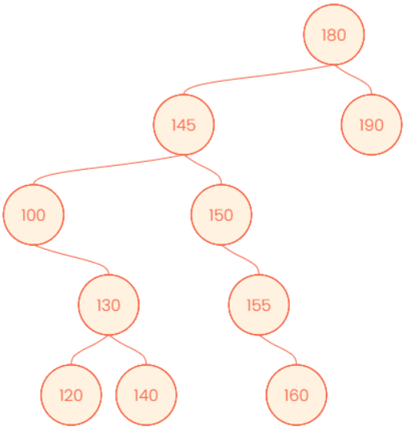
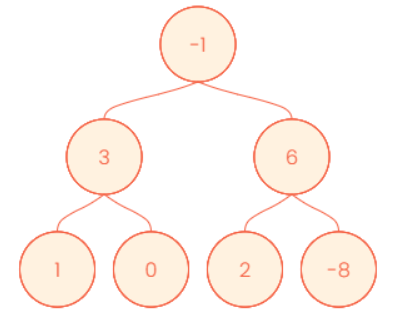

# 단계 7. 자료구조를 활용한 알고리즘

## 스토리

유전자 정보를 연구하는 G 연구원과 T 연구원은 학창 시절부터의 절친이었다. 어쩌다보니 같은 직장에서 근무하게 된 두 사람은 종종 식사나 술자리를 함께 하면서 여전히 좋은 관계를 유지하고 있었다. 어느 가을 저녁, 두 사람은 연구소 근처 맛집에서 저녁을 먹고 있었다. T 연구원은 연구소 밖에서 업무 이야기하는 것을 좋아하지는 않았지만, 요즘 잘 안풀리는 문제가 있다며 G 연구원에게 의견을 물어봤다.

“우리 연구 그룹에서 개발한 스마트 마우스 기억나지?”

“응. 기억 능력에 연산 능력이 있을지도 모른다고 발표했던 그 쥐 말하는거지?”

“응. 그런데 문제가 있어.”

“뭔데?”

“쥐의 지능을 검증하려고 하는데, 우리가 멍청한게 문제지.”

이렇게 시작한 사연은 다음과 같았다.

스마트 동물 연구 그룹에서 개발한 “영리한 쥐”가 연산 능력과 학습 능력이 있는지를 확인하기 위해 다음과 같은 실험을 설계했다.

방이 N개가 있는 미로를 설치한다. 각 방은 1번 방에서 N번 방까지 이름이 붙어 있고, 시작 지점은 방은 아니지만 편의상 0번 방이라고 부르고 있다. 0번 방은 N개의 통로가 있고, 1번 방에서 N번 방까지 연결되어 있다. 1번 방은 N-1개의 통로가 있고 2번 방에서 N번 방까지 연결되어 있다. 이런 식으로 K번 방은 K+1번 방부터 N번 방까지 연결된 통로를 가지고 있다. 각 통로는 길이가 정해져 있으며, 쥐들의 속도는 모두 일정하다. 그리고 N번 방에 도착하면 보상을 주는데, 빨리 도착할 수록 보상이 좋아진다.

“그래서 보상이 뭐야?”

“응. 8년 숙성된 냄새가 엄청난 치즈. 쥐가 그 냄새를 맡으면 미칠 듯이 좋아하더라구. 문제는, 이 치즈가 싸구려라서 시간이 지나면 지날 수록 냄새가 점점 사라진다는건데…”

“그래서?”

“이 치즈 냄새가 통로에 퍼지니까, 기를 쓰고 쥐들이 달리더라구.”

“그리고?”

“영리한 쥐가 매번 1등을 했지.”

“그러면 입증된거 아니야?”

“그런데, 영리한 쥐가 점점 학습을 해서 더 영리해지고 있는지를 확인해야 하니까. 그런데 문제는 영리한 쥐가 최선의 선택을 했는지 확인해보고 싶은데… 그게 계산이 잘 안되더라구.”

“음. 혹시, 실험할 때 방은 몇 개 설치한거야?”

“적당히 설치했어. 한 1000개 정도?”

G 연구원은 순간 할 말을 잃었다. 방이 1000개인 미로라면 방과 방 사이의 통로의 개수만 499500개이다. 적당히라는게 뭔지 모르는 녀석. 아니, 우리 연구소 실험 예산 괜찮은거야?

---

# 문제 1. 이진 검색 트리

## 문제 분류

- 중요도 : 5/5
- 난이도 : 2/5
- 목표 수행 시간 : 4시간

## 스토리

유전자 목록을 만들고 정렬하는 일을 하고 있는 G 연구원은 문득 이런 생각이 들었다.

'굳이 별도로 정렬을 하지 않고도 자동으로 유전자를 등록하면 정렬이 된 목록이 만들어진다면 더 빠르게 정렬된 목록울 가지게 되지 않을까?'

이 생각을 프로그래밍 지원 게시판에 게시하자, 그 글에 이진 검색 트리를 사용하면 된다는 답변이 달렸다.

## 수행목표

- 다음과 같은 성격을 가진 이진 트리와 관련 함수를 구현한다.
  - 트리에 크기를 비교할 수 있는 기준을 가진 값을 추가하면, 이 값에 해당하는 노드가 만들어지고 트리에 추가된다.
  - 트리에 노드가 추가되는 위치는 미리 정해진 위치에 고정되어 추가된다. 트리에 노드를 추가하는데 필요한 시간 복잡도는 O(log n)이다.
  - 전체 트리에 포함된 데이터의 정렬된 목록을 만드는데 필요한 시간 복잡도는 O(n)이다.
  - 이러한 트리의 성격을 유지하면서 트리에 값을 추가하는 함수를 구현한다.
  - 이러한 트리의 성격을 유지하면서 트리의 특정 값을 가진 노드를 삭제하는 함수를 구현한다.
  - 이러한 성격을 가진 트리로부터 오름차순으로 정렬된 목록을 반환하는 함수를 구현한다.
- 다음 첨부한 테스트케이스는 5개의 유전자 시퀀스 데이터와 5개의 숫자 데이터의 목록으로 구성되어 있다. 이 10개의 목록으로 10개의 이진 트리를 생성한다. 이 때 트리에 데이터는 목록의 순서대로 입력한다. 트리를 생성하고 난 후 다음을 출력한다.
  - 루트 트리의 왼쪽 서브 트리의 노드의 수와 오른쪽 서브 트리의 노드의 수
  - 오름차순으로 정렬된 목록

## 수행 단계

## 결과 예시

```
(이하 생략)
```

## 참고사항

- 없음

## 제약사항

- 과정에서 제시한 제약사항을 준수한다.

## 개발환경

- 3.9 버전 이상의 파이썬 프로그램으로 작성한다.

## 보너스 과제

- 없음

---

## 평가질문/평가가이드

### [수행목표 확인]

- 문제에서 지시한 형식을 준수하였는가?
  - dp_exer/bus_fare_dynamic.py 파일에 구현이 되어 있는지 확인한다.
- 제약사항을 준수하였는가?
  - 허용되지 않은 모듈, 라이브러리, 패키지의 사용 여부 (직접 구현한 경우 사용 가능하다.)
  - 입력과 무관하게 프로그램이 처리되지 않은 예외를 발생시키지 않고 정상적으로 종료되어야 한다.
- 결과가 정확한가?

  - 파이썬 3.9 이상에서 동작 여부를 확인한다.
  - 결과는 다음과 같다. 출력 형식은 평가하지 않는다.

    ```

    ```

```

```

### [문제에 대한 이해]

### [코드 예시]

```python

```

---

# 문제 2. 높이가 유지되는 트리

## 문제 분류

- 중요도 : 5/5
- 난이도 : 2/5
- 목표 수행 시간 : 2시간

## 스토리

K 연구원 이진 검색 트리를 사용해서 빠르게 정렬된 목록을 생성할 수 있게 되었다. 이것 만으로 충분히 만족할 수 있었지만, 다른 기능의 성능도 조금 더 높이고 싶은 욕심이 생겼다. 특정 값이 이 트리에 포함되어 있는지를 확인하는 기능인데, 이 기능은 트리의 왼쪽 오른쪽의 균형이 유지될 때 가장 빠르게 동작한다는 사실을 알게 되었다.

K 연구원은 이진 검색 트리에 데이터를 추가할 때, 이와 같이 균형잡힌 트리를 유지하는 방법이 궁금해졌다.

## 수행목표

- 다음과 같은 성격을 가진 이진 검색 트리를 만드는 노드 추가 함수를 구현한다.
  - 트리에 새로운 항목을 추가할 때 이진 검색 트리의 기본 성격을 유지한다.
  - 어떤 순간에서도 트리에 포함된 모든 노드는 왼쪽 서브 트리와 오른쪽 서브 트리의 높이 차이가 1 또는 0으로 유지된다.
  - 노드를 추가하는 함수의 시간 복잡도는 O(log n)이다.
- 이러한 성격을 유지하면서 특정 값을 가진 노드를 삭제하는 함수를 구현한다.
  - 트리에 지정한 값을 가진 항목 중 하나를 삭제하는 경우, 그 이후에도 이진 검색 트리의 기본 성격을 유지한다.
  - 어떤 순간에서도 트리에 포함된 모든 노드는 왼쪽 서브 트리와 오른쪽 서브 트리의 높이 차이가 1 또는 0으로 유지된다.
  - 노드를 삭제하는 함수의 시간 복잡도는 O(log n)이다.
- 다음 첨부한 테스트케이스는 5개의 유전자 시퀀스 데이터와 5개의 숫자 데이터의 목록으로 구성되어 있다.
  - 각각의 테스트케이스는 두 부분으로 나뉘어져 있다. 첫 번째 부분은 트리를 생성하는 과정이며, 목록의 각 항목은 값과 함께 +, -의 지시자가 함께 제공되는데 +의 경우는 노드에 해당 값을 가지는 항목을 추가하라는 지시자이며, -는 해당 값을 가지는 항목을 삭제하라는 지시자이다. 만약 해당 값을 가지는 항목이 없는 경우, 삭제하지 않는다.
  - 두 번째 부분 역시 +, - 지시자에 따라 트리에 항목을 추가하거나 삭제하는데, 두 번째 부분의 값을 가지는 노드의 값을 추가하거나 삭제하는 경우, 트리의 중위 순회 탐색의 순서를 기준으로 왼쪽 서브 트리의 높이와 오른쪽 서브 트리의 높이를 괄호로 묶어서 출력한다.

## 수행단계

## 결과예시

```

```

## 참고사항

- 없음

## 제약사항

- 과정에서 제시한 제약사항을 준수한다.

## 개발환경

- 3.9 버전 이상의 파이썬 프로그램으로 작성한다.

## 보너스 과제

- 없음

---

## 평가질문/평가가이드

### [수행목표 확인]

- 문제에서 지시한 형식을 준수하였는가?
  - dp_exer/max_sales.py 파일에 구현이 되어 있는지 확인한다.
  - 다이나믹 프로그래밍 방식으로 구현하였는지 확인한다. 만약 하향식 다이나믹 프로그래밍 방법으로 구현한 경우 메모이제이션이 적용되어 있는지 확인한다.
- 제약사항을 준수하였는가?
  - 허용되지 않은 모듈, 라이브러리, 패키지의 사용 여부 (직접 구현한 경우 사용 가능하다.)
  - 입력과 무관하게 프로그램이 처리되지 않은 예외를 발생시키지 않고 정상적으로 종료되어야 한다.
- 결과가 정확한가?

  - 파이썬 3.9 이상에서 동작 여부를 확인한다.
  - 결과는 다음과 같다.

    ```
    TC 1:
    최대 매출 : 10억원
    판매 방법 :
        2단위 주문 : 2회

    TC 2:
    최대 매출 : 22억원
    판매 방법 :
        6단위 주문 : 1회
        2단위 주문 : 1회

    TC 3:
    최대 매출 : 10억원
    판매 방법 :
        1단위 주문 : 10회

    TC 4:
    최대 매출 : 10억원
    판매 방법 :
        10단위 주문 : 1회

    TC 5:
    최대 매출 : 267억원
    판매 방법 :
        35단위 주문 : 1회
        34단위 주문 : 1회
        29단위 주문 : 1회
        2단위 주문 : 1회
    ```

### [보너스 과제의 확인]

- 보너스 과제를 지시대로 해결하였는가?
  - 문제의 구조를 사용하는 재귀 호출 방식으로 구현하고 있는지 확인한다.
- 결과가 정확한가?

  - 결과 예시는 다음과 같다.

    ```
    TC 1:
        최대 매출 : 10억원
        판매 방법 :
            2단위 주문 : 2회
        잔여 처리 용량 : 0단위

    TC 2:
        최대 매출 : 16억원
        판매 방법 :
            3단위 주문 : 2회
        잔여 처리 용량 : 2단위

    TC 3:
        최대 매출 : 5억원
        판매 방법 :
            2단위 주문 : 5회
        잔여 처리 용량 : 0단위

    TC 4:
        최대 매출 : 10억원
        판매 방법 :
            8단위 주문 : 1회
            2단위 주문 : 1회
        잔여 처리 용량 : 0단위

    TC 5:
        최대 매출 : 266억원
        판매 방법 :
            29단위 주문 : 3회
            13단위 주문 : 1회
        잔여 처리 용량 : 0단위
    ```

### [문제에 대한 이해]

- n = 4, prices = [1, 5, 8, 9]일 때 최대 매출은 얼마이며, 이 때의 판매 방법은 어떻게 될까?
  - 최고의 매출을 기록하기 위해서는 2단위씩 2번 주문을 받으면 된다. 이 때의 매출은 10억원이다.
- i단위의 요청을 처리했을 때 기대 가능한 최대 매출은 얼마인가? 처리 가능한 용량이 n일 때의 기대 가능한 최대 매출을 max_sales(n)이라 표현하고, i 단위의 가격을 price(i)라고 할 때, 최대 매출을 max_sales와 price를 사용해서 표현하라.
  - i단위의 요청을 처리했을 때의 기대 가능한 최대 매출 : price[i] + max_sales(n - i)
- 문제의 구조를 제시하라.
- 구현한 방식의 시간 복잡도는 얼마인가?

### [코드 예시]

```python

```

---

# 문제 3. 트리의 지름

## 문제 분류

- 중요도 : 5/5
- 난이도 : 2/5
- 목표 수행 시간 : 4시간

## 스토리

한 세대가 끝나면 여러 개체로 분화해서 새로운 세대를 시작하는 미생물이 있다. E 연구원이 속한 연구 그룹은 이 미생물의 돌연변이를 연구하는 과정에서, ‘특정 돌연변이 개체’가 발생했다가 소멸하는 현상을 발견했다. 이 돌연변이 개체는 공해 물질을 분해하는 능력을 가지게 되어 매우 유용한 발견이지만, 문제는 이 돌연변이 개체는 발생했다가 몇 세대를 지나면 사라진다는 점이었다. 이 돌연변이의 여파로 세대가 종료될 때의 분화하는 개체 수는 최대 2로 제한되었고, 그나마 분화를 하지 못하고 생을 마감하는 개체도 많았기 때문이다.

이 돌연변이 개체를 최대한 길게 유지하기 위한 유도 약물의 개발을 연구하는 과정에서 약물의 효능을 검증하기 위해서 돌연변이가 발생한 개체를 루트로 하고, 돌연변이가 유지된 자손들로 구성된 가계도 트리를 만들었다. 트리의 부모와 자식 사이의 거리를 1이라고 할 때, 이 트리에 포함된 두 노드의 거리가 길면 길수록 약물의 효능이 좋다고 평가할 수 있다.

## 수행목표

- 트리에서 두 노드의 거리는 두 노드 사이에 연결의 갯수로 정의한다. 이 정의를 따르면 부모 노드와 자식 노드의 사이의 거리는 1이된다. 그리고 어떤 트리에서 거리가 가장 먼 두 노드 사이의 연결을 트리의 지름이라고 하며, 이 두 노드 사이의 거리를 트리의 지름의 길이라 한다.
- 어떤 이진 트리의 루트 노드가 주어졌을 때, 이 트리의 지름의 길이를 반환하는 함수를 구현한다.
- 첨부한 파이썬 코드를 사용해 트리 7개의 루트 노드를 얻을 수 있다. 이 4개의 트리에 대애서 각각의 트리의 지름을 출력한다.

## 수행단계

- 다음 예제와 예제에 대한 질문을 통해서 문제 해결의 실마리를 찾는다.
  - 다음 그림의 트리에서 루트 노드의 왼쪽 서브 트리의 높이는 2, 오른쪽 서브 트리의 높이는 2, 그리고 트리 지름의 길이는 6이다.
    
  - 다음 그림의 트리에서 루트 노드의 왼쪽 서브 트리의 높이는 3, 오른쪽 서브 트리의 높이는 0이다.
    
    - 이 트리에서 루트 노드를 지나야 연결이 가능한 두 노드 사이에 가장 거리가 먼 두 노드와, 두 노드 사이의 거리는 얼마인가?
    - 이 트리에서 가장 먼 거리가 먼 두 노드와, 두 노드 사이의 거리 (즉 트리의 지름의 길이)는 얼마인가?
- 이 문제는 다이나믹 프로그래밍 예제에서 그러했듯 하향식, 상향식 두 가지 접근 방법 각각을 사용해 해결할 수 있다. 두 가지 방법 중 하나를 택해서 구현 방법을 정리한다.
- 주어진 노드를 루트로 하는 트리의 지름을 구하는 함수를 ds_more/tree_diameter1.py 파일에 구현한다.
- 첨부한 파이썬 코드의 get_testcases 함수는 어떤 트리의 루트를 항목으로 하는 리스트를 반환한다. 여기에는 7개 트리의 루트가 포함되어 있다.
  - 이 7개의 트리의 지름의 값을 출력한다.
  - 첨부한 파이썬 코드에는 이진 트리를 만드는 파이썬 클래스가 포함되어 있다. 이 클래스의 구조를 확인한 후 구현해야 한다.

## 결과예시

```
Testcase 1 트리의 지름 : 6
Testcase 2 트리의 지름 : 6
(이하 생략)
(이하 생략)
```

## 참고사항

- 없음

## 제약사항

- 과정에서 제시한 제약사항을 준수한다.

## 개발환경

- 3.9 버전 이상의 파이썬 프로그램으로 작성한다.

## 보너스 과제

- 없음

---

## 평가질문/평가가이드

### [수행목표 확인]

- 문제에서 지시한 형식을 준수하였는가?
  - ds_more/tree_diameter1.py 파일에 구현이 되어 있는지 확인한다.
- 제약사항을 준수하였는가?
  - 허용되지 않은 모듈, 라이브러리, 패키지의 사용 여부 (직접 구현한 경우 사용 가능하다.)
  - 입력과 무관하게 프로그램이 처리되지 않은 예외를 발생시키지 않고 정상적으로 종료되어야 한다.
- 결과가 정확한가?

  - 파이썬 3.9 이상에서 동작 여부를 확인한다.
  - 결과는 다음과 같다. 출력 형식은 평가하지 않는다. 실행 시간은 다를 수 있다.

    ```
    Testcase 1 트리의 지름 : 6
    Testcase 2 트리의 지름 : 6
    Testcase 3 트리의 지름 : 6
    Testcase 4 트리의 지름 : 7
    Testcase 5 트리의 지름 : 1
    Testcase 6 트리의 지름 : 43
    Testcase 7 트리의 지름 : 55
    ```

### [문제에 대한 이해]

- (상향식 접근 방법으로 구현한 경우)가장 작은 문제는 무엇인가?
  - 문제를 특정 노드를 지나가는 트리의 지름으로 정의하면, 리프 노드에 가까울 수록 서브 트리를 감안한 트리의 지름을 계산해야 하므로, 가장 작은 문제는 루트에서 가장 먼 노드를 지나가는 트리의 지름을 구하는 문제가 된다.
- (상향식 접근 방법으로 구현한 경우)상향식 접근 방법으로 트리의 지름을 계산하는 방법을 설명하라.
  - 1단계에서는 트리의 레벨 별로 각 노드를 분류한다.
  - 레벨 별 노드를 저장하는 딕셔너리를 만들고, BFS 방식으로 트리를 탐색해 트리의 모든 노드를 레벨 별 딕셔너리에 저장한다.
  - 2단계에서는 레벨이 높은, 즉 루트 노드에서 먼 노드들부터 상향식으로 모든 노드를 지나가는 트리의 지름을 구해서 올라간다.
  - 이를 위해서 작은 문제의 결과를 저장할 딕셔너리 diameter와 height를 선언한다.
  - 상위 문제의 높이는 하위 문제들 (즉 왼쪽 서브트리의 높이, 오른쪽 서브 트리의 높이) 의 최대값 + 1이 된다.
  - 상위 문제의 지름은 하위 문제들의 최대값이다. 이 때 하위 문제들은 트리의 지름에 해당하는 경로가 현재 노드를 지나가는 경우(왼쪽 서브 트리의 높이 + 오른쪽 서브 트리의 높이 + 2), 현재 노드를 지나가지 않고 왼쪽 서브 트리에 트리의 지름이 속한 경우 (왼쪽 서브 트리의 지름), 오른쪽 서브 트리에 트리의 지름이 속한 경우 (오른쪽 서브 트리의 지름)으로 구성된다.
  - 최종적으로 루트 노드를 기준으로 트리의 지름을 반환한다.
- (하향식 접근 방법으로 구현한 경우)문제의 구조를 설명하는 점화식을 제시하라.
  - 트리의 높이는 리프 노드 중 루트와 가장 먼 리프 노드와의 거리이다.
  - 이 리프 노드는 루트 노드의 두 자식 노드 중 하나의 자손 노드이다.
  - 부모와 자식 노드 사이의 거리는 1이다.
  - 이상의 상황을 종합해 node를 루트로 하는 서브 트리의 높이를 `height(node)`라고 하면 점화식은 다음과 같이 작성할 수 있다.
  - `height(node) = max(height(node.left), height(node.right)) + 1`
- 구현한 함수의 시간 복잡도를 제시하라.
  - 상향식, 하향식 모두 최적 구현은 O(n) 시간 복잡도를 가진다.

### [코드 예시]

```python
from tree_diameter_data import get_testcases
from collections import deque

# 트리의 높이 계산
def height(node, memo):
    # 메모이제이션
    if node in memo:
        return memo[node]
    if node == None:
        return -1

    # 왼쪽 자식 노드의 높이와 오른쪽 자식 노드의 높이를 사용해 현재 노드의 높이를 계산 (재귀 호출)
    memo[node] = 1 + max(height(node.left, memo), height(node.right, memo))
    return memo[node]

# 트리의 지름 계산 하향식 접근 방법
def tree_diameter2(node, memo = None):
    # 메모이제이션에 사용할 딕셔너리 초기화
    if memo == None:
        memo = {}
    if node == None:
        return 0
    # 왼쪽 트리의 지름
    left_diameter = tree_diameter2(node.left, memo)
    # 오른쪽 트리의 지름
    right_diameter = tree_diameter2(node.right, memo)
    # 현재 트리의 지름은
    #   1. 현재 노드를 지나는 경로의 최고 거리
    #   2. 왼쪽 서브 트리의 지름
    #   3. 오른쪽 서브 트리의 지름
    # 중 최대값이다.
    return max(height(node.left, memo) + height(node.right, memo) + 2,
                left_diameter,
                right_diameter)

# 트리의 지름 계산 상향식 접근 방법
def tree_diameter1(root, memo = None):
    if not root:
        return {}

    # 1단계 - 레벨별 노드를 저장하는 딕셔너리를 생성한다.
    # 레벨별 노드를 저장할 딕셔너리
    level_dict = {}
    # 루트 노드를 레벨과 함께 큐에 저장한다.
    queue = deque([(root, 0)])
    # 트리의 최대 레벨
    max_level = 0

    while queue:    # 큐가 빌 때까지 반복
        node, level = queue.popleft()   # 큐의 첫번째 항목의 노드와 레벨

        # 현재 레벨의 노드를 딕셔너리에 추가
        if level not in level_dict:
            level_dict[level] = []
            max_level = level
        level_dict[level].append(node)

        # 자식 노드를 큐에 추가
        if node.left:
            queue.append((node.left, level + 1))
        if node.right:
            queue.append((node.right, level + 1))

    # 2단계 - 상향식으로 모든 노드의 트리의 지름을 구한다.
    diameter = {}
    height = {}
    # 최대 레벨, 즉 가장 아래쪽부터 역순으로 루트까지 반복
    for i in range(max_level, -1, -1):
        # 각 레벨의 모든 노드에 대해서
        for node in level_dict[i]:
            if node.left == None:       # 왼쪽 자식 노드가 없으면
                left_height = -1
                left_diameter = -1
            else:                       # 왼쪽 자식 노드가 있으면
                left_height = height[node.left]
                left_diameter = diameter[node.left]
            if node.right == None:      # 오른쪽 자식 노드가 없으면
                right_height = -1
                right_diameter = -1
            else:                       # 오른쪽 자식 노드가 있으면
                right_height = height[node.right]
                right_diameter = diameter[node.right]

            # 높이와 지름을 계산
            height[node] = 1 + max(left_height, right_height)
            diameter[node] = max(left_height + right_height + 2,
                                    left_diameter,
                                    right_diameter)
    return diameter[root]

def main():
    testcases = get_testcases()
    for i, tc in enumerate(testcases):
        print(f"Testcase {i + 1} 트리의 지름 : {tree_diameter1(tc)}")

if __name__ == "__main__":
    main()
```

---

# 문제 4. 가장 사이가 먼 이들

## 문제 분류

- 중요도 : 5/5
- 난이도 : 2/5
- 목표 수행 시간 : 4시간

## 스토리

개체의 세대가 바뀜에 따라서 유전자의 돌연변이는 조금씩 생기기 마련이다. 즉, 현재의 트리에서 관계가 가장 먼 두 개체를 비교하면, 조금 더 길게 번식하는 미생물을 만드는 단서를 찾을 수 있을지도 모른다.

E 연구원은 트리의 지름 뿐 아니라, 지름에 해당하는 가장 먼 두 개체를 찾는 작업에 들어갔다.

## 수행목표

- 트리의 지름을 찾는 알고리즘을 사용해 트리에서 가장 먼 두 노드의 쌍을 찾는 함수를 구현한다.
- 이 함수를 사용해 트리에서 가장 먼 두 노드의 쌍을 찾아 이를 출력한다.
  - 트리에서 가장 먼 두 노드의 쌍은 여러개가 존재할 수 있다. 모든 쌍을 찾아 출력한다.
- 테스트데이터는 이전 문제와 동일한 첨부 파일을 사용해 7개의 테스트케이스를 사용할 수 있다.
  - 출력하는 값은 노드의 값을 사용해 출력한다. 테스트케이스 1의 트리는 120의 값을 가진 노드와 160의 값을 가진 노드, 그리고 140의 값을 가진 노드와 160의 값을 가진 노드 간 거리가 6으로 가장 길다. 이 경우 [(120, 160), (140, 160)]을 출력한다.

## 수행단계

- 이전 문제에서 구현한 트리 지름을 계산하는 알고리즘을 토대로 가장 먼 두 노드의 쌍을 찾는 방법을 정리한다.
- 트리의 루트노드가 주어졌을 때, 이 트리에서 지름에 해당되는 거리에 있는 두 노드의 쌍으로 구성된 리스트를 반환하는 함수를 ds_more/tree_diameter2.py 파일에 구현한다.
- 테스트케이스는 이전 문제와 마찬가지로 첨부 파일의 get_testcases 함수를 호출하면 7개의 테스트용 트리의 루트 노드를 얻을 수 있다. 이 7개의 트리에서 가장 먼 노드 쌍을 모두 찾아 출력한다.

## 결과 예시

```
Testcase 1
    트리의 지름 : 6
    가장 먼 노드 쌍 : [(120, 160), (140, 160)]

Testcase 2
    트리의 지름 : 6
    가장 먼 노드 쌍 : [(120, 160), (140, 160)]
(이하 생략)
```

## 참고사항

- 없음

## 제약사항

- 과정에서 제시한 제약사항을 준수한다.

## 개발환경

- 3.9 버전 이상의 파이썬 프로그램으로 작성한다.

## 보너스 과제

- 없음

## 평가질문/평가가이드

### [수행목표 확인]

- 문제에서 지시한 형식을 준수하였는가?
  - ds_more/tree_diameter2.py 파일에 구현이 되어 있는지 확인한다.
- 제약사항을 준수하였는가?
  - 허용되지 않은 모듈, 라이브러리, 패키지의 사용 여부 (직접 구현한 경우 사용 가능하다.)
  - 입력과 무관하게 프로그램이 처리되지 않은 예외를 발생시키지 않고 정상적으로 종료되어야 한다.
- 결과가 정확한가?

  - 파이썬 3.9 이상에서 동작 여부를 확인한다.
  - 결과는 다음과 같다. 출력 형식은 평가하지 않는다.

    ```
    Testcase 1
        트리의 지름 : 6
        가장 먼 노드 쌍 : [(120, 160), (140, 160)]

    Testcase 2
        트리의 지름 : 6
        가장 먼 노드 쌍 : [(120, 160), (140, 160)]

    Testcase 3
        트리의 지름 : 6
        가장 먼 노드 쌍 : [(120, 200), (140, 200), (160, 200), (120, 160), (140, 160)]

    Testcase 4
        트리의 지름 : 7
        가장 먼 노드 쌍 : [(120, 210), (140, 210), (160, 210)]

    Testcase 5
        트리의 지름 : 1
        가장 먼 노드 쌍 : [(100, 200)]

    Testcase 6
        트리의 지름 : 43
        가장 먼 노드 쌍 : [(-93, -10), (-93, -7), (-84, -10), (-84, -7)]

    Testcase 7
        트리의 지름 : 55
        가장 먼 노드 쌍 : [(-40, 56)]

    ```

### [문제에 대한 이해]

- 어떤 노드가 주어졌을 때 트리의 지름이 그 노드를 지나는 경우, 이 노드의 서브트리에서 가장 먼 두 노드는 어떻게 찾을 수 있을까?
  - 왼쪽 서브트리에서 이 노드로 부터 가장 먼 노드, 즉 왼쪽 서브트리에서 가장 레벨이 큰 노드와 오른쪽 서브트리에서 이 노드로부터 가장 먼 노드, 즉 오른쪽 서브트리에서 가장 레벨이 큰 노드가 가장 먼 노드이다.
- 어떤 노드가 주어졌을 때 트리의 지름이 그 노드를 지나지 않는 경우, 이 노드의 서브트리에서 가장 먼 두 노드는 어떻게 찾을 수 있을까?
  - 왼쪽 서브트리에서 가장 먼 두 노드와 오른쪽 서브트리에서 가장 먼 두 노드 중 더 먼 노드이다.

### [코드 예시]

```python
from tree_diameter_data import get_testcases
from collections import deque

def furthest_nodes(root, memo = None):
    if not root:
        return {}

    # 1단계 - 레벨별 노드를 저장하는 딕셔너리를 생성한다.
    # 레벨별 노드를 저장할 딕셔너리
    level_dict = {}
    # 루트 노드를 레벨과 함께 큐에 저장한다.
    queue = deque([(root, 0)])
    # 트리의 최대 레벨
    max_level = 0

    while queue:    # 큐가 빌 때까지 반복
        node, level = queue.popleft()   # 큐의 첫번째 항목의 노드와 레벨

        # 현재 레벨의 노드를 딕셔너리에 추가
        if level not in level_dict:
            level_dict[level] = []
            max_level = level
        level_dict[level].append(node)


        # 자식 노드를 큐에 추가
        if node.left:
            queue.append((node.left, level + 1))
        if node.right:
            queue.append((node.right, level + 1))


    # 2단계 - 상향식으로 모든 노드의 트리의 지름을 구한다.
    diameter = {}
    height = {}
    farthest_child_data = {}
    # 최대 레벨, 즉 가장 아래쪽부터 역순으로 루트까지 반복
    for i in range(max_level, -1, -1):
        # 각 레벨의 모든 노드에 대해서
        for node in level_dict[i]:
            if node.left == None:       # 왼쪽 자식 노드가 없으면
                left_height = -1
                left_diameter, left_diameter_pair = -1, []
                left_farthest_child_data = [root.data]
            else:                       # 왼쪽 자식 노드가 있으면
                left_height = height[node.left]
                left_diameter, left_diameter_pair = diameter[node.left]
                left_farthest_child_data = farthest_child_data[node.left]
            if node.right == None:      # 오른쪽 자식 노드가 없으면
                right_height = -1
                right_diameter, right_diameter_pair = -1, []
                right_farthest_child_data = [root.data]
            else:                       # 오른쪽 자식 노드가 있으면
                right_height = height[node.right]
                right_diameter, right_diameter_pair = diameter[node.right]
                right_farthest_child_data = farthest_child_data[node.right]


            # 높이와 지름을 계산하면서 가장 먼 자손 노드의 데이터도 저장한다.
            if left_height > right_height:
                height[node] = 1 + left_height
                farthest_child_data[node] = left_farthest_child_data
            elif left_height < right_height:
                height[node] = 1 + right_height
                farthest_child_data[node] = right_farthest_child_data
            else:   # 왼쪽과 오른쪽의 높이가 같은 경우, 양쪽의 가장 먼 자손 노드의 데이터를 합친다.
                height[node] = 1 + left_height
                farthest_child_data[node] = left_farthest_child_data + right_farthest_child_data

            if height[node] == 0:
                farthest_child_data[node] = [node.data]

            diameter_current_node = left_height + right_height + 2
            diameter_from_child = max(left_diameter, right_diameter)

            if diameter_current_node >= diameter_from_child:
                # 트리의 지름이 현재 노드를 지나는 경우
                combi = []
                # 왼쪽 서브 노드에서 가장 먼 노드와 오른쪽 서브 노드에서 가장 먼 노드의 쌍을 구한다.
                for left_data in left_farthest_child_data:
                    for right_data in right_farthest_child_data:
                        combi.append((left_data, right_data))
                # 이 값이 왼쪽 자식 노드의 트리의 지름과 같은 경우
                if diameter_current_node == left_diameter:
                    combi += left_diameter_pair
                if diameter_current_node == right_diameter:
                    combi += right_diameter_pair
                diameter[node] = (diameter_current_node, combi)
            elif left_diameter > right_diameter:
                # 왼쪽 자식 노드의 트리의 지름이 더 큰 경우
                diameter[node] = (left_diameter, left_diameter_pair)
            elif left_diameter < right_diameter:
                # 오른쪽 자식 노드의 트리의 지름이 더 큰 경우
                diameter[node] = (right_diameter, right_diameter_pair)
            else: # 횐쪽 자식 노드와 오튼쪽 자식 노드의 트리의 지름이 같은 경우
                diameter[node] = (left_diameter, left_diameter_pair + right_diameter_pair)
    return diameter[root]

def main():

    testcases = get_testcases()
    for i, tc in enumerate(testcases):
        tree_diameter, furthest_node_pairs = furthest_nodes(tc)
        print(f"Testcase {i + 1}")
        print(f"    트리의 지름 : {tree_diameter}")
        print(f"    가장 먼 노드 쌍 : {furthest_node_pairs}")
        print()

if __name__ == "__main__":
    main()

```

---

# 문제 5. 가장 강한 서브트리 (1)

## 문제 분류

- 중요도 : 5/5
- 난이도 : 3/5
- 목표 수행 시간 : 4시간

## 스토리

연구원들은 수 년에 걸쳐 연구하고 있는 신기한 유전자 상의 돌연변이가 있었다. '유라'라는 이름을 가진 동물의 특정한 종에서만 발견되는 돌연변이인데, 이 돌연변이 유전자는 특정 성별에서만 발생하고, 해당 성별의 자손으로만 전파되며, 게다가 자식 중 딱 두 마리까지만 전달된다는 독특한 성질 때문에 연구소에서 이 돌연변이에 초점을 맞추어 연구를 진행하고 있었다. 연구를 통해 이 돌연변이 유전자가 실제로 발현되는데 영향을 미치는 어떤 물질을 발견했는데, 이 물질의 양은 직접 측정할 수 없고, 대신 일종의 전압을 측정하는 것과 유사한 방법으로 측정을 할 수 있었기에 이 값은 양수, 음수, 그리고 0 어떤 부호의 값이든 가질 수 있었다. 이 값을 연구소에서는 '반응도 전압'이라고 불렀다.

연구팀은 이 돌연변이가 발생한 유라 개체를 루트 노드로 하고, 이 돌연변이 유전자가 전달된 자손들을 부모와 자식을 연결한 가계도의 형태로 표현한 후, 이 가계도에 포함된 모든 유라의 반응도 전압을 측정한 후, 가계도 안에 값을 기록했다. 이 가계도를 여러 개를 그려놓고 지켜보던 연구원들은, 이 가계도에서 반응 전압이 유달리 높은 일부분이 있음을 직관적으로 알게 되었다. 그 가계도의 일부분에 해당하는 유라의 개체에 실제로 해당 돌연변이의 형질이 발현되었는지를 확인하고 싶은데, 문제는 일부 가계도는 너무 크고 복잡해서 이를 확인하기가 싶지 않다는 것이었다.

연구원들이 지선생을 찾아가 이 가계도에서 그런 부분을 찾아줄 수 있느냐고 묻자, 지선생은 이렇게 말했다.

“이 가계도 위의 각각의 유라의 개체로부터 그 모든 자손들의 반응도 전압을 다 합쳤을 때, 그 값이 최대가 얼마인지 찾으면 되지 않을까요?”

그 말을 들은 연구원들은 되물었다.

“그런데, 그 값을 어떻게 찾지요?”

## 수행목표

- 이진 트리 내부에 포함된 각 노드마다 해당 노드를 루트로 하는 서브트리를 하나씩 정의할 수 있으므로, 이진 트리에는 노드의 수 만큼의 서브트리가 존재한다.
- 이진 트리에 실수의 값을 가지는 변수가 있다. 서브트리마다 이 변수의 합을 구할 수 있다. 노드 수 만큼의 서브트리의 변수의 합 중 최대값을 반환하는 함수를 구현한다.
- 첨부한 파일을 사용해서 8개의 테스트케이스를 얻을 수 있다. 각 테스트케이스에서 가장 큰 서브트리 합을 구해서 출력해보자.

## 수행단계

- 다음 그림의 트리와 질문을 통해서 문제를 파악해보자.
  
  - 트리에 포함된 모든 노드의 값의 합은 얼마인가?
  - 루트 노드의 왼쪽 자식 노드를 루트 노드로 하는 서브 트리의 모든 노드의 값의 합은 얼마인가?
  - 루트 노드의 오른쪽 자식 노드를 루트 노드로 하는 서브 트리의 모든 노드의 값의 합은 얼마인가?
  - 이 트리에서 합이 가장 큰 서브트리의 루트는 무엇이고, 합의 값은 얼마인가?
  - 반대로 트리에서 합이 가장 작은 서브트리의 루트는 무엇인가?
- 주어진 문제를 해결하기 위해서 우선 특정 노드를 루트로 하는 서브트리의 모든 값의 합을 구하는 문제를 해결해보자. 이 문제는 문제의 구조를 파악해 해결한다.
  - 상위 구조와 하위 구조를 정의해보자.
  - 상위 구조와 하위 구조의 관계를 찾아 점화식의 형태로 정리해보자.
- 서브트리의 모든 값의 합을 구하는 문제를 사용해, 합이 최대인 서브트리의 합을 구하는 방법을 정리한다.
- 정리한 내용을 토대로 합이 최대인 서브트리의 합을 구하는 함수를 ds_more/max_power_subtree.py 파일에 구현한다.
- 첨부한 파일의 get_testcases 함수를 호출해서 8개의 테스트케이스 트리의 루트 노드를 얻을 수 있다. 이 노드를 루트로 하는 트리에서 합이 최대인 서브트리의 모든 값의 합을 구하고 이를 출력한다.

## 결과예시

```
Testcase 1에서 합이 최대인 서브트리의 합의 값 : 4

Testcase 2에서 합이 최대인 서브트리의 합의 값 : 3
(이하 생략)
```

## 참고사항

- 없음

## 제약사항

- 과정에서 제시한 제약사항을 준수한다.

## 개발환경

- 3.9 버전 이상의 파이썬 프로그램으로 작성한다.

## 보너스 과제

- 없음

---

## 평가질문/평가가이드

### [수행목표 확인]

- 문제에서 지시한 형식을 준수하였는가?
  - ds_more/max_power_subtree.py 파일에 구현이 되어 있는지 확인한다.
- 제약사항을 준수하였는가?
  - 허용되지 않은 모듈, 라이브러리, 패키지의 사용 여부 (직접 구현한 경우 사용 가능하다.)
  - 입력과 무관하게 프로그램이 처리되지 않은 예외를 발생시키지 않고 정상적으로 종료되어야 한다.
- 결과가 정확한가?

  - 파이썬 3.9 이상에서 동작 여부를 확인한다.
  - 결과는 다음과 같다. 출력 형식은 평가하지 않는다.

```
Testcase 1에서 합이 최대인 서브트리의 합의 값 : 4

Testcase 2에서 합이 최대인 서브트리의 합의 값 : 3

Testcase 3에서 합이 최대인 서브트리의 합의 값 : 720

Testcase 4에서 합이 최대인 서브트리의 합의 값 : -17

Testcase 5에서 합이 최대인 서브트리의 합의 값 : 770

Testcase 6에서 합이 최대인 서브트리의 합의 값 : 23

Testcase 7에서 합이 최대인 서브트리의 합의 값 : 1562

Testcase 8에서 합이 최대인 서브트리의 합의 값 : 26546
```

### [문제에 대한 이해]

- 트리 상에 어떤 노드에 대해서, 이 노드를 루트로 하는 서브트리의 모든 노드의 값의 합을 구하는 문제를, 문제의 구조 사이의 관계를 통해서 해결하고자 할 때, 어떤 구조를 사용할 수 있는지 설명해보자.
  - 부모 노드의 문제는 왼쪽 자식 노드의 문제와 오른쪽 자식 노드의 문제, 그리고 부모 노드의 값을 합쳐서 해결할 수 있다.
- 여기에서 가장 작은 구조의 문제는 무엇인가?
  - 자식이 없는 노드인 리프 노드의 문제가 가장 작은 구조의 문제이다.
- 주어진 노드를 루트로 하는 서브 트리의 모든 값의 합을 tree_sum(node)라고 할 때, tree_sum(node)를 구하는 문제의 점화식을 제시해보자.
  - tree_sum(node) = node.data + tree_sum(node.left) + tree_sum(node.right)이며, node가 leaf 노드인 경우는, 자신의 값으로 정의된다.
- 주어진 노드를 루트로 하는 서브 트리의 모든 값을 구하는 문제의 접근 방식을 기초로, 합이 가장 큰 서브 트리의 합을 구하는 문제를 해결해보고자 한다. 합이 가장 큰 서브 트리의 합을 max_power(node)라고 할 때 max_power(node)를 구하는 점화식을 max_power, tree_sum을 사용해 표현해보자.
  - max_power(node) = max(tree_sum(node), max_power(node.left), max_power(node.right))이며
  - node가 리프 노드인 경우 max_power(node)는 node의 값이다.

### [코드 예시]

```python
from max_power_subtree_data import get_testcases


def max_power(node):
    if node == None:
        return 0, -float('inf')
    # 현재 노드의 서브트리 합을 현재 노드의 데이터로 초기화한다.
    tree_sum = node.data
    if node.left != None:
        # 왼쪽 자식 노드가 있으면 재귀 호출한다.
        l_max, l_sum = max_power(node.left)
    else:
        # 왼쪽 자식 노드가 없으면 왼쪽 서브트리 합은 0,
        # 최대 서브트리 합은 충분히 작은 값을 사용한다.
        l_max, l_sum = -float('inf'), 0
    # 오른쪽 자식 노드는 왼쪽 자식노드와 동일하게 동작한다.
    if node.right != None:
        r_max, r_sum = max_power(node.right)
    else:
        r_max, r_sum = -float('inf'), 0
    # 현재 노드의 서브트리 합을 계산한다.
    tree_sum += l_sum + r_sum
    # 1. 현재 노드의 서브 트리 합
    # 2. 왼쪽 서브트리의 최대 서브트리 합
    # 3. 오른쪽 서브트리의 최대 서브트리 합
    # 세 값의 최대값을 서브트리 합과 함께 반환한다.
    return max(tree_sum, l_max, r_max), tree_sum

def main():
    testcases = get_testcases()
    for i, root in enumerate(testcases):
        max_sum, _ = max_power(root)
        print(f"Testcase {i + 1}에서 합이 최대인 서브트리의 합의 값 : {max_sum}")
        print()

if __name__ == "__main__":
    main()
```

---

# 문제 6. 가장 강한 서브트리 (2)

## 문제 분류

- 중요도 : 4/5
- 난이도 : 3/5
- 목표 수행 시간 : 2시간

## 스토리

지선생의 가이드에 따라서 알고 싶은 값을 찾아낸 연구원들은, 그 다음 단계로 조건에 맞는 서브트리가 어떤 서브트리인지를 찾기 시작했다.

연구원들은 지선생이 가르쳐 준 방법을 사용해서 어렵지 않게 그 서브트리의 루트를 찾을 수 있었는데, 또 다른 문제가 발생했다. 트리는 너무나 크고 반응도 전압의 값이 같은 유라의 개체도 트리에 너무나 많아서, '반응도 XX인 유라를 루트로 하는 서브 트리'라는 표현이 도움이 되지 않는다는 점이었다.

연구원들의 결론은 다음과 같았다.

"이진 트리에서 모든 노드를 고유하게 구분할 수 있는 방법을 정해서 사용하자."

## 수행목표

- 이진 트리 내부에 노드 수 만큼 존재하는 서브 트리 중에서, 포함된 모든 노드의 값의 합이 최대가 되는 서브 트리를 찾는다.
- 이진 트리에 포함된 각 노드를 고유하게 구분할 수 있는 문자열 형태의 고유값을 정의하고, 찾아낸 서브 트리의 루트노드의 고유값으로 구성된 리스트와 서브트리에 포함된 모든 노드의 값의 합을 반환하는 함수를 구현한다.
  - 만약 합이 최대인 서브트리가 둘 이상 존재한다면 모든 서브트리의 루트를 포함해 반환해야 한다.
- 첨부한 파일을 사용해서 8개의 테스트케이스를 얻을 수 있다. 각 테스트케이스에서 포함된 모든 노드의 값의 합이 최대가 되는 서브 트리의 루트 노드를 정의한 고유값을 사용해 출력한다.

## 수행단계

- 이진 트리에 포함된 모든 노드를 구분할 수 있는 고유값 체계를 정의할 수 있다. 이 고유값은 다음과 같은 성격을 가진다.
  - 일반적인 모든 이진 트리에 적용할 수 있는 일반적인 고유값이어야 한다.
  - 별도로 정의하지 않아도 이진 트리의 특성에 따라 자동적으로 정의되며, 이 값으로 이진 트리의 모든 노드를 구분할 수 있다.
  - 이 값을 사용해서 트리를 재구성할 수 있다.
  - 이 고유한 값은 문자열의 형태를 지닌다.
- 이러한 고유값 정의 방식 중 하나는 어떤 노드를 루트로부터 연결되는 방식으로 표현하는 것이다.
  - 루트 노드를 `@`로 표현한다. 루트 노드의 왼쪽 자식 노드는 `l`을 덧붙여 `@l`로, 오른쪽 자식 노드는 `@r`로 표시한다.
  - 그 이하의 자식 노드도 루트 노드로부터 내려가면서 `l` 또는 `r`을 덧붙여 나가는 방식으로 이진 트리의 모든 노드를 고유하게 구분하는 문자열을 만들 수 있다.
- 이진 트리에서 포함된 노드의 값의 합이 최대가 되는 서브트리의 루트노드를 찾고, 위에서 제시한 방식으로 정의된 서브트리 루트 노드의 고유값을 반환하는 함수를 ds_more/max_power_subtree2.py 파일에 구현한다.
- 첨부한 파일의 get_testcases 함수를 호출해서 8개의 테스트케이스 트리의 루트 노드를 얻을 수 있다. 이 노드를 루트로 하는 트리에서 합이 최대인 서브트리의 모든 값의 합과 이 서브트리의 루트 노드의 고유값을 구하고 이를 출력한다.

## 결과예시

```
Testcase 1
    합이 최대인 서브트리에 포함된 노드들의 값의 합 : 4
    값이 최대가 되는 서브트리의 루트 노드 : ['@l']

Testcase 2
    합이 최대인 서브트리에 포함된 노드들의 값의 합 : 3
    값이 최대가 되는 서브트리의 루트 노드 : ['@l', '@r']
(이하 생략)
```

## 참고사항

- 없음

## 제약사항

- 과정에서 제시한 제약사항을 준수한다.

## 개발환경

- 3.9 버전 이상의 파이썬 프로그램으로 작성한다.

## 보너스 과제

- 없음

---

## 평가질문/평가가이드

### [수행목표 확인]

- 문제에서 지시한 형식을 준수하였는가?
  - ds_more/max_power_subtree2.py 파일에 구현이 되어 있는지 확인한다.
- 제약사항을 준수하였는가?
  - 허용되지 않은 모듈, 라이브러리, 패키지의 사용 여부 (직접 구현한 경우 사용 가능하다.)
  - 입력과 무관하게 프로그램이 처리되지 않은 예외를 발생시키지 않고 정상적으로 종료되어야 한다.
- 결과가 정확한가?

  - 파이썬 3.9 이상에서 동작 여부를 확인한다.
  - 프로그램의 결과의 예시이다. 결과는 항상 다르게 나오지만, 수행 시간은 거의 지연없이 결과를 확인할 수 있어야 한다.

```
Testcase 1
    합이 최대인 서브트리에 포함된 노드들의 값의 합 : 4
    값이 최대가 되는 서브트리의 루트 노드 : ['@l']

Testcase 2
    합이 최대인 서브트리에 포함된 노드들의 값의 합 : 3
    값이 최대가 되는 서브트리의 루트 노드 : ['@l', '@r']

Testcase 3
    합이 최대인 서브트리에 포함된 노드들의 값의 합 : 720
    값이 최대가 되는 서브트리의 루트 노드 : ['@']

Testcase 4
    합이 최대인 서브트리에 포함된 노드들의 값의 합 : -17
    값이 최대가 되는 서브트리의 루트 노드 : ['@rrl']

Testcase 5
    합이 최대인 서브트리에 포함된 노드들의 값의 합 : 770
    값이 최대가 되는 서브트리의 루트 노드 : ['@r']

Testcase 6
    합이 최대인 서브트리에 포함된 노드들의 값의 합 : 23
    값이 최대가 되는 서브트리의 루트 노드 : ['@lrr', '@lrrr']

Testcase 7
    합이 최대인 서브트리에 포함된 노드들의 값의 합 : 1562
    값이 최대가 되는 서브트리의 루트 노드 : ['@r']

Testcase 8
    합이 최대인 서브트리에 포함된 노드들의 값의 합 : 26546
    값이 최대가 되는 서브트리의 루트 노드 : ['@r']

```

### [문제에 대한 이해]

- 제시한 방식의 고유값 왜 모든 노드에 대해서 중복되지 않는지 설명하라.
  - (예시답변) 이진 트리에서 루트로부터 해당 노드에 도달 가능한 방법을 식별값으로 사용하므로 유일하다고 할 수 있다.
- 제시한 고유값을 사용해 노드를 찾는 방법을 설명하라.
  - (예시답변) @을 제외한 첫 글짜가 l이면 식별자의 첫 글자를 제외한 값으로 왼쪽 자식 노드로 재귀 호출 탐색한다. r인 경우 같은 방식으로 오른쪽 자식 노드로 재귀 호출 탐색한다. 문자열이 빈 문자열이 되었을 때 찾은 노드를 반환한다.
- 루트 노드가 주어졌을 때 트리 상의 어떤 노드의 고유값을 생성하는 알고리즘을 설명해보자.
  - (예시답변) 이진 트리의 in-order 탐색을 식별자 추가 메커니즘으로 식별자를 생성하면서 진행한다. 찾고자 하는 노드에 도착했을 때 생성된 식별자를 반환한다.
- 이전 문제에서 해결한 방법의 과정을 활용해 찾고자 하는 서브 트리의 루트노드를 찾는 방법을 제시하라.
  - 최대 서브트리 합을 탐색 중에 계속 갱신하면서 관리한다.
  - 만약 최대값과 같은 서브 트리를 찾은 경우, 기존 목록에 새로 찾은 서브 트리의 루트 노드의 경로를 추가한다.
  - 최대값보다 큰 새로운 최대값의 서브 트리를 찾은 경우, 기존 목록 대신 새 서브 트리의 루트 경로 목록을 만든다.
    - 만약 이 새로운 서브 트리가 현재 탐색중인 노드를 루트로 한다면, 루트 노드의 경로 하나를 가진 리스트를 새로 생성한다.
    - 만약 이 새로운 서브 트리가 왼쪽 서브트리 또는 오른쪽 서브 트리에 속해 있는 경우, 왼쪽 서브트리 또는 오른쪽 서브 트리의 목록으로 대체한다.

### [코드 예시]

```python
from max_power_subtree_data import get_testcases

def max_power_yura(node, path = '@'):
    if node == None:
        return 0, -float('inf'), []
    # 현재 노드의 서브트리 합을 현재 노드의 데이터로 초기화한다.
    tree_sum = node.data
    if node.left != None:
        # 왼쪽 자식 노드가 있으면 재귀 호출한다. 재귀 호출 시 path에 'l'을 추가한다.
        l_max, l_max_root_nodes, l_sum = max_power_yura(node.left, path + 'l')
    else:
        # 왼쪽 자식 노드가 없으면 왼쪽 서브트리 합은 0,
        # 최대 서브트리 합은 충분히 작은 값을 사용한다.
        l_max, l_max_root_nodes, l_sum = -float('inf'), [], 0
    # 오른쪽 자식 노드는 왼쪽 자식노드와 동일하게 동작한다.
    if node.right != None:
        r_max, r_max_root_nodes, r_sum = max_power_yura(node.right, path + 'r')
    else:
        r_max, r_max_root_nodes, r_sum = -float('inf'), [], 0
    # 현재 노드의 서브트리 합을 계산한다.
    tree_sum += l_sum + r_sum
    # 1. 현재 노드의 서브 트리 합
    # 2. 왼쪽 서브트리의 최대 서브트리 합
    # 3. 오른쪽 서브트리의 최대 서브트리 합
    # 세 값의 최대값을 서브트리 합, 최대 서브트리의 루트의 위치와 목록과 함께 반환한다.

    # 양쪽 서브트리의 결과를 우선 취합
    c_max = max(l_max, r_max)
    if l_max > r_max:
        c_max_root_nodes = l_max_root_nodes
    elif l_max < r_max:
        c_max_root_nodes = r_max_root_nodes
    else:
        c_max_root_nodes = l_max_root_nodes + r_max_root_nodes

    if tree_sum > c_max:
        # 현재 트리의 합이 가장 클 때
        current_max = tree_sum
        current_max_root_nodes = [path]
    elif tree_sum < c_max:
        # 자식 노드의 서브트리 합이 더 클때
        current_max = c_max
        current_max_root_nodes = c_max_root_nodes
    else:
        # 같을 때는 최대 서브트리의 루트 목록에 현재 노드를 추가한다.
        current_max = tree_sum
        current_max_root_nodes = [path] + c_max_root_nodes

    return current_max, current_max_root_nodes, tree_sum

def main():
    testcases = get_testcases()
    for i, root in enumerate(testcases):
        max_sum, max_power_root, _ = max_power_yura(root)
        print(f"Testcase {i + 1}")
        print(f"    합이 최대인 서브트리에 포함된 노드들의 값의 합 : {max_sum}")
        print(f"    값이 최대가 되는 서브트리의 루트 노드 : {max_power_root}")
        print()

if __name__ == "__main__":
    main()
```

---

# 문제 7. 식물의 영양 흡수 패턴

## 문제 분류

- 중요도 : 3/5
- 난이도 : 2/5
- 목표 수행 시간 : 1시간

## 스토리

"도대체 지선생님의 정체가 뭘까요?"

X 그룹장, K 연구원이 회사 근처 호프집에서 맥주를 한잔 하면서 이야기를 나누고 있었다.

"음. 사실 지선생님은 외국 출신이야."

X 그룹장의 말에 K 연구원이 깜짝 놀랐다. X 그룹장이 말을 이었다.

"잘은 모르지만, 중학교 시절인가 부친이 외국에서 사업을 하셔서 따라 나갔는데, 거기서 수학과로 대학을 진학을 했던거 같아. 그런데, 대학 시절 당시 최첨단 장비였던 컴퓨터에 빠져 버리는 바람에 졸업을 못하고, 군입대 나이가 되어서 졸업을 못하고 귀국해서 군입대를 하려고 했다지 아마. 그런데, 당시 88올림픽 때문에 전산 인력이 부족한 상황이라 그 쪽으로 병역 특례로 복무를 했고, 어찌어찌하다가 다시 외국으로 나가지 못하고 국내 대학에서 행정학을 전공하고 우리 연구소가 만들어질 때 연구지원인력으로 입사했다는 이야기를 언젠가 들은 것 같은데..."

설득력이 있는 스토리였다. 그 이야기를 들은 K 연구원이 말했다.

"그런 분이면, 아예 연구소에서 전산지원팀 이런 것 만들어서 활동하시는게 연구소에 훨씬 도움이 되지 않을까요?"

"그렇지. 그런데, 지선생님 조금 있으면 정년 퇴직이셔서 힘들거야."

그런데, 그 이야기를 유심히 듣던 근처 자리의 연구소 직원이 있었다. 그 직원은 다음날 곧장 연구소장을 찾아가서 재미있는 제안을 했다. 그리고 그날 오후, 연구소장이 지선생을 불러서 식물의 생장 연구와 관련된 난제가 있으니 도와달라는 요청을 직접 전달했다.

> - 뿌리 위쪽의 식물의 구조는 가지가 되었건 줄기가 되었건 복잡한 방식으로 갈라지는 구조를 가지고 있지만, 자세히 보면 모든 가지 또는 줄기는 한 점(갈래점)에서 정확히 둘로 갈라진다. 셋 이상 갈라지는 경우는, 갈래점이 너무 가까워서 그렇게 보이는 것 뿐이다.
> - 식물의 어떤 부위의 영양 상태를 확인하는 방법으로 식물의 갈래점에서 영양물질을 측정하는 방법을 개발해 사용하고 있다.
> - 영양물질이 변화한 정도를 측정하면, 해당 부위에서 영양소를 많이 사용하는지 적게 사용하는지를 알 수 있다. 이 값은 외부에서 영양물질이 전달되기도 하므로 양의 값, 음의 값 모두를 가질 수 있다.
> - 식물의 효과적인 생장을 연구하기 위해 이 영양물질의 변화량의 합이 가장 큰 연결된 부위를 찾아야 한다. 이 부위의 의미는 어떤 식물의 영양물질이 가장 잘 흡수되지 않는 부위라는 의미이다.

## 수행목표

- 이진트리에서 부모 노드와 자식 노드의 연결 구조를 그래프와 같이 취급한다면, 이진트리에서 이 연결관계를 기준으로 경로를 정의할 수 있다.
- 각 노드가 양 또는 음의 실수의 값을 가진 이진트리에서 구성할 수 있는 경로 중에서 이 경로에 포함된 노드의 값의 합이 최대인 경로를 최대 경로합 경로, 그리고 이 때의 노드의 값의 합을 최대 경로합이라고 하자. 이진트리의 최대 경로합 경로의 양 끝 점의 값과 최대 경로합을 반환하는 함수를 구현한다.
- 첨부한 파일을 사용해서 8개의 테스트케이스를 얻을 수 있다. 각 테스트케이스 트리에서 최대 경로합 경로를 찾아, 최대 경로합과 함께 출력한다.

## 수행단계

- 문제의 구조를 분석해보자.
  - 다음 그림의 이진 트리에서 경로에 포함된 노드의 값의 합이 최대가 되는 경로와, 이 경로에 포함된 노드의 값의 합을 구해보자.
    
  - 최대 경로합이 되는 경로가 루트 노드를 지나가는 경우와 루트 노드를 지나가지 않는 경우 각각에 대해서 문제의 해결 방법을 찾는다.
- 최대 경로합 경로의 양 끝 점의 값의 리스트와 최대 경로합을 계산해 반환하는 함수를 ds_more/max_pathsum_tree.py 파일에 구현한다.
  - 최대 경로합 경로는 같은 경로합을 가지는 둘 이상의 경로로 구성될 수 있다. 이 경우 모든 경로의 양 끝 점을 반환한다.
- 첨부한 파일의 get_testcases 함수를 호출해서 8개의 테스트케이스 트리의 루트 노드를 얻을 수 있다. 이 노드를 루트로 하는 트리에서 합이 최대인 서브트리의 모든 값의 합과 이 서브트리의 루트 노드의 고유값을 구하고 이를 출력한다.
  - 최대 경로합 경로는 양 끝 점의 값의 튜플의 형태로 출력한다. 시작점과 끝점은 구분되지 않으므로 순서는 고려하지 않는다.

## 결과예시

```
Testcase 1
    최대 경로합: 11
    최대 경로합 경로의 양 끝 노드의 값 : [(1, 2)]

Testcase 2
    최대 경로합: 3
    최대 경로합 경로의 양 끝 노드의 값 : [(1, 1), (1, 1)]

(이하 생략)
```

## 참고사항

- 없음

## 제약사항

- 과정에서 제시한 제약 사항을 준수한다.

## 개발환경

- 3.9 버전 이상의 파이썬 프로그램으로 작성한다.

## 보너스 과제

- 없음

---

## 평가질문/평가가이드

### [수행목표 확인]

- 문제에서 지시한 형식을 준수하였는가?
  - ds_more/max_pathsum_tree.py 파일에 구현이 되어 있는지 확인한다.
- 결과가 정확한가?

  - 파이썬 3.9 이상에서 동작 여부를 확인한다.
  - 실행 결과의 예시는 다음과 같다.

    ```
    Testcase 1
        최대 경로합: 11
        최대 경로합 경로의 양 끝 노드의 값 : [(1, 2)]

    Testcase 2
        최대 경로합: 3
        최대 경로합 경로의 양 끝 노드의 값 : [(1, 1), (1, 1)]

    Testcase 3
        최대 경로합: 513
        최대 경로합 경로의 양 끝 노드의 값 : [(51, 76)]

    Testcase 4
        최대 경로합: -13
        최대 경로합 경로의 양 끝 노드의 값 : [(-13, -13)]

    Testcase 5
        최대 경로합: 558
        최대 경로합 경로의 양 끝 노드의 값 : [(25, 89)]

    Testcase 6
        최대 경로합: 32
        최대 경로합 경로의 양 끝 노드의 값 : [(2, 3)]

    Testcase 7
        최대 경로합: 958
        최대 경로합 경로의 양 끝 노드의 값 : [(62, 92)]

    Testcase 8
        최대 경로합: 2572
        최대 경로합 경로의 양 끝 노드의 값 : [(67, 92)]

    ```

### [문제에 대한 이해]

- 어떤 노드를 루트로 하는 서브트리에서, 이 트리를 지나는 최대 경로합(`max_path_sum_over(node)`)과 이 트리의 자식 노드를 루트로 하는 서브트리에서, 이 서브트리의 루트에서 시작되는 최대 경로합(`max_oneway_path_sum(node.left)` 또는 `max_oneway_path_sum(node.right)`)의 관계를 경우에 따라 분류해 설명해보자.
  - 양쪽 자식 노드 모두의 `max_oneway_path_sum` 이 음수인 경우, 노드를 통과하는 최대 경로합 경로는 해당 노드 하나로만 구성된다. 그러므로 node.data이다.
  - 만약 왼쪽 자식 노드의 `max_oneway_path_sum`만 음수인 경우, 노드를 통과하는 최대 경로합 경로는 해당 노드와 오른쪽 자식 노드에서 시작하는 자식 노드 방향의 최대 경로합으로 구성된다. 그러므로 node.data + max_oneway_path_sum(node.right)이다. 오른쪽도 대칭적으로 변경된다.
  - 만약 자식 노드 모두의 `max_oneway_path_sum`이 음수가 아닌 경우, 노드를 통과하는 최대 경로합 경로는 해당 노드와 왼쪽 방향, 오른쪽 방향의 자식 노드 방향의 최대 경로를 모두 합친 경로이다. 그러므로 node.data + max_oneway_path_sum(node.right) + max_oneway_path_sum(node.left)이다.
- 이 문제의 목적 함수는 max_path_sum_oneway, max_path_sum_over 중 어떤 것인가?
  - 모든 노드에 대해서 max_path_sum_over를 구하고, 이들 중 최대값을 구해야 하므로, 목적 함수는 max_path_sum_over이다.
- 이 문제에서 재귀 호출을 사용해 구해는 값은 max_path_sum_oneway, max_path_sum_oneway 중 어떤 것인가?
  - 이 문제에서 재귀 호출을 사용해 구하는 값은 max_path_sum_oneway이다.
- 재귀 호출로 구하는 대상의 점화식을 제시해보자.
  - max_oneway_path_sum(node) = max(max_oneway_path_sum(node.left), max_oneway_path_sum(node.right), 0) + node.data
  - 종료조건은 node가 None인 경우이다.
- 문제의 목적 함수의 값은 어떤 방식으로 계산하는가?
  - 양쪽 자식 노드의 max_one_way_path_sum을 재귀 호출로 구한 값을 사용해 계산한다.

### [코드 예시]

```python
from max_pathsum_tree_data import get_testcases
import itertools

# 주어진 노드에서 시작해서 하향 방향으로의 최대 경로의 합이다.
# 왼쪽 또는 오른쪽 중 한 쪽 방향으로만 하향한다.
# 반환 값은 두 개이다.
#   1. 나에서 시작하고, 하향하는 경로에서의 최대 경로합
#   2. 나에서 시작하고, 하향하는 경로에서의 반대쪽 끝 노드의 값
#   3. 나를 루트로 하는 서브트리의 최대 경로합
#   4. 나를 루트로 하는 서브트리의 최대 경로합을 만드는 경로의 조합
def absorbing_max_path(node, path = ''):
    # 기저조건
    if node == None:
        return 0, [], -float('inf'), ([], [])
    # 왼쪽 서브트리의 루트에서 시작하는 하향 최대 경로합과, 왼쪽 서브트리의 최대 경로합
    max_left_path_sum, max_leftmost_node, left_max_so_far, left_max_path_ends = absorbing_max_path(node.left, path + "l")

    # 오른쪽 서브트리의 루트에서 시작하는 하향 최대 경로합과, 오른족 서브트리의 최대 경로합
    max_right_path_sum, max_rightmost_node, right_max_so_far, right_max_path_ends = absorbing_max_path(node.right, path + "r")

    # 현재 노드에서 시작하는 하향 최대 경로합.
    # 왼쪽, 오른쪽, 현재 노드 중 최대값을 선택하며 양쪽 다 음수인 경우 둘 다 선택하지 않는다.
    # 각 조건에 맞는 햐향 경로의 끝 노드를 선택한다.
    if max_left_path_sum <= 0 and max_right_path_sum <= 0:
        current_oneway_path_sum = node.data
        current_oneway_path_end = [node.data]
    elif max_left_path_sum == max_right_path_sum:
        current_oneway_path_sum = node.data + max_left_path_sum
        current_oneway_path_end = max_leftmost_node + max_rightmost_node
    elif max_left_path_sum > max_right_path_sum:
        current_oneway_path_sum = node.data + max_left_path_sum
        current_oneway_path_end = max_leftmost_node
    else:
        current_oneway_path_sum = node.data + max_right_path_sum
        current_oneway_path_end = max_rightmost_node

    # 현재 노드를 통과하는 최대 경로합
    # 왼쪽 자식 노드의 하향 최대 경로합, 오른쪽 자식 노드의 하향 최대 경로합이 모두 음수인 경우
    # 현재 노드를 통과하는 최대 경로합 경로의, 조건에 맞는 양 끝 노드의 조합도 구한다.
    current_max_so_far = node.data
    current_max_path_ends = [([node.data], [node.data])]
    if max_left_path_sum <= 0 and max_right_path_sum > 0:
        # 오른쪽 자식 노드의 하향 최대 경로합만 양수인 경우는 현재 노드에 이를 더한다.
        current_max_so_far += max_right_path_sum
        current_max_path_ends = [([node.data], max_rightmost_node)]

    elif max_left_path_sum > 0 and max_right_path_sum <= 0:
        # 왼쪽 자식 노드의 하향 최대 경로합만 양수인 경우는 현재 노드에 이를 더한다.
        current_max_so_far += max_left_path_sum
        current_max_path_ends = [(max_leftmost_node, [node.data])]

    elif max_left_path_sum > 0 and max_right_path_sum > 0:
        # 양쪽 자식 노드의 하향 최대값이 모두 양수이면, 모두 더한다.
        current_max_so_far += max_left_path_sum + max_right_path_sum
        current_max_path_ends = [(max_leftmost_node, max_rightmost_node)]

    # 현재, 그리고 하위 노드들의 최대 경로합 중에서 최대를 선택한다.
    # 각 경우의 양 끝 노드의 조합도 구한다.
    # 만약, 동점 최대 경로가 둘 이상 있는 경우, 각각의 케이스를 케이스는 취합한다.

    # 현재 노드를 지나는 경로가 최대경로합 경로인 경우
    if current_max_so_far > left_max_so_far and current_max_so_far > right_max_so_far:
        max_path_sum_under_node = current_max_so_far
        max_path_ends = current_max_path_ends
    # 현재 노드를 지나는 경로가 최대 경로합이며, 왼쪽 서브트리에도 같은 값의 최대 경로합 경로가 있는 경우
    elif current_max_so_far == left_max_so_far and left_max_so_far > right_max_so_far:
        max_path_sum_under_node = current_max_so_far
        max_path_ends = current_max_path_ends + left_max_path_ends
    # 현재 노드를 지나는 경로가 최대 경로합이며, 오른쪽 서브트리에도 같은 값의 최대 경로합 경로가 있는 경우
    elif current_max_so_far == right_max_so_far and right_max_so_far > left_max_so_far:
        max_path_sum_under_node = current_max_so_far
        max_path_ends = current_max_path_ends + right_max_path_ends
    # 현재 노드를 지나는 경로가 최대 경로합이며, 양쪽 서브트리에도 같은 값의 최대 경로합 경로가 있는 경우
    elif current_max_so_far == left_max_so_far and left_max_so_far == right_max_so_far:
        max_path_sum_under_node = current_max_so_far
        max_path_ends = current_max_path_ends + left_max_path_ends + right_max_path_ends
    # 양쪽 서브트리에만 같은 크기의 최대 경로합 경로가 모두 있는 경우
    elif left_max_so_far == right_max_so_far and left_max_so_far > current_max_so_far:
        max_path_sum_under_node = left_max_so_far
        max_path_ends = left_max_path_ends + right_max_path_ends
    # 왼쪽 서브트리에만 최대 경로합 경로가 있는 경우
    elif left_max_so_far > right_max_so_far and left_max_so_far > current_max_so_far:
        max_path_sum_under_node = left_max_so_far
        max_path_ends = left_max_path_ends
    # 오른족 서브트리에만 최대 경로합 경로가 있는 경우
    elif right_max_so_far > left_max_so_far and right_max_so_far > current_max_so_far:
        max_path_sum_under_node = right_max_so_far
        max_path_ends = right_max_path_ends

    # 반환 - 현재 노드에서 시작하는 하향하는 최대 경로합, 이 때의 반대쪽 노드 리스트, 현재 노드를 루트로 하는 서브트리에서 최대 경로합, 현재 노드를 루트로 하는 서브트리에서 최대 경로합 경로의 양 끝 노드 조합
    return current_oneway_path_sum, current_oneway_path_end, max_path_sum_under_node, max_path_ends

def main():
    testcases = get_testcases()
    for i, testcase_root in enumerate(testcases):
        result = []
        _, _, max_path_sum, max_path_ends = absorbing_max_path(testcase_root)
        for path in max_path_ends:
            combinations = list(itertools.product(*path))
            result += combinations

        print(f"Testcase {i + 1}")
        print(f"    최대 경로합: {max_path_sum}")
        print(f"    최대 경로합 경로의 양 끝 노드의 값 : {result}")
        print()

if __name__ == '__main__':
    main()

```

---

# 문제 8. 그래프의 사이클 탐지

## 문제 분류

- 중요도 : 3/5
- 난이도 : 2/5
- 목표 수행 시간 : 1시간

## 스토리

식물의 생장 연구와 관련된 문제를 지선생이 해결했다는 이야기를 들은 연구소장은 지선생을 호출했다.

호출을 받은 지선생이 연구소장에게 가려는데 E 연구원이 연구지원팀으로 들어오면서 지선생에게 도움을 청했다. E 연구원이 들고 온 문제를 보니 다음과 같았다.

> - 플라나리아와 같은 생물은 여러 조각으로 잘라내면 각 조각이 각각의 개체로 성장하는 특이한 형태를 보인다. 이러한 생물을 관찰한 결과는 트리 형태로 표현할 수 있다. 그런데, 이 데이터를 만든 사람이 이러한 생물종에 대한 이해가 깊지 않아서 이를 인접 리스트를 사용한 그래프로 표현하였다. 물론, 트리도 방향성 그래프의 일종으로 생각할 수 있기 때문에 여기까지는 큰 문제가 없다.
> - 그런데 데이터가 꼬여서 일부 그래프가 트리의 형태가 아닌 데이터가 되어 버렸다. 이 경우, 분열되어 새로 발생한 플라나리아가 다시 분열해서 원래의 플라나리아가 되는 것 같은 표현이 이 그래프에 포함될 수 있다.
> - 여러 그래프 중에서 이런 문제가 있는 그래프 데이터를 찾아야 한다.

문제를 훓어 본 지선생은 이렇게 말했다.

"지금 연구소장이 호출해서 시간이 별로 없는데, 그래프의 사이클을 감지하는 알고리즘을 만들어보세요."

## 수행목표

- 방향성 그래프를 구성하는 데이터가 있다. 이 데이터를 인접 리스트를 사용하는 그래프의 객체로 만들 수 있는 파이썬 클래스를 구현한다.
- 이러한 방향성 그래프가 주어졌을 때, 이 그래프에 사이클이 존재하는지 확인하는 함수를 구현한다.
- 주어진 데이터는 10개의 그래프 데이터가 포함되어 있다. 이 10개의 그래프에 사이클이 존재하는지 검사하고 그 결과를 출력한다.

## 수행단계

- 방향성 그래프에서 사이클이란 무엇인지 확인한다.
- 인접 리스트를 사용하는 그래프를 생성하는 파이썬 클래스를 만들고, 만들어진 그래프 객체에 사이클이 존재하는지 검사하는 메소드를 구현한다. 이 클래스는 ds_more/find_cycle.py 파일에 구현한다.
- 첨부한 파일에는 10개의 그래프 데이터가 포함되어 있다.
  - 그래프는 testcase 번호 줄로 구분된다.
  - 각각의 그래프의 데이터는 컴마로 구분된 그래프 꼭짓점 고유값 한 쌍으로 표현하는 변을 한 줄에 하나씩 표현하고 있다. 이 변은 방향성을 가지고 있으며, 첫 번째 꼭짓점이 시작 꼭짓점, 두 번째 꼭짓점이 끝 꼭짓점에 해당된다.
  - 이 데이터를 사용해 10개의 방향성 그래프 객체를 만들고, 그래프 객체에 사이클이 존재하는지 검사한 결과를 출력한다.

## 결과예시

```
(이하 생략)
```

## 참고사항

- 없음

## 제약사항

- 과정에서 제시한 제약 사항을 준수한다.

## 개발환경

- 3.9 버전 이상의 파이썬 프로그램으로 작성한다.

## 보너스 과제

- 없음

---

## 평가질문/평가가이드

### [수행목표 확인]

- 문제에서 지시한 형식을 준수하였는가?
  - dp_exer/filter2..py 파일에 구현이 되어 있는지 확인한다.
  - 상향식 다이나믹 프로그래밍 접근 방법으로 해결하고 있는지 확인한다.
- 결과가 정확한가?

  - 파이썬 3.9 이상에서 동작 여부를 확인한다.
  - 실행 결과의 예시는 다음과 같다.

    ```

    ```

### [문제에 대한 이해]

- n이 홀수인 경우는 어떤 결과가 나오는가?
- 문제의 구조를 하위 문제를 사용해 설명하라.
- n x 3에서 가능한 모든 실험 설정의 수를 case(n)으로 표기할 때, case(n)의 상위 문제와 하위 문제의 관계를 나타내는 점화식을 제시하라.

### [코드 예시]

```python

```

---

# 문제 9. 그래프의 커넥티드 컴포넌트

## 문제 분류

- 중요도 : 3/5
- 난이도 : 2/5
- 목표 수행 시간 : 1시간

## 스토리

연구소장의 호출을 받아 모종의 제안을 받고 돌아온 지선생은 자리에 돌아와서 습관처럼 프로그래밍 지원 게시판을 열었다. 게시판에는 도움을 청하는 문제가 몇 개 올라와 있었는데, 그 중 하나는 잠시 전 만났던 E dㅕㄴ구원
동물 지능 연구그룹을 이끄는 X 그룹장은 어느날 지선생을 찾아갔다. X 그룹장은 지선생이 기가 막힐 정도로 천재라는 사실을 눈치채고 있는 소수의 연구원 중 한 사람이었다. 사실 그것이 아니라도 평소 연구 업무에 크게 도움을 주고 있는 지선생을 연구소의 훌륭한 선배로 받들어 모시는 그런 사람이기도 했다.

"요즘 원숭이들의 규칙 준수 가능성을 확인하기 위해서, 원숭이들 행동을 점수로 평가하고 있어요."

"아니 원숭이랑 생긴 일을 왜 나한테 가지고 와서 그래?"

"그런데, 그 녀석들에게 요즘 가르치고 있는게 있거든요."

"뭔데?"

"정확히 100점을 받으면 바나나를 상으로 주고 있어요."

"뭔 소리야?"

"100점을 초과해버리면 안준단 소리죠."

"너 그러다 원숭이한테 맞겠다."

"여튼, 이거 방법을 좀 알려주셨으면..."

"뭔데?"

"원숭이들이 정확히 100점을 받을 수 있는 가능한 모든 행동 시퀀스를 구하는 방법이 필요해요."

"음. 어렵지는 않은데, 점수표는 좀 조절해야겠네?"

"어떻게요?"

"행동에 점수를 매길 때, 행동 별로 같은 점수가 없도록 만들어주면 좋겠네."

"아, 그래요? 그거야, 뭐 어렵지 않죠. 오히려 실험 결과를 식별하기에는 더 편할 것 같은데요?"

"아... 그런데, 원숭이는 예외없이 바나나를 좋아하는거 맞는거지?"

두 사람은 문제를 검토한 후, 머리를 맞대고 방법을 찾아나가기 시작했다.

## 수행목표

- 점수 배열과 목표 점수가 주어진다. 점수 배열은 각 행동 별 점수를 나타내며, 중복된 값을 포함하지 않는다.
- 목표 점수를 정확히 달성하는데 필요한 행동의 시퀀스를 모두 작성해 반환한다.
  - 목표 점수가 30점이고 행동 점수 배열이 [10, 20]인 경우, 이 함수는 [[0, 0, 0], [0, 1], [1, 0]]을 반환한다. 10점 행동을 3번 연달아하거나, 10점 행동 이후에 20점 행동을 하거나, 20점 행동 이후에 10점 행동을 한 세 가지 경우를 해당 점수의 인덱스를 사용해 만든 리스트의 리스트에 해당한다.
  - 목표 점수가 90점이고 행동 점수 배열이 [40, 20]인 경우, 목표 점수를 달성할 수 있는 가능성이 전무하므로 빈 리스트 []를 반환한다.
- 다음 테스트케이스는 점수 배열과 목표 점수의 튜플로 구성되어 있다. 총 5개의 테스트케이스가 제시되며, 각각의 결과를 출력한다.
  ```python
  testcases = [([15, 20], 10), ([1, 2, 3], 6), ([12, 14, 16, 18, 20], 105), ([13, 17, 19], 56)]
  ```

## 수행단계

- 문제의 구조를 분석한다.
  - 하향식으로 접근하기 위해서 목표 점수를 달성하기 전 단계를 사용해서 상위 문제와 하위 문제의 관계를 정리한다.
  - 상향식으로 접근하기 위해서 가장 작은 문제와 상향식 전개 과정을 정리한다.
- 이 문제를 상향식 접근 방법 및 햐힝식 접근 방법 각각의 방식으로 해결하는 두 개의 함수를 dp_exer/monkey_banana.py 파일에 구현한다.
- 제시된 테스트케이스를 사용해 문제를 해결한 결과를 출력한다.

## 결과예시

```

(이하 생략)
```

## 참고사항

- 없음

## 제약사항

- 과정에서 제시한 제약 사항을 준수한다.

## 개발환경

- 3.9 버전 이상의 파이썬 프로그램으로 작성한다.

## 보너스 과제

- 없음

---

## 평가질문/평가가이드

### [수행목표 확인]

- 문제에서 지시한 형식을 준수하였는가?
  - dp_exer/monkey_banana.py 파일에 구현이 되어 있는지 확인한다.
  - 상향식, 하향식 각각의 방법을 사용한 두 가지 모두 구현되어 있어야 한다.
- 결과가 정확한가?

  - 파이썬 3.9 이상에서 동작 여부를 확인한다.
  - 실행 결과의 예시는 다음과 같다.

    ```

    ```

### [문제에 대한 이해]

- 하향식 다이나믹 프로그래밍 해결 전략을 제시해보자. 재귀 호출 함수가 하는 일, 종료 조건, 메모이제이션 변수의 정의, 그리고 목록을 작성하는 방법을 설명해야 한다.
  - 목표 점수에서 취할 수 있는 점수 만큼을 뺀 값을 재귀 호출 한 후, 반환되는 전체 목록에 뺀 점수의 항목을 앞에 각각 붙이고 취합하는 방식으로 구현할 수 있다.
  - 종료 조건은 0점이 되었을 때 (성공), 혹은 점수가 남았으나 취할 수 있는 행동이 없을 때(실패) 이다.
  - 목록을 취합하는 방식은 성공의 경우는 해당 항목을 반환하는 경로에 합치고, 실패의 경우에는 버린다.
  - 메모이제이션은 딕셔너리를 사용하며, ws_memo[i]는 i 점을 받기 위한 행동 시퀀스이다.
- 상향식 다이나믹 프로그래밍으로 문제를 해결할 때, 가장 작은 문제를 정의해보자.
  - 가장 작은 문제는 0점을 달성하는 목록을 구하는 문제이다.
- 상향식 다이나믹 프로그래밍으로 문제를 해결할 때, 이전에 계산한 결과를 저장하는 변수를 정의하고 초기화 하는 방법을 제시해보자.
  - 크기 별 문제의 결과를 저장하기 위해서 target + 1 크기의 배열을 빈 배열로 초기화하면서 생성한다.
- 두 가지 구현 방법의 시간 복잡도를 제시하라.

### [코드 예시]

```python

```

---

# 문제 10. 그래프를 트리로

## 문제 분류

- 중요도 : 3/5
- 난이도 : 2/5
- 목표 수행 시간 : 1시간

## 스토리

유전 정보의 코딩을 연구하는 D 연구원은 자나깨나 염기 서열의 배치 특징을 생각하는 삶을 살고 있다. 문득 이런 생각이 들었다.

'어떤 배치 구조가 길면 길수록 어떤 특징이 나타나지 않을까? 일단 염기 서열의 오름차순 배치 구조부터 확인해봐야겠다.'

## 수행목표

- 'C', 'T', 'A', 'G' 네 글자로 구성된 문자열이 주어진다. 이 문자열의 부분 순열 중, C, T, A, G 순으로 배치된 부분 문자열의 최장 길이와 이 부분 순열 패턴을 찾아 출력하는 프로그램을 작성한다.
  - 예를 들어 주어진 문자열이 CTAGTACG인 경우, 이 문자열에서 `__A__ACG`의 오름차순 부분 순열이 가장 긴 오름차순 부분 순열이 된다. (같은 값의 경우 오름차순으로 간주한다.) 이 경우 4와 함께 AACG를 출력한다.
  - CTAGGTACG의 경우 `C__GGT___`, `__AGGT___` 등 여러 개의 길이가 4인 오름차순 부분 순열을 찾을 수 있으며, 이 부분순열이 가장 긴 오름차순 부분 순열이다. 이 경우 4와 함께 찾을 수 있는 부분 순열 중 하나를 출력한다.
- 다음 테스트케이스에는 16개의 문자열이 주어진다. 이 문자열에서 가장 긴 오름차순 부분 순열의 길이와 부분 순열 중 하나를 출력한다.
  ```python
  testcases = ['CTAGTACG', 'CTAGGTACG', 'AAA', 'ACGT', 'TGCA', 'ACTTTTTTTCGGGGGGT', 'ACTTTTTCT', 'ACTTTTTCGGGT', 'ACTTTTTCGGGGGGTTTTTT', 'GCCTGCTGGT', 'CCCATCTTCCGTCATTATAG', 'ACCAAGAAACTGTAATCTCCTTCTTCTCGA', 'TCCGTTCGGCATACCCCCCGGCGGGGATATCGAACTGGAG', 'GTCCGAGGGGCAAGCAAGCGGGTTGACGCATCCTGAAGCTCTTTCACAGG', 'ATGGGTGAAAACCCCCATTAACATAACTGGCGCCGGGAGTTACGAATCTCGTGCTTGAAGAAGGGCAAACTGTTTTACGAGAGGTGGGGACAGACTACCT', 'CAATCATCTGGCCTCCAATTAAGACTTTATGCTGCTGCTAGCCAGAAATTTATTGACCACCACGGATGCGACGGCTCGACGCTGATGGTGTGACGTTGCAAAAGCTGGTCTATGGCTTGGTTTAGTGGTGGCCATGGACCCCTCACTCGTAATTTGTAAATGTAATAATAGGCGCCAAATTCAGTGTCTGATGCTGGTTCCCCAGCTGTCTCTTGCAAGTCGGCGCCAATCGTTTTCCACGGAACGACTTGTCTGCGGCCTATGCATCGTTCGCTAGCCAGTTAAATGGCATATGCTAGTTCACCTAACCACTTCAAAGTATCAGCCCAAGGATTTTCACCAGGTAGGGAAATTATTAGGATCGCTAAGCAACCCACTGTCCGATACGACAGCCCGCTGCCAGCGTTTCATTATAGTCTTGGAATACCGTTCCGTTGTTTTCAAACCGTTCCAACCCCCCTGATGCGCCAGCGTCTAGGTTTGTCGGCGCTAGTGGCCACCAGCGCGTGCCATACACGCGGTGTTGGCCTAATCAGTTGCTAAGTACCTAGAACGACAGCTAACCGAAAGAGAAAACATCGAGCTTTTACGTAATTTCTACACTATACGCCCTGGACGACATACTAGTCTGCGTTTGGTCTATATCTATATGTTCACTCCGAAGCTCTCAGATCTGATACAGACACATGAGGGTCTTGTAGCATTCCTAGAGCTTCTATACGCGTGGTTCGCCGGCCAGGATATGGGTCACACGGGTACATTCAACTCCTACTACGAGAGGGGGTGTTTAAACTATCCGTAAAGCCACAGTAATCGAGATTTACCCATAGGCGACCGATCAAATCGTCTATGGACAGAAGTGGCTCCGCCCGCGAAGCTAACATAAGGTCCAATTACATTGTTACCTAAGCTCTTGTACTAAAATCTAGTGATCATAATCCCGGCCCCGTTATCGCCACCATGGCAATATTTGAACGCGCCCTCGTAGAGCTCATAAGGA']
  ```

## 수행단계

- 문제의 구조를 분석한다.
- 문제의 구조를 사용하는 다이나믹 프로그래밍 접근 방식으로 최장 부분 순열 중 하나를 문자열로 만들어 반환하는 함수를 dp_exer/ascending_pattern.py 파일에 구현한다.
  - 다이나믹 프로그래밍 방식으로 구현하며, 구현한 알고리즘의 시간 복잡도를 확인한다. -
- 테스트케이스로 제시된 16개의 문자열에서 가장 긴 오름차순 부분 문자열 중 하나를 만들어 길이와 함께 출력한다.

## 결과예시

```
Testcase 1
    가장 긴 오름차순 부분 순열의 길이 : 4
    가장 긴 오름차순 부분 순열 중 하나 : AACG

Testcase 2
    가장 긴 오름차순 부분 순열의 길이 : 4
    가장 긴 오름차순 부분 순열 중 하나 : CGGT
(이하 생략)
```

## 참고사항

- 없음

## 제약사항

- 과정에서 제시한 제약 사항을 준수한다.

## 개발환경

- 3.9 버전 이상의 파이썬 프로그램으로 작성한다.

## 보너스 과제

- 없음

---

## 평가질문/평가가이드

### [수행목표 확인]

- 문제에서 지시한 형식을 준수하였는가?
  - dp_exer/ascending_pattern.py 파일에 구현이 되어 있는지 확인한다.
  - 다이나믹 프로그래밍 접근방법을 사용해 구현하였는지 확인한다.
- 결과가 정확한가?

  - 파이썬 3.9 이상에서 동작 여부를 확인한다.
  - 실행 결과의 예시는 다음과 같다.

  ```
  Testcase 1
      가장 긴 오름차순 부분 순열의 길이 : 4
      가장 긴 오름차순 부분 순열 중 하나 : AACG

  Testcase 2
      가장 긴 오름차순 부분 순열의 길이 : 4
      가장 긴 오름차순 부분 순열 중 하나 : CGGT

  Testcase 3
      가장 긴 오름차순 부분 순열의 길이 : 3
      가장 긴 오름차순 부분 순열 중 하나 : AAA

  Testcase 4
      가장 긴 오름차순 부분 순열의 길이 : 4
      가장 긴 오름차순 부분 순열 중 하나 : ACGT

  Testcase 5
      가장 긴 오름차순 부분 순열의 길이 : 1
      가장 긴 오름차순 부분 순열 중 하나 : T

  Testcase 6
      가장 긴 오름차순 부분 순열의 길이 : 10
      가장 긴 오름차순 부분 순열 중 하나 : ACTTTTTTTT

  Testcase 7
      가장 긴 오름차순 부분 순열의 길이 : 8
      가장 긴 오름차순 부분 순열 중 하나 : ACTTTTTT

  Testcase 8
      가장 긴 오름차순 부분 순열의 길이 : 8
      가장 긴 오름차순 부분 순열 중 하나 : ACTTTTTT

  Testcase 9
      가장 긴 오름차순 부분 순열의 길이 : 15
      가장 긴 오름차순 부분 순열 중 하나 : ACCGGGGGGTTTTTT

  Testcase 10
      가장 긴 오름차순 부분 순열의 길이 : 6
      가장 긴 오름차순 부분 순열 중 하나 : CCGGGT

  Testcase 11
      가장 긴 오름차순 부분 순열의 길이 : 11
      가장 긴 오름차순 부분 순열 중 하나 : CCCCCCGTTTT

  Testcase 12
      가장 긴 오름차순 부분 순열의 길이 : 16
      가장 긴 오름차순 부분 순열 중 하나 : AAAAAACTTTTTTTTT

  Testcase 13
      가장 긴 오름차순 부분 순열의 길이 : 20
      가장 긴 오름차순 부분 순열 중 하나 : CCCCCCCCCCGGGGGGGGGG

  Testcase 14
      가장 긴 오름차순 부분 순열의 길이 : 20
      가장 긴 오름차순 부분 순열 중 하나 : CCGGGGGGGGGGTTTTTTTT

  Testcase 15
      가장 긴 오름차순 부분 순열의 길이 : 39
      가장 긴 오름차순 부분 순열 중 하나 : AAAAACCCCCCCGGGGGGGGGGGGGGGGGGGGGGGGGTT

  Testcase 16
      가장 긴 오름차순 부분 순열의 길이 : 274
      가장 긴 오름차순 부분 순열 중 하나 : AAAAAAAAAAAAAAAACCCCCGGGGGGGGGGGGGGGGGGTTTTTTTTTTTTTTTTTTTTTTTTTTTTTTTTTTTTTTTTTTTTTTTTTTTTTTTTTTTTTTTTTTTTTTTTTTTTTTTTTTTTTTTTTTTTTTTTTTTTTTTTTTTTTTTTTTTTTTTTTTTTTTTTTTTTTTTTTTTTTTTTTTTTTTTTTTTTTTTTTTTTTTTTTTTTTTTTTTTTTTTTTTTTTTTTTTTTTTTTTTTTTTTTTTTTTTTTTTTTTTTTTTTTTTTTTTT
  ```

### [문제에 대한 이해]

- 문제의 구조를 제시하라.
  - 문자열의 i 번째 글자의 값을 마지막 값으로 반드시 포함하는 가장 긴 부분 순열의 길이를 dp[i]라고 표현하면, 임의의 dp[j]의 값은 j 보다 작은 모든 k에 대해서 다음 모든 값들의 최대값이 되는 구조가 성립한다.
    - 만약 k 번째 글자보다 j 번째 글자가 같거나 더 큰 값의 글자인 경우 : dp[k] + 1
    - 그렇지 않은 경우 : 1
- 가장 긴 오름차순 부분 순열을 찾는 방법을 설명하라.
  - 가장 긴 오름차순 부분 순열의 길이를 문자열의 모든 인덱스에 대해서 갱신할 때, j번 인덱스의 글자로 끝나는 오름차순 부분 순열의 이전 글자는 k번째 인덱스의 글자가
    된다. 이를 모든 인덱스 별로 관리한 다음, 부분 문자열의 길이가 최대가 되는 j에 대해서 역순으로 이전 글자를 이어 붙이는 과정으로 가장 긴 오름차순 부분 순열을 찾을 수 있다.
- 구현한 알고리즘의 시간 복잡도를 제시하라.
  - 모든 글자에 대해서 더 작은 글자를 반복하는 구조이므로 n의 이중 루프 구조를 가진다. O(n^2)에 해당된다.
- 만약 문제의 조건이 가장 긴 '연속된 오름차순 부분 문자열'인 경우 문제를 어떻게 해결할 수 있는지 접근 전략을 제시해보자.
  - 슬라이딩 윈도우, 헤드와 테일 포인터 등을 유지하면서 전체 문자열을 스캔하는 방법 등 적당한 전략을 제시할 수 있는지 확인한다.

### [코드 예시]

```python
def find_lap(input_seq):
    if not input_seq:
        return ''

    dp = [1] * len(input_seq)
    prev = [-1] * len(input_seq)

    max_len = 0
    max_index = 0

    for i in range(1, len(input_seq)):
        for j in range(i):
            if input_seq[j] <= input_seq[i] and dp[j] + 1 > dp[i]:
                dp[i] = dp[j] + 1
                prev[i] = j
                if dp[i] > max_len:
                    max_len = dp[i]
                    max_index = i

    longest_ascending_pattern = ''
    while max_index != -1:
        longest_ascending_pattern += input_seq[max_index]
        max_index = prev[max_index]
    return longest_ascending_pattern[::-1]


def main():

    testcases = ['CTAGTACG', 'CTAGGTACG', 'AAA', 'ACGT', 'TGCA', 'ACTTTTTTTCGGGGGGT', 'ACTTTTTCT', 'ACTTTTTCGGGT', 'ACTTTTTCGGGGGGTTTTTT', 'GCCTGCTGGT', 'CCCATCTTCCGTCATTATAG', 'ACCAAGAAACTGTAATCTCCTTCTTCTCGA', 'TCCGTTCGGCATACCCCCCGGCGGGGATATCGAACTGGAG', 'GTCCGAGGGGCAAGCAAGCGGGTTGACGCATCCTGAAGCTCTTTCACAGG', 'ATGGGTGAAAACCCCCATTAACATAACTGGCGCCGGGAGTTACGAATCTCGTGCTTGAAGAAGGGCAAACTGTTTTACGAGAGGTGGGGACAGACTACCT', 'CAATCATCTGGCCTCCAATTAAGACTTTATGCTGCTGCTAGCCAGAAATTTATTGACCACCACGGATGCGACGGCTCGACGCTGATGGTGTGACGTTGCAAAAGCTGGTCTATGGCTTGGTTTAGTGGTGGCCATGGACCCCTCACTCGTAATTTGTAAATGTAATAATAGGCGCCAAATTCAGTGTCTGATGCTGGTTCCCCAGCTGTCTCTTGCAAGTCGGCGCCAATCGTTTTCCACGGAACGACTTGTCTGCGGCCTATGCATCGTTCGCTAGCCAGTTAAATGGCATATGCTAGTTCACCTAACCACTTCAAAGTATCAGCCCAAGGATTTTCACCAGGTAGGGAAATTATTAGGATCGCTAAGCAACCCACTGTCCGATACGACAGCCCGCTGCCAGCGTTTCATTATAGTCTTGGAATACCGTTCCGTTGTTTTCAAACCGTTCCAACCCCCCTGATGCGCCAGCGTCTAGGTTTGTCGGCGCTAGTGGCCACCAGCGCGTGCCATACACGCGGTGTTGGCCTAATCAGTTGCTAAGTACCTAGAACGACAGCTAACCGAAAGAGAAAACATCGAGCTTTTACGTAATTTCTACACTATACGCCCTGGACGACATACTAGTCTGCGTTTGGTCTATATCTATATGTTCACTCCGAAGCTCTCAGATCTGATACAGACACATGAGGGTCTTGTAGCATTCCTAGAGCTTCTATACGCGTGGTTCGCCGGCCAGGATATGGGTCACACGGGTACATTCAACTCCTACTACGAGAGGGGGTGTTTAAACTATCCGTAAAGCCACAGTAATCGAGATTTACCCATAGGCGACCGATCAAATCGTCTATGGACAGAAGTGGCTCCGCCCGCGAAGCTAACATAAGGTCCAATTACATTGTTACCTAAGCTCTTGTACTAAAATCTAGTGATCATAATCCCGGCCCCGTTATCGCCACCATGGCAATATTTGAACGCGCCCTCGTAGAGCTCATAAGGA']

    for i, tc in enumerate(testcases):
        print(f"Testcase {i + 1}")
        longest_ascending_pattern = find_lap(tc)
        length_of_lap = len(longest_ascending_pattern)
        print(f"    가장 긴 오름차순 부분 순열의 길이 : {length_of_lap}")
        print(f"    가장 긴 오름차순 부분 순열 중 하나 : {longest_ascending_pattern}")
        print()

if __name__ == '__main__':
    main()


```

---

# 문제 11. 최적 경로

## 문제 분류

- 중요도 : 3/5
- 난이도 : 2/5
- 목표 수행 시간 : 1시간

## 스토리

D 연구원은 오름차순 패턴의 길이와 관련된 염기 서열과 유전 정보와의 관계를 찾는데 실패했다. 하지만 불굴의 의지로 또 다른 가능성을 찾아보고 있었다. 그런 그가 문득 DNA 염기 서열에서 특수한 패턴을 확인하는 프로그램이 있으면 편하지 않을까란 생각을 했다.

D 연구원이 생각하는 특수 패턴 확인 프로그램은 일반적인 '와일드카드' 매칭과 동일한 방법이다. 즉, `*`와 `?`를 사용해서 검사를 하자는 아이디어였다.

## 수행목표

- 'C', 'T', 'A', 'G' 네 글자로 구성된 문자열 형태의 유전자 염기 서열과 패턴이 주어진다. 문자열에 패턴이 포함되어 있는지를 검사하고 그 결과를 출력하는 프로그램을 작성한다. 패턴은 다음과 같다.
  - 단순 문자열 패턴 : 패턴이 문자열에 포함되어 있는지를 검사한다. 예를 들어 주어진 문자열이 `CTATTAG`이고, 패턴이 `TAT`인 경우는 `_TAT___`로 패턴이 문자열에 포함되어 있으므로 '포함'을 출력한다.
  - `?` 와일드카드 패턴 : `?`는 아무 한 글자와 매칭되며, 이러한 패턴이 문자열에 포함되어 있는지 검사한다. 주어진 문자열이 `CTATTAG`이고, 패턴이 `T?T`인 경우는 `_T?T___`로 패턴이 문자열에 포함되어 있으므로 '포함'을, 패턴이 `A?G`인 경우는 이런 패턴이 포함되어 있지 않으므로 '불포함'을 출력한다.
  - `*` 와일드카드 패턴 : `*`는 아무 여러 글자와 매칭되며, 이러한 패턴이 문자열에 포함되어 있는지 검사한다. 주어진 문자열이 `CTATTAG`이고 패턴이 `TA*AG`인 경우 '포함'을, 패턴이 `TA*AT`인 경우 '불포함'을 출력한다. 또한 `*`는 0글자 이상의 아무 여러 글자이므로 문자열이 `CCCAGTT`일 때 패턴이 `AG`, `A*G`는 포함, `A?G`는 불포함을 의미한다.
  - 패턴은 `*`와 `?`를 0개 이상 여러번 사용해서 구성된다. 문자열이 `CGTATGTAGCCGTGTA`이고 패턴이 `AT*CG?GT`인 경우 '포함'을 출력한다. (`___AT_____CG_GT_`)
- 다음 첨부 파일에는 15개의 테스트케이스가 포함되어 있다. 각 테스트케이스는 문자열과 패턴의 튜플로 구성되어 있으며, 마지막 두 개의 테스트케이스는 공백 문자를 포함한 일반적인 문자열에 해당한다. (공백 문자도 하나의 글자로 처리한다.) 이 15개의 테스트케이스에서 주어진 패턴이 포함되어 있는지 검사한 결과를 출력한다.

## 수행단계

- 문제의 구조를 분석한다.
- 이 문제를 상향식 다이나믹 프로그래밍으로 구현하기 위한 방법을 정리한다.
  - 힌트 - 이 문제를 해결하기 위한 상향식 접근 방법에서는 작은 문제의 결과를 저장하기 위한 자료형으로 이차원 배열을 사용한다.
    - dp[s][p], 0 <= s <= 문자열의 길이, 0 <= p <= 패턴의 길이
- 문제의 구조를 사용하는 다이나믹 프로그래밍 접근 방식으로 패턴이 문자열에 포함되어 있는지를 검사하는 함수를 dp_exer/wildcard_pattern.py 파일에 구현한다.
  - 다이나믹 프로그래밍 방식으로 구현한다.
- 테스트케이스로 제시된 15개의 문자열과 패턴에 대해서 검사 결과를 출력한다.

## 결과예시

```
Testcase 1 : 포함

Testcase 2 : 포함

Testcase 3 : 불포함

Testcase 4 : 포함

Testcase 5 : 불포함
(이하 생략)
```

## 참고사항

- 없음

## 제약사항

- 과정에서 제시한 제약 사항을 준수한다.

## 개발환경

- 3.9 버전 이상의 파이썬 프로그램으로 작성한다.

## 보너스 과제

- 없음

---

## 평가질문/평가가이드

### [수행목표 확인]

- 문제에서 지시한 형식을 준수하였는가?
  - dp_exer/wildcard_pattern.py 파일에 구현이 되어 있는지 확인한다.
  - 상향식 다이나믹 프로그래밍 접근방법을 사용해 구현하였는지 확인한다.
- 결과가 정확한가?

  - 파이썬 3.9 이상에서 동작 여부를 확인한다.
  - 실행 결과의 예시는 다음과 같다.

  ```
  Testcase 1 : 포함

  Testcase 2 : 포함

  Testcase 3 : 불포함

  Testcase 4 : 포함

  Testcase 5 : 불포함

  Testcase 6 : 포함

  Testcase 7 : 포함

  Testcase 8 : 불포함

  Testcase 9 : 포함

  Testcase 10 : 포함

  Testcase 11 : 불포함

  Testcase 12 : 포함

  Testcase 13 : 불포함

  Testcase 14 : 포함

  Testcase 15 : 불포함
  ```

### [문제에 대한 이해]

- 문제의 구조와 상향식으로 문제를 전개해나가는 방식을 설명하라.
  - 모든 패턴은 시작이 `*`이 아닌 경우 처음에 `*`을 추가하고, 마지막이 `*`이 아닌 경우 마지막에 `*`를 추가한다.
  - dp[i][j]를 i번째 글자 까지의 문자열과 j번째 글자 까지의 패턴에 대해서 검사한 결과라 하자. (참거짓값)
  - 우선 패턴 시작의 `*`의 크기만큼 dp[0][j]를 True로 초기화한다.
  - 패턴을 하나씩 추가하면서 차례대로 검사하고, 이 과정을 문자열의 글자를 추가해가면서 검사하는 방향으로 상향식으로 계산해 나간다.
  - 추가한 패턴이 `*`인 경우 `dp[i][j]`는 `dp[i][j - 1]`가 참이거나(`*` 이전 까지 참이었는가) `dp[i - 1][j]`가 참인 경우(이전 글자까지 참이었는가) 참이 된다.
  - 그렇지 않은 경우 추가한 패턴의 글자와 문자열의 추가한 글자가 일치한 경우에 `dp[i][j]`은 `dp[i - 1][j - 1]`와 동일한 값을 가지며, 일치하지 않는 경우는 거짓이 된다. `?`패턴인 경우는 패턴의 추가한 글자와 문자열의 추가한 글자가 일치하는 것으로 간주하고 처리한다.
- 상향식으로 문제를 해결하기 위한 가장 간단한 문제는 무엇이며, 이 값은 무엇으로 초기화되는가?
  - 빈 문자열을 빈 패턴과 비교하는 경우이며, 이는 참으로 초기화된다.
  - 패턴 앞 부분에 `*`의 길이 만큼 `dp[0][j]`는 참이 된다.

### [코드 예시]

```python
from wildcard_pattern_data import testcases
def isMatch(sequence, pattern):
    seq_size = len(sequence)
    pat_size = len(pattern)
    dp = [[False] * (pat_size + 1) for _ in range(seq_size + 1)]
    dp[0][0] = True
    for j in range(1, pat_size + 1):
        if pattern[j - 1] == '*':
            dp[0][j] = dp[0][j - 1]

    for i in range(1, seq_size + 1):
        for j in range(1, pat_size + 1):
            if pattern[j - 1] == '*':
                dp[i][j] = dp[i][j - 1] or dp[i - 1][j]
            elif pattern[j - 1] == '?' or sequence[i - 1] == pattern[j - 1]:
                dp[i][j] = dp[i - 1][j - 1]

    return dp[seq_size][pat_size]


def main():

    for i, tc in enumerate(testcases):
        sequence, pattern = tc
        pattern = '*' + pattern + '*'
        print(f"Testcase {i + 1} : {'포함' if isMatch(sequence, pattern) else '불포함'}")
        print()

if __name__ == '__main__':
    main()
```
